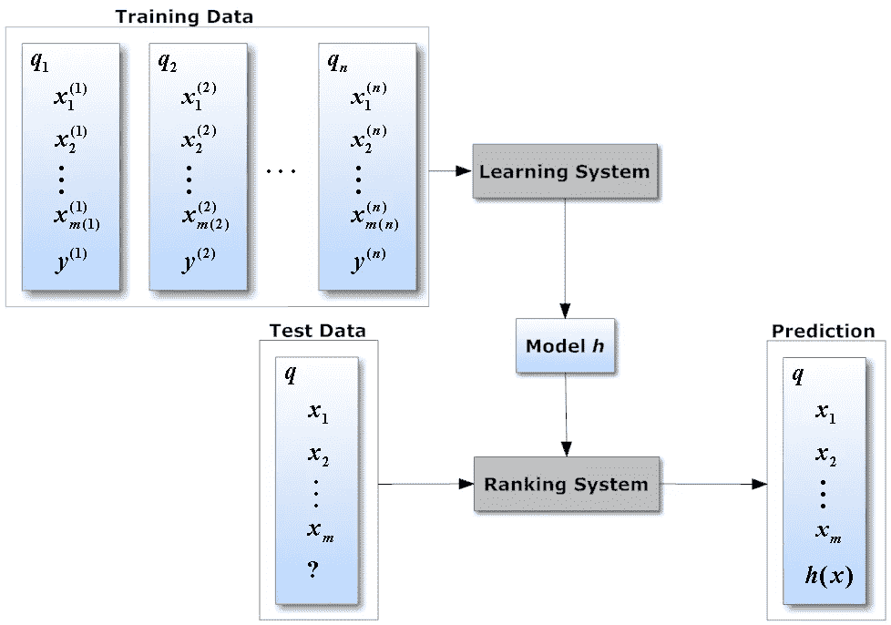

# 何时使用机器学习与基于分数的搜索排序

> 原文：<https://towardsdatascience.com/when-to-use-a-machine-learned-vs-score-based-search-ranker-aa8762cd9aa9?source=collection_archive---------1----------------------->

(Photo coutesy: [Catarina Moreira](http://web.ist.utl.pt/~catarina.p.moreira/coursera.html))

## 什么时候是从简单的基于分数的机器学习搜索排名的正确时机

传统的信息检索始于使用诸如 TF-IDF [1]或 BM25 [2]之类的分数对搜索结果进行基于分数的排序。随着搜索引擎变得更好，他们使用的分数也开始变得更好。许多大型搜索引擎使用启发式/基于分数的搜索排名模型。最著名的是，就在 2011 年，谷歌在搜索排名中使用了启发式模型[3]，尽管它在机器学习方面拥有非常强大的内部专业知识。

使用机器学习模型对搜索结果进行排名已经探索了至少二十年。在过去的十年左右，随着学习排序技术的流行，它变得更加突出。例如，Bing 至少从 2009 年就开始使用学习排序技术对其搜索结果进行排序[5]。

这是许多新的和现有的搜索引擎必须做出的选择:他们应该选择手动调整的基于分数的模型，还是应该使用机器学习来对搜索结果进行排名。

以下是一些重要的因素，应该纳入你的决策中。请注意，这些要点中的大多数都足够通用，可以应用于任何预测/排名问题，并且不严格限于搜索。

**1。可解释性**

对于大多数最大似然算法，特别是对于目前流行的算法，如集成或神经网络，排序本质上是一个可解释的黑箱。你可以控制输入，但是很难解释特定的输入对输出有什么确切的影响。因此，最终的模型不是很好解释。

基于分数的模型，尤其是分数被精心构造的模型，通常更容易推理和解释。

**2。实施时间**

构建 ML 模型的新版本通常需要花费大量的时间。在您的模型准备好进行 A/B 测试之前，您需要运行“收集/清理数据->训练->验证->测试”循环的多次迭代。

更新基于分数的模型可以像调整分数一样简单，因此可以在很短的时间内完成 A/B 测试。

**3。优化指标**

对于大多数搜索引擎来说，很难找到一个客观的指标来优化。这是告诉您特定搜索查询的结果良好且搜索成功的指标。这一标准会根据您正在构建的产品和您的搜索“成功”的构成而变化。你可能想开始优化用户点击，但是如果你盲目地使用点击，你可能会训练出一个更倾向于坏的“点击诱饵”结果的模型。大型搜索引擎在建立人类相关性系统[6]上花费了大量资金，在这些系统中，训练有素的人类评分员使用明确定义的准则来为每个搜索结果生成客观的“成功评级”。由这些系统生成的训练数据然后可以用于训练 ML 模型来对搜索结果进行排名。较小的搜索引擎可能没有大型搜索引擎那么多的资源，也可能没有能力建立这样的系统。

这个优化指标对于 ML 和基于分数的系统都很重要。然而，如果您没有一个好的优化度量，ML 模型会遭受更多的损失，因为您可能最终会学习到一个训练有素的模型，该模型针对一个完全错误的度量进行优化。相比之下，基于分数的系统受到的影响要小一些，因为分数是使用理性和直觉结合您试图优化的指标构建的。

**4。结果相关性**

如果你能得到正确的优化度量，这就是 ML 模型能给你巨大红利的地方。直接从数据中学习通常胜过任何可以在基于分数的模型中编码的直觉。如果相关性对你来说比其他任何因素都重要，那么使用 ML 模型通常是一个不错的选择。

**5。灵活性**

在 ML 模型中很难进行局部修正。解决问题的最佳方式是通过使用更好/更多的训练数据或更好的特征工程或超参数调整，所有这些都很耗时。

在基于分数的模型中，快速修复问题要容易得多。给定一个 bug，你可以很容易地调整这个模型，然后马上把它提供给用户。

**6。工程爬坡时间**

如果你使用的是众所周知的 ML 模型，一个好的机器学习工程师相对容易适应你的系统。模型从数据中学习，虽然您需要一些时间来了解整个系统，但在开始对模型进行更改之前，您不需要了解模型内部发生的所有细节。

基于分数的模型是手动调整的，在有效地使用它之前，您需要理解模型中包含的所有直觉和权衡。对于一个相当复杂的手工调整的模型，即使是一个好的工程师也可能需要几个月的时间才有足够的上下文来理解多年来在模型工作中形成的所有直觉。这个问题通常随着模特年龄的增长而变得更加严重。

## **混合 ML/手动调谐系统**

如您所见，ML 模型在相关性方面可能更好，但也有一些其他缺点。为了克服这些缺点，大多数使用 ML 模型的搜索引擎使用混合 ML/手动调整系统。在这种情况下，即使你的主要排名模型是一个 ML 训练的模型，你仍然有手动调整的杠杆，如黑名单，约束，或强制排名，以快速修复惊人的错误。注意，如果您这样做，手工调整的组件保持非常简单和易于使用是很重要的，否则您可能最终不得不维护一个相当复杂的 ML 模型和一个相当复杂的手工调整的系统。

**对新搜索引擎的建议**

对于新的搜索引擎，考虑到上述各种因素，一个好的经验法则是:

1.  从手动调谐模型开始。它们更容易预先构建，让您立即投入运行。
2.  获得你的初始用户。让他们使用你的搜索一段时间，这样你就可以为你未来的 ML 模型生成良好的训练数据。
3.  当你达到这样一个规模，即相关性的增量收益比其余因素更重要时，考虑转向 ML 模型。但是在您开始处理 ML 模型之前，请确保您对“优化度量”问题有一个好的答案。

*原载于*【www.quora.com】

## *笔记*

*[1][TF–IDF](https://en.wikipedia.org/wiki/Okapi_BM25)
【2】[Okapi BM25](https://en.wikipedia.org/wiki/Okapi_BM25)
【3】[为什么机器学习被大量用于谷歌的广告排名而较少用于他们的搜索排名？](https://www.quora.com/Why-is-machine-learning-used-heavily-for-Googles-ad-ranking-and-less-for-their-search-ranking)
【4】[Nikhil dande kar 的回答学习 RankNet、LambdaRank、LambdaMART 这样的排名和算法的直观解释是什么？](https://www.quora.com/What-is-the-intuitive-explanation-of-Learning-to-Rank-and-algorithms-like-RankNet-LambdaRank-and-LambdaMART/answer/Nikhil-Dandekar)
【5】[用户需求、功能和必应背后的科学](https://blogs.bing.com/search/2009/06/01/user-needs-features-and-the-science-behind-bing/)
【6】[Nikhil dande kar 对谷歌如何衡量其搜索结果质量的回答？](https://www.quora.com/How-does-Google-measure-the-quality-of-their-search-results/answer/Nikhil-Dandekar)*