# 堆栈溢出何时回复:如何用 BigQuery 预测

> 原文：<https://towardsdatascience.com/when-will-stack-overflow-reply-how-to-predict-with-bigquery-553c24b546a3?source=collection_archive---------14----------------------->

Stack Overflow predictions: You can play with this interactive dashboard!

## 当你最后发布一个关于栈溢出的问题时，一个漫长的等待就开始了。有人会回答你的问题吗？社区会否决你的问题，认为你的问题不好吗？有人会给你答案吗？他们回答了吗？我们能预测这些吗？就这么办吧。

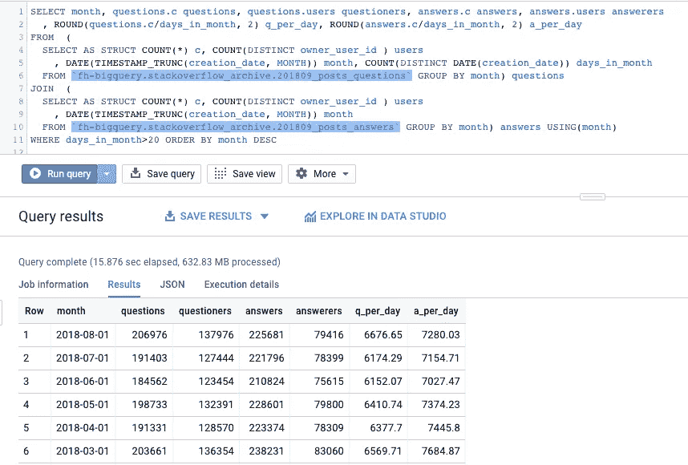

Stack Overflow stats per month

我喜欢堆栈溢出。它回答了我的大多数编程问题，如果没有，我可以发布一个新的。正常情况下，一个月会有超过 120，000 名用户提出新问题，超过 75，000 名社区成员随时准备提供帮助。我知道，因为[我两边都去过](https://stackoverflow.com/users/132438/felipe-hoffa?tab=topactivity)。

BigQuery 为[提供了许多公共数据集](https://console.cloud.google.com/marketplace/browse?q=BigQuery%20Public%20Data)，其中之一是 Stack Overflow 的季度更新副本。我们可以使用这些数据和最近发布的 BigQuery ML 特性来预测需要多长时间来回答您的堆栈溢出问题。

你刚刚发布了一个关于堆栈溢出的问题吗？在您等待的时候，让我们回顾一下这些预测是如何运行的。

# 背后的科学

第一步是测量用户在堆栈溢出的人给他们一个答案之前要等待多长时间。我们将从 BigQuery 中的[问题表中得到这个，并通过一个相关子查询得到答案:](https://medium.com/google-cloud/google-bigquery-public-datasets-now-include-stack-overflow-q-a-5a8a7e371b52)

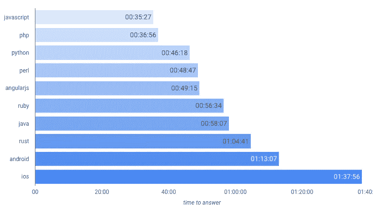

Average time to get an answer on Stack Overflow, per tag. Keep reading, because we’ll debunk these numbers in a few.

将答案与问题结合起来的基本查询，产生问题与其第一个答案之间的时间:

```
WITH question_answers_join AS (
  SELECT *
    , GREATEST(1, TIMESTAMP_DIFF(answers.first, creation_date, minute)) minutes_2_answer
  FROM (
    SELECT id, creation_date, title
      , (SELECT AS STRUCT MIN(creation_date) first, COUNT(*) c
         FROM `bigquery-public-data.stackoverflow.posts_answers` 
         WHERE a.id=parent_id
      ) answers
      , SPLIT(tags, '|') tags
    FROM `bigquery-public-data.stackoverflow.posts_questions` a
    WHERE EXTRACT(year FROM creation_date) > 2016
  )
)SELECT * 
FROM question_answers_join
WHERE 'google-bigquery' IN UNNEST(tags)
AND answers.c > 0
ORDER BY RAND()
LIMIT 10
```

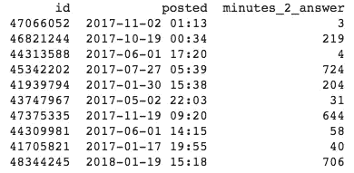

Some sample questions — when were they posted, how long it took to get an answer.

这是一个好的开始，让我们来看看一些流行标签的平均价格:

```
SELECT COUNT(*) questions, tag
  , ROUND(**AVG((minutes_2_answer)**), 2) avg_minutes
FROM question_answers_join, UNNEST(tags) tag
WHERE tag IN ('javascript', 'python', 'rust', 'java', 'php', 'ruby', 'perl', 'ios', 'android', 'angularjs')
AND answers.c > 0
GROUP BY tag
ORDER BY avg_minutes
```

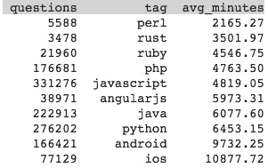

Naive average time per tag to get an answer.

事实证明 Perl 拥有最令人惊奇的社区:它是回复最快的！其次是 Rust、Ruby、PHP。最慢的社区是 Android 和 iOS。在这之间你有…**停在那里**

> 警告:普通平均值在这里是不好的。相反，我们将计算[几何平均值](https://stackoverflow.com/a/51981354/132438)。

我不会在这里详细解释为什么普通平均值不好——但是您应该注意的第一件事是，这些数字告诉我们，我们必须等待几天才能得到关于堆栈溢出的回复——这并不反映我们的正常体验。为了减少异常值的影响，我们可以要求使用[几何平均值](https://medium.com/@JLMC/understanding-three-simple-statistics-for-data-visualizations-2619dbb3677a)和中位数来代替:

```
SELECT COUNT(*) questions, tag
  , ROUND(EXP(AVG(LOG(minutes_2_answer))), 2) mean_geo_minutes
  , APPROX_QUANTILES(minutes_2_answer, 100)[SAFE_OFFSET(50)] median
FROM question_answers_join, UNNEST(tags) tag
WHERE tag IN ('javascript', 'python', 'rust', 'java', 'php', 'ruby', 'perl', 'ios', 'android', 'angularjs')
AND answers.c > 0
GROUP BY tag
ORDER BY mean_geo_minutes
```

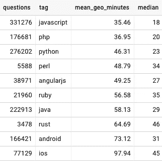

Geometric mean and median time to get an answer in Stack Overflow per tag

这更有意义:你的 JavaScript 问题将在 35 分钟内得到回答，而 Rust、Android 和 iOS 问题将需要一个多小时才能出现。

我们也可以计算得到答案的几率:

```
SELECT COUNT(*) questions, tag
  , ROUND(EXP(AVG(LOG(minutes_2_answer))), 2) avg_minutes
  , FORMAT('%.2f%%', 100***COUNT(minutes_2_answer)/COUNT(*)**) chance_of_answer
FROM question_answers_join, UNNEST(tags) tag
WHERE tag IN ('javascript', 'python', 'rust', 'java', 'php', 'ruby', 'perl', 'ios', 'android', 'angularjs')
GROUP BY tag
ORDER BY avg_minutes
```

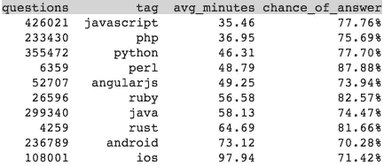

Perl、Ruby 和 Rust 在这里看起来不错:从我们的选择中，这些是仅有的回复率高于 80%的标签。有趣的是，这些标签比其他标签得到的问题少得多。

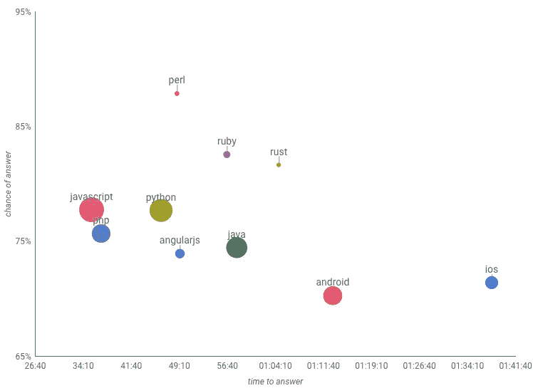

Time to answer vs chance of answer: iOS and Android are the slowest to reply, while they also have the lowest chance of replying. Perl has a high probability of getting a reply. Meanwhile Javascript, Python and PHP have more questions than Perl, and are quicker to reply. ([DS source](https://datastudio.google.com/c/u/0/reporting/1XNs9m9DoqGyZ4vPHeizKB-Fd8Ye7qLon/page/byEa/edit))

现在，我们可以探索很多其他的变量:是在周一还是周六需要更多的时间来得到答案？新栈溢出用户比资深用户得到更快的回复？用哪个词开始提问很重要吗？问题不用问号结尾有关系吗？更长的问题还是更短的问题？一天中的什么时候？让我们来回答所有这些问题:

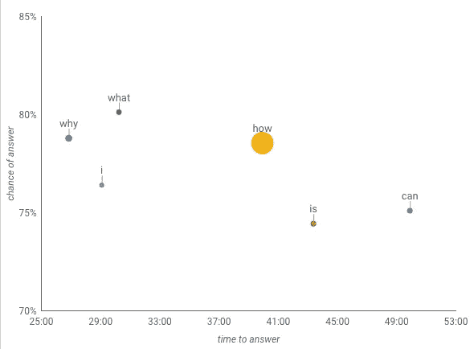

**First word:** Most people ask ‘how’ questions. ‘Can’ take longer to answer than ‘why’s.

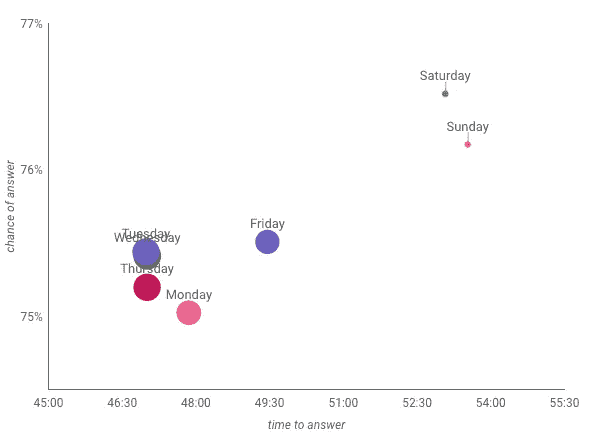

**Day of week (UTC)**: More questions during the week, faster answers, but with a lower probability of answer.

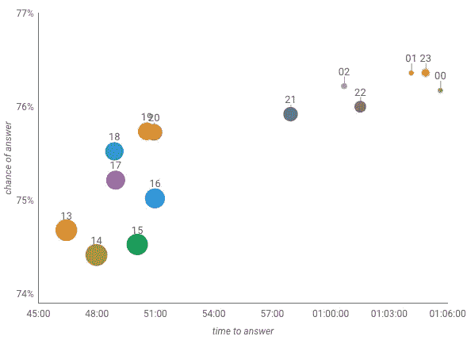

**Hour of the day (UTC)**. Faster answers — with lower chance of getting an answer: 14:00 UTC, which is 7am in California. The opposite at 00:00 UTC, 5pm California.

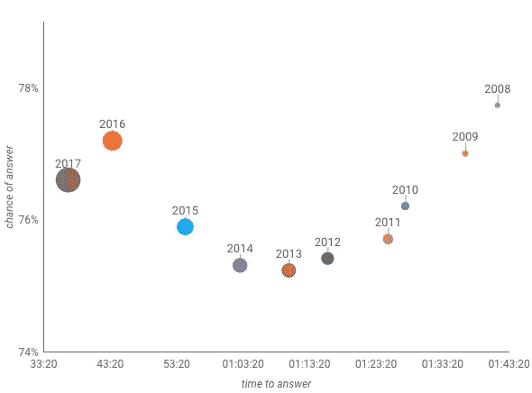

**Account creation year**: New users get quick replies. Veteran users ask questions that take longer to reply, but more of their questions are replied. Note there seems to be a linear relationship between account age and time to answer, but a non-linear one with probability of answer.

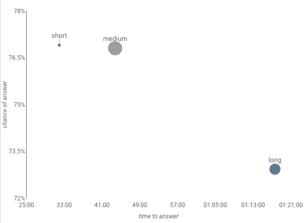

**Length of question**: Shorter questions are easier to answer, and with a higher chance.

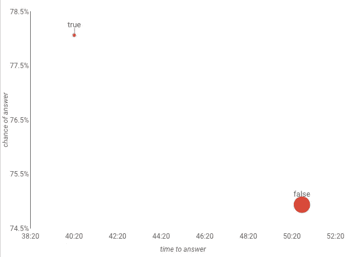

**Did they use a ?**: Questions that end with a question mark get quicker answers with a higher chance?

我获取所有这些维度的基本查询:

```
WITH answers AS (
  SELECT * 
    , REGEXP_EXTRACT(LOWER(title), '[a-z]+') first_word
    , '?' = SUBSTR(title, LENGTH(title)) ends_question
    , GREATEST(1, TIMESTAMP_DIFF(answers.first, creation_date, minute)) minutes_first_answer
    , answers.c > 0 was_answered
  FROM (
    SELECT creation_date, title
      , CASE WHEN LENGTH(body)<700 THEN 'short' WHEN LENGTH(body)<1700 THEN 'medium' ELSE 'long' END question_length
      , (SELECT AS STRUCT MIN(creation_date) first, COUNT(*) c
         FROM `bigquery-public-data.stackoverflow.posts_answers` 
         WHERE a.id=parent_id
      ) answers
      ,(SELECT  AS STRUCT EXTRACT(year FROM creation_date) account_creation_year
         FROM `bigquery-public-data.stackoverflow.users`  
         WHERE a.owner_user_id=id 
      ) user
      , SPLIT(tags, '|') tags
    FROM `bigquery-public-data.stackoverflow.posts_questions` a
    WHERE EXTRACT(year FROM creation_date) > 2016
  )
)SELECT tag, 60*EXP(AVG(LOG(minutes_first_answer ))) time_to_answer, COUNT(minutes_first_answer)/COUNT(*) chance_of_answer
   , COUNT(*) questions
-- first_word, ends_question, tag
--   , FORMAT_TIMESTAMP('%H', creation_date) hour_utc
--   , FORMAT_TIMESTAMP('%A', creation_date) weekday_utc
--   , user.account_creation_year
--   , question_length
FROM answers, UNNEST(tags) tag
WHERE tag IN ('javascript', 'python', 'rust', 'java', 'php', 'ruby', 'perl', 'ios', 'android', 'angularjs')
--AND first_word IN UNNEST(['why','what','how','is','can', 'i'])
GROUP BY 1
```

# 结合一切:回归！

那么我们如何综合所有这些平均值呢？如果我在周四下午 3 点有一个简短的 SQL 问题，并且我自 2009 年以来一直是一个堆栈溢出用户，该怎么办？我的问题以“什么”开头，我会确保以提问的形式提问。我们能不能创建一个公式，囊括所有这些指标，即使以前没有人尝试过这种组合？

> 是啊！这就是为什么 BigQuery 现在支持线性和逻辑回归(期待更多)。跟我的朋友打个招呼， [BigQuery ML](https://cloud.google.com/bigquery/docs/bigqueryml-intro) 。

要创建一个线性回归模型，将所有这些特征组合成一个预测，预测您需要等待多长时间才能得到答案，只需执行以下操作:

```
CREATE MODEL `dataset.stacko_predicted_time`
OPTIONS  (model_type='linear_reg' ) ASSELECT first_word, ends_question, tag
  , FORMAT_TIMESTAMP('%H', creation_date) hour_utc
  , FORMAT_TIMESTAMP('%A', creation_date) weekday_utc
  , user.account_creation_year
  , question_length
  , **LOG(minutes_first_answer) label**
FROM answers, UNNEST(tags) tag
WHERE was_answered
```

该查询涉及 3，784，571 个问题及其回复，超过 46，178 个不同的标签。您可能会注意到，我为他们的每个标签复制了问题(当他们有多个标签时)，这样总共有 11，297，337 行。这可能会给一些标签一个不公平的平衡，但我们可以稍后再讨论。训练这个模型花了多长时间？6 分钟，我最后一次尝试。

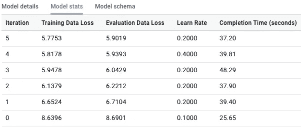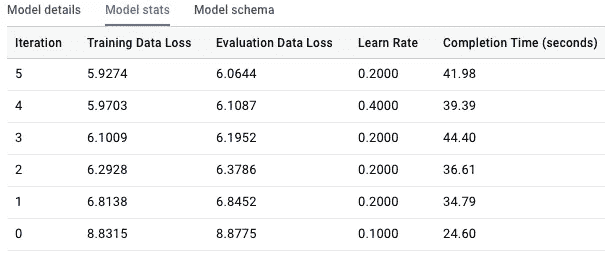

Different instances of training this model .

## 一些统计数据:

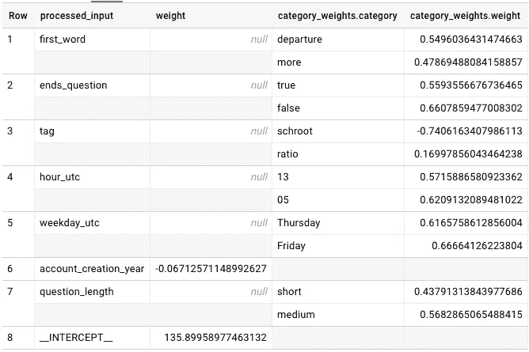

```
SELECT processed_input, weight
  , ARRAY(SELECT AS STRUCT * FROM UNNEST(category_weights) WHERE weight<0.7 ORDER BY RAND() DESC LIMIT 2) category_weights
FROM ML.WEIGHTS(MODEL `dataset.stacko_predicted_time`)SELECT *
FROM ML.EVALUATE(MODEL `dataset.stacko_predicted_time`)
```

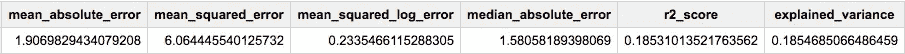

要检查这些值的含义，请参见[机器学习词汇表](https://developers.google.com/machine-learning/glossary/)，或者参见[莎拉·罗宾逊](https://medium.com/u/7f2ab73b39f8?source=post_page-----553c24b546a3--------------------------------)的[预测 CPU 性能](https://medium.com/@srobtweets/machine-learning-on-machines-building-a-model-to-evaluate-cpu-performance-d43528f6075a)中对不同预测的类似值的分析。在试图赋予权重意义之前，请检查[上的](https://hackernoon.com/why-feature-weights-in-a-machine-learning-model-are-meaningless-b0cd22a4c159) [Lak Lakshmanan](https://medium.com/u/247b0630b5d6?source=post_page-----553c24b546a3--------------------------------) 为什么机器学习模型中的特征权重是无意义的。

对于 6 分钟的实验来说，还不错。我们可以做很多改进，但现在让我们继续。

训练答案的概率同样简单，只是这次用了逻辑回归:

```
CREATE MODEL `dataset.stacko_predicted_answered`
OPTIONS  (**model_type='logistic_reg'**) ASSELECT first_word, ends_question, tag
  , FORMAT_TIMESTAMP('%H', creation_date) hour_utc
  , FORMAT_TIMESTAMP('%A', creation_date) weekday_utc
  , user.account_creation_year
  , question_length
  , **IF(was_answered, 1, 0) label**
FROM answers, UNNEST(tags) tag
```

哦，如果没有时态表`answers`，上面的查询将无法工作，它具有我们建模的特性:

```
WITH answers AS (
  SELECT * 
    , REGEXP_EXTRACT(LOWER(title), '[a-z]+') first_word
    , '?' = SUBSTR(title, LENGTH(title)) ends_question
    , GREATEST(1, TIMESTAMP_DIFF(answers.first, creation_date, minute)) minutes_first_answer
    , answers.c > 0 was_answered
  FROM (
    SELECT creation_date, title
      , CASE WHEN LENGTH(body)<700 THEN 'short' WHEN LENGTH(body)<1700 THEN 'medium' ELSE 'long' END question_length
      , (SELECT AS STRUCT MIN(creation_date) first, COUNT(*) c
         FROM `bigquery-public-data.stackoverflow.posts_answers` 
         WHERE a.id=parent_id
      ) answers
      ,(SELECT  AS STRUCT EXTRACT(year FROM creation_date) account_creation_year
         FROM `bigquery-public-data.stackoverflow.users`  
         WHERE a.owner_user_id=id 
      ) user
      , SPLIT(tags, '|') tags
    FROM `bigquery-public-data.stackoverflow.posts_questions` a
    WHERE EXTRACT(year FROM creation_date) > 2016
  )
)
```

## 预测

一旦创建了模型，您就可以使用如下查询来预测任何类型的组合:

```
SELECT * FROM ML.PREDICT(
  MODEL `fh-bigquery.bqml_models.stacko_201809_time` 
  , (
    SELECT 'why' first_word
      , true ends_question
      , 'google-bigquery' tag
      , '7' hour_utc
      , 'Monday' weekday_utc
      , 2013 account_creation_year 
      , 'short' question_length
    )
)
```

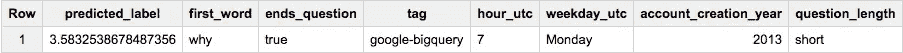

Prediction results

并在一个查询中组合所有 3 个模型:

```
WITH features AS (
  SELECT 'why' first_word, true ends_question
    , 'google-bigquery' tag, '7' hour_utc
    , 'Monday' weekday_utc, 2013 account_creation_year 
    , 'short' question_length
)SELECT predicted_label minutes, * EXCEPT(predicted_label)
FROM ML.PREDICT(
  MODEL `fh-bigquery.bqml_models.stacko_201809_time` 
  , (SELECT 
      (SELECT prob FROM UNNEST(predicted_label_probs) WHERE label=1 LIMIT 1) prob_down
      , * EXCEPT(predicted_label, predicted_label_probs)
    FROM ML.PREDICT(
      MODEL `fh-bigquery.bqml_models.stacko_201809_downvoted` 
      , (SELECT 
          (SELECT prob FROM UNNEST(predicted_label_probs) WHERE label=1 LIMIT 1) prob_answer
          , * EXCEPT(predicted_label, predicted_label_probs)
        FROM ML.PREDICT(
          MODEL `fh-bigquery.bqml_models.stacko_201809_answered`, TABLE features
        )
      )
    )
  )  
)
```

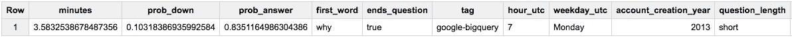

1 query, 3 predictions

# 为结果服务

你可能想知道“这个交互数据工作室仪表板怎么会这么快？”，或者“将 Data Studio 连接到 BigQuery 的成本是多少”？我们将不得不把这段对话留到以后的文章中，但现在先预览一下:

*   为了[将 Data Studio 连接到用于公共仪表板的 BigQuery，在中间使用一个层](https://www.youtube.com/watch?v=KG8CpA3m1q4)。看我和 [Minhaz Kazi](https://medium.com/u/be4fab220f85?source=post_page-----553c24b546a3--------------------------------) 关于这个话题的对话。
*   我预先生成了所有 4000 万个结果组合——使用 BigQuery 很容易。
*   这 4000 万个结果由云 SQL MySQL 数据库提供服务，该数据库拥有完美的索引，可以快速提供服务。加比会告诉你所有的事情。
*   查看 [Lak Lakshmanan](https://medium.com/u/247b0630b5d6?source=post_page-----553c24b546a3--------------------------------) 的帖子[导出并在其他地方使用权重](/how-to-do-online-prediction-with-bigquery-ml-db2248c0ae5)。

# 感谢

感谢大家的牛逼点评:[凯西·科济尔科夫](https://medium.com/u/2fccb851bb5e?source=post_page-----553c24b546a3--------------------------------)、[拉克什马南](https://medium.com/u/247b0630b5d6?source=post_page-----553c24b546a3--------------------------------)、[弗兰克·范·普弗伦](https://medium.com/u/899fe8703e05?source=post_page-----553c24b546a3--------------------------------)、[萨拉·罗宾逊](https://medium.com/u/7f2ab73b39f8?source=post_page-----553c24b546a3--------------------------------)、[阿布舍克·卡什雅普](https://medium.com/u/ca0215d8d6a4?source=post_page-----553c24b546a3--------------------------------)、[史蒂夫·切里尼](https://medium.com/u/ab8968742b93?source=post_page-----553c24b546a3--------------------------------)。

# 后续步骤

想要更多的故事？查看我的[媒体](http://medium.com/@hoffa/)，[关注我的推特](http://twitter.com/felipehoffa)，订阅[reddit.com/r/bigquery](https://reddit.com/r/bigquery)。试试 BigQuery 吧——每个月你都可以从免费的网站上获得一个完整的万亿字节的分析。

[](/these-are-the-real-stack-overflow-trends-use-the-pageviews-c439903cd1a) [## 这些是真正的堆栈溢出趋势:使用页面视图

### 直到今天，获得 Stack Overflow 的季度浏览量并不容易。了解如何获得这些…

towardsdatascience.com](/these-are-the-real-stack-overflow-trends-use-the-pageviews-c439903cd1a)