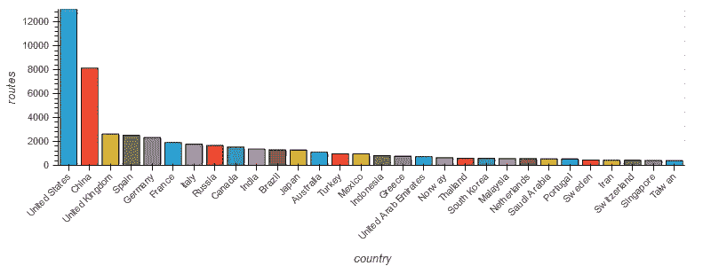
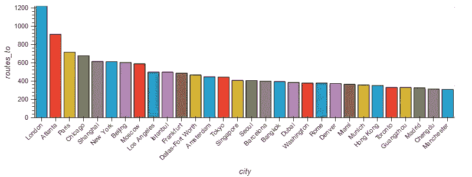
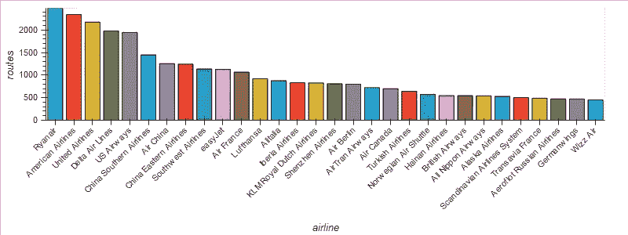
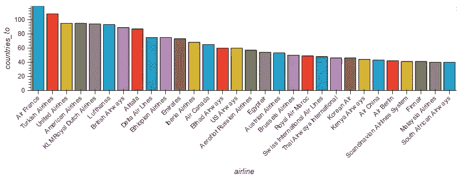
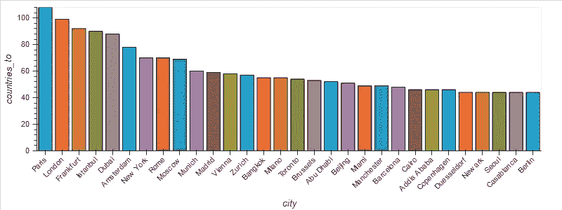
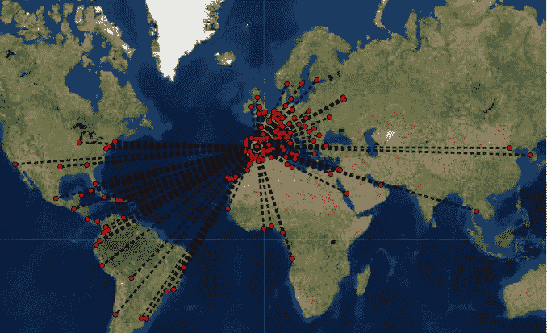
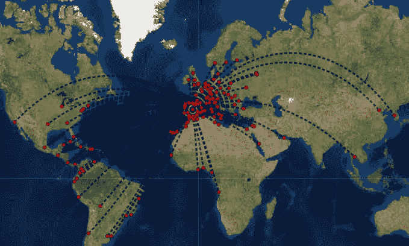
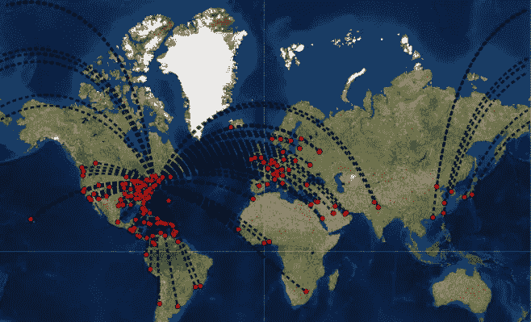

# 我能从我的家乡飞到哪里？

> 原文：<https://towardsdatascience.com/where-can-i-fly-to-from-my-home-town-72aaf5b3b223?source=collection_archive---------13----------------------->

任何经常旅行的人都想知道航空公司从他们居住的地方提供什么路线。通常的方法是使用航班搜索服务，如 [Skyscanner](https://www.skyscanner.net/) 、 [Google Flights](https://www.google.com/flights) 或 [Momondo](http://momondo.com/) ，并动态地发现答案(同时检查机票价格)，但作为数据科学家，我们可以用更系统的方式来做这件事。

当然，为此我们需要一个静态的、组织良好的路线数据库。幸运的是， [OpenFlights](https://openflights.org/data.html) 已经为我们收集了这些数据，这些数据来自:

*   机场(另外还有火车站和轮渡码头)。
*   航空公司。
*   实际飞行路线。

你可以从他们的网站或者从 Kaggle 下载这些数据，在那里他们友好地将以上 3 个数据集分发给社区。这些是通过不同 id 匹配的 CSV(例如，路线从一个机场 id 到另一个机场 id)，因此我们首先要做的是合并所有信息**。** [*熊猫*](https://pandas.pydata.org/) 来救援了！

Reading and merging info

这看起来有点令人不知所措，但我们只是读取 3 个来源，过滤一些东西(例如，只有机场-没有车站-和直接路线-没有中途停留-)，防止丢失值，并连接 3 个表。 *df* 中的最终结果是一个数据帧，包含:

*   出发地机场的位置、名称和城市。
*   目的地机场的位置、名称和城市。
*   运营该航线的航空公司。

现在我们已经有了所有的数据，是时候可视化并回答一些有趣的问题了。我一直对记录和极限很感兴趣，问这种"*最大/最高/最长……*"的问题？在这种情况下，我想到的一些问题是:

*   出发/抵达路线最多的**国家/城市有哪些**？

有两个明显胜出的国家:美国(亚特兰大、芝加哥、纽约、洛杉机、达拉斯……)和**中国** ( **上海、北京、香港**……)。然而，**他们的许多路线都是国内的**，所以**如果我们只考虑城市，那么也有像伦敦、巴黎或莫斯科**这样的欧洲枢纽站在第一位。以上是进来的路线:如果你考虑出去的路线，它几乎是相同的故事，因为大多数路线是对称的(如果有从 X 到 Y 的路线，也有从 Y 到 X 的相同路线)。

*   航线最多/飞往最多国家的**航空公司有哪些**？

不出意外，**美国** ( [**美国**](http://www.aa.com/) ， [**美联航**](https://www.united.com/) ， [**达美**](http://es.delta.com/)……)和**中国** ( [**南航**](http://www.flychinasouthern.com/) ， [**国航**](http://www.airchina.es/es/index.html) **，** [**东航**](http://global.ceair.com/)……)航母占优，但而 [**易捷**](http://www.easyjet.com/) **的航线比** [**汉莎**](http://www.lufthansa.com/es/es/homepage) **或** [**荷航**](http://www.klm.com/) 多，这是我没想到的。同样，国内航班的效果非常显著:**如果你有兴趣访问尽可能多的国家，你最好选择** [**法航**](http://www.airfrance.com/) **或** [**土耳其航空**](http://www.turkishairlines.com/) **而不是美国航空公司**(更不用说中国航空公司，因为它们基本上是在中国周边飞行，所以不在此列)。另一个惊喜是，如果一些非洲航空公司名列前茅，你会说埃塞俄比亚航空公司比阿联酋航空公司更国际化吗？我打赌不会！

那么，作为两种观点的混合，你能猜出我们从哪些城市到达大多数国家吗？对，**基本上就是上述航空公司的总部**(法国航空的巴黎，英国航空的伦敦，德国汉莎航空的法兰克福等等)。从现在开始，我将使用这些:

Cities with routes to most countries

关于获得上面的情节的一些提示:我使用了[***holo views***](http://holoviews.org/)，这是一个非常强大的可视化库，它建立在 Python 中使用最广泛的两个可视化工具(即 [*bokeh*](http://bokeh.pydata.org/) 和 [*matplotlib*](http://matplotlib.org/) )之上。 **Holoviews 与 *pandas* 巧妙集成，允许通过 3 个步骤抽象绘图来绘制数据帧的信息**:

1.  选择**类型的图**(散点图、条形图、热图等)。).
2.  建立**关键维度**(用他们的行话来说就是 *kdims* )，也就是确定要绘制的信息部分的维度。
3.  建立**值尺寸** ( *vdims* )，即将要在图中显示的变量。

因此，为了从城市获得国家的条形图，我们可以:

我按城市分组，统计了他们飞往的不同国家，挑选了 30 个最国际化的国家，然后选择了一个 holoviews [*条*](http://holoviews.org/reference/elements/bokeh/Bars.html#bokeh-gallery-bars) 图，其中航空公司作为关键维度(x 轴，每个条与谁相关)，目的地国家作为值维度(y 轴，条的高度)。然后，我使用了一些可用的选项，使情节看起来更好。

顺便说一下，**上面的图片是静态的，但 holoviews 会生成交互式的图**:例如，**如果你将鼠标悬停在一个条上，就会出现一个图例:看看这个下载并运行** [**完整代码**](https://github.com/jorloplaz/travel_stories/blob/master/flights.ipynb) ！

太好了，我们离我们的目标越来越近了，给定一个城市，我们可以飞到哪里。如果我们能画出一张显示全球路线的图表，那就太酷了。 **Holoviews 还提供了一个** [***图形***](http://holoviews.org/reference/elements/bokeh/Graph.html#bokeh-gallery-graph) **对象与交互支持**，但是地球地图呢？一种选择是用国家多边形(例如，用我的[上一篇文章](https://medium.com/@jorloplaz/youre-always-travelling-anywhere-you-haven-t-been-to-yet-96608c3b402c)的国家*地理数据框*)构建一个 [*多边形*](http://holoviews.org/reference/elements/bokeh/Polygons.html#bokeh-gallery-polygons) 对象，并用图形覆盖它，但是**我们可以在全息视图上使用另一个库:** [***地理视图***](http://geo.holoviews.org/) 。

所以，这个想法很简单。给定一个城市，我们必须:

1.  从 *df* 中选择从该城市出发的路线。
2.  **从这些航线中，选择所有涉及的机场**(出发地和目的地)。
3.  **用这些机场的位置建立图节点**。
4.  **用所选路线连接的机场建立图边**。
5.  **调整图形选项以获得更好的可视化效果**。

由于一些小细节，代码相当长，例如**可能有一个以上的源机场**(例如，巴黎有戴高乐机场和奥利机场)以及我希望交互显示的信息(**可读且不太长的名称、运营每条航线的航空公司**等)。) :

马德里的结果看起来是这样的(这里也是静态的，但是如果你下载并运行[完整的代码](https://github.com/jorloplaz/travel_stories/blob/master/flights.ipynb)，你可以用蓝色和黄色突出显示**每条路线，并且它的信息显示在交互式图例中**):

Routes from Madrid (straight line version)

对于最后的*绝技*，让我们利用**直线并不是飞机**实际遵循的路线这一事实。听说过 [*测地线*](https://en.wikipedia.org/wiki/Geodesic) 吗？嗯，令人悲伤的事实是，**给定两个城市，它们之间的最短路线不是直线，因为它们位于地球的球面上，而不是平面几何形状**。例如，我今年夏天从北京飞往马德里，航线经过贝加尔湖和西伯利亚，所以它比上面显示的线更靠北。我们能改变路线来反映这一点吗？

是的，我们可以。 **Python 也有专门为测地线、投影和制图设计的库，比如**[***pyproj***](https://github.com/jswhit/pyproj)**和**[***shapely***](https://github.com/Toblerity/Shapely)。我们没有给出图 *edgepaths=None* ，而是使用可选参数*测地线*显式构建路径，并将其传递给函数 *routes_from* :

所以现在的**结果更加真实**:

Flights from Madrid (geodesic version)

但是仍然有一个警告。如果我们尝试用大多数路线生成之前看到的 30 个城市的图表，**有些情况下会失败**。以纽约为例:

Flights from New York (geodesic version, something wrong!)

嘿嘿，到底是什么(字面上的地球，lol)出问题了？**这是一个投影问题**:路线计算正确，但是当 *geoviews* 试图将其投影回一个平面(默认情况下使用 [*墨卡托投影*](https://en.wikipedia.org/wiki/Mercator_projection) )穿过太平洋的**路线**(从地图的右端到左端，反之亦然)**错误地加入了一个不应该在那里的额外线段**。如何解决这个问题？

这不是很优雅，但我想出了这个快速的方法:想法是当**检测到一条路线穿过太平洋**(即，从经度 180°切换到-180°或相反方向)**时，它将*线串*分成具有两段的*多线串*，每侧一段**。代码如下:

因此，如果我们用*几何=边.应用(修复 _ 线)*而不是*几何=边*为*边路径*构建*地理数据框*，我们会得到:

Flights from New York (geodesic version, fixed)

太好了！并且**当我们选择太平洋上空的特定航线时，两个航段都会高亮显示**！你可以在我的 [Github 代码](https://github.com/jorloplaz/travel_stories/blob/master/flights.ipynb)中查看这一点，我在那里生成了我们在上一节中看到的 30 个最国际化城市的图表。为了完整起见，下面是这样做的代码:

我构建了一个[全息地图](http://holoviews.org/reference/containers/bokeh/HoloMap.html)来存储所有 30 个图形。绘制时，它会自动创建一个选择框，我们可以从中选择我们想要的城市。注意 *opts* 指令:它类似于我们之前使用的 *options* 函数，但是专用于 Jupyter 笔记本。我使用了很多选项来调整节点和边的大小、颜色和整体外观。此外，ESRI 图块源是我们在图片中看到的卫星背景，而*运算符用于叠加图。

希望你喜欢这个解释！我鼓励你下载[笔记本](https://github.com/jorloplaz/travel_stories/blob/master/flights.ipynb)和[数据](https://github.com/jorloplaz/travel_stories/tree/master/data)，用 Jupyter 运行笔记本，然后玩结果。欢迎建议！