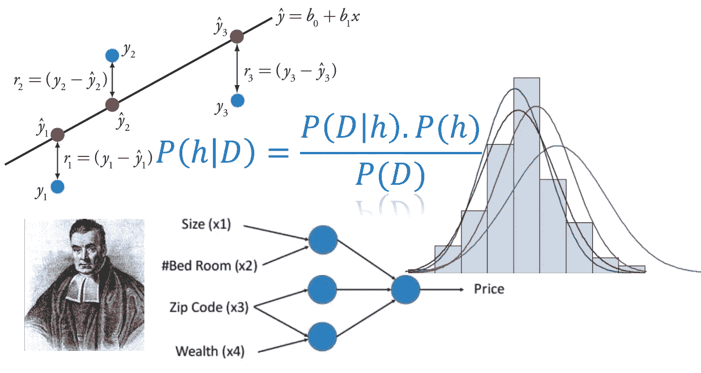
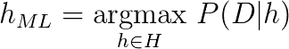
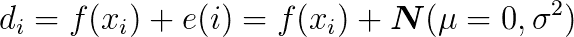
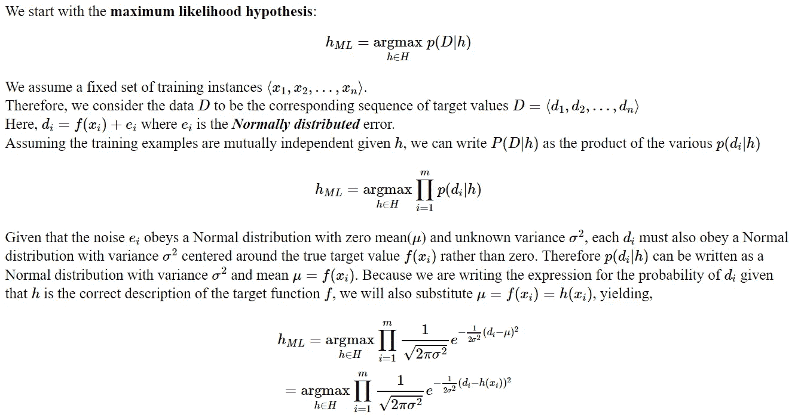
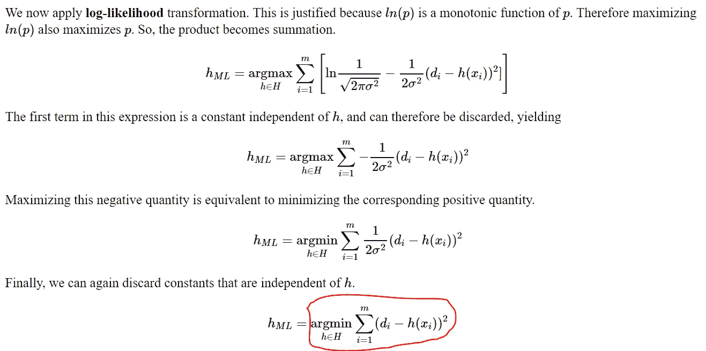
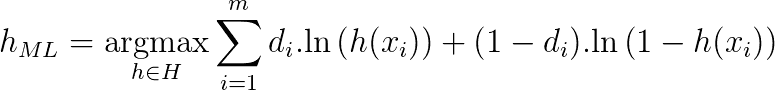

# 最小二乘法从何而来？

> 原文：<https://towardsdatascience.com/where-did-the-least-square-come-from-3f1abc7f7caf?source=collection_archive---------3----------------------->

## 在机器学习面试中，如果被问及最小二乘损失函数的数学基础，你会怎么回答？

## 承认

感谢我在佐治亚理工学院的 [CS7641 课程，在我的](https://www.omscs.gatech.edu/cs-7641-machine-learning) [MS 分析项目](https://pe.gatech.edu/degrees/analytics)中，我发现了这个概念，并受到了写这个概念的启发。感谢 [Brandon](https://www.linkedin.com/in/brohrer/) 让我在本文中使用他美丽的贝叶斯推断视频。

***问题*** :为什么要对一个回归机器学习任务中的误差进行平方？

***Ans*** :“为什么，当然是把所有的误差(残差)变成正的量！”

***问题*** :“好吧，为什么不用一个更简单的绝对值函数| *x* |使所有误差为正？”

***Ans*** :“啊哈，你在骗我。绝对值函数不是处处可微的！”

***问题*** :“那对数值算法应该没多大关系。套索回归使用一个有绝对值的项，可以处理。还有，为什么不是 *x* 的 4 次方或者 log(1+ *x* )？**平方误差有什么特别的？**

***Ans*** :嗯……

## 贝叶斯论证

请记住，对于机器学习中所有棘手的问题，如果你在你的论点中混合使用单词“ ***贝叶斯*** ”，你就可以很快找到一个听起来很严肃的答案。

好吧，我是在开玩笑。

但是，是的，我们应该明确准备好关于像最小二乘和交叉熵这样的流行损失函数来自哪里的论点——至少当我们试图使用贝叶斯论点为监督学习问题找到最可能的假设时。

请继续阅读…

## 基础知识:贝叶斯定理和“最可能假设”

贝叶斯定理可能是对现代机器学习和人工智能系统最有影响的概率论恒等式。关于这个话题的超级直观的介绍，[请参见由](https://brohrer.github.io/how_bayesian_inference_works.html) [Brandon Rohrer](https://brohrer.github.io/blog.html) 撰写的这个伟大的教程。我会专注于方程式。

这实质上是告诉你在看到数据/证据(*可能性*)后更新你的信念(*先验概率*，并将更新后的信念度赋予术语*后验概率*。你可以从一个信念开始，但是每一个数据点都会加强或削弱这个信念，并且你一直在更新你的假设。

现在让我们用不同的符号——属于数据科学的符号——来改写贝叶斯定理。让我们用 ***D*** 表示数据，用*表示假设。这意味着在给定数据 的情况下，我们应用贝叶斯公式来尝试确定 ***数据来自什么假设。我们将定理改写为，****

**

*现在，一般来说，我们有一个大的(通常是无限的)假设空间，也就是说，有许多假设可供选择。[贝叶斯推断](https://www.datascience.com/blog/introduction-to-bayesian-inference-learn-data-science-tutorials)的本质是我们想要检查数据，以最大化最有可能产生观察数据的一个假设的概率。我们主要是想确定*中的***arg max***(***h***|***D***)**也就是说，给定观察到的*，我们想知道哪个 ***h*** 可能性最大。*****

## ****一个捷径:最大可能性****

****上面的等式看起来很简单，但在实践中计算起来却非常棘手——因为在复杂的概率分布函数上计算积分时，假设空间非常大且非常复杂。****

****然而，在我们寻求'*给定数据的最可能假设时，*'我们可以进一步简化它。****

*   ****我们可以把分母中的项去掉，它没有任何包含 ***h*** 的项即假设。我们可以把它想象成使总概率总和为 1 的规格化器。****
*   ****[**一致先验假设**](https://www.quora.com/What-is-an-example-of-a-uniform-prior) —这实质上是通过使其一致来放松对***P***(***h***)性质的任何假设，即所有假设都是可能的。那么它是一个常数 1/|Vsd|其中|Vsd|是 [**版本空间**的大小，即与训练数据](http://www2.cs.uregina.ca/~dbd/cs831/notes/ml/vspace/3_vspace.html)一致的所有假设的集合。那么它在确定最大可能假设时实际上并不重要。****

****在这两个简化的假设之后，**最大似然(ML)** 假设可以由下式给出:****

********

> ****这仅仅意味着*最可能的*假设是观测数据(给定假设)的 [**条件概率**](https://www.mathsisfun.com/data/probability-events-conditional.html) **达到最大的假设。******

## ****拼图的下一块:数据中的噪音****

****我们通常在学习 Stats 101 中的[简单线性回归](https://en.wikipedia.org/wiki/Simple_linear_regression)时开始使用[最小二乘误差](https://en.wikipedia.org/wiki/Least_squares)，但这个看起来简单的损失函数牢牢地存在于几乎每个监督机器学习算法中，即。线性模型、样条、决策树或深度学习网络。****

****那么，它有什么特别之处呢？这和贝叶斯推理有什么关系吗？****

> ****事实证明，最小二乘误差和贝叶斯推断之间的关键联系是通过**误差或残差**的假定性质。****

******测量/观察数据从来都不是无误差的**，并且总是有**随机噪声**与数据相关联，这可以被认为是感兴趣的信号。机器学习算法的任务是通过从噪声中分离信号来估计/近似可能产生数据的函数。****

****但是我们能对这种噪音的本质说些什么呢？原来噪声可以被建模为一个[随机变量](https://en.wikipedia.org/wiki/Random_variable)。因此，我们可以将我们选择的一个[概率分布](https://en.wikipedia.org/wiki/Probability_distribution)关联到这个随机变量上。****

> ******最小二乘优化的关键假设之一是残差的概率分布是我们信任的老朋友——**[**高斯正态。**](https://en.wikipedia.org/wiki/Normal_distribution)****

****这意味着监督学习训练数据集中的每个数据点( ***d*** )可以写成未知函数***f***(***x***)(学习算法试图近似的)和从零均值( ***μ*** )和未知方差***σ【t3t】的正态分布中得出的误差项之和这就是我的意思，*******

********

****从这个断言，我们可以很容易地得出，最大可能的假设是最小化最小平方误差的假设。****

****M 而且没有好的方法在 Medium 中输入数学。所以，我必须粘贴一个图像来显示推导过程。请随意跳过这一部分，我将在下一部分总结关键结论。****

## ****从最大似然假设推导最小二乘****

****************

> ****瞧！最后一项只不过是简单的最小二乘最小化。****

## ****那么，这些数学显示了什么？****

****它表明，从监督训练数据集的误差分布在高斯正态分布的假设出发，该训练数据的**最大似然假设是最小化最小平方误差损失函数的假设。******

****没有关于学习算法类型的假设。**这同样适用于任何事情，从简单的线性回归到深度神经网络。******

> ****这就是贝叶斯推理的力量和统一性。****

****这是线性回归拟合的典型场景。贝叶斯推理论证在这个模型上起作用，并使选择误差的平方作为最佳损失函数变得可信。****

********

## ****常态的假设是否足够合理？****

****你可以质疑关于正态分布误差项的假设的有效性。[但在大多数情况下，它是有效的](https://www.quora.com/Why-is-the-normal-distribution-important)。这是根据[中心极限定理](https://en.wikipedia.org/wiki/Central_limit_theorem) (CLT)得出的，在某种意义上，错误或噪声从来不是由单个底层过程产生的，而是由多个子过程的综合影响产生的。当大量随机子过程组合时，它们的平均值服从正态分布(来自 CLT)。因此，对于我们承担的大多数机器学习任务来说，假设这样的分布并不困难。****

## ****通过高斯-马尔可夫定理的另一个(更强的)论证****

****事实证明，在没有误差分布信息的情况下，最小二乘法仍然是所有线性估计中最好的线性无偏估计(根据[高斯-马尔可夫定理](https://en.wikipedia.org/wiki/Gauss%E2%80%93Markov_theorem))。唯一的要求是误差的期望值为零，不相关，方差相等。****

## ****类似的论点适用于分类问题吗？****

****最小平方损失函数用于回归任务。但是当我们处理类别和概率，而不是任意的实数时，分类问题又如何呢？****

****令人惊讶的是，使用 ML 假设和简单的类定义选择可以完成类似的推导，****

********

****…也就是**交叉熵损失函数。******

****因此，相同的贝叶斯推理产生交叉熵作为在分类问题中获得最大可能假设的损失函数的优选选择。****

## ****总结和结论****

****我们可以通过以下几点来总结和延伸我们在文章中的讨论和论点，****

*   ******最大似然估计(MLE)** 是一种强大的技术，如果我们能够做出一致的先验假设，即在开始时，所有假设都是同等可能的，则可以得出给定数据集的最可能假设。****
*   ****如果我们可以假设机器学习任务中的每个数据点都是真实函数和一些正态分布的随机噪声变量之和，那么我们可以推导出这样一个事实，即**最大可能假设是最小化平方损失函数**的假设。****
*   ****无论机器学习算法的性质如何，这个结论都是正确的。****
*   ****然而，另一个隐含的假设是数据点的**相互独立性**，这使得我们能够将联合概率写成单个概率的简单乘积。这也**强调了在建立机器学习模型之前消除训练样本间共线性的重要性。******

> ****最终，你可以说最小二乘最小化非常特别，因为事实上，它与宇宙中最著名的[分布函数](http://www.askamathematician.com/2010/02/q-whats-so-special-about-the-gaussian-distribution-a-k-a-a-normal-distribution-or-bell-curve/) :-)密切相关****

****如果你有任何问题或想法要分享，请联系作者[**tirthajyoti【AT】Gmail . com**](mailto:tirthajyoti@gmail.com)。此外，您可以查看作者的 [**GitHub 资源库**](https://github.com/tirthajyoti?tab=repositories) 中其他有趣的 Python、R 或 MATLAB 代码片段和机器学习资源。如果你像我一样对机器学习/数据科学充满热情，请随时[在 LinkedIn 上添加我](https://www.linkedin.com/in/tirthajyoti-sarkar-2127aa7/)或[在 Twitter 上关注我。](https://twitter.com/tirthajyotiS)****

**** [## Tirthajyoti Sarkar -高级首席工程师-低压设计工程-半导体上|…

### 查看 Tirthajyoti Sarkar 在世界上最大的职业社区 LinkedIn 上的个人资料。Tirthajyoti 有 8 份工作…

www.linkedin.com](https://www.linkedin.com/in/tirthajyoti-sarkar-2127aa7/)****