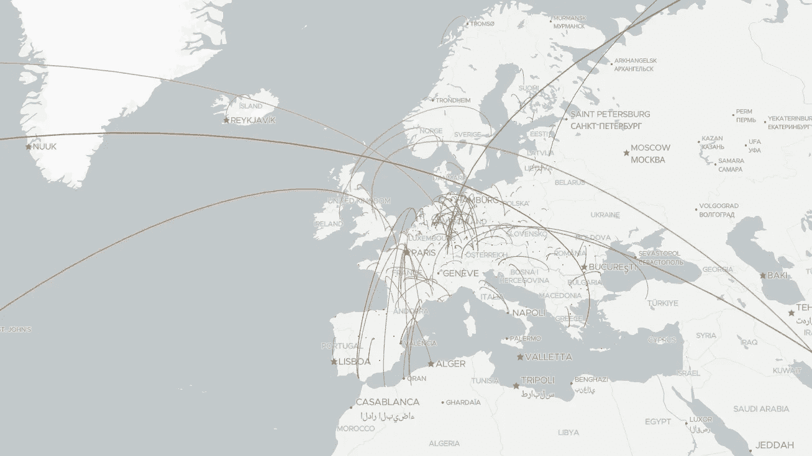
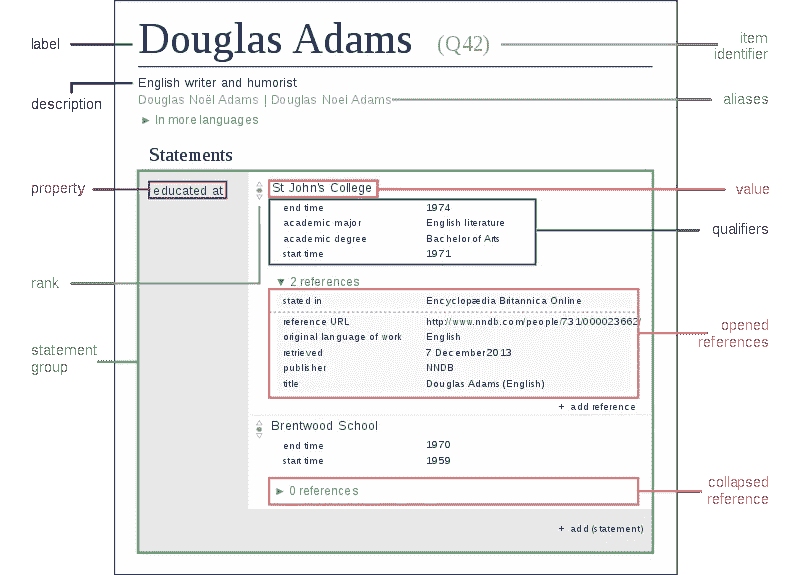
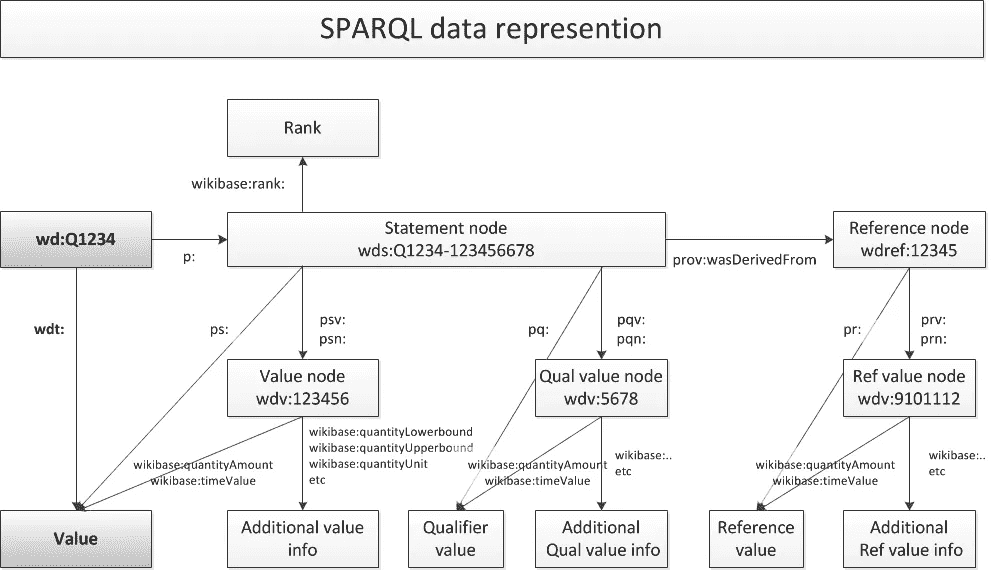
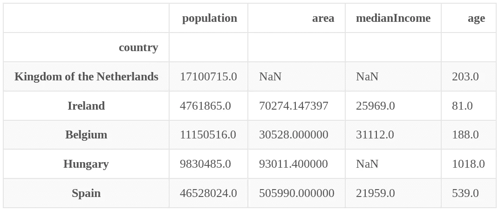
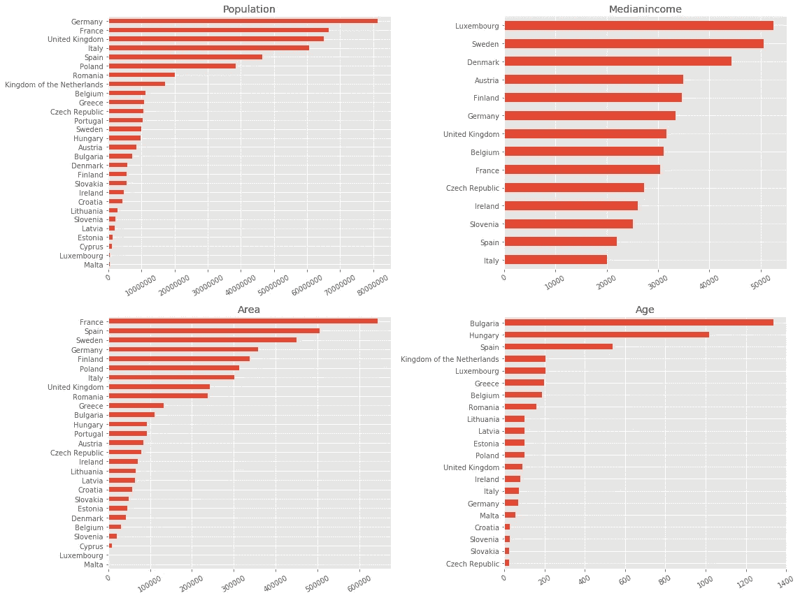
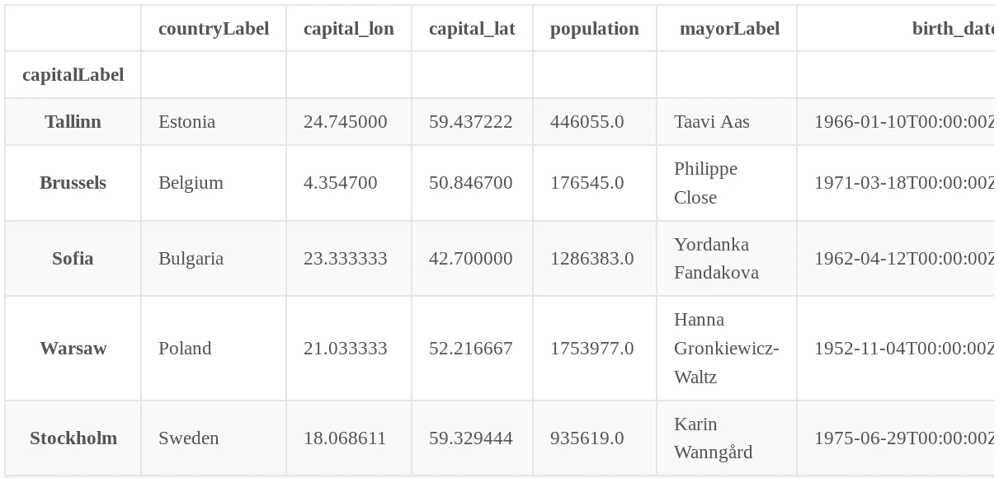
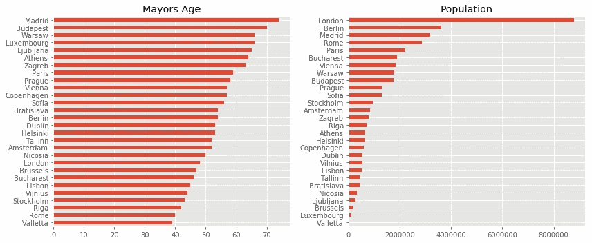

# 市长从哪里来？

> 原文：<https://towardsdatascience.com/where-do-mayors-come-from-querying-wikidata-with-python-and-sparql-91f3c0af22e2?source=collection_archive---------12----------------------->

## 用 Python 和 SPARQL 查询 Wikidata

想象一下，你想要一个画家的儿子的列表，或者你想知道哪个市长出生在最遥远的地方。用 SPARQL 在 Wikidata 上进行简单的查询，就可以完成大量繁琐的研究工作。在本文中，通过了解欧洲市长的出生地，您将看到如何使用 Python 和 SPARQL 为 Wikidata 构建查询。

这篇文章和[交互可视化](https://janakiev.com/wikidata-mayors/)的所有代码都可以在这个[库](https://github.com/njanakiev/wikidata-mayors)中找到。



[Where do Mayors Come From?](https://janakiev.com/wikidata-mayors/)

[Wikidata](https://www.wikidata.org/) 是一个免费的协作式[链接开放数据(LOD)](https://en.wikipedia.org/wiki/Linked_data) 知识库，可以由人类和机器编辑。该项目始于 2012 年，由维基媒体基金会发起，旨在集中维基链接、信息框和丰富的查询。它雄心勃勃的目标是以机器可读的方式构建整个人类知识，这很好地体现了蒂姆·伯纳斯·李在 2009 年 TED 演讲中的愿景。令人惊讶的是，[语义网](https://en.wikipedia.org/wiki/Semantic_Web)的想法在 2001 年就已经存在了，它是由关联数据组成的。在维基数据之前有很多项目。有 [DBpedia](https://en.wikipedia.org/wiki/DBpedia) 基于维基百科中的信息框，[朋友的朋友(FOAF)](https://en.wikipedia.org/wiki/FOAF_(ontology)) 这是一个描述社交网络中关系的本体， [GeoNames](https://en.wikipedia.org/wiki/GeoNames) 提供了一个带有地理名称的数据库，[上层映射和绑定交换层(UMBEL)](https://en.wikipedia.org/wiki/UMBEL) 这是一个概念和实体的知识图以及一整套其他项目，但维基数据似乎是它们之间最雄心勃勃的项目。

它的工作方式类似于维基百科，它是建立在贡献者的工作之上的。那里的所有数据都是免费的(在 [CC0 1.0](https://creativecommons.org/publicdomain/zero/1.0/) 下，也就是公共领域)，任何人都可以编辑和贡献。在大多数(如果不是全部)维基百科页面上，有一个*维基数据条目*链接到它在维基数据中的对应条目，在那里你可以找到列出的链接信息。请注意，您仍然可以找到漏洞，但由于这是一个社区的努力，随着时间的推移，随着每一次贡献，这将变得越来越好。要访问结构化数据，您可以使用它的 [SPARQL 端点](https://query.wikidata.org/)来查询 Wikidata，这使您能够运行高级查询，或者使用它的 [REST API](https://www.wikidata.org/w/api.php) 。

但是你可能会问，那些维基数据是什么？在这个图表中，您可以看到一个 Wikidata 条目的结构。他们每个人都有一个[语句](https://www.wikidata.org/wiki/Help:Statements)的列表，是以`SUBJECT` - `PREDICATE` - `OBJECT`形式的三元组(例如*道格拉斯·亚当斯*在*圣约翰学院*受*教育)。在维基数据中，主语指的是一个[项](https://www.wikidata.org/wiki/Help:Items)，谓语指的是[属性](https://www.wikidata.org/wiki/Help:Properties)。每个属性都有一个值，可以是项目、文本、数字、日期或 GPS 坐标等。每个值可以有额外的[限定符](https://www.wikidata.org/wiki/Help:Qualifiers)，这些限定符具有其他属性-值对的额外信息，比如开始时间。当您开始用 SPARQL 表达查询时，这种结构将非常重要。*



Image from [SPARQL/WIKIDATA Qualifiers, References and Ranks](https://en.wikibooks.org/wiki/SPARQL/WIKIDATA_Qualifiers,_References_and_Ranks)

# SPARQL 简介

SPARQL？这是另一个 SQL 派生吗？因为您处理的是链接数据，而不是通常的关系数据，所以您需要一种不同的方法来查询数据库(也称为 triplestore)，但它非常相似，使用起来也非常简单。SPARQL 是一种查询语言，用于检索存储为 [RDF](https://en.wikipedia.org/wiki/Resource_Description_Framework) (资源描述框架)的数据，它由 W3C 标准化。它是一种强大的查询链接数据的语言，已经被 Wikidata 选用。语法类似于 SQL，但是对于接受过 SQL 培训的人来说有一些不同。一个关键的区别是，在 SQL 中，您倾向于避免使用`JOIN`子句，因为它们会降低查询速度，但是在 SPARQL 中，查询主要由连接组成。但是坚持住，让我们来看看这样一个查询。在本例中，我们希望列出欧盟的所有国家:

```
SELECT ?country ?countryLabel WHERE {
  ?country wdt:P463 wd:Q458.
  SERVICE wikibase:label { bd:serviceParam wikibase:language "en". }
}
```

你可以自己尝试这个查询[这里](https://query.wikidata.org/#SELECT%20%3Fcountry%20%3FcountryLabel%20WHERE%20%7B%0A%20%20%3Fcountry%20wdt%3AP463%20wd%3AQ458.%0A%20%20SERVICE%20wikibase%3Alabel%20%7B%20%0A%20%20%20%20bd%3AserviceParam%20wikibase%3Alanguage%20%22%5BAUTO_LANGUAGE%5D%2Cen%22.%20%0A%20%20%7D%0A%7D)。请注意，您可以在[https://query.wikidata.org/](https://query.wikidata.org/)测试每个查询。那里的编辑器提供了一些有用的特性。如果您将鼠标悬停在编辑器中的属性和项目上，您将获得关于它们的信息，编辑器还提供了自动完成功能。你还会发现一系列例子，这些例子在你重新开始时非常有用。好了，继续。

从`SELECT`子句开始，定义想要获取的变量(变量以问号为前缀)。在`WHERE`子句中，您设置了一些限制，这些限制大多采用您之前看到的三元组的形式。语句`?country wdt:P463 wd:Q458.`将对象为[欧盟(Q458)](https://www.wikidata.org/wiki/Q458) 的属性为[成员(P463)](https://www.wikidata.org/wiki/Property:P463) 的所有项目收集到变量`country`中。如您所见，这些声明读起来像一个句子(该国是欧盟成员国)。您还会注意到前缀`wd:`和`wdt:`被认为是 SPARQL 中的快捷缩写(您可以在这里找到内置前缀列表[)。这些用`wd:`表示项目，用`wdt:`表示属性。在本教程的后面，当您更深入地了解 SPARQL 数据表示时，我们将讨论更复杂的前缀。](https://en.wikibooks.org/wiki/SPARQL/Prefixes)

最后，您将看到查询中令人困惑的部分`SERVICE wikibase:label { bd:serviceParam wikibase:language "en". }`。这个代码片段负责将收集到的项目的标签检索到一个附加变量中，该变量带有指定语言(在本例中为英语)的后缀`Label`。在这个查询中，这将是存储`country`变量标签的`countryLabel`变量。请注意，仅检索具有所选特定语言标签的项目的标签(在本例中`"en"`为英语)，因为可能存在未翻译成该特定语言的项目。

有趣的补充说明:当运行查询时，您会注意到欧洲国家列表中的[荷兰王国](https://en.wikipedia.org/wiki/Kingdom_of_the_Netherlands)和维基百科条目 [Q29999](https://www.wikidata.org/wiki/Q29999) 。令人惊讶的是，[荷兰](https://en.wikipedia.org/wiki/Netherlands) ( [Q55](https://www.wikidata.org/wiki/Q55) )是荷兰王国的组成国，但不是国家。这类似于英格兰是联合王国的一部分。如果你感到困惑，这个视频可以很好地解释这种情况。

# 高级查询

现在让我们探索一下我们所选择的国家的其他属性。如果你看一下[德国(Q183)](https://www.wikidata.org/wiki/Q183) ，那么你可以看到一大堆属性，比如[人口(P1082)](https://www.wikidata.org/wiki/Property:P1082) ，[收入中位数(P3529)](https://www.wikidata.org/wiki/Property:P3529) ，甚至是带有[图像(P18)](https://www.wikidata.org/wiki/Property:P18) 属性的图像。SPARQL 也使我们能够检索这些内容，这将我们引向下一个查询:

```
SELECT 
  ?country ?countryLabel ?population ?area ?medianIncome
WHERE {
  ?country wdt:P463 wd:Q458.
  ?country wdt:P1082 ?population.
  ?country wdt:P2046 ?area.
  ?country wdt:P3529 ?medianIncome.

  SERVICE wikibase:label { bd:serviceParam wikibase:language "en". }
}
```

你可以试试这个查询[这里](https://query.wikidata.org/#SELECT%20%0A%20%20%3Fcountry%20%3FcountryLabel%20%0A%20%20%3Fcapital%20%3FcapitalLabel%0A%20%20%3Fpopulation%20%3Farea%20%3FmedianIncome%0AWHERE%20%7B%0A%20%20%3Fcountry%20wdt%3AP463%20wd%3AQ458.%0A%20%20%3Fcountry%20wdt%3AP36%20%3Fcapital.%0A%20%20%3Fcountry%20wdt%3AP1082%20%3Fpopulation.%0A%20%20%3Fcountry%20wdt%3AP2046%20%3Farea.%0A%20%20%3Fcountry%20wdt%3AP3529%20%3FmedianIncome.%0A%20%20%0A%20%20SERVICE%20wikibase%3Alabel%20%7B%20bd%3AserviceParam%20wikibase%3Alanguage%20%22en%22.%20%7D%0A%7D)。

还记得我们说过 SPARQL 主要由连接组成吗？你可以看到，每个语句都是这样一个连接，增加了更多的链接。尝试这个查询后，您会注意到国家列表变短了。这是因为查询忽略了没有人口、面积或中值收入作为属性的每个国家项目。您可以将这些三元组想象成一个过滤器，限制只匹配这个查询的三元组。我们可以添加`OPTIONAL`子句，如果查询在该子句中找不到三元组，该子句会将这些变量留空:

```
SELECT 
  ?country ?countryLabel ?population ?area ?medianIncome
WHERE {
  ?country wdt:P463 wd:Q458.
  OPTIONAL { ?country wdt:P1082 ?population }
  OPTIONAL { ?country wdt:P2046 ?area }
  OPTIONAL { ?country wdt:P3529 ?medianIncome }

  SERVICE wikibase:label { bd:serviceParam wikibase:language "en". }
}
```

你可以试试这个查询[这里](https://query.wikidata.org/#SELECT%20%0A%20%20%3Fcountry%20%3FcountryLabel%20%0A%20%20%3Fcapital%20%3FcapitalLabel%0A%20%20%3Fpopulation%20%3Farea%20%3FmedianIncome%0AWHERE%20%7B%0A%20%20%3Fcountry%20wdt%3AP463%20wd%3AQ458.%0A%20%20%3Fcountry%20wdt%3AP36%20%3Fcapital.%0A%20%20%20%20%0A%20%20OPTIONAL%20%7B%20%3Fcountry%20wdt%3AP1082%20%3Fpopulation%20%7D%0A%20%20OPTIONAL%20%7B%20%3Fcountry%20wdt%3AP2046%20%3Farea%20%7D%0A%20%20OPTIONAL%20%7B%20%3Fcountry%20wdt%3AP3529%20%3FmedianIncome%20%7D%0A%20%20%0A%20%20SERVICE%20wikibase%3Alabel%20%7B%20bd%3AserviceParam%20wikibase%3Alanguage%20%22en%22.%20%7D%0A%7D)。现在，您可以在表格中看到，您将再次找到所有国家/地区的更多附加信息:


Query Result for all countries

# SPARQL 数据表示

我们用一个更复杂的查询继续我们的旅程，我们将一步一步地解开它。我们的目标是现在得到所有国家，首都，人口，市长，他的生日，最后是他的出生地。结果查询如下所示:

```
SELECT DISTINCT 
  ?country ?countryLabel ?capital ?capitalLabel ?population 
  ?mayor ?mayorLabel ?birth_place ?birth_placeLabel ?birth_date ?age
WHERE {
  # Get all european countries, their capitals and the population of the capital
  ?country wdt:P463 wd:Q458.
  ?country wdt:P36 ?capital.
  OPTIONAL { ?capital wdt:P1082 ?population. }

  # Get all mayors without an end date
  ?capital p:P6 ?statement.
  ?statement ps:P6 ?mayor.
  FILTER NOT EXISTS { ?statement pq:P582 ?end_date }

  # Get birth place, birth date and age of mayor
  ?mayor wdt:P19 ?birth_place.
  ?mayor wdt:P569 ?birth_date.
  BIND(year(now()) - year(?birth_date) AS ?age)

  SERVICE wikibase:label { 
    bd:serviceParam wikibase:language "[AUTO_LANGUAGE],en". 
  }
}
```

你可以试试这个查询[这里](https://query.wikidata.org/#SELECT%20DISTINCT%20%0A%20%20%3Fcountry%20%3FcountryLabel%20%3Fcapital%20%3FcapitalLabel%20%3Fpopulation%20%0A%20%20%3Fmayor%20%3FmayorLabel%20%3Fbirth_place%20%3Fbirth_placeLabel%20%3Fbirth_date%20%3Fage%0AWHERE%20%7B%0A%20%20%3Fcountry%20wdt%3AP463%20wd%3AQ458.%0A%20%20%3Fcountry%20wdt%3AP36%20%3Fcapital.%0A%20%20OPTIONAL%20%7B%20%3Fcapital%20wdt%3AP1082%20%3Fpopulation.%20%7D%0A%20%20%0A%20%20%3Fcapital%20p%3AP6%20%3Fstatement.%0A%20%20%3Fstatement%20ps%3AP6%20%3Fmayor.%0A%20%20FILTER%20NOT%20EXISTS%20%7B%20%3Fstatement%20pq%3AP582%20%3Fend_date%20%7D%0A%20%20%20%20%0A%20%20%3Fmayor%20wdt%3AP19%20%3Fbirth_place.%0A%20%20%3Fmayor%20wdt%3AP569%20%3Fbirth_date.%0A%20%20BIND%28year%28now%28%29%29%20-%20year%28%3Fbirth_date%29%20AS%20%3Fage%29%0A%20%20%0A%20%20SERVICE%20wikibase%3Alabel%20%7B%20%0A%20%20%20%20bd%3AserviceParam%20wikibase%3Alanguage%20%22%5BAUTO_LANGUAGE%5D%2Cen%22.%20%0A%20%20%7D%0A%7D)。

让我们解开这里发生的事情。首先，你首先通过[首都(P36)](https://www.wikidata.org/wiki/Property:P36) 属性获得这个国家的首都。接下来，你进入一个更复杂的部分。要理解如何访问市长，您必须查看下图中的 SPARQL 数据表示:



Image from [SPARQL/WIKIDATA Qualifiers, References and Ranks](https://en.wikibooks.org/wiki/SPARQL/WIKIDATA_Qualifiers,_References_and_Ranks)

这看起来确实令人困惑，但是不要放弃。你只需要专注于你需要的数据。这个数据表示图展示了使用 SPARQL 从一个条目开始遍历它以获得各种信息的方法(在图中显示为`wd:Q1234`)。您可以在左侧看到我们在前面的三元组中使用的经典路径，它使用了前缀`wdt:`,导致的值可以是另一个项目、一个数值(例如，在前面的一个查询中的人口)或各种其他数据类型。

如果你看一下像[罗马(Q220)](https://www.wikidata.org/wiki/Q220) 这样的项目，你会注意到对于[政府首脑(P6)](https://www.wikidata.org/wiki/Property:P6) 有各种各样的说法。你想要一个没有结束日期的。您可以通过遍历带有`p:`前缀的语句节点并将其存储在`statement`变量中来实现这一点。从这个变量中，您可以得到带有`ps:`前缀的市长。你本可以用`wdt:`做到这一点，因为你已经学会了，但你想更进一步。您希望到达作为限定符存储在语句中的[结束时间(P582)](https://www.wikidata.org/wiki/Property:P582) 。您可以遍历带有前缀`pq:`的限定符，这将给出结束日期，但是您想要没有结束日期的市长。这可以通过使用`FILTER NOT EXISTS`子句来完成，该子句排除了所有具有结束日期的语句节点的三元组。

在最后一部分，您收集市长的出生地、出生日期和年龄。为了计算他的年龄，可以使用`BIND`表达式。这个表达式可以用来将一些表达式绑定到一个变量(在我们的例子中是年龄变量)。对于这个表达式，我们用当前年份减去出生日期的年份。这个查询到此结束。您可以在 [SPARQL/WIKIDATA 限定符、引用和等级](https://en.wikibooks.org/wiki/SPARQL/WIKIDATA_Qualifiers,_References_and_Ranks)中更深入地挖掘，它更详细地描述了数据表示。请确保对这个查询稍加研究，以便更好地理解它，因为它确实涵盖了各种各样的主题。

# 用 Python 检索 SPARQL 查询

您已经了解了如何使用 SPARQL，也可以在编辑器中下载结果表，但是如何自动化整个过程呢？您还可以使用 Python 访问 Wikidata SPARQL 端点，这使您能够直接加载和分析您查询的数据。为此，您将使用出色的[请求](http://docs.python-requests.org/en/master/)模块，该模块通过其所有必要的工具在处理 HTTP 请求方面表现出色。您可以通过添加查询作为参数来创建请求，如下所示。

```
import requestsurl = 'https://query.wikidata.org/sparql'
query = """
SELECT 
  ?countryLabel ?population ?area ?medianIncome ?age
WHERE {
  ?country wdt:P463 wd:Q458.
  OPTIONAL { ?country wdt:P1082 ?population }
  OPTIONAL { ?country wdt:P2046 ?area }
  OPTIONAL { ?country wdt:P3529 ?medianIncome }
  OPTIONAL { ?country wdt:P571 ?inception. 
    BIND(year(now()) - year(?inception) AS ?age)
  }
  SERVICE wikibase:label { bd:serviceParam wikibase:language "en". }
}
"""
r = requests.get(url, params = {'format': 'json', 'query': query})
data = r.json()
```

您已经将查询打包到了`query`变量中，并且需要额外提供带有 SPARQL 端点 URL 的请求，该 URL 是[https://query.wikidata.org/sparql](https://query.wikidata.org/sparql)。默认情况下，这将返回一个 XML，但是如果您想使用 JSON 作为输出文件，您也可以将它添加到您的请求中。除了 XML 和 JSON，API 还支持 TSV、CSV 和二进制 RDF。这个请求返回一个 JSON，其中包含从查询中收集的所有行，您可以使用这个 JSON 将这些行收集到一个包含以下代码片段的 [Pandas](https://pandas.pydata.org/) DataFrame 中:

```
import pandas as pd
from collections import OrderedDictcountries = []
for item in data['results']['bindings']:
    countries.append(OrderedDict({
        'country': item['countryLabel']['value'],
        'population': item['population']['value'],
        'area': item['area']['value'] 
            if 'area' in item else None,
        'medianIncome': item['medianIncome']['value'] 
            if 'medianIncome' in item else None,
        'age': item['age']['value'] 
            if 'age' in item else None}))df = pd.DataFrame(countries)
df.set_index('country', inplace=True)
df = df.astype({'population': float, 'area': float, 'medianIncome': float, 'age': float})
df.head()
```



让我们直观地研究收集的数据，并比较每个国家的各种属性:

```
%matplotlib inline
import matplotlib.pyplot as plt
plt.style.use('ggplot')plt.figure(figsize=(16, 12))
for i, label in enumerate(['population', 'medianIncome', 'area', 'age']):
    plt.subplot(2, 2, i + 1)
    df_plot = df[label].sort_values().dropna()
    df_plot.plot(kind='barh', color='C0', ax=plt.gca());
    plt.ylabel('')
    plt.xticks(rotation=30)
    plt.title(label.capitalize())
    plt.ticklabel_format(style='plain', axis='x')
plt.tight_layout()
```



太好了！现在让我们继续更高级的查询。

# 欧洲各国首都的市长

在我们最后的查询中，通过将坐标添加到查询中，您将看到市长出生的地方。为了获得经纬度坐标作为变量，需要添加以下语句:

```
?capital p:P625/psv:P625 ?capital_node.
?capital_node wikibase:geoLatitude ?capital_lat.
?capital_node wikibase:geoLongitude ?capital_lon.
```

在第一行中，您遍历前面显示的数据表示图。`p:P625/psv:P625`中的斜线表示您继续到[坐标位置(P625)](https://www.wikidata.org/wiki/Property:P625) 的*值节点*，而没有为*语句节点*使用单独的变量。然后，`wikibase:geoLatitude`和`wikibase:geoLongitude`分别负责从*值节点*中检索经纬度。欲了解更多信息，请查看关于[精度、单位和坐标](https://en.wikibooks.org/wiki/SPARQL/WIKIDATA_Precision,_Units_and_Coordinates)的文档。您将使用请求库向 SPARQL 端点发送查询:

```
url = 'https://query.wikidata.org/sparql'
query="""
SELECT DISTINCT 
  ?countryLabel ?capitalLabel ?population ?capital_lon ?capital_lat
  ?mayorLabel ?birth_date ?age ?birth_place ?birth_placeLabel ?birth_place_lon ?birth_place_lat
WHERE {
  ?country wdt:P463 wd:Q458.
  ?country wdt:P36 ?capital.
  OPTIONAL { ?capital wdt:P1082 ?population. }

  # Get latitude longitude coordinates of capital
  ?capital p:P625/psv:P625 ?capital_node.
  ?capital_node wikibase:geoLatitude ?capital_lat.
  ?capital_node wikibase:geoLongitude ?capital_lon. ?capital p:P6 ?statement.
  ?statement ps:P6 ?mayor.
  FILTER NOT EXISTS { ?statement pq:P582 ?end_date } ?mayor wdt:P569 ?birth_date.
  BIND(year(now()) - year(?birth_date) AS ?age)
  ?mayor wdt:P19 ?birth_place.
  ?birth_place wdt:P625 ?birth_place_coordinates.

  # Get latitude longitude coordinates of birth place
  ?birth_place p:P625/psv:P625 ?birth_place_node.
  ?birth_place_node wikibase:geoLatitude ?birth_place_lat.
  ?birth_place_node wikibase:geoLongitude ?birth_place_lon.

  SERVICE wikibase:label { 
    bd:serviceParam wikibase:language "[AUTO_LANGUAGE],en". 
  }
}
"""r = requests.get(url, params = {'format': 'json', 'query': query})
data = r.json()
```

现在，您需要将生成的 JSON 数据转换成 Pandas 数据框架，以便进一步处理数据:

```
countries = []
for item in data['results']['bindings']:
    countries.append(OrderedDict({
        label : item[label]['value'] if label in item else None
        for label in ['countryLabel', 'capitalLabel', 
                      'capital_lon', 'capital_lat', 'population', 
                      'mayorLabel', 'birth_date', 'age', 
                      'birth_placeLabel', 'birth_place_lon',      
                      'birth_place_lat']}))df = pd.DataFrame(countries)
df.set_index('capitalLabel', inplace=True)
df = df.astype({'population': float, 'age': float,
                'capital_lon': float, 'capital_lat': float, 
                'birth_place_lon': float, 'birth_place_lat': float})
df.head()
```



使用该数据集，您现在可以探索市长的年龄以及他们所服务的首都的人口:

```
plt.figure(figsize=(12, 5))
plt.subplot(1, 2, 1)
df['age'].sort_values().plot(kind='barh', color='C0', title='Mayors Age')
plt.ylabel('')
plt.subplot(1, 2, 2)
df['population'].sort_values().plot(kind='barh', color='C0', title='Population')
plt.ylabel('')
plt.ticklabel_format(style='plain', axis='x')
plt.tight_layout()
```



因此，欧洲首都最老的市长似乎是马德里的住房。接下来，我们来看看市长出生在离首都多远的地方。为此，您可以使用 [geopy](https://geopy.readthedocs.io/en/stable/) 包来计算坐标之间的距离。这个[教程](https://janakiev.com/blog/gps-points-distance-python/)涵盖了这个话题，如果你好奇为什么我们不能只在 GPS 坐标上使用欧几里德距离(剧透:地球不是平的)。要计算距离，您可以使用距离的`distance()`函数和米(`.m`)属性:

```
from geopy.distance import distancecoordinates = df[['capital_lon', 'capital_lat', 
                  'birth_place_lon', 'birth_place_lat']]
df['distance'] = [distance((lat0, lon0), (lat1, lon1)).m 
                for lon0, lat0, lon1, lat1 in coordinates.values]df['distance'].sort_values().plot(
    kind='barh', color='C0', logx=True)
plt.xlabel('Distance (m)')
plt.ylabel('');
```


在这里，你可以看到大多数市长往往出生在他们后来任职的城市或其附近(注意，该图表是对数标度)。你可以看到雅典领先例外，他们的现任市长(乔治·卡米尼斯)出生在美国纽约，巴黎的现任市长(安妮·伊达尔戈)出生在西班牙圣费尔南多。从那里开始，距离显著下降。

要在 Wikidata 中获得欧洲所有市长的列表，请看一下这个[脚本](https://github.com/njanakiev/wikidata-mayors/blob/master/load_european_mayors.py)，它更复杂，因为它必须处理一些例外情况(比如出生在不再存在的国家的市长)，并且需要对每个国家分别进行查询，因为查询有限制。最终的交互可视化可以在[这里](https://janakiev.com/wikidata-mayors/)找到，包括这个笔记本在内的完整代码可以在这个[库](https://github.com/njanakiev/wikidata-mayors)找到。

# 结论

您已经学习了如何使用 Wikidata 和 SPARQL，以及如何将其与 Python 和 Pandas 集成。Wikidata 是一个很棒的数据库，它可以实现在您最喜欢的搜索引擎上进行普通搜索所无法实现的查询和发现。这为进行数据科学和探索性数据分析开辟了令人兴奋的新可能性，并为了解我们积累的人类知识中的关系和好奇的发现开辟了一条迷人的新途径。

*感谢阅读！如果你有一些反馈或者想要合作，请随时联系我。你可以在*[*Github*](https://github.com/njanakiev)*[*Twitter*](https://twitter.com/njanakiev)*[*LinkedIn*](https://at.linkedin.com/in/nikolai-janakiev)*上找到我或者你可以在我的* [*主页*](https://janakiev.com/about/) *上找到我的邮箱。***

# **资源和一堆链接**

**在文章 [Wikidata:一个免费的协作知识库中可以找到关于 Wikidata 的历史和概述。](http://delivery.acm.org/10.1145/2630000/2629489/p78-vrandecic.pdf?ip=188.23.116.132&id=2629489&acc=OA&key=4D4702B0C3E38B35%2E4D4702B0C3E38B35%2E4D4702B0C3E38B35%2EB8CD93A2515AABD1&__acm__=1533116941_da1ef0b41c8a6ea97e62187e7e72de90)作者:vrandei d .&krtzsch m .(2014 年)。有一个很棒的 SPARQL 教程涵盖了这里提到的许多内容，并且更加深入地理解 SPARQL。如果你对维基数据感到兴奋，并想做出贡献，有[维基数据之旅](https://www.wikidata.org/wiki/Wikidata:Tours)可以指导你完成这个过程。如果你计划进行大型查询，请确保查看可公开下载的[维基数据转储](https://dumps.wikimedia.org/wikidatawiki/entities/)，它们是整个维基数据集的定期更新转储，这里有一个关于[维基数据库数据模型](https://www.mediawiki.org/wiki/Wikibase/DataModel)的文档。维基数据也为程序员提供了一个工具列表。**

**这里是一个非结构化的资源列表，包含有用的文档、教程或使用 Wikidata 的例子。**

*   **[从维基数据导出 RDF](https://tools.wmflabs.org/wikidata-exports/rdf/)**
*   **[维基数据:属性列表](https://www.wikidata.org/wiki/Wikidata:List_of_properties)**
*   **[维基数据:数据库报告](https://www.wikidata.org/wiki/Wikidata:Database_reports)**
*   **[维基数据:数据库报告/财产清单/前 100 名](https://www.wikidata.org/wiki/Wikidata:Database_reports/List_of_properties/Top100)**
*   **[维基百科:简介](https://www.wikidata.org/wiki/Wikidata:Introduction)**
*   **[Wikidata:SPARQL 查询](https://www.wikidata.org/wiki/Wikidata:SPARQL_query_service/queries)**
*   **[Wikidata:SPARQL 查询示例](https://www.wikidata.org/wiki/Wikidata:SPARQL_query_service/queries/examples)**
*   **[维基数据:创建一个机器人](https://www.wikidata.org/wiki/Wikidata:Creating_a_bot)**
*   **[向维基数据查询维也纳的电车线路:SPARQL 简介](https://noniq.at/0016/wikidata-sparql-introduction/)**
*   **[维基数据显示美国总统的死因](http://ramiro.org/notebook/us-presidents-causes-of-death/)**
*   **[雄心勃勃的维基数据教程——幻灯片分享](https://de.slideshare.net/_Emw/an-ambitious-wikidata-tutorial)**
*   **[维基数据图表生成器](https://angryloki.github.io/wikidata-graph-builder/)，可视化维基数据图表的伟大工具**
*   **历史时间线的可视化**