# 蚊子在哪里——香港登革热前线:第一部分数据清理

> 原文：<https://towardsdatascience.com/where-is-the-mosquito-hk-dengue-fever-frontline-part-1-data-cleaning-d3dc165ba3db?source=collection_archive---------14----------------------->

[*第 2 部分:创建 SQLite 数据库*](/where-is-the-mosquito-hk-dengue-fever-frontline-part-2-create-a-sqlite-database-d8d90968ef10)[*第 3 部分:可视化诱蚊产卵器索引*](/where-is-the-mosquito-hk-dengue-fever-frontline-part-3-visualising-ovitrap-index-f04f3295c63a)

今年夏天登革热的爆发令许多香港市民担忧。根据香港特区卫生防护中心，到目前为止已经有 29 例。这种疾病由登革热病毒引起，可通过白纹伊蚊(一种身体上有白色条纹的蚊子)作为媒介感染人类。在东南亚，它是许多国家的地方病。由于登革热病毒可导致严重疾病，香港政府使用一种名为[产卵诱捕器](https://www.fehd.gov.hk/english/pestcontrol/dengue_fever/index.html)(诱蚊产卵器)的设备监测登革热蚊子的分布，这有助于反映选定区域蚊子的分布范围。

为了抗击这种疾病，了解蚊子的活动区域至关重要。因此，我收集和整理了香港特别行政区食物环境卫生署(FEHD)在 2008 年 1 月至 2018 年 7 月期间的区域诱蚊产卵器指数(AOI)数据，希望找出它们在这些年的大本营。

整个数据清理过程有四个步骤。2008 年至 2017 年的数据从 [FEHD 网站](https://www.fehd.gov.hk/english/pestcontrol/dengue_fever/images/montlyOvitrap_2008-2017.pdf)下载 PDF 格式，2018 年 1 月至 2018 年 7 月的数据从 FEHD 网站废弃。

下面是下载的 PDF 的样子:

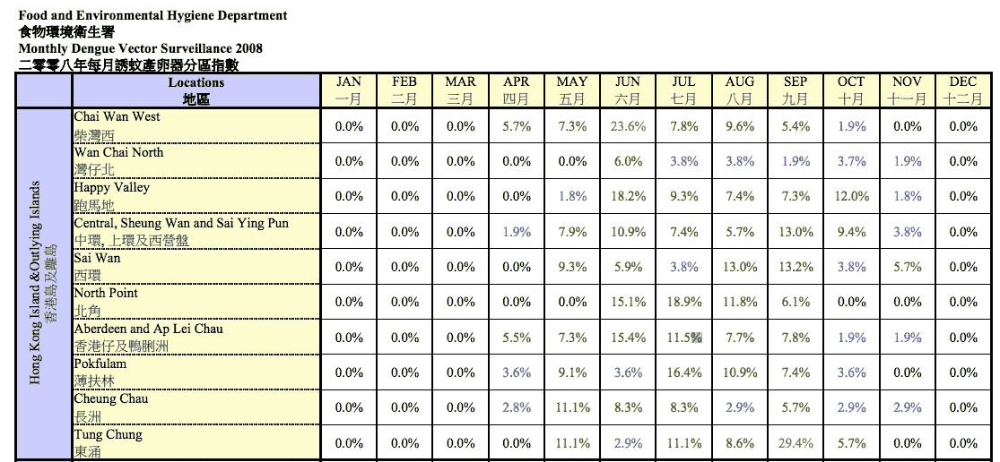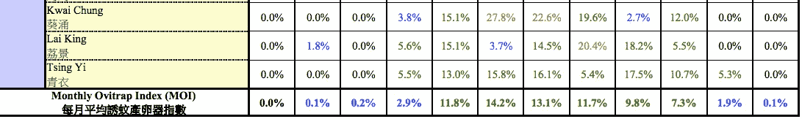

这份双语文档有十页，每一页都有一个表格，由当年每个月每个地点的 AOI 组成。每一页都以一个 FEHD 标题和一个副标题开始，然后是一个表格。在每个表格的最后一行，有一个每月诱蚊产卵器指数(MOI)行，其中包含该年每个月的平均诱蚊产卵器指数。

**步骤 1)从 FEHD 文档中提取所需数据**

在将文档加载到 Jupyter 笔记本之前，我将其转换为 CSV 格式，以便于数据准备。正如我们在上面看到的，一些数据行(如 FEHD 标题)应该被删除，一些重要的数据需要提取(如副标题“2008 年每月登革热媒介监测”中的 2008 年)。

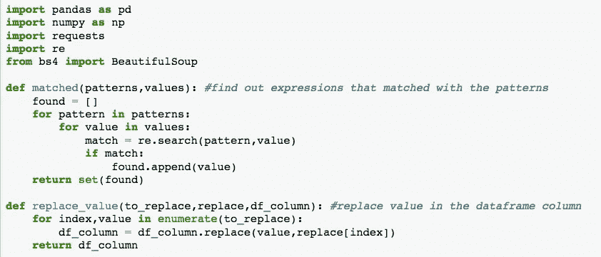

Function ‘matched’ and ‘replace_value’ are created to clean the original dataframe and web scrapped data

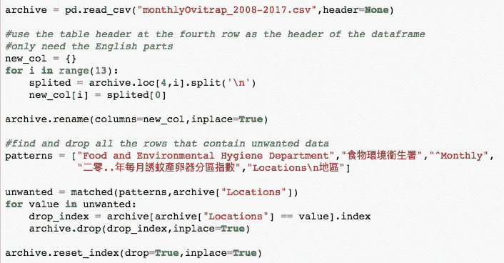

Assigning the dataframe header and drop data that are not needed

尽管原始文档中的每个表格都有标题，但由于 FEHD 标题、副标题及其双语性质的存在，它不能直接用作 dataframe 标题。因此，我从表格中提取了标题的英文部分，并将其设置为 dataframe 标题。然后，使用正则表达式找到不需要的行并删除。如前所述，每个表格都有一个表头。因此，只有第一个表头被保留，而其他表头也被删除。

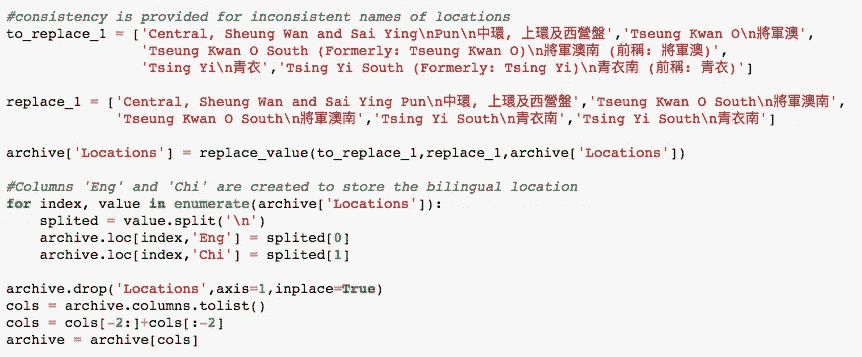

当探索数据时，发现一些区域被分成更小的部分，因此相同的位置被不同地调用。例如，“将军澳”分为“将军澳南”和“将军澳北”。根据 FEHD，分区前的“将军澳”现与“将军澳南”相同。为了使十年数据更加一致，这些位置基于最近(2018 年 7 月)的区域划分进行处理，当将该数据集与从 FEHD 网站收集的 2018 年数据相结合时，将再次处理该区域划分。此外，原始列“Locations”有英文和中文名称，中间用“\n”分隔。因此，我把它们分成两个新的栏目，分别叫做“Eng”和“Chi”。

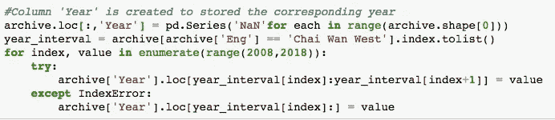

在获取 2018 年的数据之前，这个数据帧不包含告诉我们该行属于哪一年的数据。通过观察数据集，我发现虽然地点数量从 2008 年的 38 个增加到 2017 年的 52 个，但每年都是从地点“柴湾西”开始。意思是找到“柴湾西”的行，我就找到了每年的第一行。这个模式支持我创建新的列“Year”来存储行中相应的年份。

为了更容易识别文档数据和 web 数据，在下面的步骤中，它们将被分别称为“存档”和“当前”。

**步骤 2)从 FEHD 网站收集数据**

由于登革热在今年夏天爆发，因此也应该收集 2018 年的数据。虽然 2018 年的诱蚊产卵器指数只能从 FEHD 网站收集，但当前数据集和存档数据集之间的差异需要额外的努力才能将它们结合在一起。

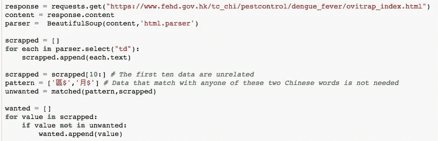

The two Chinese words in “pattern” means “District” and “Month” respectively

首先，BeautifulSoup 帮我删除了 FEHD 网站上的数据。从报废的内容来看，除了 10 行不相关的数据和几个标题行，发现有一个新的栏目叫“区”。区数据在进一步的分析中可能很有用，但是，最好在合并两个数据集后再包含它们。此外，为了将 web 数据与归档数据集相结合，不使用废弃数据的头。由于中文版的标题行具有更易识别的表达方式，所以网站的中文视图用于网页报废。

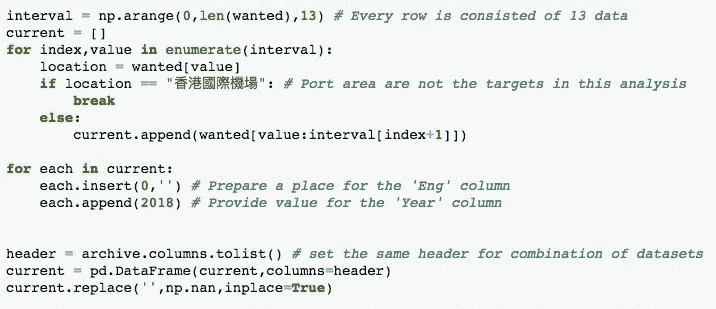

The Chinese words in line 5 means “Hong Kong International Airport”

之后，需要所有剩余的数据。每行应包含 1 月至 12 月的位置和诱蚊产卵器指数，因此，列表中的每 13 个数据代表一行。本项目以居民区诱蚊产卵器指标为目标，因此不考虑港区。在合并数据集之前，最后一项任务是确保两个数据集具有相同的标题，并且每一行具有相同的长度。由于该网站是中文版，收集的数据中没有这些地点的英文名称。因此，他们现在将被替换为 NaN。对于要放在“年份”列中的值，肯定是 2018。

**步骤 3)组合“存档”和“当前”**

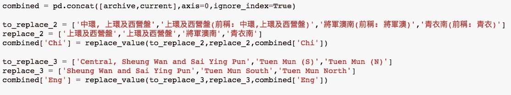

是时候将数据集合并成一个了。两个数据集有相同的头，所以 pandas.concat()可以很容易地完成这项工作。2018 年似乎有新的区域划分，这意味着同一个地点可能有不止一个名字。再次调用 replace_value 函数，它们现在有了一致的名称。

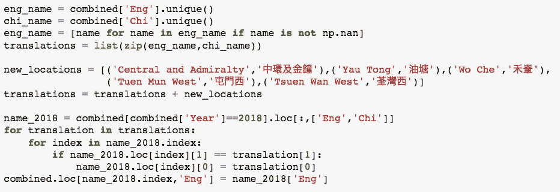

现在是时候填写 web 数据的空英文名称了。为此，需要创建一个名为 translations 的列表，其中包含所有的英文和中文位置。仅在 2018 年有 5 个新地点，因此，它们的翻译是手动输入的。完成后，组合过程就完成了。

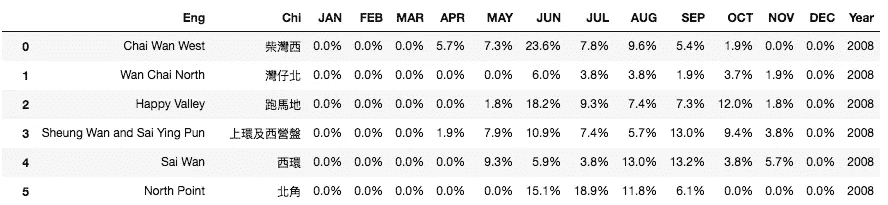

A preview of the combined dataframe

然而，这还不够好。组合数据框架基于 FEHD 表结构，这对于分析来说不够灵活。所以，有了后期创建一个简单 SQL 数据库的想法，我决定做一个改变。

**步骤 4)一个新的表格结构**

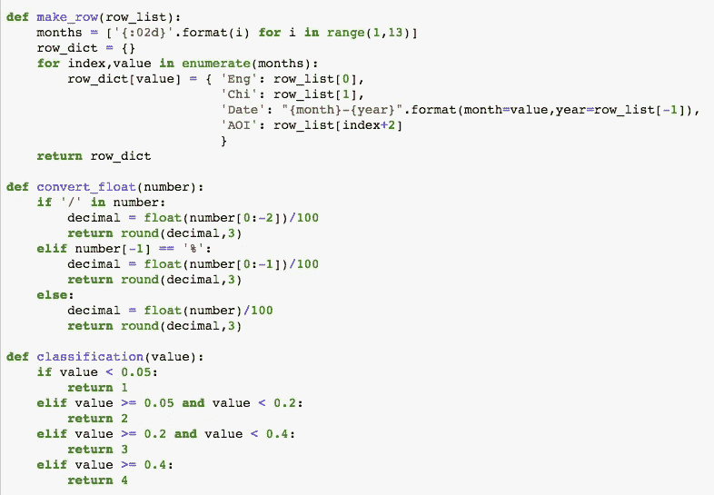

Three functions are created to serve the purpose of making the new dataframe

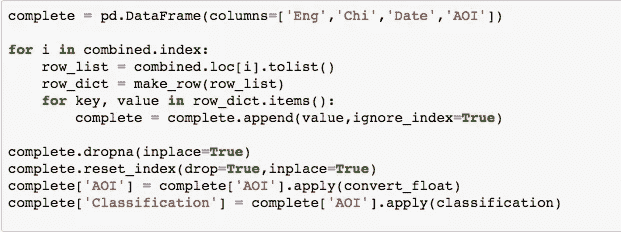

The process of creating the new dataframe

通过上述功能，您可能会意识到，我将在新的数据帧中创建代表某个位置的特定月份的每一行，并创建一个名为“分类”的列，以根据 [FEHD 指南](https://www.fehd.gov.hk/english/pestcontrol/dengue_fever/index.html)指示诱蚊产卵器指数的级别。将诱蚊产卵器索引从字符串类型转换为浮点类型时，发生了一个意外事件。一个诱蚊产卵器指数有一个错别字，在数字和%之间有一个“/”。这就是为什么“convert_float”函数有第一个 if 语句。

在整个数据清理过程之后，数据帧如下所示:

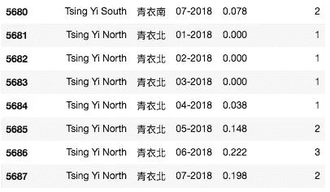

感谢您的阅读！数据清理已经完成，但是与蚊子的捉迷藏才刚刚开始。在下一篇文章中，我将分享我是如何将数据存储到 SQLite 数据库中的。这是我在数据科学领域的第一个独立项目。对于任何有兴趣加入这个旅程的人，你可以访问我的 [Github](https://github.com/DanielHLH/Where-is-the-Mosquito---HK-Dengue-Fever-Frontline) 来仔细看看代码。

如果任何人有任何想法，请随时分享。我非常愿意倾听和学习:)