# 蚊子在哪里——香港登革热前线:第二部分建立 SQLite 数据库

> 原文：<https://towardsdatascience.com/where-is-the-mosquito-hk-dengue-fever-frontline-part-2-create-a-sqlite-database-d8d90968ef10?source=collection_archive---------23----------------------->

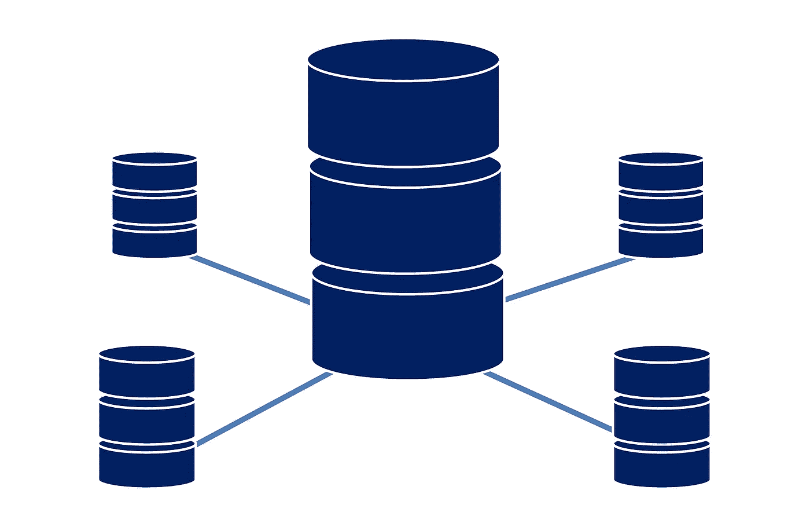

在[数据清理过程](https://medium.com/@danielhlh/where-is-the-mosquito-hk-dengue-fever-frontline-part-1-data-cleaning-d3dc165ba3db)中，我们从[香港食物环境卫生署](https://www.fehd.gov.hk/english/pestcontrol/dengue_fever/index.html) (FEHD)可下载的 PDF 文档和网站中，清理并合并了 2008 年 1 月至 2018 年 7 月期间的区域诱蚊产卵器指数(可反映每个月选定区域成蚊的广泛程度)数据。为了有一个更灵活的分析，原来的 FEHD 表结构被改成了这样:

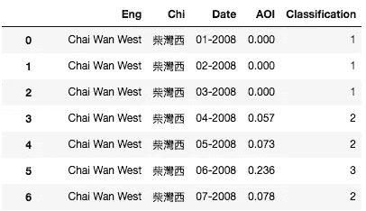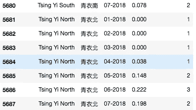

从上面的快照中，我们可以看到表中有 5600 多行。然而，并非每次分析都需要所有数据(例如，如果您只对 2010 年九龙区的诱蚊产卵器指数感兴趣),每次都将整个文件加载到 pandas dataframe 中并不是一个好主意。因此，我想设计一个 SQL 数据库。对于任何想用数据库做自己分析的人，可以从这个 [Github 库](https://github.com/DanielHLH/Where-is-the-Mosquito---HK-Dengue-Fever-Frontline)下载。

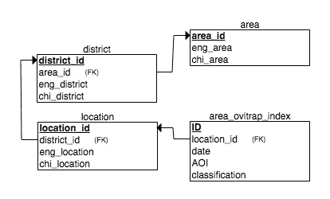

Relational Schema of the AreaOvitrap Database

数据库的表格和关系简单而直接。对于诱蚊产卵器指数，位置和记录的月份和年份构成了分析的背景。香港一般分为三个主要地区和 18 个地区。不过，FEHD 把香港分为 4 个主要地区和 19 个地区，以记录诱蚊产卵器指数。对于每个位置，它属于一个区和一个区域。然而，原始数据不支持针对特定地区或区域的分析。因此，在 Jupyter 笔记本中使用 sqlite3 创建数据库之前，需要准备以下字典:

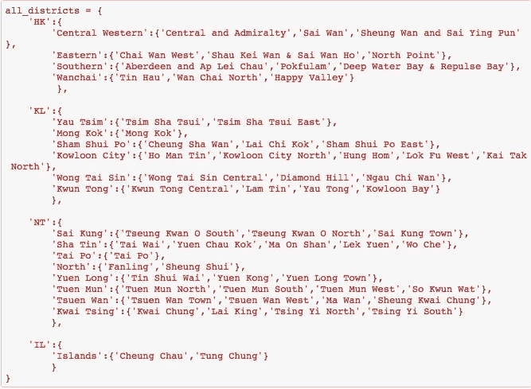

The division of districts in Hong Kong according to FEHD

这本字典有三个层次。第一层包括四个主要地区，然后是 19 个区，以及每个区内的诱蚊产卵器位置。

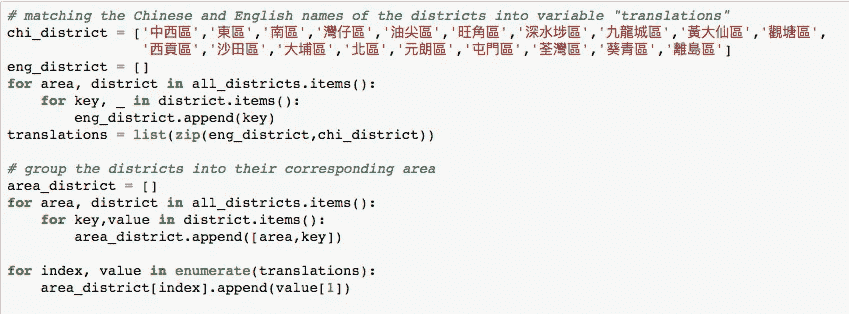

虽然每个诱蚊产卵器位置都有中英文名称，但地区应该相同。将地区的中文名称与相应的英文名称配对后，地区应根据四个主要地区进行分组。

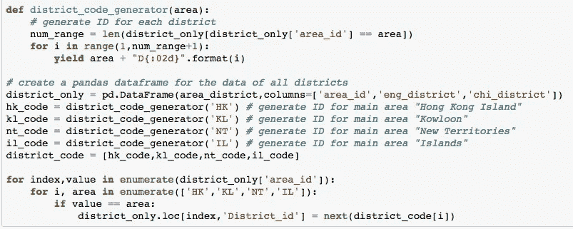

Generate ID for every district

在为地区和区域分配了 district_id 和 area_id 之后，就该创建数据库了。左边的图片显示了在生成任何 ID 之前的区域匹配，右边的数据帧快照就是结果。您可能会注意到，district_id 包含两个部分。第一部分是地区所属的区域(如 **HKD: H** 翁 **K** 翁岛 **D** 伊斯特里茨)，第二部分是一个整数。整数部分可以告诉我们一个地区有多少个区(例如，香港岛只有 4 个区，因此香港岛的最后一个区 id 是 HKD04)。

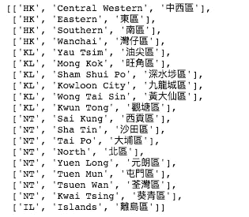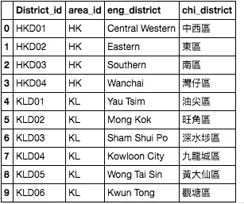

现在可以创建数据库了。让我们导入 sqlite3 并创建两个函数来简化这个过程。

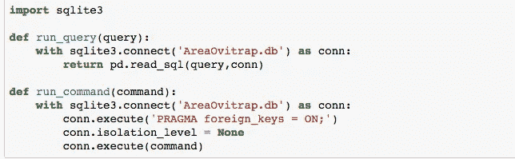

## **表格:区域**

区域仅包含代表香港四个主要区域的四行，因此可以手动输入数据。

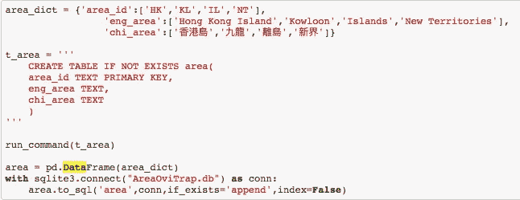

Creating table ‘Area’

## **表格:地区**

如上所示，如果在上一步中已经在数据帧“district_only”中处理了所需的数据，则可以使用 df.to_sql()方法直接迁移 district 表中的数据。

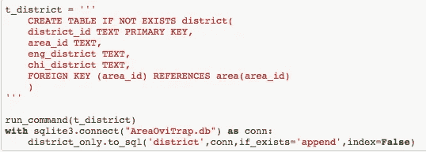

Creating table ‘District’

## 表格:位置

对于位置，让我们为每个位置创建一个 location_id，就像 district_id 一样。为此，创建了两个函数来匹配位置和地区，然后生成代码。

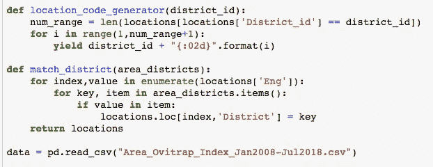

为该过程创建新的数据帧“位置”。它包含每个地点的中英文名称，然后通过检查该地点是否出现在主词典“all_districts”的子词典中，将该地点与地区进行匹配，主词典是在开始时创建的，用于记录所有地区和地点。之后，为了生成 location_id，创建了一个用于 district_id 的列，它使用 district_id 作为基础。

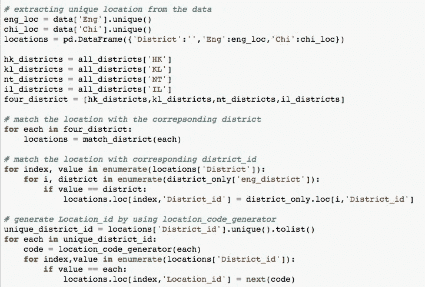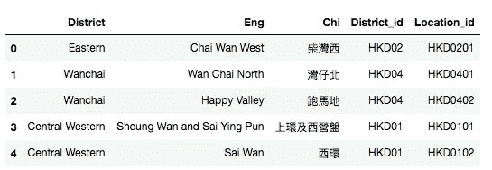

A snapshot of dataframe “locations “

数据帧“locations”的快照显示，location_id 具有类似于 district_id 的结构，district _ id 是基于 district 具有的位置的数量来决定的。location_id 由两部分组成，第一部分是 district_id，它也反映了 district 所属的区域，第二部分是一个整数。这个整数部分可以告诉我们该地区有多少个位置(例如，对于万佳区(HKD04)，它有三个位置)。第一个位置是 HKD0401，第二个位置是 HKD0402，第三个位置是 eis HKD0403)。

当还生成了 location_id 时，不仅表“location”，第四个表“area_ovitrap_index”也准备好被创建。在将 district_id 和 location_id 集成到原始数据帧“data”中之后，表“origin”由 df.to_sql()生成，因此最后两个表可以仅使用 sql 来创建

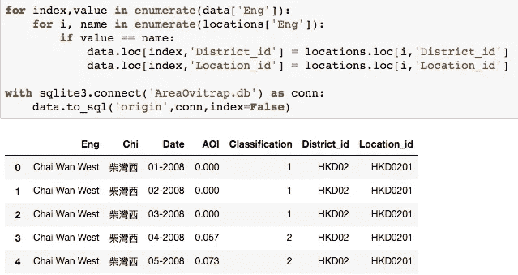

现在，创建了表“位置”和“区域 _ 诱蚊产卵器 _ 索引”。

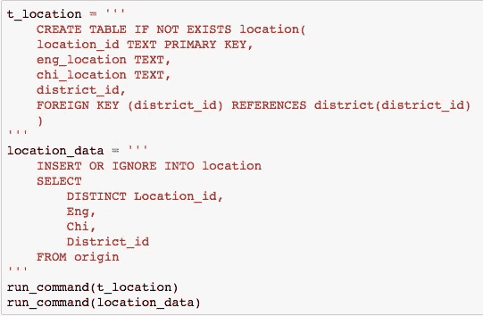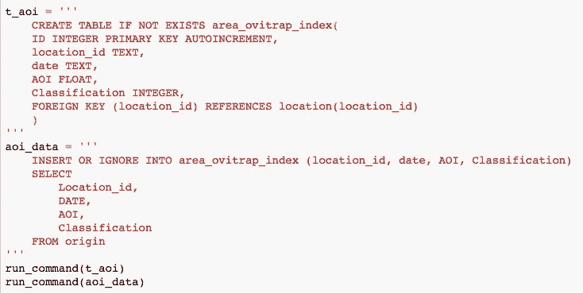

Creating tables “Location” and “Area Ovitrap Index”

最后，不要忘记删除“origin”表，它已经做了很好的工作。

***【run _ command】【若存在原点则删除表格】***

感谢您阅读这个项目的第二部分！这是我第一次独立的数据科学项目。如果任何人有任何意见或建议，我非常欢迎听取和借鉴。此外，对于有兴趣使用数据库进行自己的分析的人，我想提一下，当你在计算区域诱蚊产卵器指数的月平均值(例如，2017 年 7 月的月平均诱蚊产卵器指数)时，你可能不会得到与 FEHD 文件所示相同的结果，但你也会发现所有数据都是正确的。FEHD 在计算每月诱蚊产卵器指数时，可能没有如文件所示进行四舍五入。因此，舍入误差是可能的。

这个项目的最后一部分将是寻找和可视化具有最高诱蚊产卵器指数的位置。我们去抓蚊子吧！

有兴趣加入旅程的人可以访问我的 [Github](https://github.com/DanielHLH/Where-is-the-Mosquito---HK-Dengue-Fever-Frontline) 仔细看看代码:)