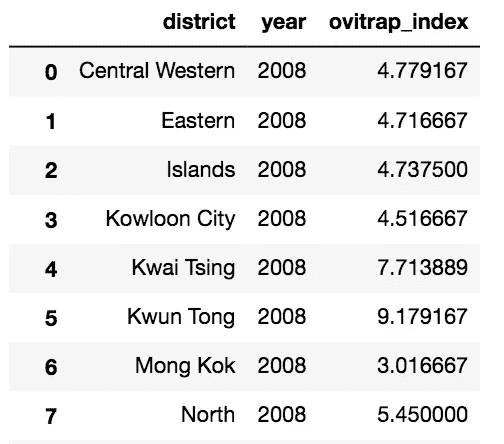
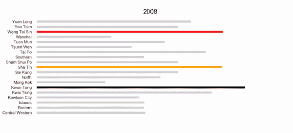
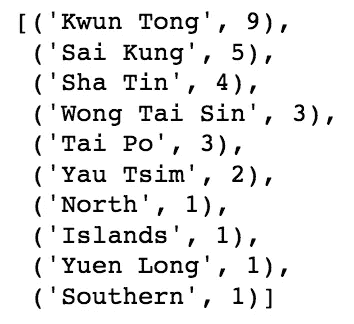
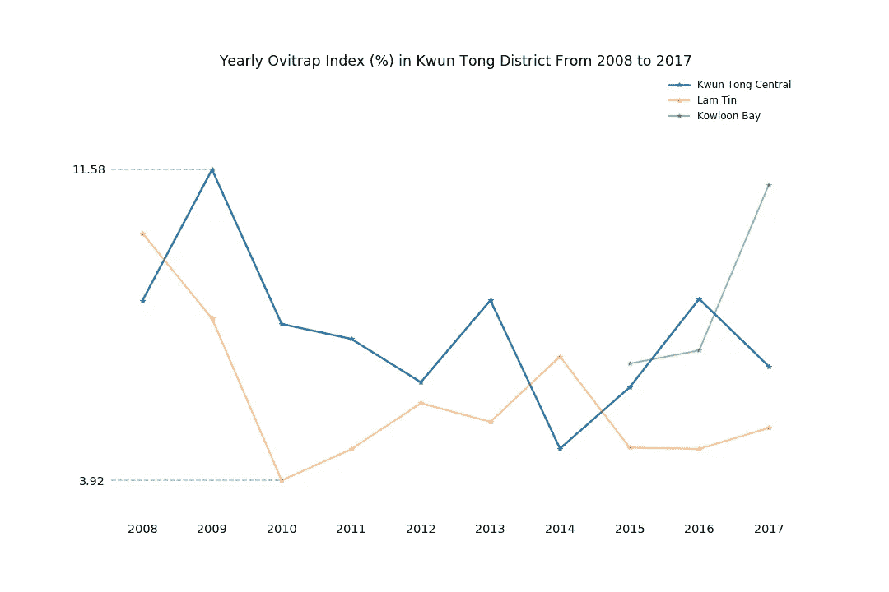
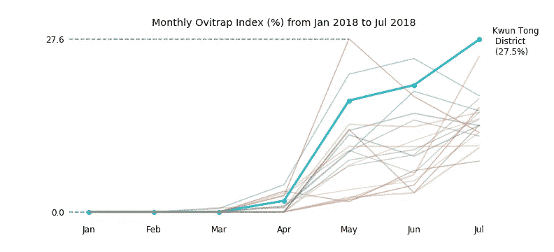
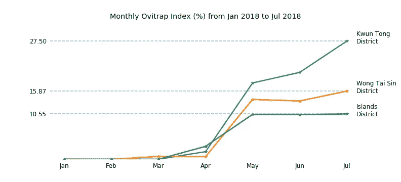
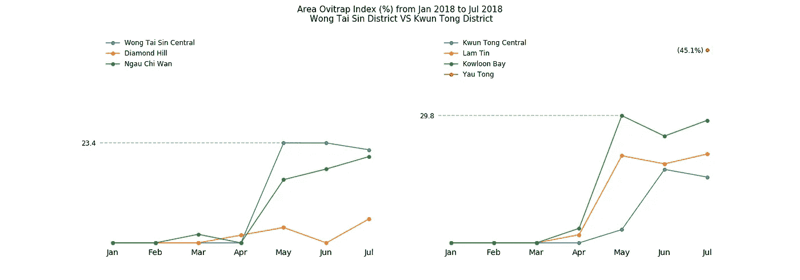

# 蚊子在哪里—香港登革热前线第三部分:可视化诱蚊产卵器指数

> 原文：<https://towardsdatascience.com/where-is-the-mosquito-hk-dengue-fever-frontline-part-3-visualising-ovitrap-index-f04f3295c63a?source=collection_archive---------14----------------------->

这是“独立计划”的第三篇帖子，寻找香港哪个地区的诱蚊产卵器指数最高。对于任何对这篇文章中使用的数据感兴趣的人，欢迎阅读该项目的[第 1 部分:数据清理](/where-is-the-mosquito-hk-dengue-fever-frontline-part-1-data-cleaning-d3dc165ba3db)和[第 2 部分:创建一个 SQLite 数据库](/where-is-the-mosquito-hk-dengue-fever-frontline-part-2-create-a-sqlite-database-d8d90968ef10)。

清理完数据放入数据库，终于到了探索香港哪个区域诱蚊产卵器指数最高的时候了。简单回顾一下，诱蚊产卵器指数是由 FEHD 食物卫生署用来了解登革热的分布范围，这种蚊子能够在东南亚选定的地区传播一种常见但危险的疾病“登革热”。该地区诱蚊产卵器指数(AOI)使我们能够找出哪个地区需要更多的蚊虫控制，尽管较高的 AOI 并不意味着一定有登革热。由于数据收集过程是在 2018 年 8 月初，使用的数据是 2008 年 1 月至 2018 年 7 月。FEHD 网站在 8 月份之后已经更改，AOI 分两个阶段收集，并将从 2018 年 9 月开始以计算的平均值显示在网站上。但是，由于该项目使用的是变更前的数据，因此该分析不受影响。

我们先来看一个更大的画面。根据 FEHK 分部的统计，香港总共有 19 个区(对任何困惑的香港人来说，是的，这里有 19 个区)。虽然一些地区有更多的诱蚊产卵器的位置，这是更一致和更符合逻辑的划分 FEHD。

每个地区的全年诱蚊产卵器指数的计算方法是将同一地区的地点的全年诱蚊产卵器指数相加，然后除以该地区的地点数目。例如，湾仔区有三个地点:天后、湾仔北和跑马地。计算这三个地点的全年诱蚊产卵器指数，然后将总和除以 3，即湾仔区的诱蚊产卵器指数。

SQL 不仅可以从数据库中提取所需的数据，还可以有效地支持计算。

“?” after “LIKE” is a placeholder which represents the years from 2008 to 2017

然后创建一个数据帧来存储这些提取的数据。

现在我们可以开始回答这样的问题:

> 从 2008 年到 2017 年，有哪个地区的 AOI 持续较高？

Top three districts in each year. Black means highest Ovitrap Index, followed by red, and orange.

这个柱状图告诉我们从 2008 年到 2017 年各区每年的诱蚊产卵器指数。因为我们想知道哪个地区的诱蚊产卵器指数比其他地区高，所以每年最高的三个地区被涂上颜色。诱蚊产卵器指数越高，颜色越深。获胜者穿黑色衣服，亚军穿橙色衣服。我们可以看到，前三个区之间的差异并不总是那么大。然而，似乎有些地区比其他地区更具色彩。

我们来做一个简单的计数器，检验一下是否属实。

Districts that have never been top three are not in the Counter

观塘区在 10 年中有 9 年是前三名，但观塘区包括几个位置。在决定整个地区是否需要更多的蚊子控制之前，最好仔细看看这个地区。

Only the highest and lowest Ovitrap Index are presented because the differences between each location are already clearly shown.

2008 年至 2017 年观塘区有三个地点。除 2008 年和 2014 年外，观塘市中心区的诱蚊产卵器指数较蓝田为高。虽然九龙湾在 2014 年后才启用，但观塘中区很可能是观塘区在 2015 年前诱蚊产卵器指数较高的原因。此外，令人担忧的是，去年九龙湾的诱蚊产卵器指数迅速上升，远远超过观塘中区。

我们现在知道观塘区的诱蚊产卵器指数在过去 10 年一直相当高，让我们看看它在 2018 年 1 月至 2018 年 7 月的表现。

All districts are shown in this line plot

虽然未达到最高指数(北区的 27.6%)，但持续上升，今年 7 月成为最高。很明显，观塘区应该有更严格的防蚊措施。结案之前，我们再考虑一个问题。

卫生防护中心表示，今夏大部分登革热个案在黄大仙(黄大仙区)和长洲(离岛区)。正如我们从下图所见，高诱蚊产卵器指数并不一定会导致登革热爆发，但高诱蚊产卵器指数地区的潜在风险不容忽视。

虽然黄大仙在地理上接近观塘，但如果黄大仙爆发的登革热蔓延至这几年诱蚊产卵器指数高企的观塘，情况会非常令人担心。虽然这似乎不会发生，但打安全牌并没有错。为了应对这种令人担忧的组合，让我们更仔细地看看这两个地区:

从上述线状图来看，黄田仙中及九龙湾应被视为实施更严格灭蚊措施的首要地区。正如上文所讨论的，九龙湾保持了前一年的势头，但观塘中心似乎受到控制。然而，你可能会注意到右边的红点代表油塘有一个可怕的 AOI。这是 2018 年 6 月之后才记录的，所以那里的蚊子控制可能比其他地方少。相信油塘并不是唯一的个案，因此，要更全面了解香港蚊患的范围，诱蚊产卵器应监察更多地区。

由于导致登革热在一个地区爆发的因素很多，诱蚊产卵器指数只是其中一个有用的监测工具。不过，如果诱蚊产卵器指数能有效地运用，灭蚊工作便可以更有效率地进行。

感谢阅读。这是我第一个独立项目的最后一部分。这一次，我们发现了需要更多和更严格控制蚊子的地点。虽然还有很多探索没有涉及，但我希望这个项目也能告诉你为什么诱蚊产卵器指数和监测 Aedine 蚊子很重要。对于任何对完整代码感兴趣的人，欢迎访问这个 [Github](https://github.com/DanielHLH/Where-is-the-Mosquito---HK-Dengue-Fever-Frontline) 。还有，如果谁有什么意见，我非常欢迎去听，去借鉴:)