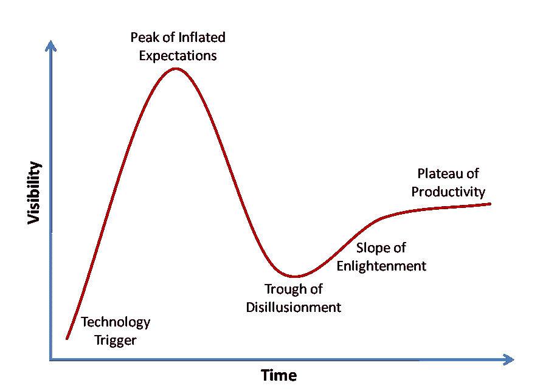

# 在哪里投资放射学人工智能

> 原文：<https://towardsdatascience.com/where-to-invest-in-radiology-ai-31213f4ba7a8?source=collection_archive---------4----------------------->

随着我们到达围绕人工智能及其对放射学领域的影响的炒作曲线的顶点，精明的投资者意识到这一前进空间的危险和陷阱比以往任何时候都更重要。对于所有的梦想和初创企业的咆哮来说，有大量的艰苦工作、监管官僚主义、科学验证和制度偏见需要克服。所有这些都不是不可克服的，但是为了获得最大的成功机会，我们需要后退一步，在决定最佳投资策略之前，调查一下我们的周围环境。

在这篇文章中，我将讨论将深度学习应用于放射学的承诺、希望和严酷的现实，以及在选择下注地点时要寻找的令人兴奋的方面。

## 大肆宣传

> 我们现在应该停止培训放射科医生。

我是人工智能在放射学中的巨大传播者，但也是实用主义者和现实主义者。我不同意放射科医生将在短短 5 年内被取代的观点，但我相信放射科医生将在未来十年内得到人工智能难以置信的良好服务和增强。我非常尊敬杰弗里·辛顿；毕竟，他的确是图像感知的教父。然而，他的名言大大夸大了布丁(我相信，如果被追问，他会澄清和缓冲这一声明！).首先，他的言外之意是放射科医生唯一做的事情就是解读图像——这是对整个职业的巨大曲解。他还假设医院会毫无疑问地接受新技术。我只需要指出过去十年对 CADx 软件的极度依赖，就可以证明将新技术注入临床一线是多么困难…

人工智能承诺未来会有巨大的回报，但在可预见的未来不会完全取代放射科医生。是的，放射学正处于需求超过能力一个数量级的转折点，但这正是这个领域如此突出的原因——问题如此巨大，解决方案如此接近！我们当然需要 AI！当然能有帮助！我们当然迫切需要它！但是这些说法实际上并不意味着它会很快发生。这只会助长炒作泡沫。

有些炒作是好的；它有助于推动研究，带来投资，提高意识，创造竞争。但是炒作也是有害的；它会导致过度承诺、缺乏改善当前实践的投资，以及仓促采用不科学的方法来解决问题。

## 穿越低谷

当我们开始从炒作的顶点跌入幻灭的低谷时，我们将开始看到兴奋随着现实的到来而迅速消退。这是聪明的投资者可以大赚一笔的地方。

这里将有两种主要类型的投资机会:在这种环境下寻求种子资金的公司将必须证明自己比他们的前辈强得多，而迄今为止幸存下来的强者将寻求 A 轮或 B 轮融资以进入下一步。在这个阶段，应该根据他们最初的承诺对他们的结果进行认真的分析，以确保他们是可靠的。

在这一点上，我们应该投资什么样的技术进步？会出现哪些在宣传阶段没有预见到的挑战？需要什么类型的基础设施来支持这些公司的扩展？这些是投资者应该问的关键问题，我现在就试着回答它们…

## 大梦想，小现实，聪明的钱

雄心和远大的梦想在被夸大的种子资金轮中是伟大的，但在幻灭的低谷期就没那么有用了。这个阶段承诺世界的公司需要避开。关注那些已经将他们的眼光锁定在关键问题上的公司，这些问题越小越好。在放射学人工智能中，这意味着几件事:

*   对特定医学问题的敏锐关注。避免那些声称已经解决了所有问题的公司。相反，寻找那些只在一个问题上有深度的专业知识，并且已经显示出成果的人。您可以在以后扩大这些公司的规模，以解决其他重点问题。一个例子是一家公司声称已经解决了胸部 CT。这是炒作。避免。相反，投资一家致力于解决胸部 CT 成像中一个问题的公司。一个很好的例子是 Arterys 专注于一个问题——在 MR 上测量心脏流量。
*   尽早与监管机构接触。如果一家公司不知道这些规定或者对这些规定没有准备，那就避开它们。任何为临床目的解读图像的产品都是医疗设备，这意味着需要严格的流程来满足这一要求。只投资那些团队中有人已经成功通过监管领域，或者已经适当聘用，或者已经做出财务安排外包这项工作的公司。没有什么比长达 4 年的意外临床试验更能扼杀一家初创企业。
*   避免声称要取代人类的公司。没有一家公司的临床诊断设备能够获得 FDA 的批准，而不是由人来监督。相反，为了减轻监管负担，寻找生产软件的公司，这些软件与人类一起工作并增强人类的能力，被称为临床决策支持。这些可能是分类系统，定量分析工具，登记或分割系统。如果你一定要投资诊断服务，一定要有足够的钱——FDA 对 PMA 的收费起价是 25 万美元。祝你好运！
*   临床上有效的用例。这似乎很明显，不是吗？但是，你不会相信我从初创企业创始人那里听到了多少虚张声势。"我们将通过观察骨密度来测量一个人的年龄."听起来像一个有趣的科学实验——但是临床益处在哪里呢？有人会为这种服务付费吗？难道没有更便宜更简单的方法来达到同样的效果吗？只投资那些拥有强大的科学委员会，并解决了临床问题的公司。确保人工智能是解决临床问题的正确方法，并且问题确实需要解决。避免锤子找钉子。
*   寻找致力于消除偏见的公司。人工智能有一个巨大的偏见问题——我们可以在大量数据上训练神经网络，但这意味着算法总是偏向于它被训练的人群。在某些情况下，这意味着算法是明显的种族主义者、年龄歧视者、性别歧视者或者更糟。一家拥有减少学习偏差的聪明解决方案的公司将胜过有偏差的算法，更有可能在监管环境中取得成功，并在现实世界中更有用。医学讲究精准，需要精准的工具。
*   权力属于人民。许多放射学人工智能初创公司从大学和学术机构剥离出来，声称达到“95%的特异性”和其他令人印象深刻的性能指标。这是炒作。避免。检查他们的数据集大小。它远没有大到足以证明任何事情。例如，他们可能只训练了几千张图片。相反——关注那些可能报告较低准确性指标，但可以访问大得多的数据集(想想数百万)的公司。这些公司是现实主义者！当然，数据访问是机器学习中一个至关重要的障碍，但这让我想到了最后一点…
*   投资将有助于放射学人工智能作为一个部门发展的公司，而不仅仅是终端产品。如果我有一个几百万的基金来投资，我甚至不会去找涉及图像解读的公司。这个领域最需要的不是算法(这些是果实)——而是算法背后的基础设施(树)才是重要的。投资果园！寻找零知识转移数据存储系统的创新解决方案，用于[匿名医疗数据](https://arxiv.org/pdf/1606.03475.pdf)的工具，用于访问 EHR 数据的 API，符合 DICOM 标准的区块链服务，以及用于构建临床自由文本的 [NLP 服务。](https://arxiv.org/pdf/1706.06177.pdf)这些将是放射学人工智能革命的支柱，找到一家整个行业最终依赖的公司来构建他们的图像解释算法可能会被证明是非常有益的。

## 如何找到这些公司

所以，你知道要找什么，但是从哪里开始呢？对于种子基金投资，去资源和网络深入放射科医生，科学家和研究人员。在全球范围内，有如此多的医院和研究网络致力于成像领域的深度学习，每个都有一大批科学家，他们只是希望能够将自己的想法推向市场。投资者应该接近大学附属机构、机构合作者甚至科学家本人。Arxiv.org 是寻找科学界有影响力的人的一个很好的方式，也是了解该领域最新研究的一个非常有用的资源([这是我保存的对放射学论文的搜索](https://arxiv.org/find/all/1/all:+radiology/0/1/0/all/0/1))。如果你想避免与受资助的大学研究衍生产品相关的重大知识产权问题，那么尽早与研究人员建立关系网对于让他们参与进来至关重要。投资者应该寻求与这些在放射学和机器学习领域值得信赖的人建立合作伙伴关系，并开发一种利用合作伙伴的专业知识寻找新技术的策略(在试图决定是否投资动态对比度增强 MRI 序列的像素聚类分析时，银行学位不会起作用)。

对于首轮融资来说，理想的情况是找到处于隐形模式的公司，而不是那些闪亮的、大肆宣传的、寻求增长的种子基金资助的初创企业。很少有成长期的放射学人工智能公司真正拥有完全监管批准的可上市产品，即使有，也已经超额认购。隐形模式公司是一个更安全的赌注，但更难找到，但同样，这是与科学家建立联系的回报——他们知道谁在建造什么，谁是可信的，谁是该领域的领导者。

我的最后一条建议很简单:做一只乌龟，而不是兔子。你要长期坚持下去。不要期望在 3 年的时间尺度内有显著的回报。分散投资，为 5-10 年(甚至 15 年)的扩张期做好计划。那些现在就进行明智投资、选择能够在重点问题上灵活扩展的公司的人，能够引领市场基础设施。那些急于求成和过度承诺的人只能在以后的日子里迎头赶上。

如果你和我一样对人工智能在医学成像领域的未来感到兴奋，并想讨论这些想法，请联系我们。我在推特@drhughharvey

*如果你喜欢这篇文章，点击推荐并分享它会很有帮助。*

*关于作者:*

哈维博士是一名委员会认证的放射科医生和临床学者，在英国国民医疗服务体系和欧洲领先的癌症研究机构 ICR 接受过培训，并两次获得年度科学作家奖。他曾在 Babylon Health 工作，领导监管事务团队，在人工智能支持的分诊服务中获得了世界第一的 CE 标记，现在是顾问放射科医生，皇家放射学家学会信息学委员会成员，以及人工智能初创公司的顾问，包括 Kheiron Medical。