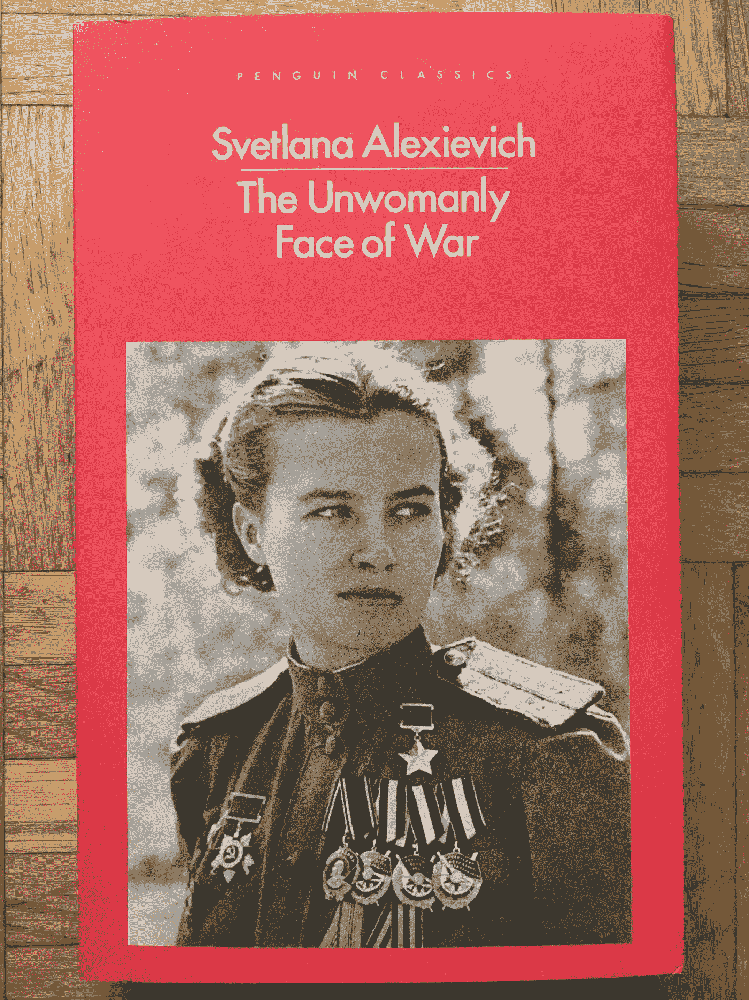

# 我的深度优先搜索机器学习呢？

> 原文：<https://towardsdatascience.com/wheres-my-depth-first-search-machine-learning-6dd83436adab?source=collection_archive---------2----------------------->

作为一个狂热的图书读者，我对亚马逊这样的商店如何向我推荐与我将要购买的图书相关的书籍有一个问题，无论是以“购买了该商品的顾客也购买了……”还是“与该商品相关的赞助产品”的形式。我认为这些建议以**广度优先搜索**的方式起作用，就像在*这里你有所有这些关于你想阅读的主题的书，*但在我的情况下，我更喜欢亚马逊根据我正在阅读的作品中引用的内容来推荐书籍，或者**深度优先搜索**。

[The Unwomalny Face of War](https://www.amazon.com/Unwomanly-translator-Volokhonsky-Svetlana-Alexievich/dp/0141983523/)

在这一点上，你可能会说……这就是书末参考文献的作用。首先，并不是所有的书最后都有参考书目。第二，我说的是书中引用的作品，作者特别强调了这一点，比如“你应该读一读 ZYX 作者写的这本 XYZ 的书”。一个问题是，很多时候作者并没有明确表达这种观点，但他们只是给你一些线索，说 XYZ 的书对他们很有影响。让我举几个例子来说明我的观点。

我第一次意识到这种需要是在我阅读卡米尔·福涅尔的《经理之路》时。她在导言中写道:

> 如果你对提高领导力的人员管理方面感兴趣，像《第一，打破所有规则》这样的书是很好的参考。

我看完那句话的第一个想法是:“为什么我在买卡米尔的时候，亚马逊不给我推荐那本书？”

然后我开始读刘慈欣的《三体问题》。在那本书的第一部分，他们提到了另一本名为[寂静的春天](https://en.wikipedia.org/wiki/Silent_Spring)的书，据《三体》报道，这本书似乎被文革审查过。在不破坏故事的情况下，寂静的春天是故事中非常重要的元素，直到后来我意识到这本书的第一部分实际上叫做*寂静的春天*。

在《三体》中,《寂静的春天》这本书只在这里和那里的角色中被提及，当我们读完这本书的一半时，我们意识到了解它的重要性。虽然阅读《寂静的春天》并不是理解《三体》的必要条件，但这似乎是一本非常有趣的书。所以在读这篇文章的时候，我也在想:“*为什么我买《三体》的时候，亚马逊不推荐我那本书？*

最后，我刚刚开始阅读诺贝尔奖得主斯维特拉娜·阿列克谢耶维奇的《战争中不具女性色彩的一面》( T1 ),这本书描述了二战期间参战的苏联女性。在介绍中，她写道:

> 曾经有一本书落到我手里:*我来自一个燃烧的村庄*，作者 a .阿达莫维奇，雅。Bryl 和 V. Kolesnik。我以前只经历过一次这样的震惊，当我读陀思妥耶夫斯基的时候。这是一种不寻常的形式:这部小说是由生活本身的声音组成的，由我童年时听到的声音组成，由现在在街上、在家里、在咖啡馆、在公共汽车上听到的声音组成。那里！圈子被封闭了。我找到了我一直在寻找的东西。我知道我会的。
> 
> 阿莱斯·阿达莫维奇成了我的老师…

在这两段中，阿列克谢耶维奇告诉我们*为什么*那本书很重要，它对她意味着什么，但她不是说你应该读这本书，她只是告诉我们为什么那本书对她的生活有影响。我也想了解那本书，所以你现在可能已经猜到了，我也问自己:“*当我买《战争的非女性面孔》时，为什么亚马逊不推荐我那本书？*”。

这就是我希望机器学习帮助我的地方。我想要一种足够智能的算法来解析一本书的内容，并且足够好地理解文本的含义，从而知道作者正在推荐一本书，并且能够根据作者对这些推荐的内容进行排名。这意味着，仅仅在一本书上提到一个标题并不足以让它变得有趣:如果作者这么说，它就会变得有趣，无论是明确地说出来，类似于《经理之路》中的内容，还是战争中的非女性面孔；或者像三体问题中那样是隐含的。

所以，亲爱的[杰夫·贝索斯](https://twitter.com/JeffBezos)，这是我的用户故事，作为一个购书者，我希望亚马逊根据书籍的实际内容向我推荐书籍，而不仅仅是根据人们在你的平台上购买了什么。