# 这是哪个品种的猫？一个更复杂的认知计算测试用例

> 原文：<https://towardsdatascience.com/which-cat-breed-is-this-a-more-complex-test-case-for-the-cognitive-computing-bce46aa64483?source=collection_archive---------7----------------------->

本周早些时候，我写了一个简单的机器学习实验，试图确定一个给定的图像是否是一个玉米卷。

 [## 这是玉米卷吗？自定义视觉的机器学习实验

### 想知道如何获得机器学习(ML)吗？嗯，现在你可以通过机器学习服务…

medium.com](https://medium.com/towards-data-science/is-this-a-taco-a-machine-learning-experiment-with-custom-vision-d33291a36b9c) 

使用相同的基于云的认知机器学习技术，[定制视觉](https://customvision.ai/projects)，我想处理一个更复杂的场景。

*机器学习算法能决定猫的品种吗？*

# 训练数据集

像往常一样，我需要为机器学习算法提供多组图像，以理解它应该学习什么。

首先，我找到了一个猫品种的列表，上面有它们的名字和照片，以此作为我在网上寻找图片的基础。

然后，我去 Flickr 搜索每个品种的名字，用 Chrome 扩展插件从第一页下载图片。

我使用 Flickr 而不是 Google Images 的原因是为了下载高分辨率的图像。

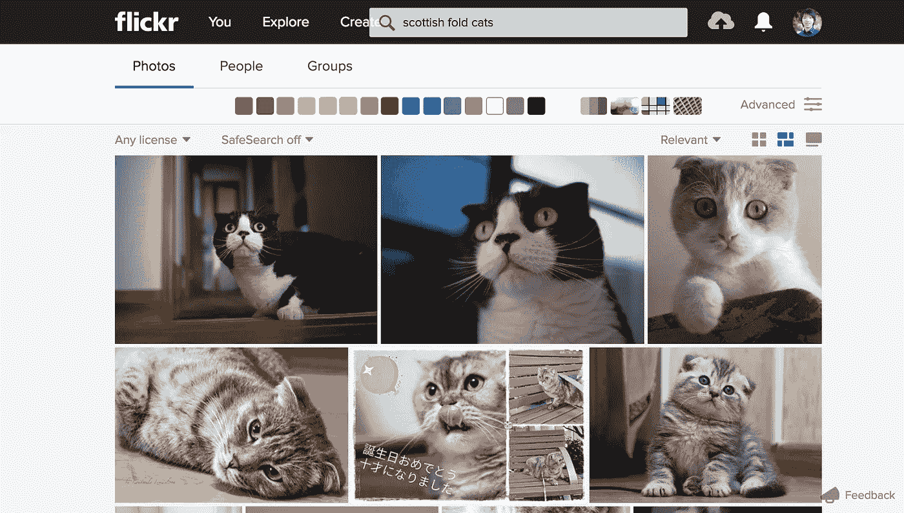

Scottish Fold cats on Flickr

它也更容易瞄准用户上传到 Flickr 上的图片，这些图片比不切实际地编辑过的猫的图片更实用。

花了一个小时左右的时间下载猫的照片后，我不得不策展它们。

显然，我必须删除所有不是猫的图像，这样它们才不会影响训练集。

然后，我去剔除同一场景中同一只猫的图像，实际上只是同一只猫的连拍。

这是为了避免算法过度训练，它会寻找照片的精确匹配，而不是更具预测性。

请记住，机器学习的目的是让算法识别以前从未见过的新信息。

我必须确保的最后一部分是收集至少 5 张特定品种的图像，因为这是您在 Custom Vision 上创建的每个标签所需的图像数量。

我承认数据中存在一些偏差，因为一些普通品种的猫有超过 20 张图片，而一些不常见的品种只有超过 6 张可用的图片。

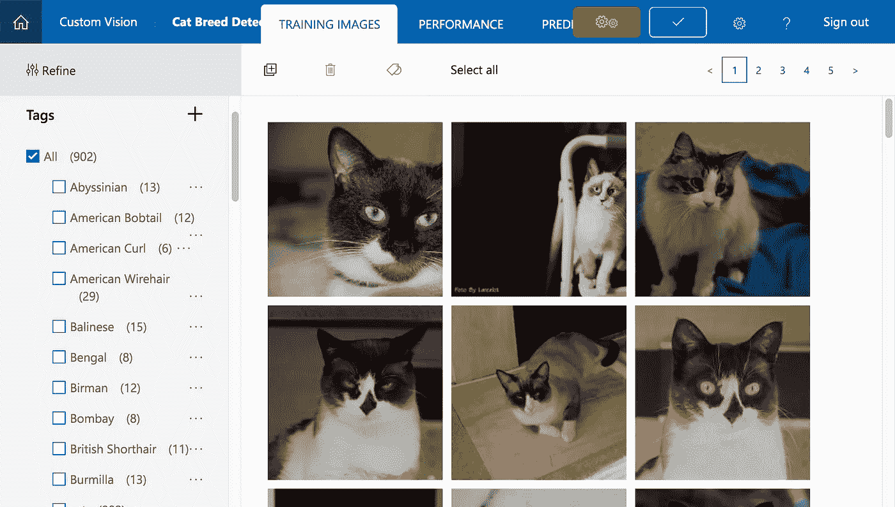

A varying amount of training images per breed

这可能会扭曲识别猫品种的结果，但至少我们意识到了算法中的潜在偏差。

所以最后，我收集了 50 种不同猫的 900 多张照片。

一旦我完成了数据收集，我就把所有的图片上传到 Custom Vision，并给每张照片贴上相应品种的标签。

之后，你只需点击一个按钮来训练算法，它就可以在几秒钟内为你运行一个预测。

# 测试数据集

这就是乐趣开始的地方，我们先来看看算法的性能。

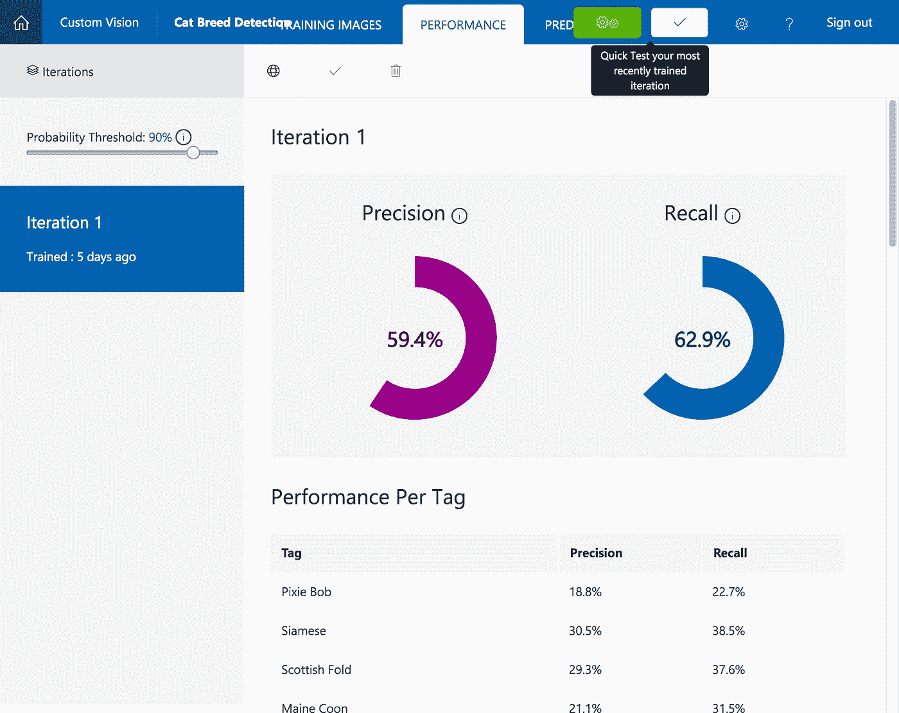

The result of performance is so-so

基于 900 张图像和 50 个品种标签，该算法的性能预计一般。

我预计性能会很低，因为它不仅仅是从其他物体中识别出一只猫。

对于没有受过辨别差异训练的人来说，察觉猫品种差异的细微差别也是困难的。

所以半信半疑，我决定用算法从未见过的图像来测试算法。

## 首先是索拉，我的苏格兰折耳猫(我知道)

首先，我用我的猫测试了这个算法，我很确定它是一只纯苏格兰品种的猫。

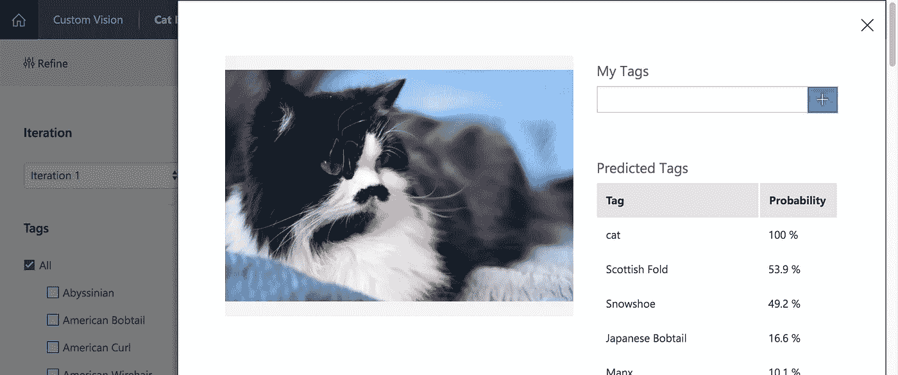

53.9% chance that she is a Scottish Fold

用训练集测试我的猫很有趣，因为训练集中所有的苏格兰褶皱都有一个褶皱的耳朵。

我怀疑这有多大的影响，所以我接着测试了我的猫的特写照片。

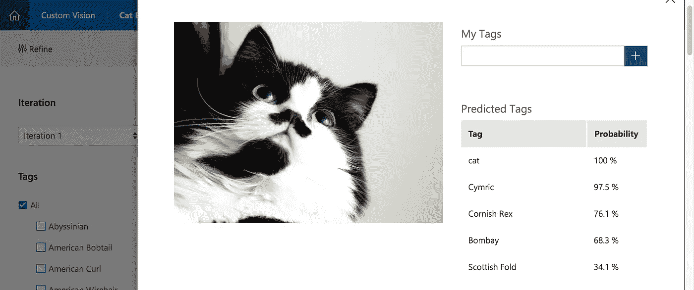

Only 34.1% chance it’s a Scottish Fold

突然之间，我的猫被预测有很高的几率患 Cymric。

因此，我检查了训练集中所有标记为 Cymric 的图像，发现了一张与她一模一样的猫的图像。

尽管不同品种的猫有着截然不同的外貌，但来自不同品种的两只猫在面部模式上看起来非常相似也是有可能的。

在这种情况下，匹配不幸是巧合，也许更多种类的 Cymric 图像可以避免这种问题。

## 成功的测试案例

下面让我们快速看一下一些跨不同品种的成功测试案例。

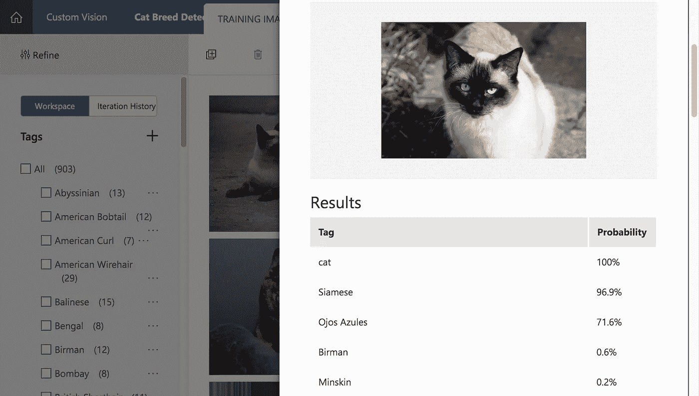

96.9% Siamese, Credit: [Max Pixel](http://maxpixel.freegreatpicture.com/Siam-Cat-Kitten-Siamese-Fur-Siamese-Cat-Breed-Cat-2124270)

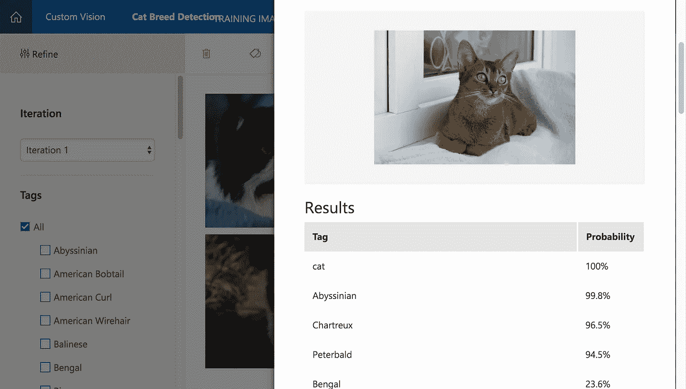

99.8% Abyssinian, Credit: [Max Pixel](http://maxpixel.freegreatpicture.com/Siam-Cat-Kitten-Siamese-Fur-Siamese-Cat-Breed-Cat-2124270)

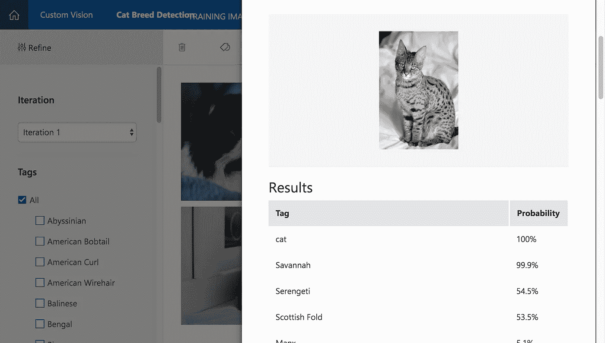

99.9% Savannah, Credit [Max Pixel](http://maxpixel.freegreatpicture.com/Siam-Cat-Kitten-Siamese-Fur-Siamese-Cat-Breed-Cat-2124270)

我必须说，当你测试随机品种图像时，这种算法是正确的，感觉很神奇。

然而，该算法并非没有缺陷，所以让我们来看看一些它失败的棘手情况。

## 失败测试案例

让我们来关注一下暹罗猫，因为该算法在前面的例子中表现得非常好。

首先，从后面来一张暹罗的图片怎么样？

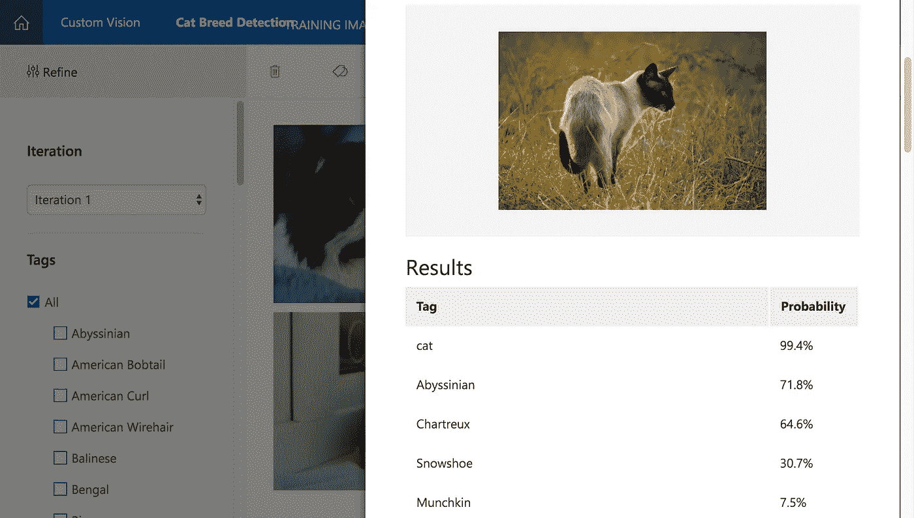

Unlikely a Siamese, Credit [Max Pixel](http://maxpixel.freegreatpicture.com/Siam-Cat-Kitten-Siamese-Fur-Siamese-Cat-Breed-Cat-2124270)

老实说，这并不太令人惊讶。

所有暹罗的训练图像集都让他们的脸朝向相机，而不是看向侧面。

给暹罗猫一个特写怎么样？

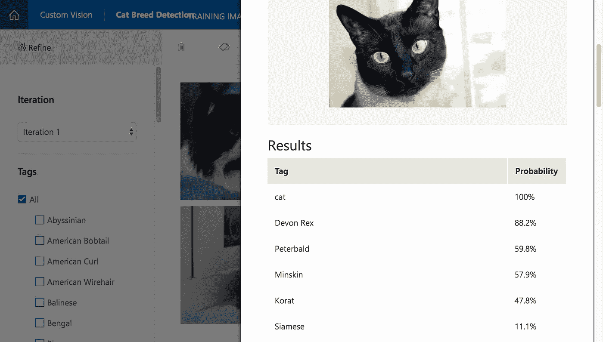

11.1% Siamese, Credit [Max Pixel](http://maxpixel.freegreatpicture.com/Siam-Cat-Kitten-Siamese-Fur-Siamese-Cat-Breed-Cat-2124270)

这个结果好像和之前测试我家猫咪的特写脸差不多。

也许当算法不仅仅看到一只猫的脸来确定品种时，它会工作得更好。

老实说，考虑到暹罗训练集有相似的图像，我认为它不会比 11.1%好多少。

然而，让我们继续测试非猫图像。

## 狗，兔子，豚鼠

你可能已经意识到每个结果都有一个“猫”标签。

使用自定义视觉，您需要用至少两个标签标记每个图像。

所以让我们用其他毛茸茸的动物照片来测试一下。

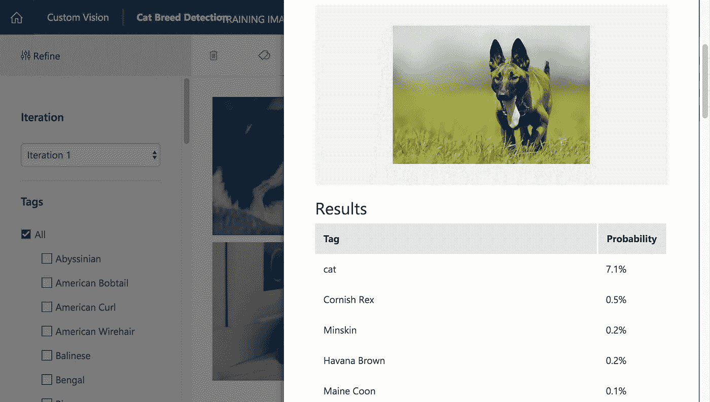

this dog is definitely not a cat, Credit [Max Pixel](http://maxpixel.freegreatpicture.com/Siam-Cat-Kitten-Siamese-Fur-Siamese-Cat-Breed-Cat-2124270)

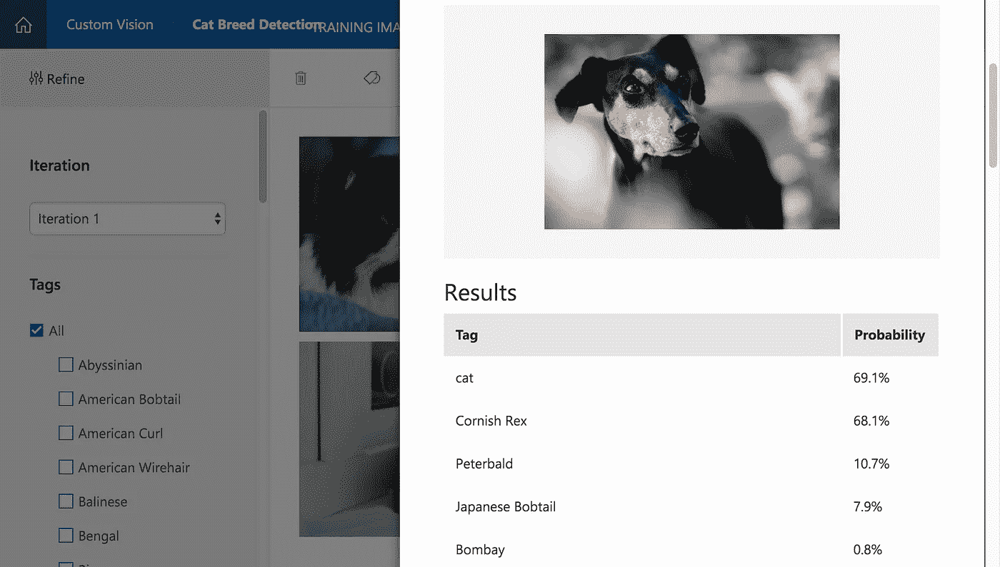

this dog is possibly a cat, Credit [Max Pixel](http://maxpixel.freegreatpicture.com/Siam-Cat-Kitten-Siamese-Fur-Siamese-Cat-Breed-Cat-2124270)

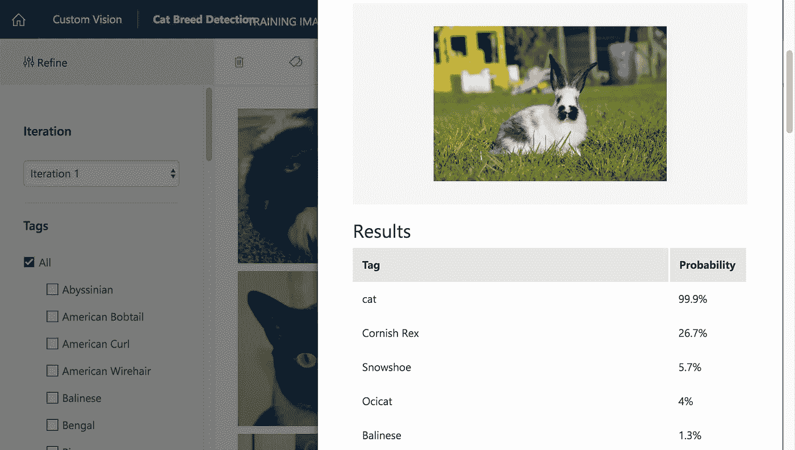

this rabbit is definitely a cat, Credit [Max Pixel](http://maxpixel.freegreatpicture.com/Siam-Cat-Kitten-Siamese-Fur-Siamese-Cat-Breed-Cat-2124270)

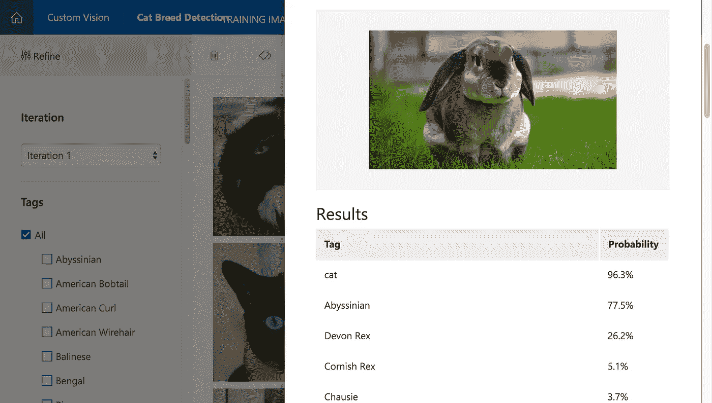

this rabbit is also definitely a cat, Credit [Max Pixel](http://maxpixel.freegreatpicture.com/Siam-Cat-Kitten-Siamese-Fur-Siamese-Cat-Breed-Cat-2124270)

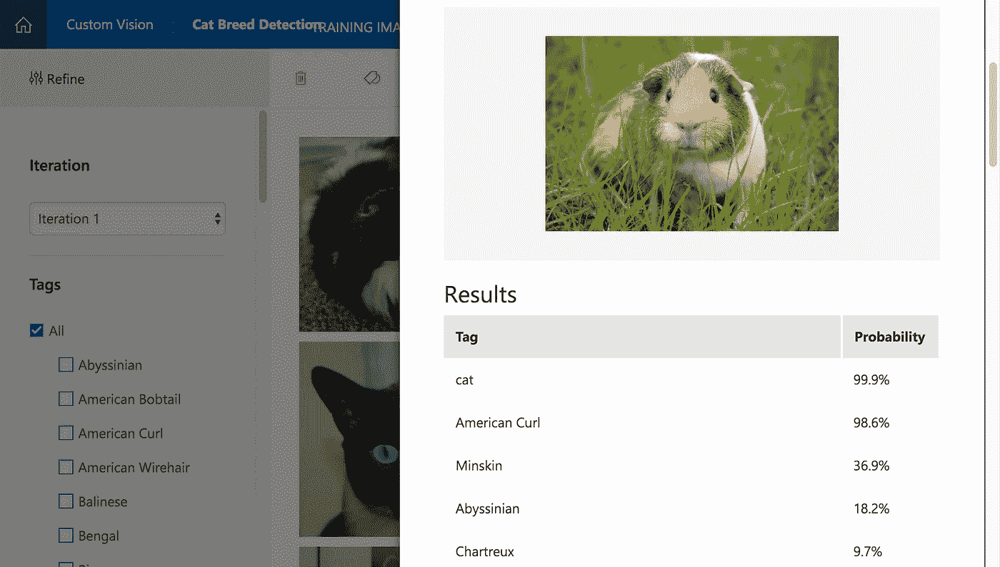

this guinea pig is definitely a cat, Credit [Max Pixel](http://maxpixel.freegreatpicture.com/Siam-Cat-Kitten-Siamese-Fur-Siamese-Cat-Breed-Cat-2124270)

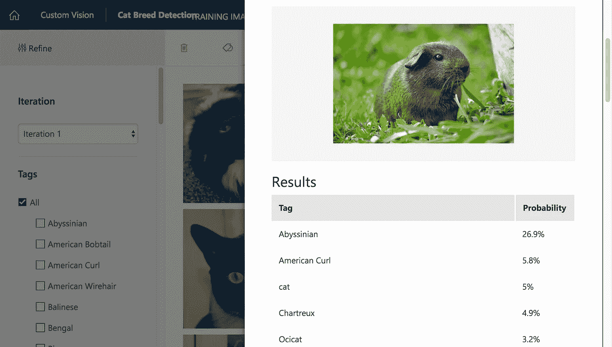

this guinea pig is unlikely to be a cat, Credit [Max Pixel](http://maxpixel.freegreatpicture.com/Siam-Cat-Kitten-Siamese-Fur-Siamese-Cat-Breed-Cat-2124270)

显然，如果它们看起来足够相似，算法很难区分什么是猫，什么不是猫。

很有可能，经过训练的算法会根据颜色、图案和整体形状来模糊匹配它看到的东西。

# 裁决

给定一个粗略的训练集，训练后的算法在某些条件下表现良好，可以识别猫的品种。

然而，它没有做好它没有被训练去做的事情，比如区分猫和非猫动物。

因此，在任何人投入时间训练任何机器算法之前，界定它应该能够处理的范围似乎是明智的。

你养猫吗，很好奇算法对它们的照片表现如何？

欢迎在评论中给我发一个图片网址，我会帮你测试的！

我是 Fresh Consulting 的前端开发主管。我写关于有影响力的技术领导(**)和最新的技术实验。**

**跟我上* [*中*](https://medium.com/@elishaterada) *和* [*推特*](https://twitter.com/elishaterada)*