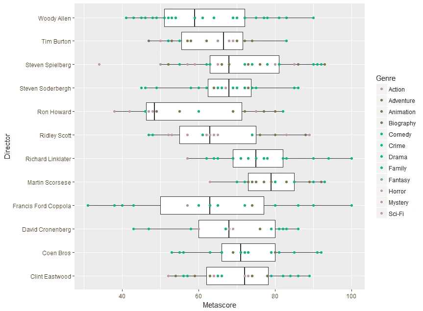
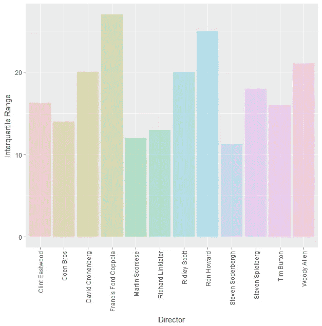
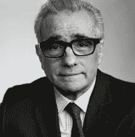

# 哪个导演拍的电影最好？

> 原文：<https://towardsdatascience.com/which-director-makes-the-best-films-1050e5a73dc4?source=collection_archive---------4----------------------->

## 看数据来支持我的观点，马丁·斯科塞斯是最伟大的电影导演

我取了自 1960 年以来 12 位最多产导演的电影的 meta scores(M[eta critical](http://www.metacritic.com/)的加权和标准化的评论家评分平均值),并绘制了如下的方框图:

A box plot of metascores for 12 directors, each point represents a film. The line bisecting the box is the median value, and the width of the box is the interquartile range. Unlike most box plots, all the data points are shown.

**谁是最棒的？**

斯科塞斯是得分最高的导演，其次是理查德·林克莱特，然后是科恩兄弟。这些导演的顶级电影是**(斯科塞斯)**《少年时代》**(林克莱特)和**《老无所依》**(科恩兄弟)。得分最低的导演是朗·霍华德，他评分最差的电影是《倒叙》。**

****谁最始终如一？****

**上图中方框的宽度对应于四分位距，这是数据可变性的一种度量。为了更清楚地了解这一点，我在条形图中绘制了每个控制器的四分位数范围(控制器元得分的 75%位于该范围内):**

****

**Interquartile Range of the metascores of the 12 directors.**

**最稳定的导演是伊史蒂芬·索德伯格，其次是斯科塞斯和林克莱特。弗朗西斯·福特·科波拉的元得分最多；评分最高的(**《教父》** ) 和评分最低的(**《杰克》**)都是他的电影。**

****结论****

**根据评论家的说法，马丁·斯科塞斯是最好的导演，也是十二位最多产导演中第二个最稳定的。**

****

****后记:关于元符号分数的注释****

**自 1999 年推出以来，Metacritic 为绝大多数电影配乐。然而，在此之前对电影的报道较少。这可能会扭曲那些在 1999 年之前有很多电影的导演的结果。例如，可能存在对过去更受好评和著名的电影的评论的偏见，这可能会使这些电影的导演的分数向上倾斜。**