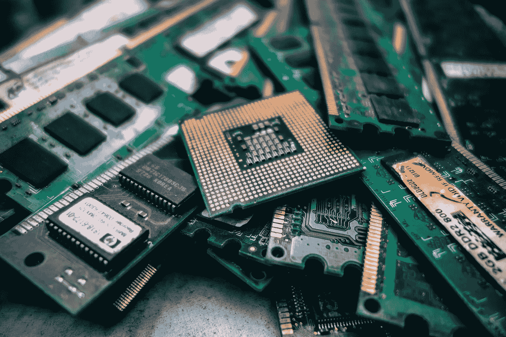

# 作为一名远程机器学习工程师，我应该使用哪种硬件？

> 原文：<https://towardsdatascience.com/which-hardware-should-i-use-as-a-remote-machine-learning-engineer-35af52301d3c?source=collection_archive---------2----------------------->

数字游牧的前提是伟大的:作为一名程序员，你可以带着你纤薄的 MacBook 去巴厘岛的海滩，在那里工作。但是如果你从事机器学习工作，工作需要昂贵而强大的 GPU 呢？几个选择。

在远程工作甚至四处旅行时，如何处理硬件有多种选择。他们每个人都有自己的优点和缺点，所以我想通过他们。

# 塔

最显而易见的选择——就像在非偏远的工作场所一样，在你的办公桌旁边放一个结实而强大的塔。当然，它会让你的办公室变热——但你要对自己的硬件负责。你可以随时升级你的机器。另外，如果你做大量的训练，这可能是一个更便宜的选择。

顺便说一下，在海滩和/或咖啡馆工作不再是一种选择——你将被束缚在办公室里。

**亲**

*   掌控您自己的硬件
*   价格

**Con**

*   受公职约束
*   功率和热量消耗

# 游戏玩家笔记本

如果你想灵活消费，但仍想离线/在自己的硬件上工作，你可能需要考虑游戏笔记本电脑。虽然游戏笔记本电脑过去几乎与塔式机一样宽，使用时电池运行时间不到 2 小时，但现在它们在这方面要好得多！现代游戏笔记本电脑只比传统笔记本电脑宽一点点，电池运行时间通常在 7-9 小时之间！

不过它也有缺点:游戏笔记本经常会有发热问题，而且更容易坏。它们也非常昂贵并且不容易修理。意思是:如果你有灰尘或者短路什么的，你可能不得不买一个 2000 多美元的新笔记本。

**Pro**

*   更加灵活
*   拥有硬件

**Con**

*   价格
*   可修性
*   供暖问题

# 笔记本+塔式

如果你是一家拥有几名机器学习工程师的初创公司，这是一个很好的选择。工作时，你坐在任何笔记本上，比如 Macbook。一旦你准备好训练，你就进入了一个强大的 ML 机器，有几个 GPU 等等。该塔可以位于办公室、服务器机房或任何其他地方。

虽然您仍然可以控制您的硬件，并可以随时升级，但您不必担心灵活性、电池运行时间或东西损坏。如果你让你的 MacBook 掉进了海里——买一台新的。培训仍在其他地方进行。

**Pro**

*   灵活的
*   控制硬件
*   培训与工作机器是分离的

**Con**

*   需要互联网连接
*   两台机器->总价更高

# 笔记本+ eGPU

如果你是一个单独的工程师，不在团队中工作，你可能不值得买一个塔和一个笔记本。一个简单但仍然灵活的解决方案是外部 GPU！你仍然可以把你的笔记本带到海滩或任何地方，但你可以让你宝贵的 GPU 留在酒店房间里。一旦您准备好接受训练，您就可以插入 eGPU 并开始训练——所有这一切仍然保持对您的硬件的控制。

**Pro**

*   控制硬件
*   培训与工作机器是分离的
*   比塔式便宜
*   脱机的

**骗局**

*   不完全灵活

# 笔记本+云[AWS/GCP]

最后一种解决方案也是单身工程师或早期创业公司的首选。

许多云提供商，如亚马逊、谷歌或 Paperspace，允许你在他们的机器上训练你的模型。这是您不必担心自己的硬件的唯一解决方案。这有好的一面也有不好的一面:一方面，你不用担心坏了的 GPU、用电量、散热等等。另一方面，您将无法随时升级您的硬件——提供商决定何时升级以及升级什么。

此外，如果你在一个团队中工作，这可能不便宜。您将为使用云实例的每一分钟付费——让它整夜运行会变得非常昂贵。

**亲**

*   不控制硬件
*   独处时的价格
*   非常灵活
*   培训与工作机器是分离的

**Con**

*   不控制硬件
*   团队价格

# 结论

我曾与许多这样的变体合作过:

*   当我在 NVIDIA 实习的时候，我有强大的本地机器可以使用。
*   当我做自己的工作时，我通常在 AWS 上工作
*   在目前的职位上，我在 GCP 工作

我个人对远程公司的建议是，一开始就使用轻型笔记本电脑和云提供商。它为您的员工提供了很大的灵活性，而且没有人需要维护硬件。

当团队成长时，我也会开始使用共享机器。在某个时候，它会开始为你省钱，但你必须有人来维护它(可能还有一个集中的办公空间)，所以这个选项并不适合每个人。

**本文首次发表于**[**Remote ml**](https://remoteml.com)**——远程机器学习工程师社区。**