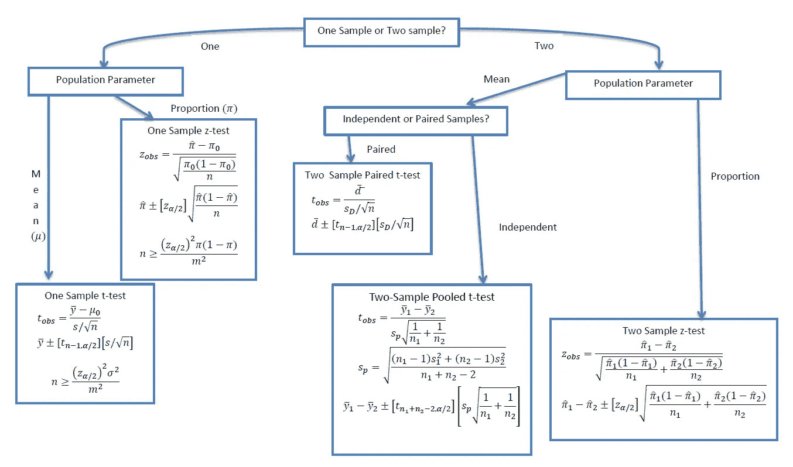
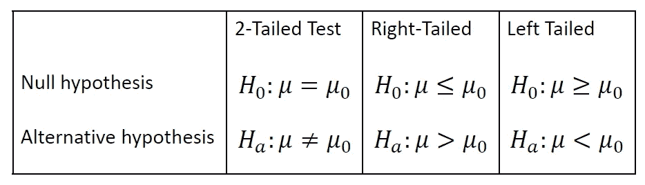
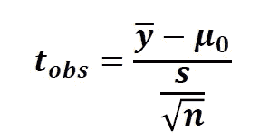
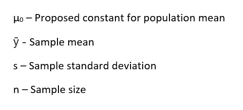
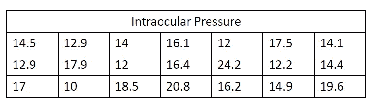
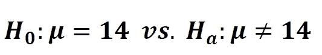
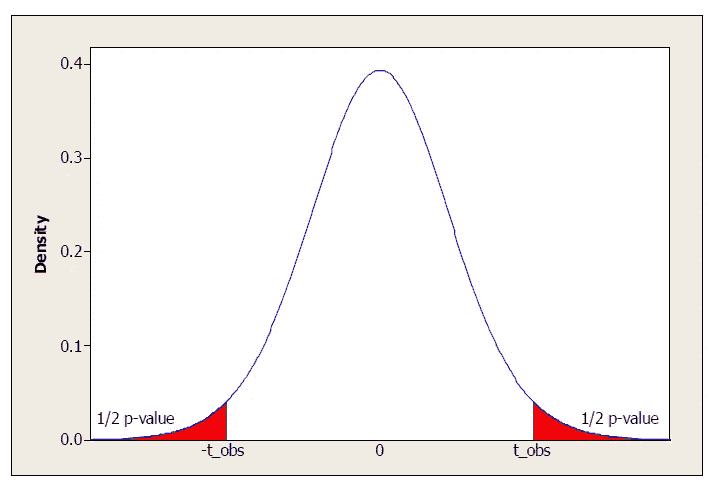
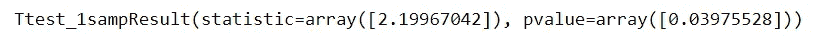

# 执行哪个假设检验？

> 原文：<https://towardsdatascience.com/which-hypothesis-test-to-perform-89d7044d34a1?source=collection_archive---------3----------------------->

## 各种假设检验的概述，并附有一个单样本 t 检验的例子

统计学的目的是根据样本中包含的信息对总体进行推断。用于表征群体的数值度量被称为 ***参数*** 。人口参数是:

1.  μ:平均值
2.  男:中位数
3.  σ:标准偏差
4.  π:比例

大多数推断问题可以表述为对总体的上述参数之一的推断。进行推理的方法分为两类:

1.  **估计**人口参数的值
2.  **测试关于参数值的假设**

有许多测试可以用来测试假设——但是我们什么时候使用哪种测试呢？这要看我们有什么信息，要检验什么假设。下面的流程图总结了各种假设检验以及何时应该使用。

在本文中，我们将更详细地研究**单样本 t 检验****。**

# 单一样本 t 检验

> 单样本 t 检验确定样本均值是否在统计上不同于已知或假设的总体均值。

## **假设**

**双尾**单样本 t 检验的无效假设和替代假设为:

**零假设:**样本均值等于建议总体均值

**替代假设:**样本均值不等于建议的总体均值

类似地，我们可以陈述右尾和左尾检验的假设。无效假设和替代假设可总结如下:

## 检验统计量

单样本 t 检验的检验统计量可以使用以下公式计算:

在哪里，

将计算出的 t 值与自由度为 *df = n-1 的 t 分布表中的临界 t 值进行比较。*如果计算出的 t 值>是临界 t 值，那么我们拒绝零假设。

## 例子

在一项青光眼研究中，从 21 名老年受试者的样本中记录了以下眼内压值。根据数据，我们是否可以得出结论，人群的平均眼内压 ***与*** 不同于 14 毫米汞柱？

## 步骤 1:测试方法

我们需要使用的检验是一个 ***对均值*** 的单样本 t 检验(对均值的*假设检验是一个 t 检验，因为我们不知道总体标准差，所以要用样本标准差 s* 来估计)。

## **第二步:假设**

列出测试有效的所有假设。即使假设未被满足，我们也应该评论这将如何影响我们的结果。

因变量必须是连续的。

观察结果相互独立。

因变量应近似呈正态分布。

因变量不应包含任何异常值。

## 第三步:假设

零假设描述了一个关于总体均值的断言。因此，零假设表明眼内压的**群体平均值为 14 毫米汞柱**，替代假设表明眼内压的**群体平均值不同于 14 毫米汞柱。**它可以用数学公式表示如下:

## 步骤 4:计算测试统计量

ȳ =样本平均值= 15.623

s =样本标准偏差= 3.382

n = 21

μ = 14

代入该值，我们得到， ***t = 2.199***

在这种情况下(双尾)，p 值是 t 分布两个尾部的面积。

## 步骤 5:确定 p 值并与显著性水平进行比较

在计算了检验统计量之后，现在我们可以计算 p 值了([使用 t 表](http://www.ttable.org/))。t 统计对应的 p 值为 ***0.0398*** 。

那么，p 值是多少呢？假设零假设为真，这是观察样本结果或更极端结果的机会。如果这种可能性很小，我们可以拒绝零假设。

> 在我们的示例中，p 值是观察到样本平均值为 15.623 毫米汞柱的概率，或者是一个更极端的值，假设真实平均压力为 14 毫米汞柱。

p 值= 0.0398，小于 0.05(我们选择的显著性水平)，我们拒绝零假设。**有足够的样本证据证明真实平均眼内压不同于 14 毫米汞柱。**

我们可以通过使用 scipy 模块在 Python 中实现单样本 t-test。

输出:

在 [LinkedIn](https://www.linkedin.com/in/rohan-joseph-b39a86aa/) 上连接。