# 哪几局对赢得 MLB 棒球比赛最有影响？

> 原文：<https://towardsdatascience.com/which-innings-are-most-influential-in-winning-mlb-baseball-games-e1a405b4fdc7?source=collection_archive---------17----------------------->

线性回归可以显示哪些局影响 MLB 棒球比赛的输赢吗？

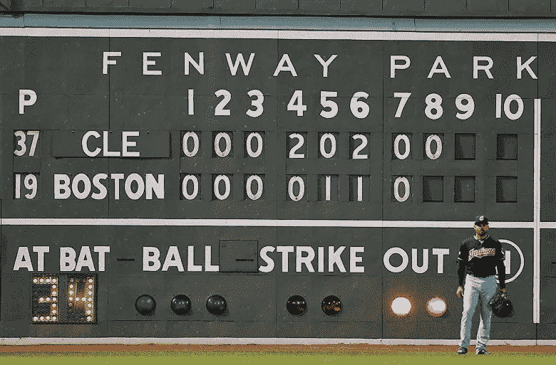

Image from [https://www.covers.com/sports/mlb](https://www.covers.com/sports/mlb)

不管你在 sabermetrics 的爱与恨的光谱中处于什么位置，都不能忽视它们。每一次击球手的转变，替补投手开始比赛，以及像“发射角度”和“每分钟转数”这样你在一百万年内都不会想到的统计数据给比赛带来了前所未有的价值。棒球迷谈论的 sabermetrics 主要围绕个人击球，以显示什么可以使团队防守更好，或者一个进攻球员打出更多的本垒打，但没有一个真正表明球队在年底会赢得多少胜利。

有很多方法来确定什么将帮助一个团队获胜，但我想更多地关注每一局，以确定哪些局影响输赢。当然，团队希望“赢得”每一局，让他们的团队有最好的机会赢得比赛，但是否有特定的局比其他局更重要？一局中得分或允许得分会影响赢多少场比赛吗？我浏览了 2015-2018 赛季每场比赛的每一局，看看球迷是否应该比其他人更近距离地观看比赛。

*一如既往，你可以在我的 GitHub 页面上查看我的代码和更深入的数学分析:*[https://GitHub . com/anchor p34/Baseball-Reference-Extracts/blob/master/Regression % 20 analysis % 20 on % 20 inning % 20 net % 20 runs . ipynb](https://github.com/anchorP34/Baseball-Reference-Extracts/blob/master/Regression%20Analysis%20on%20Inning%20Net%20Runs.ipynb) *这也将是未来更多棒球分析的主要数据来源，可以从我在*[https://github.com/anchorP34/Baseball-Reference-Extracts 的 web 抓取脚本或 JSON 文件中使用](https://github.com/anchorP34/Baseball-Reference-Extracts)

在看每一局之前，我想看看每个赛季的胜利分布。

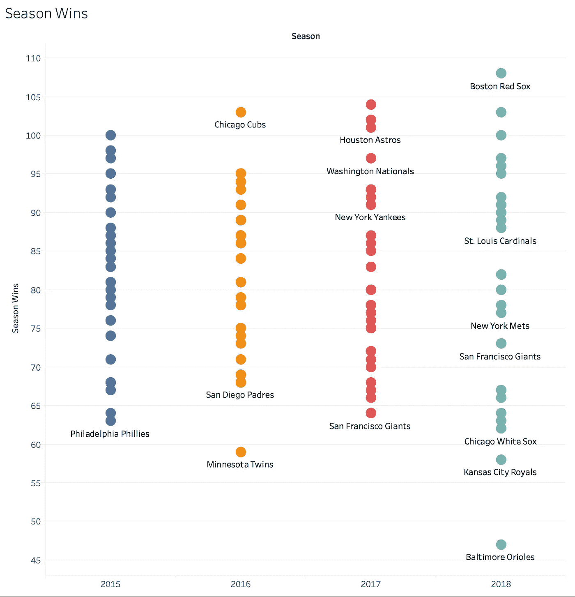

Wins for each team for the last 4 years

2015-2017 年的胜利分布彼此非常相似，但 2018 年更加分散。2018 年，巴尔的摩金莺队经历了棒球史上最糟糕的赛季之一，而波士顿红袜队则是最好的赛季之一。看看这两个队在每一局的表现会很有趣。

为了保持主题，看看年度概览，我们可以看看每支球队的总得分，看看进攻与总胜率有多大关系。

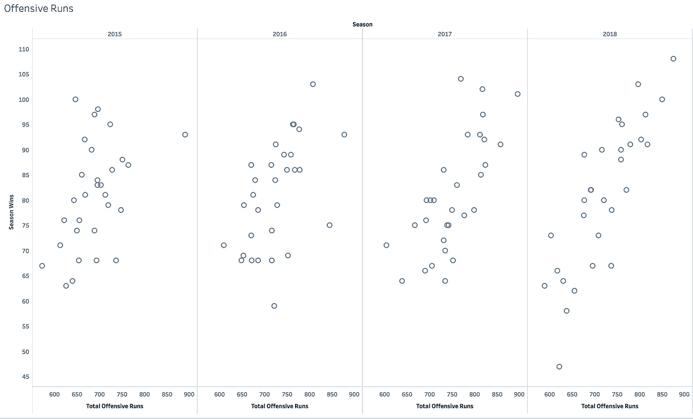

Offensive Runs vs Season Wins for each year

如果没有显示每个赛季的最佳拟合线，你就不会说得分越高，赢得的比赛就越多。这与净运行相比如何？净得分的计算是每个队在那个赛季得分的次数减去他们在那个赛季允许的得分次数。

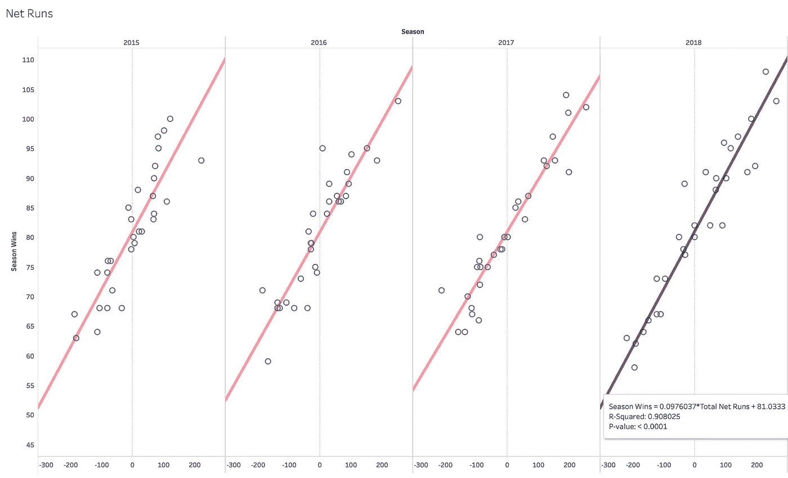

Net Runs vs Season Wins for each year

每个赛季的净得分是一个更好的指标，可以显示一个球队在赛季结束时的总得分。R 平方值是. 908，这意味着净得分可以解释一个赛季中 90.8%的胜率变化。R 平方值越接近 1，变量之间的线性关系越好。作为参考，2018 赛季进攻得分的 R 平方值为 0.704。

我们还可以看到，线性函数是 0.097 *总净得分+ 81.033，这意味着一支球队在一个赛季中的平均胜场数是 81.033 场(几乎正好是一个赛季 162 场比赛的一半)，总净得分的每一个正或负变化都会使球队赢得/输掉大约 1/10 的比赛。因此，如果一支球队在赛季中的总净得分是 50，我们预计他们会赢得 86 场比赛(81+50 * 1 = 86)。

不过这只是 2018 赛季。如果我们想把所有的季节放在一起看，净总运行次数会有一点点的变化，但总体趋势是相同的。

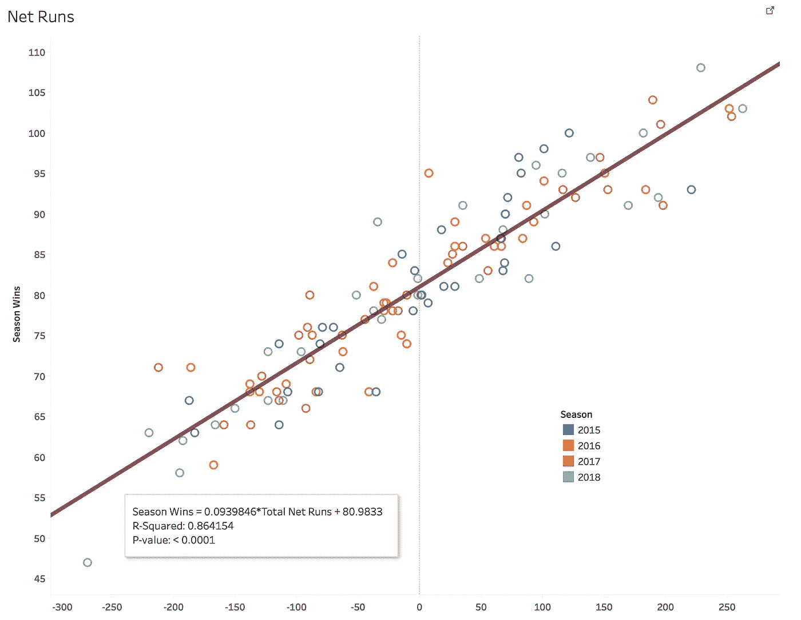

Net Runs vs Season Wins for all seasons

我们可以看到所有的季节加在一起将给出 0.864 的 R 平方分数，这将是我们前进的基线标准。这将被用来确定是否使用个别局更有助于预测一个球队在赛季结束时将获得的胜利数。

为了分析，我们需要做一个改变。由于有些比赛可以有加时赛，所以我取了每场比赛所有加时赛的净跑，称之为“Net_Inning_10”。单独查看每个额外的一局没有意义，因为有些游戏可以进行 10 局，有些可以进行 18 局，但除此之外，我不需要做太多的数据清理。

由于我们无法真实地可视化 11 维的东西，我们将会看到一个 ANOVA(**a**analysis**o**f**Va**riance)图表，该图表显示了我们感兴趣的调整后的 R 平方度量以及系数和度量，以显示每一局的相互比较价值。这是我们基线回归的方差分析图:

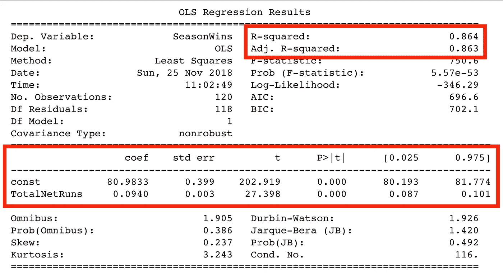

我们最感兴趣的指标用红色方框标出。如您所见，我们有与散点图相同的 R 平方值以及相同的系数(. 094 *总净运行数+ 80.98)。**但是，我们将开始查看调整后的 R 平方度量，因为它会惩罚变量数量增加的模型**。t 值有助于我们确定每个变量的重要性以及它们是否具有统计显著性。t 越远离 0(正或负)，该变量在预测一个赛季的总胜率方面的统计意义就越大。

P >|t|度量是“P 值”，它是该特征的斜率为 0 的概率，这将是一条水平线，因此对预测获胜总数没有影响。统计学家通常使用 0.05 作为该指标的阈值，这意味着任何低于 0.05 的指标都被认为对该回归模型具有统计显著性。

首先，我想看看各个季节，看看我们是否得到相似的结果。以下是 2015 赛季和 2018 赛季的方差分析图:

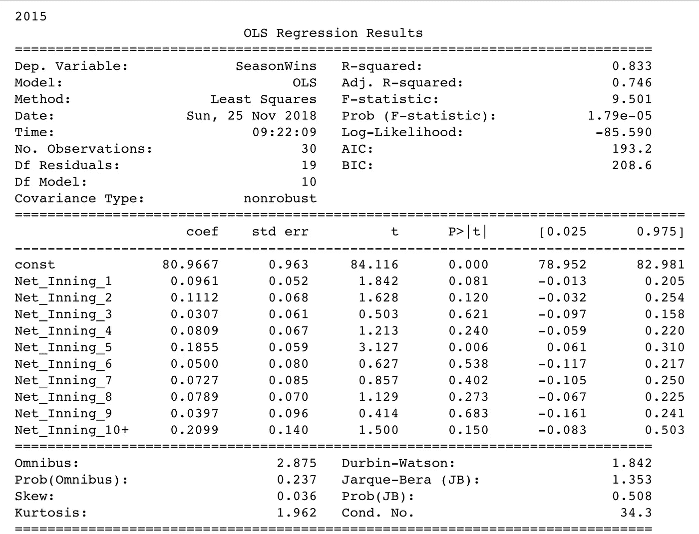

2015 Anova Chart

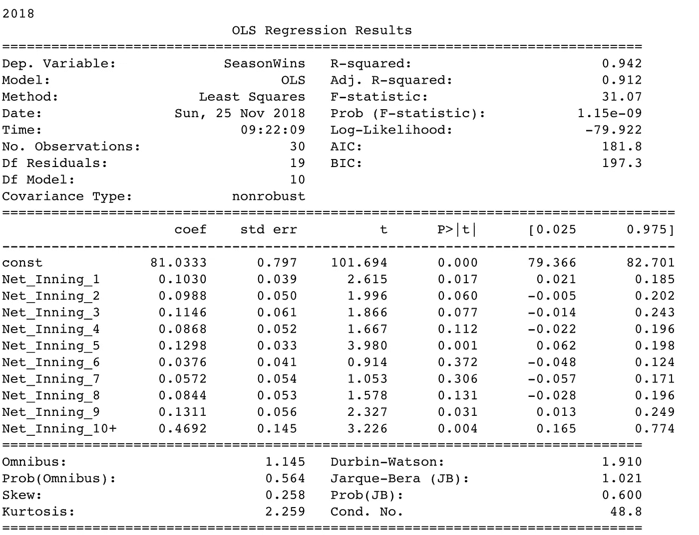

2018 Anova Chart

在调整后的 R 平方值方面，我们可以看到，2018 赛季的总胜场数可以比 2015 赛季更好地解释，只要看一下从 2015 年的. 746 到 2018 年的. 912 的每局总净得分。这并不意味着 2018 年是一个更好的分析年，只是意味着每局的净得分比 2015 年的模型更好地解释了 2018 年的赛季胜利。对于统计显著特征，2015 年刚好有第 5 局，而 2018 年是第 1、5、9、10+局。最后，两个模型的每一局的系数都是正值，这意味着不管哪一局，你在那一局的净得分越高，你在年底的胜场就越多。这两个模型没有我想象的那么接近。

既然我们已经看到了每个季节分别建模，让我们一起建模所有的季节。

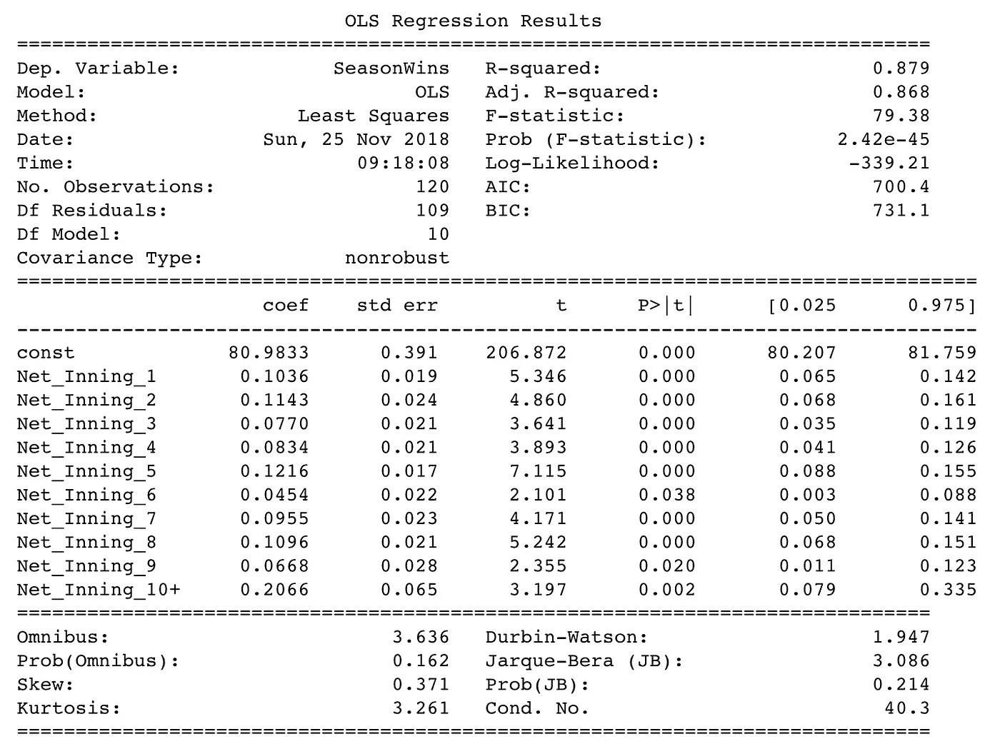

Regression analysis for seasons 2015–2018

从调整后的 R 平方指标 0.868 开始，这几乎等同于总净运行模型 R 平方值 0.864。为了简单起见，只使用基线模型更有意义，因为您只需要使用一个变量，而不是在完整的模型中使用所有 10 个变量。我们还在最终模型中看到，在预测总胜率时，每一局都被认为具有统计学意义。

如果有一个局的特定子集，比模型中的所有局给我们提供了更好的调整 R 平方值，会怎么样？我能够运行每一个可能的场景，随着每一局的增加，调整后的 R 平方值增加:

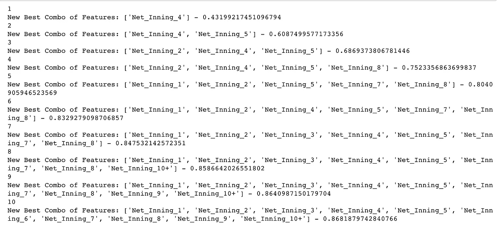

The best feature set for the number of input features of the model

从上到下，我们可以看到第四局本身是最有影响力的一局，调整后的 R 平方值为 0.432。这很有意思，因为在最终模型中还有 5 局比第 4 局更有统计学意义。

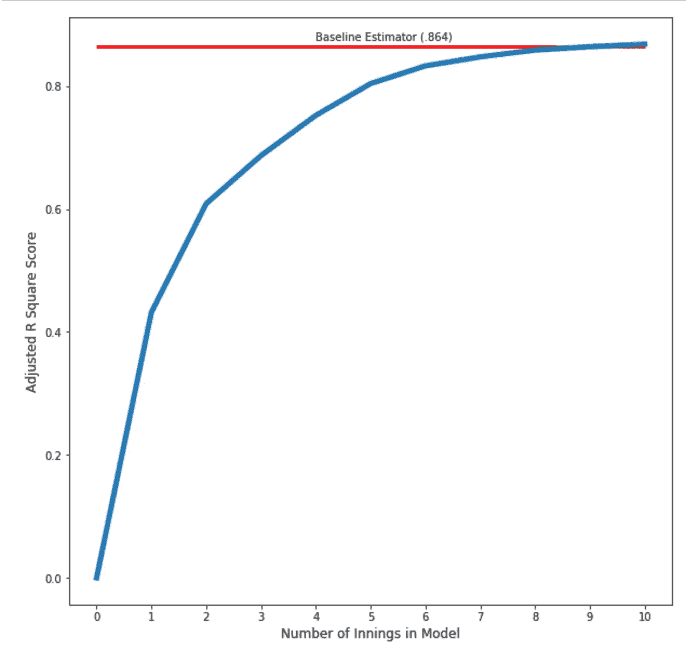

Graph showing how the Adjusted R Squared value increases with each additional inning that gets added into the model

您还可以看到，随着模型中要素数量的增加，校正后的 R 平方值也会增加。从这个分析中，我们可以得出结论，最佳调整的 R 平方值将包含所有局的分析。

# 结论:

模型中最有影响力的四个局是第 5、第 1、第 8 和第 2 局。这些局是有意义的，因为第一局和第二局是投手必须始终面对球队中最好的击球手的时候(顺序中最少 1-6)，第五局是先发投手想要结束的一局，因为他们必须投完 5 局才能获胜，第八局之后的得分决定了球队是否需要使用他们的终结者。对于使用这种分析的球队来说，如果他们看起来开始累了，他们需要非常小心第五局的首发投手。从长远来看，搞砸这一局会对他们的赛季总胜率产生严重的影响。

我们还可以看看 2018 年波士顿红袜队和巴尔的摩金莺队的净局数，看看是什么让他们如此不同:

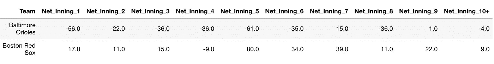

与红袜队相比，金莺队的这个赛季如此糟糕，原因显而易见。两队之间，有些局彼此接近，但像第 5 局和第 1 局这样最有影响力的局，结果却截然不同。金莺队在可能的 10 局比赛中有 8 局是负的，而红袜队在 10 局比赛中只有 1 局是负的，但即使是这 1 局也比金莺队的一些净局数(-56，-61)少了(-9)。

这一分析的总体信息非常清楚。每一局都对你的团队在年底能否成功有很大的影响。你可能会看到每一年都有不同的价值，但是把所有的年份都考虑进去就会发现每一局都是有价值的。我们也看到了没有必要将每一局都放入一个模型中，而只需要整个赛季的总净得分。如果你想在年底进入季后赛，你需要在每一局持续得分超过你放弃的分数。