# 欧洲最激动人心的足球联赛是哪个？

> 原文：<https://towardsdatascience.com/which-is-the-most-exciting-soccer-league-in-europe-529c6639e84a?source=collection_archive---------12----------------------->

Photo by [Thomas Serer](https://unsplash.com/@jesusance?utm_source=medium&utm_medium=referral) on [Unsplash](https://unsplash.com?utm_source=medium&utm_medium=referral)

从根本上说，足球是一项简单的运动。你开球，连续打 45 分钟，休息 15 分钟，再打 45 分钟。但是根据比赛地点的不同会有很大的不同。例如:英格兰超级联赛历史上一直以注重比赛的身体方面而牺牲更多的技术和战术方面而闻名，尽管这种情况最近正在发生变化。意大利的意甲联赛被誉为欧洲主要联赛中最具战术性和防御性的联赛。

在本帖中，我将深入数据，分析各个联赛之间的差异，目标是回答以下问题:**哪个联赛最值得看？**

# 数据

这个 Kaggle [数据集](https://www.kaggle.com/secareanualin/football-events/home)提供了来自欧洲五大联赛(英、法、西、意、德)的 9000 多场比赛的详细信息。它涵盖了从 2011/12 赛季开始到 2016-17 赛季中期(准确地说是到 2017 年 1 月 25 日)的比赛。理想情况下，我会喜欢更新的数据，但我会在这次分析后努力获取这些数据。

我选择这个数据集是因为它提供了每场比赛的事件级数据，包括投篮次数、黄牌和换人。有了这种详细程度，我可以做很多分析，这是我无法用一个只到游戏级别的数据集做的。

这个数据集相当均匀地分布在五个联赛中，只有一个例外:德国。这是因为德甲是唯一拥有 18 支球队的联赛；其他联盟都有 20 个。少两支球队显然会导致每个赛季的比赛减少。

另一点:英超的比赛比法甲、意甲和西甲略多，因为它是唯一没有冬歇期的联赛。由于这个数据集将于 2017 年 1 月结束，英格兰队将在假期期间比赛，而其他联赛将会休息。其他联盟通常会在赛季末补上这些比赛，但这个数据集并没有考虑到这一点。

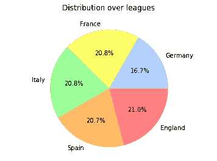

这些数据也在不同的季节平均分布，这是你所期望的。2016-17 赛季仅占数据集的 9.7%，而其他赛季占 18.1%，因为该数据集仅涵盖到 2017 年 1 月 25 日。

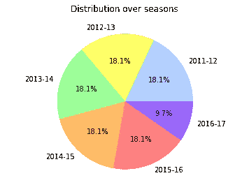

# 哪个联赛进球最多？

对于大多数人来说，更多的目标=更多的兴奋。所以我会先看看每个联赛中每场比赛的平均进球数。

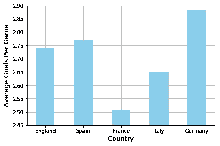

Average Goals Per Game

德甲平均每场 2.87 个进球，远远高于其他联赛。这种超额表现的一部分可能是因为联赛中的球队越来越少，比赛越来越少，但这仍然是一个实质性的差异。法甲联赛场均进球 2.52 个，排名垫底。

在我们给出德甲在这一点上的优势之前，让我们看看得分的分布，即进球在某些比赛中的集中程度。他们是平均分布还是几场比赛进球比例大？这对联赛的观赏性/精彩程度有很大的影响。例如，我们有理由假设零比零平局越少，联赛就越精彩。

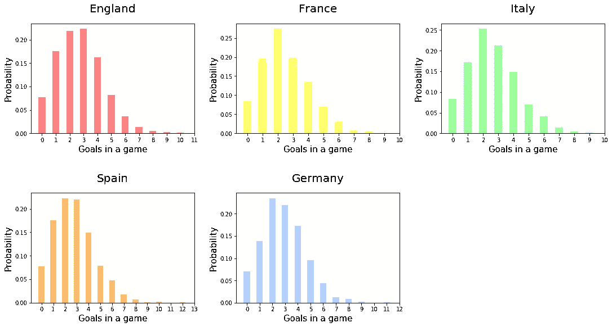

Distribution of goals scored in a game

上面的图表显示的是每个联赛中每个可能进球总数的概率。举例来说，图表显示，在意大利，一场比赛有 17%的机会以 1 球结束，有 15%的机会以 4 球结束。在西班牙，一场比赛有 15%的几率有 4 个进球，有 7%的几率有 5 个进球。

我们可以看到联盟中的分布看起来非常相似。它们每个都有一个近似的正态分布，最常见的结果是在一场比赛中打进 2 到 3 个球。一个小的兴趣点:英超是唯一一个比赛进 3 个球比进 2 个球更常见的联赛，尽管只是稍微更常见。

由于上面的分布看起来彼此相似，我们可以说，就进球在游戏中的集中程度而言，各联盟之间没有实质性的差异。

**外卖:**

*   德甲和西甲的场均进球数最高，英超接近第三。意甲第 4，法甲最后。
*   不管是哪个联赛，只有 7-8%的比赛没有进球。

# 哪个联赛的比赛最接近？

势均力敌的比赛紧张、刺激、有压力。他们很棒。所以让我们看看每个联盟的胜率。

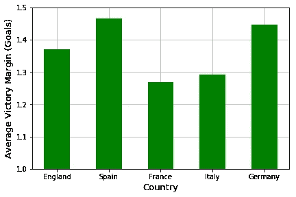

Average margin of victory, in goals, for each league

场均进球数最低的法国队实际上拥有最接近的比赛，胜率为 1.27 球。因此，如果你看一场法甲比赛，你可能会看到稍微少一些的进球，但比赛通常会更接近。因此，对于法甲球迷来说，这并不完全是悲观的。

意大利仅略落后于法国，MoV 为 0.02 个进球。这种差异实际上非常微小，没有统计学意义。Scipy stats f_oneway 函数的 p 值为 0.49。这意味着法国和意大利之间的胜利差距可能只是偶然，而不是由于联赛之间的任何根本差异。类似地，当比较西班牙和德国时，P 值为 0.66，因此这种差异在统计上也不显著。然而，法国/意大利和英国和西班牙/德国之间有显著的不同。

就像我们对进球得分所做的那样，让我们看看胜率的分布，看看是否有任何一个联赛有更大比例的势均力敌的比赛。

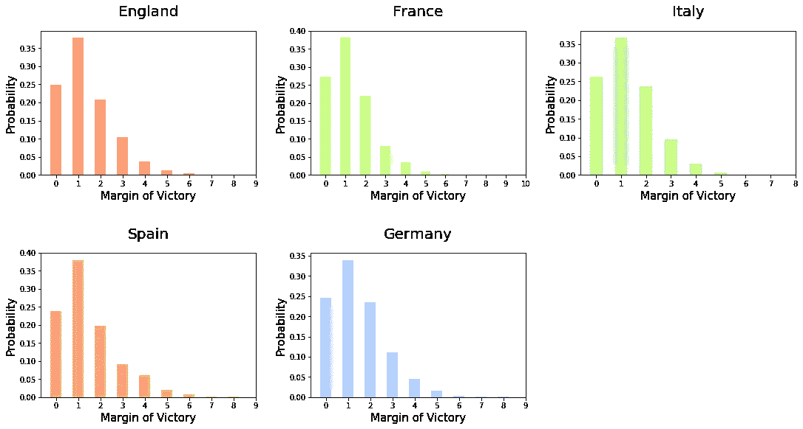

Distribution of the margin of victory in a game

各联盟之间似乎没有什么显著差异。

**外卖:**

*   最接近的比赛，看法甲或者意甲，他们的比赛是由~1.3 个进球决定的。
*   德甲和西甲的胜率最大，约为 1.45 球。

# 哪个联赛的后期进球最多？

目标就是目标就是目标。但是在比赛的余烬中进球，当一支球队拼命想扳平比分或赢得比赛时，那就更好了。所以让我们看看哪个联盟给你最惊心动魄的结局。我将把迟到的进球定义为在第 75 分钟或更晚的时候进球。

首先，不是所有的游戏都有我需要的事件级数据。下图是各联赛此类比赛的场次。

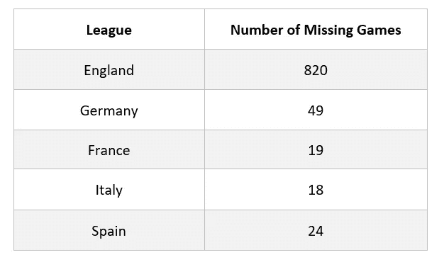

绝大多数没有高级统计的游戏都来自英超联赛。我认为这不会对分析产生太大影响，因为我更感兴趣的是后期进球的百分比，而不是原始数据，但我不能肯定。如果我有所有比赛的这些统计数据，那肯定是理想的，但是现在，我会对我有这些数据的比赛进行分析。

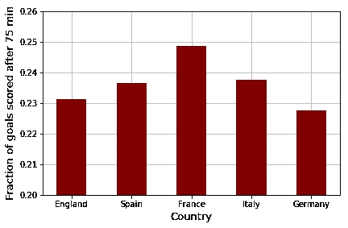

Fraction of goals that are scored in 75th minute or later

法甲拥有最高的后期进球比例，远远超过其他任何联赛。这对我来说有点意外，因为我预计英超联赛的后期进球比例最高，因为它以快速和激烈而闻名。

我也很想知道如果我们算上上半场的最后 5 分钟，情况会有什么变化。

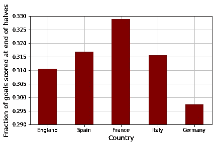

Goals scored in minutes 40–45 and 75+

如果把上半场结束时的进球计算在内，法国队仍然领先。看起来德国队在 40-45 分钟内的进球相对较少。在之前的图表中，德国和英格兰都徘徊在 23%左右，但在这张图中，德国大大落后于英格兰，29.7%比 31%多。

**外卖:**

*   在法甲联赛中，每 4 个进球中就有近 1 个(25%)是在第 75 分钟或更晚的时候打进的
*   德甲后期进球比例最低，为 22.75%。
*   德甲联赛在 40-45 分钟内的进球也略少:7%，而其他联赛为 8%。

# 哪个联赛进球间隔时间最少？

最后，我们来看看哪个联赛的进球次数最多。换句话说，从一个目标到下一个目标你需要等待多少分钟。显然，进球之间的等待时间越短，比赛就越精彩。

下图显示了至少有 2 个进球的比赛中进球的平均间隔时间。

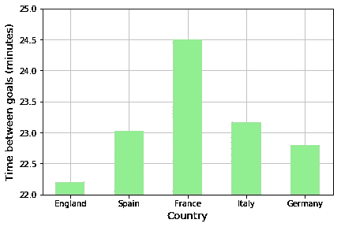

Minutes between goals (in games with 2+ goals)

英超在这一指标上名列前茅，平均每场比赛的进球间隔略多于 22 分钟。另一方面，法甲比赛的进球间隔时间为 24.5 分钟。

注意:对于上面的图表，我没有考虑那些只有一个目标的游戏。“进球间隔时间”的概念在这些比赛中并不适用。但是为了以某种方式将这些游戏结合起来，让我们来看看一场游戏的第一个进球是什么时候打进的。我的假设是，你等待看到第一个进球的时间越少，比赛就越精彩。现在，第 89 分钟的进球可以和第 2 分钟的进球一样令人兴奋，如果不是更多的话，但是我认为如果在前 65-70 分钟没有进球，很多观众会感到厌烦。这就是为什么我认为一个早期的目标对于决定哪场比赛，以及哪一个联盟，最能吸引观众的注意力是很重要的。

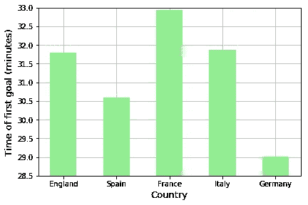

When is the first goal scored during a game?

如上图所示，一般德甲比赛的第一个进球至少比其他联赛早一分钟，所以如果你想看到提前进球，德国是最好的选择。

**外卖:**

*   德甲比赛的平均第一个进球比任何其他联赛都要早，法甲比任何其他联赛都要早。

# 结论

如果你想要进球，西甲和德甲是值得看的联赛。如果你希望进球一个接一个的快速到来，这就是英超。如果你想要势均力敌的比赛或者有进球动作的比赛，去法甲吧。