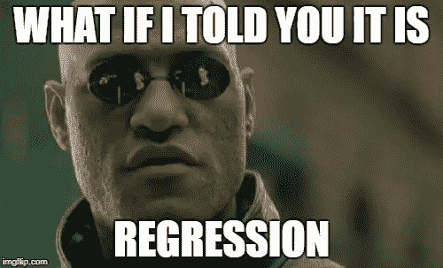
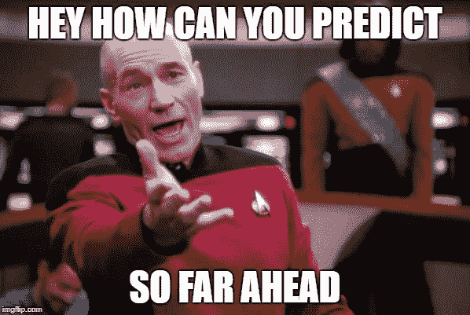
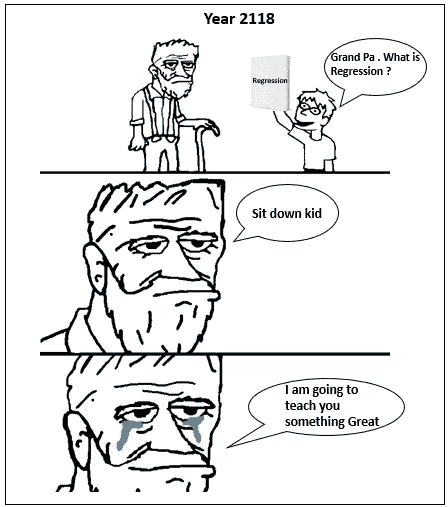
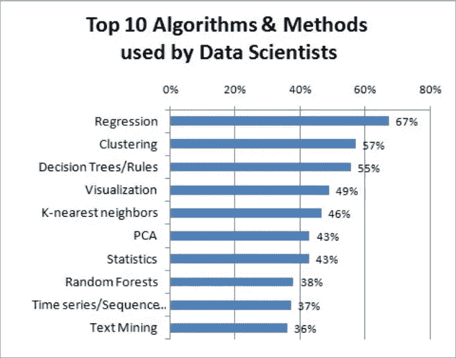

# 哪种机器学习算法将在 2118 年继续使用？

> 原文：<https://towardsdatascience.com/which-machine-learning-algo-will-continue-to-be-in-use-in-year-2118-59d0461160f3?source=collection_archive---------6----------------------->

Image source : Pixabay

那么你脑海中闪现的答案是什么？随机森林、SVM、K 均值、Knn 甚至深度学习及其变种？

Image adapted from imgflip.com

现在你们中的一些人可能会笑着说，你怎么能预测那么远的未来，预测 100 年后的事情是疯狂的。

Image adapted from imgflip.com

## 你凭什么说 2118 年还会继续用回归？

答案是林迪效应。是的，我用来预测这是林迪效应的试探法。

好吧，下一个合乎逻辑的问题是**什么是林迪效应？**

**林迪效应**

维基百科对林迪效应的定义如下

> “林迪效应”是一个概念，即一些不易腐烂的东西，如技术或想法的未来预期寿命与它们当前的年龄成正比，因此每增加一段生存时间就意味着更长的剩余预期寿命。

我最喜欢的作家之一纳西姆·塔勒布在他的名著《抗脆弱:从无序中获得的东西》中对林迪效应定义如下。

> 如果一本书已经出版了 40 年，我可以预计它还会出版 40 年。但是，这是主要的区别，如果它能再生存十年，那么它将有望再出 50 年。简单地说，作为一个规则，这告诉你为什么存在了很长时间的东西不像人一样“老化”，而是相反地“老化”。没有灭绝的每一年都会使预期寿命增加一倍。这是某种稳健性的指标。一个物品的坚固程度和它的寿命成正比！

一位名叫呼唤的专家写了一篇关于林迪效应的文章，强烈推荐阅读。

## 那么，为什么衰退会持续那么久呢

因为它存活了这么久。回归(最小二乘法)作为一个概念最早是由[卡尔·弗里德里希·高斯](https://en.wikipedia.org/wiki/Carl_Friedrich_Gauss)和[阿德里安·玛丽·勒让德](https://en.wikipedia.org/wiki/Adrien-Marie_Legendre)在 19 世纪发明的。他们用它来确定行星和其他天体围绕太阳的轨道。

“回归”一词是由弗朗西斯·高尔顿创造的，用来描述观察到的高个子父亲往往有相对较矮的儿子，而矮个子父亲往往有相对较高的儿子！！

很明显回归已经存在了 200 多年了！！所以根据林迪效应的启发，它还会持续 200 年。所以事实上，我可能有点保守地说，回归将在 2118 年继续使用。

Adapted from [Grandpa Meme](https://me.me/t/im-gonna-tell-you-a-great-story)

## 回归长寿背后的秘密是什么？

这方面的例子是 2016 年 [Kdnuggets 调查](https://www.kdnuggets.com/2016/09/poll-algorithms-used-data-scientists.html)的以下报告

事实上，在 2011 年 kdnuggets 在[进行的另一项调查](https://www.kdnuggets.com/polls/2011/algorithms-analytics-data-mining.html)中，回归紧随其后。因此，通过林迪效应，它在 5 年内成为“更不朽”的排行榜冠军！！

(更新:在写这篇文章的时候，我不知道还有一个 [2017 年调查](https://www.kdnuggets.com/2017/12/top-data-science-machine-learning-methods.html)。2017 年的调查也显示回归名列榜首)

回归仍然是广泛使用的 ML 算法。人们使用回归或者继续使用回归是因为

> 这很简单
> 
> 高度可理解性(即使是[呆伯特的](http://dilbert.com/)老板也能理解:P)
> 
> 它工作了

## “有效”的部分

不同领域的人们继续使用回归，因为它对他们有用。人们通过使用回归获得了明显的投资回报。例如，在市场营销中，[市场组合建模](/market-mix-modeling-mmm-101-3d094df976f9)背后的驱动力是回归。这仍然是一种流行的技术，许多快速消费品公司相信 MMM 的输出。其他领域也是如此。如果回归在交付结果时没有用，它将会以渡渡鸟的方式消失。它仍然被工业界和学术界使用，因为“它有效”。

## 神经网络及其变体呢？2118 年会用到它们吗？

到目前为止，林迪效应对神经网络并不友好，或者让我们称之为人工智能。它已经面临[艾冬](https://en.wikipedia.org/wiki/AI_winter)。神经网络及其变体的寿命受到了 20 世纪“人工智能冬天”的阻碍。这种破坏对于技术或算法的寿命来说不是一个好兆头。

但从光明的一面来看，在过去十年里，人工智能相关的进步越来越强大。而我作为一个永远的学生，继续着迷于最新的人工智能突破。因此，一个安全的赌注可能是，我们可以看到神经网络及其变体再生存 10-20 年，希望埃隆·马斯克表达的“奇点”恐惧不会导致另一个人工智能冬天。

什么可以减轻机器学习算法的林迪效应？

**机器学习矫枉过正**:是的，林迪效应会因为机器学习算法的错误应用和矫枉过正而减轻。我遇到过人们使用机器学习算法的情况，而简单的常识基线方法可能会奏效。Rama Ramkrishnan 先生在他的[文章](/first-create-a-common-sense-baseline-e66dbf8a8a47)中很好地抓住了这一本质。

最近流行的数据科学是最性感的工作，这也无助于这项事业。机器学习算法在数据科学家手中已经变得像一把锤子。每件事看起来都像一个钉子。在适当的时候，机器学习的错误应用或过度使用将导致人们在它不提供价值时不再抱有幻想。这将是一个自己造成的“人工智能冬天”。

但是目前回归将会笑到最后，甚至可能在 2118 年。

如果你喜欢我的文章，给它一些掌声，你也可以在下面评论你对这篇文章的看法。

你可以联系我

[领英](http://www.linkedin.com/in/venkat-raman-Analytics)

[推特](https://twitter.com/venksaiyan)

我的博客:[分析洛卡](https://wordpress.com/view/analyticsloka.blog)