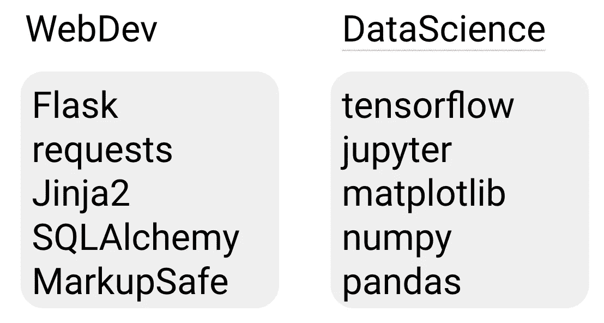
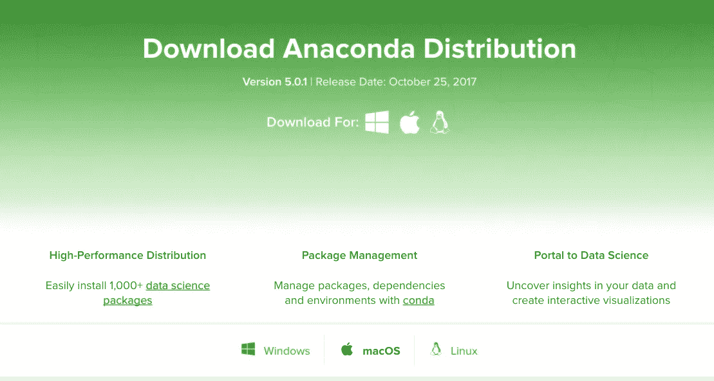
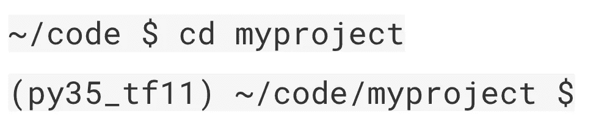

# 应该使用哪个 Python 包管理器？

> 原文：<https://towardsdatascience.com/which-python-package-manager-should-you-use-d0fd0789a250?source=collection_archive---------0----------------------->

每个接触代码的人对他们的编程环境都有不同的偏好。Vim 对 emacs。制表符对空格。虚拟人对巨蟒。今天我想和你们分享我处理数据和进行机器学习的环境。

您肯定不需要复制我的设置，但是其中的一些内容可能会对您的开发环境有所启发。

# 点

首先，我们需要谈谈 Pip。Pip 是 python 的包管理器。它内置到 Python 中已经有一段时间了，所以如果你有 Python，你可能已经安装了 pip。

Pip 安装了 tensorflow 和 numpy、pandas 和 jupyter 等软件包及其依赖项。

`pip install <your_favorite_library>`

许多 Python 资源是以 pip 包的形式交付的。有时你可能会在某人的 Python 脚本文件夹中看到一个名为`requirements.txt`的文件。通常，该文件概述了该项目使用的所有 pip 包，您可以使用

`pip install -r requirements.txt`。

作为这个生态系统的一部分，有一个完整的版本号和依赖关系的世界。我有时需要为我正在处理的不同项目使用给定库的不同版本，所以我需要一种方法来将我的包组组织到不同的、隔离的环境中。

Doing web development and data science on the same machine can leave your Python packages in a jumble

目前有两种流行的管理不同 pip 包的方法:virtualenv 和 anaconda。

# 虚拟

irtualenv 是一个允许你创建命名的“虚拟环境”的包，在这里你可以以隔离的方式安装 pip 包。

如果您想详细控制为您创建的每个环境安装哪些软件包，这个工具非常棒。例如，您可以为 web 开发创建一个包含一组库的环境，为数据科学创建一个不同的环境。

这样，您就不需要让不相关的库相互交互，并且它允许您创建专用于特定目的的环境。

# 蟒蛇

现在，如果您主要从事数据科学工作，Anaconda 也是一个不错的选择。Anaconda 由 Continuum Analytics 创建，它是一个 python 发行版，预装了许多用于数据科学的有用的 Python 库。

Anaconda 之所以受欢迎，是因为它一次安装就带来了许多数据科学和机器学习中使用的工具，因此它非常适合进行简短的设置。

和 Virtualenv 一样，Anaconda 也使用创建环境的概念来隔离不同的库和版本。Anaconda 还引入了自己的包管理器，名为`conda`，您可以从这里安装库。

此外，Anaconda 仍然具有与 pip 的有用交互，允许您安装 Anaconda 包管理器中没有的任何附加库。

# 如何选择？

我该用哪一个，虚拟人还是蟒蛇？嗯，我经常发现自己在 Python 2 和 Python 3 之间测试 TensorFlow 和其他库的新版本。

理想情况下，我还可以尝试 virtualenv 和 anaconda 上的库，但有时这两个包管理器并不友好。

## 认识 pyenv

所以我选择两者都用，并使用一个名为`pyenv`的库来管理整个事情。从概念上讲，pyenv 位于 virtualenv 和 anaconda 之上，它不仅可以用于控制使用哪个 virtualenv 环境或 anaconda 环境，还可以轻松控制我运行的是 Python 2 还是 Python 3。

pyenv 的最后一个我喜欢的方面是为给定目录设置默认环境的能力。这使得当我进入一个目录时，所需的环境被自动激活。我发现这比我每次做一个项目时试图记住我想使用哪个环境要容易得多。

应该使用哪个 Python 包管理器？这真的取决于你的工作流程和偏好。

如果您通常只使用核心数据科学工具，并且不关心安装一些您不使用的额外库，Anaconda 可能是一个很好的选择，因为它可以根据您的需要和偏好简化工作流。

但是，如果您喜欢定制您的环境，并使它完全符合您的喜好，那么像 virtualenv 甚至 pyenv 这样的东西可能更适合您。

# 包裹

管理 Python 库没有“一个”正确的方法，当然，除了我刚才介绍的选项之外，还有很多其他的方法。

随着不同工具的出现和消失，重要的是要记住每个人都有不同的需求、偏好和用例，因此您必须自己选择适合您的工具。

您的 python 环境是什么样的，您如何防止它失控？在下面的评论中分享你的设置吧！

感谢阅读本集[云 AI 冒险](https://goo.gl/UC5usG)。如果你喜欢这个系列，请为这篇文章鼓掌让我知道。如果你想要更多的机器学习动作，一定要关注媒体上的[me](https://medium.com/@yufengg)或订阅 YouTube 频道的[来观看未来的剧集。更多剧集即将推出！](https://goo.gl/S0AS51)