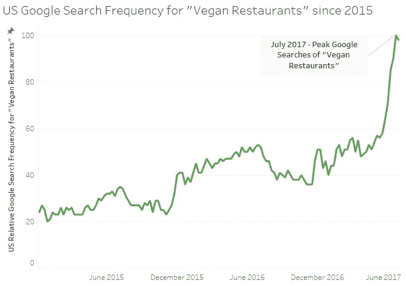
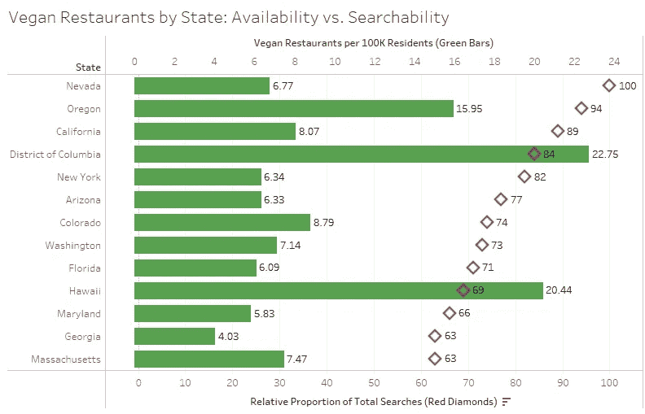
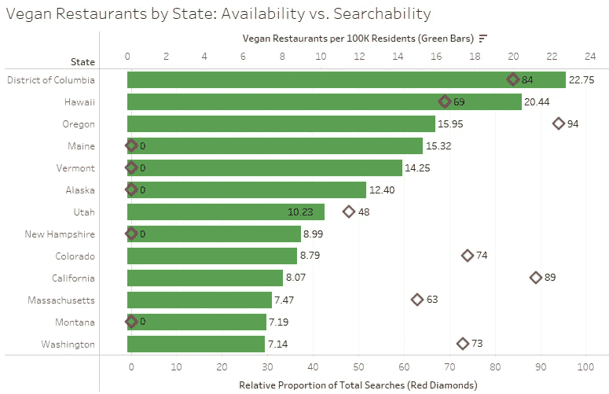
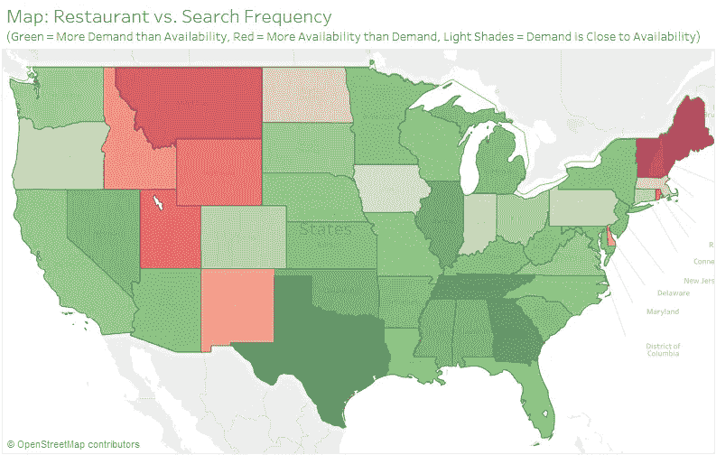

# 哪些州是最纯素食的州？还有，哪些州不是(但真的想成为)？

> 原文：<https://towardsdatascience.com/which-states-are-the-most-vegan-and-which-states-arent-but-really-want-to-be-5ff619a87f4b?source=collection_archive---------7----------------------->

这是我这种吃货的黄金时代。你不仅可以找到每一种菜肴，还可以找到迎合 SoCal 居民饮食限制的餐厅概念，无论是需要的还是想象的。我经常从从其他地方搬到加州的人们那里听说，加州有比其他任何地方都多的餐馆，为那些对乳制品、麸质等过敏的人提供饮食帮助。出现的最大的饮食需求之一是素食热潮，这意味着食物不含任何动物产品，也不是用任何动物产品制成的。越来越多的人对在纯素食餐厅用餐表现出兴趣，如下图所示。

在过去的五年里，当查看谷歌趋势来研究“纯素食餐馆”这个词的搜索频率时，这个词的兴趣有了普遍的倾向，但在过去的几周内绝对飙升。

一个安全的假设是，在我们伟大的国家，不是每个州都对这一新趋势表现出同样的热情。让我们看看哪个州的居民最感兴趣(在下图中用红色菱形表示)。

谷歌搜索对素食餐馆最感兴趣的州是…

内华达？？？

等等，什么？

我承认我有点喜欢加利福尼亚，我们接受所有人的各种饮食偏好，但这仍然令人震惊。当然，加州在俄勒冈州之后排名第三在某种程度上是有道理的，热爱自然的波特兰人(波特兰人？)可能会比洛杉矶洛杉矶的 LA fad diet 更受素食者的青睐，但令人哭笑不得的是，罪恶之城的家乡内华达州拿走了蛋糕。我的意思是，我不认为我曾经偷听到有人喝醉了跌跌撞撞地走在拉斯维加斯大道上寻找甜菜沙拉和芋头片。

如上图所示，红色菱形表示[谷歌搜索](https://trends.google.com/trends/explore?geo=US&q=vegan%20restaurants)的相对比例，上面覆盖着绿色条，标志着人均素食餐厅的实际频率(指标是[每 10 万](https://www.happycow.net/north_america/usa/)[州居民](https://www.census.gov/data/tables/2016/demo/popest/state-total.html)中素食餐厅的数量)。虽然内华达州的搜索兴趣最大，但它远非真正的素食餐厅最多，每 10 万居民中只有 6.77 家素食餐厅。虽然这使内华达州远远落后于其他领导者，如华盛顿州 DC(每 10 万居民 22.75 家素食餐馆)和俄勒冈州(每 10 万居民 15.95 家)，甚至夏威夷州(每 10 万居民 20.44 家素食餐馆)，其相对搜索频率仅为 69。它被夏威夷和马萨诸塞州等搜索排名前十之外的州打败了。

当看着同样的视觉，但按实际餐厅频率排序时，有一些更有趣的见解。虽然前三名(DC、夏威夷州和俄勒冈州)都有相对较高的搜索频率，但缅因州、佛蒙特州和阿拉斯加州(分别是排名第四、第五和第六的州)对“素食餐厅”的谷歌搜索很低，以至于它们在总搜索中的比例为零。事实证明，我关于加州是素食者的麦加的看法是完全错误的，因为这个黄金之州的人均纯素食餐馆数量仅排在第十位。

上图比较了各州的相对需求(各州在谷歌搜索比例中的排名)与素食餐厅的实际可用性(各州每 10 万居民中素食餐厅数量的排名)。

与谷歌搜索频率相比，深红色的州素食餐馆相对过多。非沿海西部的北部各州(蒙大拿、怀俄明等。)和东北部(缅因州、佛蒙特州和新罕布什尔州)的素食餐馆数量都超过了当地居民在网上显示的兴趣。深绿色的州素食餐馆相对较少，而谷歌搜索中指向“素食餐馆”的比例要高得多。列表中一些令人惊讶的州，如德克萨斯州、田纳西州和阿拉巴马州恰好是“烧烤带”的成员(这个词是我随便编造的)。浅色的州，如宾夕法尼亚、俄勒冈，以及明尼苏达州南部边境的任何州(开玩笑，爱荷华州……是的，我很确定那是爱荷华州)，都有与纯素食餐馆的实际实体代表接近的在线兴趣量。

*感谢您阅读我最新的数据帖子。作为一名产品营销和数据分析专业人士，我对数据支持的讲故事充满热情。这些帖子是我将真实数据与我个人不同的兴趣结合起来的方式，这些兴趣包括从旅行和娱乐到经济和社会问题的任何事情。
如果您有任何评论、故事想法或预期的数据项目，请随时发送电子邮件至 dwpwriting <至> gmail < dot > com 或通过* [*LinkedIn*](https://www.linkedin.com/in/davidwpeterson/) *联系我。*