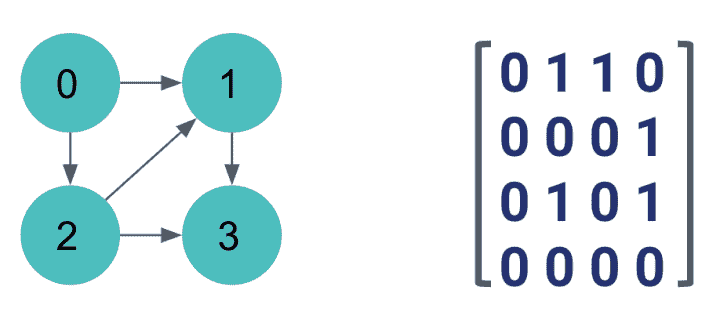
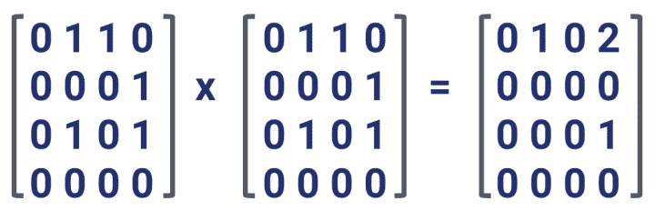
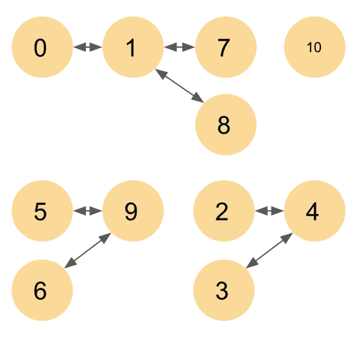
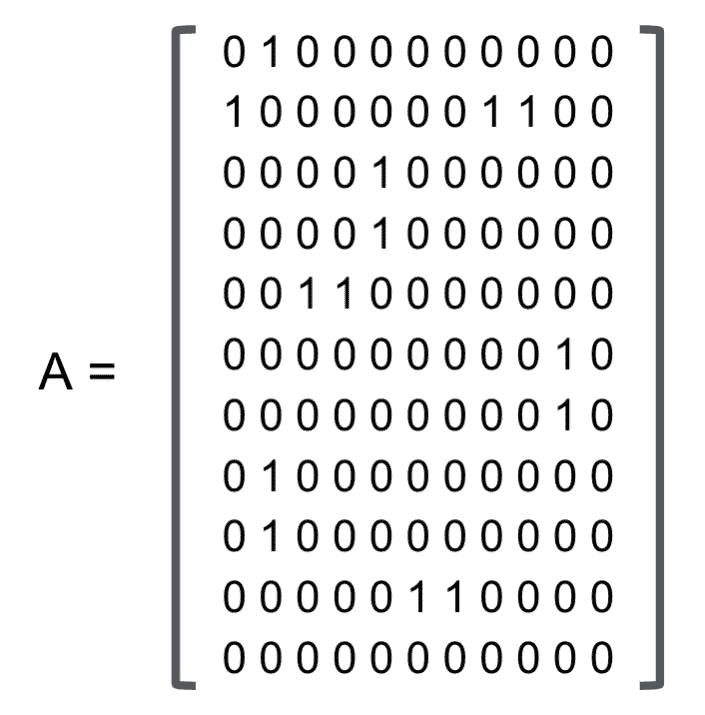
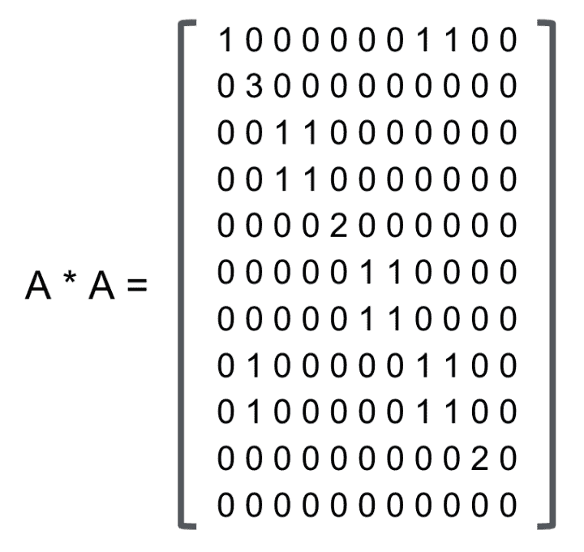
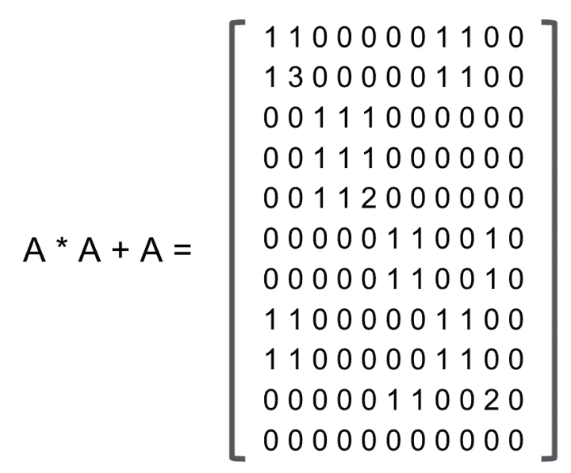
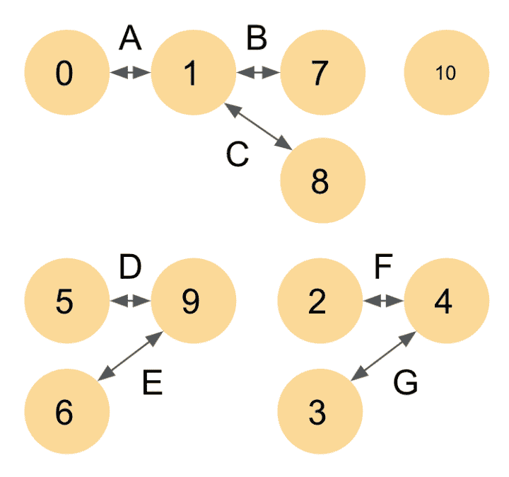
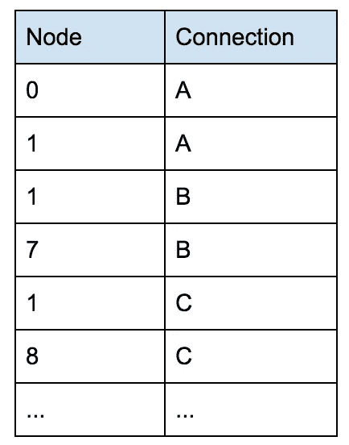
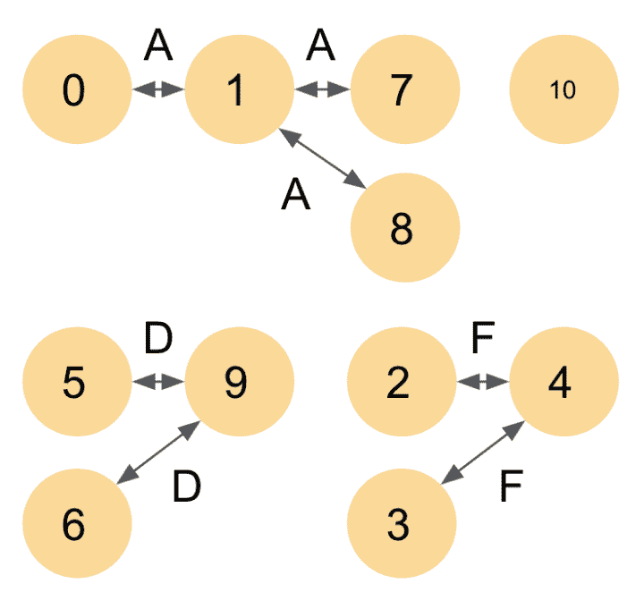

# 我和谁有联系？

> 原文：<https://towardsdatascience.com/who-am-i-connected-to-1660df1b140e?source=collection_archive---------20----------------------->


当你处理数据时，一个经常出现问题是找出事物之间的联系。例如，可以从你所有的朋友、你的朋友关系、你的朋友的朋友关系……来确定你与谁直接或间接相关，或者你与这样或那样的关系有多少分离度。幸运的是，您可以使用一些工具来进行这样的分析。这些工具属于网络理论的范畴，我将在这篇文章中介绍一些基本技巧。

首先让我们来了解一些术语。节点是我们联系的事物，例如你，你的朋友，你的朋友的朋友。顶点是那些节点连接方式。例如，在下面，节点 0 连接到节点 1 和 2，使用两个顶点来描述这些连接。节点 1 通过一个顶点连接到节点 3，等等。对于第一个例子，我们使用单向顶点，但没有什么阻止我们使用双向顶点。一般来说，如果所有顶点都是双向的，我们就称之为无向图，这是朋友的情况(通常是这样),因为你认识你的朋友，他也认识你！

网络分析中引入的第一个重要概念是邻接矩阵。邻接矩阵是表示节点之间的顶点连接的矩阵。邻接矩阵中的第一行表示节点 0 的连接。因此，节点 0 连接到节点 1 和 2，但不连接到自身或节点 3。所以第一行是 0，1，1，0。第二行表示节点 1 的连接，它只连接到节点 3。所以第二行是 0，0，0，1。请注意，我们可以有双向连接，在这种情况下，连接将同时出现在行和列上，但在本例中并非如此。



通过检查邻接矩阵，我们可以重建节点/顶点图。它在第一跳连接中告诉我们:谁是你的朋友。但是我们如何知道第二跳连接，例如节点 0 通过节点 1 和节点 2 连接到节点 3？一个非常简单的方法是将邻接矩阵乘以自身(A*A)。这个乘法的结果是第二跳连接。这里，我们看到节点 0 通过 2 跳连接到节点 1(通过节点 2)，并通过 2 跳连接到节点 3。我们甚至可以看到，从节点 0 到节点 3 的两跳中有两个这样的连接。最后，我们看到节点 2 通过 2 跳连接到节点 3(通过节点 1)。



如果我们再次将 A*A 乘以 A 本身，我们将获得三跳连接，在这种情况下，这仅限于节点 0 连接到节点 3。

总的来说，我们感兴趣的网络比这个简单的 4 节点图要大得多。同样，一般来说，所有节点都不会相互连接。嗯，他们说每个人都通过[六度间隔](https://en.wikipedia.org/wiki/Six_degrees_of_separation)(六跳)与每个人相连，但是对于大多数其他实际应用来说，并不是所有的节点都相互连接。让我们看一个更大的例子，看看上面举例说明的原理是如何大规模应用的。让我们假设下面的无向网络图。这里，因为我们有一个无方向的网络图，您会看到连接值出现在行和列中。这个特例显示了对角线的对称性。



像以前一样，如果我们计算 A*A，我们会得到第二跳连接。请注意，节点通过第二跳相互连接。例如，节点 1 通过第二跳经由节点 0、7 和 8 连接到自身 3 次。



如果您对所有第一跳连接和第二跳连接感兴趣，您可以将 A*A 和 A 相加，得到以下矩阵。您可以继续向前寻找第三个跳跃点，但是在这个例子中没有其他的连接，所以虽然您在这里看到的数字会增加，但是零的模式不会改变。我们已经找到了这张图的所有联系。我们发现节点 0 连接到节点 1、7 和 8。节点 2、3 和 4 相连。节点 5、6 和 9 相连。最后，我们看到节点 10 没有连接到任何其他节点。



在实践中，矩阵乘法可以很好地找到下一跳的邻居。如果恰好对于您的问题(如上一个)，大多数连接都不存在，即 0，那么您可以使用稀疏矩阵来存储(并且可能使用)您的邻接矩阵。然而，这些矩阵很快就会变得非常庞大，需要进行大量运算才能计算出来。如果您正在使用 SQL 或 spark，一个很好的技巧可能是在表上使用联接。

要做到这一点，你需要彻底解决这个问题。您将创建一个连接表，而不是创建节点如何连接的邻接矩阵。为了跟上我们的第二个例子，您可以将下面的网络图转换为节点/连接表。



现在，我们已经有了节点/连接表，我们的目标将是尽可能减少连接的数量，并最终得到类似下面这样的东西来查看所有连接的东西(我们不关心有多少跳会引导我们)。



为了实现这个目标，我们将通过两个步骤来迭代。首先，我们将执行连接缩减，然后更新节点/连接表。然后，我们反复冲洗，直至无法再减少连接数量。

假设上面的节点/连接表(node_connections ),我们可以通过以下 SQL 查询减少连接数，并将其存储为 new_connections 表:

```
SELECT A.connection, MIN(B.connection) AS new_connection 
FROM node_connections AS A 
JOIN node_connections AS B 
ON A.node = B.node 
GROUP BY A.connection
```

然后，您可以使用以下 SQL 查询更新 node_connection 表:

```
SELECT DISTINCT B.new_connection AS connection, A.node 
FROM node_connections AS A 
JOIN new_connections AS B 
WHERE A.connection = B.connection
```

重复这两个步骤，直到 node_connections 表不再发生变化，这样，您就有了一个通过不同连接连接的所有节点的图。

这只是可能的用例之一，但是对于大规模的应用来说，连接表可能比创建和乘邻接矩阵更容易和更快。我用 SQL 展示了逻辑，但是显然您可以使用 spark 获得类似的结果(对于我的特定应用程序，我使用 pySpark)。

如果你对网络理论在某个问题上的应用有疑问或有趣的想法，请随时加入讨论！

*封面照片由* [*迈克尔·盖达在 Pixabay*](https://pixabay.com/en/users/MichaelGaida-652234/) *拍摄。*

*原载于 2018 年 10 月 16 日*[*thelonenutblog.wordpress.com*](https://thelonenutblog.wordpress.com/2018/10/16/who-am-i-connected-to/)*。*