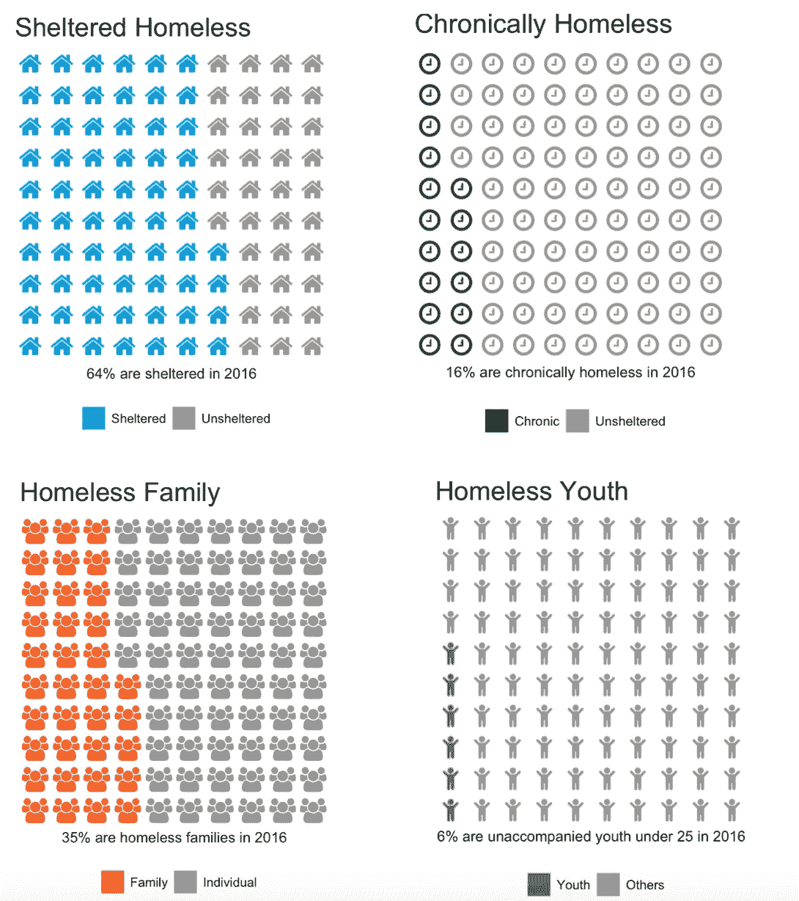
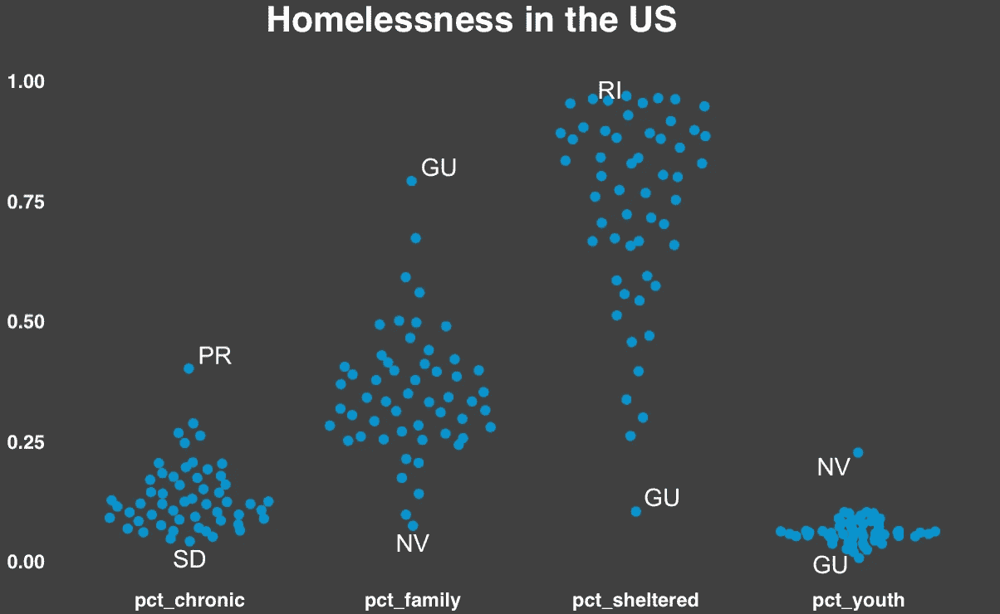

# 谁是无家可归者

> 原文：<https://towardsdatascience.com/who-are-the-homeless-a5a3516f0e3b?source=collection_archive---------6----------------------->

我一直想把无家可归形象化，但直到今天才找到任何数据。这个[数据集](https://www.hudexchange.info/resource/3031/pit-and-hic-data-since-2007/)包含美国各州无家可归者的几个属性(长期或暂时、有保护或无保护、家庭或个人等)。



Source: Department of Housing and Urban Development

按位置分解这些百分比，我们可以观察到:



homelessness in 2016

*   内华达州的无家可归家庭比例最低，无人陪伴的青少年比例最高
*   关岛受庇护家庭的比例最低，无家可归家庭的比例最高
*   南达科他州长期无家可归者的比例最低

我今天学到的是如何用[华夫饼](https://rud.is/b/2015/03/18/making-waffle-charts-in-r-with-the-new-waffle-package/)包和 [fontawesome](http://fontawesome.io/) 在 R 中制作华夫饼图表(饼状图的替代品)。

```
library(waffle)
library(extrafont)
parts <- c(Sheltered=64, Unsheltered=36)
waffle(parts, rows=10, colors=c("#009bda", "#969696"), 
       use_glyph="home", glyph_size=6)
```

这是我关于数据科学和视觉故事的[# 100 天项目](https://medium.com/@yanhann10)的第 44 天。我的 [github](https://github.com/yanhann10/opendata_viz) 上的全部代码。感谢阅读。欢迎新主题的建议和反馈。