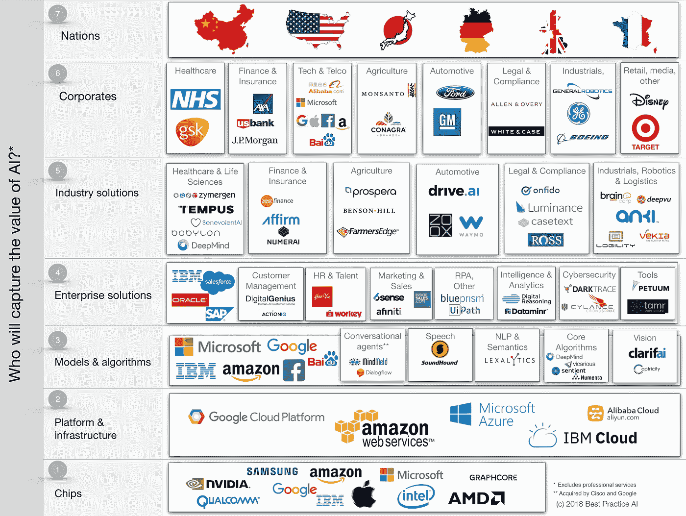
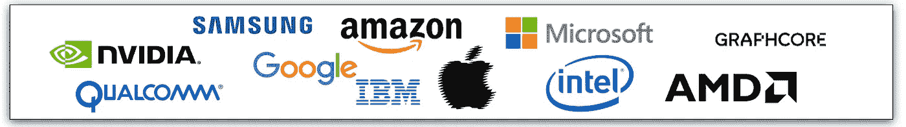
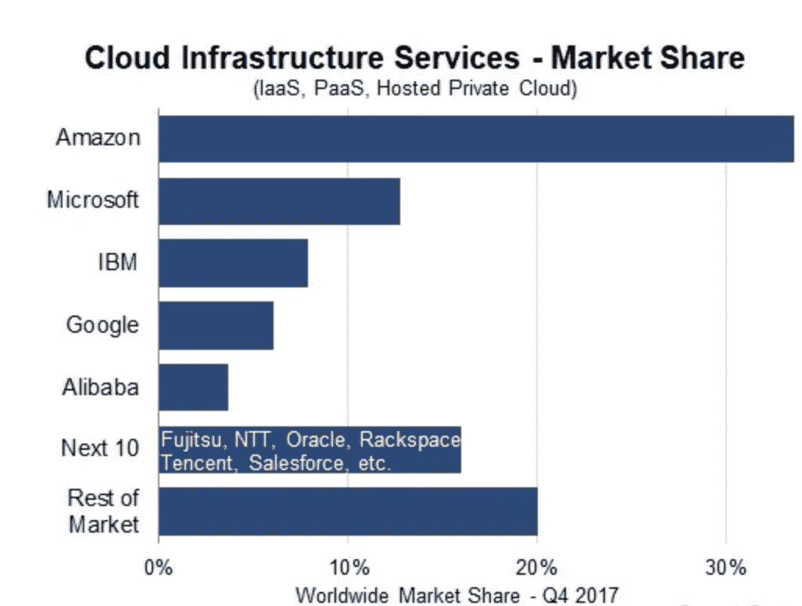
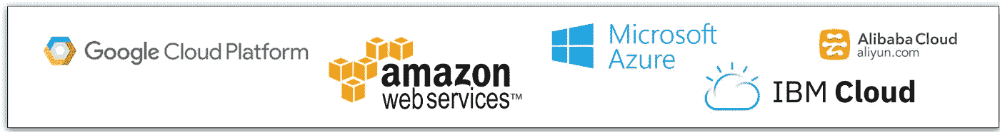
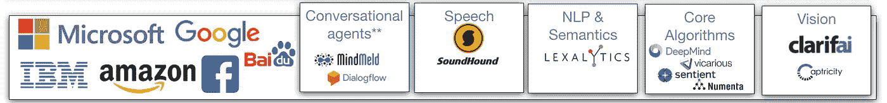
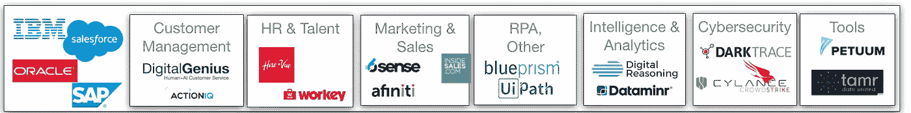
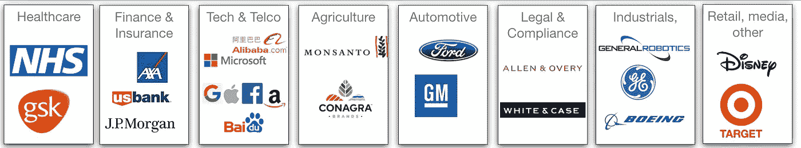
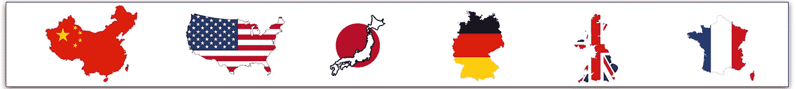

# AI 谁来赚钱？第一部分

> 原文：<https://towardsdatascience.com/who-is-going-to-make-money-in-ai-part-i-77a2f30b8cef?source=collection_archive---------1----------------------->

我们正处于人工智能的淘金热之中。但是谁将获得经济利益呢？都是淘金的创业公司的大众？那些拥有大规模金矿开采业务的公司？提供镐和铲的科技巨头？哪个国家有最丰富的金矿？

## 欢迎来到人工智能淘金热！

我们目前正在经历人工智能的另一次淘金热。数十亿美元正在投资于人工智能初创公司，涵盖所有可以想象的行业和商业功能。谷歌、亚马逊、微软和 IBM 正在进行一场重量级的战斗，在 2016 年投资超过 200 亿美元用于人工智能。企业正在争先恐后地确保在竞争对手之前实现人工智能的生产力优势，同时关注初创公司。中国正在大力支持人工智能，欧盟正在讨论 220 亿美元的人工智能投资，因为它担心输给中国和美国。

AI 无处不在。从谷歌上的 35 亿次每日搜索，到使用面部识别的新苹果 iPhone X，再到可爱地回答我们问题的亚马逊 Alexa。媒体头条吹捧人工智能如何帮助医生诊断疾病，银行如何更好地评估客户贷款风险，农民如何预测作物产量，营销人员如何锁定和留住客户，以及制造商如何改善质量控制。还有专门研究人工智能的物理、网络和政治风险的智库。

So who will make the money in AI?

人工智能和机器学习将成为无处不在的**，并融入社会的**结构**。但是和任何淘金热一样，问题是谁会找到金子？只会是勇敢者、少数人和大人物吗？或者时髦的暴发户能抢到他们的金块吗？那些提供镐和铲的人会赚大部分的钱吗？谁会找到宝藏呢？**

## **那么 AI 创造的价值在哪里呢？**

**当我开始思考谁将在人工智能中赚钱时，我提出了七个问题。谁将在(1)芯片制造商，(2)平台和基础设施提供商，(3)使能模型和算法提供商，(4)企业解决方案提供商，(5)行业垂直解决方案提供商，(6)人工智能的企业用户和(7)国家之间赚钱？虽然有很多方法可以揭开人工智能领域的面纱，但希望下面能提供一个有用的解释框架——一种价值链。所提到的公司是每个类别中较大公司的代表，但这份名单并不全面或具有预测性。**

****

**This is an example of an AI value chain. The companies noted are representative of larger players in each category but in no way is this list intended to be comprehensive or predictive. © Best Practice AI Ltd.**

## **1.谁有最好的人工智能芯片和硬件？**

**尽管计算能力的价格呈指数级下降，但需求却在以更快的速度增长。人工智能和机器学习有着巨大的数据集和数万亿的向量和矩阵计算，有着凶猛而永不满足的胃口。带上**筹码**。**

****

**NVIDIA 的股票在过去两年中上涨了 1500%，这得益于他们的**图形处理单元(GPU)** 芯片在历史上用于渲染美丽的高速流动游戏图形，非常适合机器学习。谷歌最近推出了第二代 [**张量处理单元【TPUs】**](https://techcrunch.com/2017/05/17/google-announces-second-generation-of-tensor-processing-unit-chips/)。而 [**微软**](https://www.nextplatform.com/2017/08/24/drilling-microsofts-brainwave-soft-deep-leaning-chip/) 正在打造自己的**脑波** AI 机器学习芯片。与此同时，像 Graphcore 这样已经筹集了超过 1 . 1 亿美元的初创公司正在寻求进入这个市场。现有的芯片供应商如 IBM、英特尔、高通、T21 和 AMD 都没有止步不前。甚至有传言说脸书正在组建一个团队来设计自己的人工智能芯片。随着剑桥科技**上周宣布推出首款云人工智能芯片，中国正在成为认真的芯片玩家。****

********

****Who made the money? [Levi Strauss](http://en.wikipedia.org/wiki/Levi_Strauss) and [Samuel Brannan](http://en.wikipedia.org/wiki/Samuel_Brannan) didn’t mine for gold themselves but instead made a fortune selling supplies to miners — wheelbarrows, tents, jeans, picks and shovels, etc.****

****显而易见的是，设计和制造芯片，然后保持全球芯片领导者地位的成本非常高。这需要极其雄厚的财力和世界级的芯片和软件工程师团队。这意味着新的赢家将会很少。就像淘金热时期一样，那些提供最便宜和最广泛使用的镐、铲将会赚很多钱。****

## ****2.谁拥有最好的人工智能基础设施和平台云？****

****人工智能竞赛现在也在云中进行。亚马逊很早就意识到，初创公司更愿意租赁电脑和软件，而不是购买。因此，它在 2006 年推出了亚马逊网络服务(AWS)。今天，人工智能对计算能力的需求如此之大，以至于越来越多的公司转向云，通过基础设施即服务 **(IaaS)和平台即服务****(PaaS)**产品**来租赁硬件。******

********

****[Amazon is the leader in cloud services but hot on their tales are Microsoft, IBM, Google and Alibaba.](https://www.srgresearch.com/articles/cloud-growth-rate-increases-amazon-microsoft-google-all-gain-market-share)****

****科技巨头之间的斗争正在进行。微软正在提供他们的混合公共和私有 **Azure** 云服务，据称拥有超过一百万台计算机。在过去几周，他们宣布他们的 [**脑波** **硬件解决方案**](https://venturebeat.com/2018/03/26/microsofts-brainwave-makes-bings-ai-over-10-times-faster/) 极大地加速了机器学习，他们自己的必应搜索引擎性能提高了 10 倍。谷歌正急着用自己的谷歌云产品迎头赶上。我们看到中国的阿里巴巴开始占据全球份额。****

********

****Large cloud players are racing to ensure they are positioned for the massive demand that will be driven by AI.****

****亚马逊——微软——谷歌和 IBM 将继续一决雌雄。请注意来自中国的大规模云玩家。那些拿着大镐和铲子的家伙会再次获胜。****

## ****3.谁有最好的实现算法？****

****今天，谷歌是世界上最大的人工智能公司，吸引了最优秀的人工智能人才，在 R&D 上花费了小国规模的 GDP 预算，并坐拥来自其服务的数十亿用户的最佳数据集。人工智能正在推动谷歌的搜索、自动驾驶汽车、语音识别、智能推理、大规模搜索，甚至是它自己在药物发现和疾病诊断方面的工作。****

****令人难以置信的人工智能**机器学习**软件和算法正在推动谷歌的所有人工智能活动——[**tensor flow**](https://www.tensorflow.org/)——现在正在免费赠送。是免费的！TensorFlow 现在是一个面向全球开放的开源软件项目。他们为什么要这么做？正如 Google Brain 的负责人 Jeff Dean 最近所说，今天世界上有 2000 万个 T21 组织可以从机器学习中受益。如果数以百万计的公司使用这种同类最佳的免费人工智能软件，那么他们可能需要大量的计算能力。谁能提供更好的服务呢？当然，谷歌云针对 TensorFlow 和相关的人工智能服务进行了优化。一旦你变得依赖他们的软件和云，在未来的许多年里，你就会成为一个非常顽固的客户。难怪亚马逊-微软 IBM 也提供自己的廉价或免费人工智能软件服务，这是一场争夺全球人工智能算法主导地位的残酷比赛。****

****我们也看到了不仅是机器学习算法，还有为对话代理和机器人、语音、自然语言处理(NLP)和语义、视觉和增强核心算法提供服务的**认知** **算法**的斗争。在这个竞争日益激烈的领域，一家初创公司是 [**Clarifai**](https://www.clarifai.com) ，它为企业提供先进的图像识别系统，以检测近似重复和视觉搜索。在过去三年里，它已经筹集了近 4000 万美元。视觉相关算法和服务的[市场](https://www.statista.com/statistics/607835/worldwide-artificial-intelligence-market-leading-use-cases/)预计在 2016 年至 2025 年间的累计收入为 80 亿美元。****

********

****The race is on for the deep learning and cognitive algorithms that will enable and power applied AI solutions.****

****巨人并没有停滞不前。例如，IBM 正在提供其沃森认知产品和服务。他们有大约 20 个用于聊天机器人、视觉、语音、语言、知识管理和移情的 API，可以简单地插入公司软件中，以创建人工智能应用程序。认知 API 无处不在。 [**KDnuggets**](https://www.kdnuggets.com/2017/02/machine-learning-data-science-apis-updated.html) 在这里列出了 50 多个来自巨头和初创公司的顶级认知服务。这些服务被作为人工智能即服务 **(AIaaS)** 放到云中，以使它们更易于访问。就在最近，微软首席执行官塞特亚·纳德拉声称，有 100 万开发者正在使用他们的人工智能 API、服务和工具来构建人工智能应用，近 30 万开发者正在使用他们的聊天机器人工具。我不想成为一家与这些巨人竞争的创业公司。****

****这一领域的赢家可能会再次青睐重量级企业。他们可以雇佣最优秀的研究和工程人才，花最多的钱，访问最大的数据集。初创公司要繁荣发展，必须有充足的资金，由拥有一整套知识产权专利和已发表论文的领先研究人员支持，拥有深厚的领域专业知识，并能获得高质量的数据集。他们应该有出色的导航技能，可以在巨人之前航行或参加不同的比赛。将会有许多初创企业受损，但那些能够扩大规模的企业将会发现自己成为全球性企业，或者很快被重量级企业收购。即使一家初创公司没有找到商业化的道路，如果他们与一个强大的研究导向型团队一起致力于实现人工智能算法，那么他们也可能成为**收购者**(因其人才而被收购的公司)。我们在 2014 年看到了这一点，当时 **DeepMind** ，一家成立两年的伦敦公司，开发了独特的强化机器学习算法，w [被**谷歌**以 4 亿美元](https://www.theguardian.com/technology/2014/jan/27/google-acquires-uk-artificial-intelligence-startup-deepmind)收购。****

## ****4.谁拥有最好的企业解决方案？****

******企业软件**一直被 Salesforce、IBM、Oracle、SAP 等巨头把持。他们都认识到，人工智能是一种工具，需要集成到他们的企业产品中。但许多初创公司正急于成为下一代企业服务，填补现有企业目前没有涉足甚至没有试图破坏的空白。****

****我们分析了企业领域的两百多个用例，从客户管理到营销、网络安全、智能、人力资源到认知机器人流程自动化(RPA)的热门领域。企业领域比以前的领域更加**开放**，有许多初创公司为这些用例提供单点解决方案。今天，有超过 200 家人工智能公司正在招聘，其中许多是人工智能初创公司。网络安全领导者 **DarkTrace** 和 RPA 领导者 **UiPath** 拥有 1 亿美元的战争资金。现任者还希望确保他们的生态系统处于前沿，并投资于初创公司，以增强他们的产品。Salesforce 投资了一个客户管理解决方案[**Digital****Genius**](https://www.digitalgenius.com)和类似的提供企业翻译服务的[**un able**](https://unbabel.com/for-salesforce/)。在职者也经常有更紧迫的问题。例如，SAP 急于在提供云解决方案方面迎头赶上，更不用说在人工智能方面迎头赶上了。我们也看到**工具**提供商试图简化在企业中创建、部署和管理人工智能服务所需的任务。例如，机器学习培训是一个混乱的行业，80%的时间可以花在数据争论上。并且在测试和调整所谓的超参数上花费了过多的时间。[**Petuum**](http://www.petuum.com/)**总部位于美国匹兹堡的工具提供商已经筹集了超过 1 亿美元来帮助加速和优化机器学习模型的部署。******

********

****Enterprise AI solutions will drive improved customer service and productivity.****

****如果这些企业初创提供商能够迅速证明他们正在解决和扩展解决方案以满足现实世界的企业需求，他们中的许多人都可以拥有一个健康的未来。但正如软件淘金热中经常发生的那样，每个类别都会有少数赢家。对于那些人工智能企业类别的获胜者来说，如果他们看起来太具威胁性，他们很可能会与最好的同类工具提供商一起被巨头们抢购。****

## ****5.谁有最好的垂直解决方案？****

****人工智能正在推动一场最佳垂直行业解决方案的竞赛。有大量新的人工智能初创公司为医疗保健、金融服务、农业、汽车、法律和工业部门的企业用例提供解决方案。许多初创公司正在采取雄心勃勃的方式，通过直接向相同的客户提供服务来颠覆现有的企业。****

********

****New industry AI solutions will either power or disrupt organisations.****

****很明显，许多初创公司正在提供**有价值的**点解决方案，如果他们能够获得(1)大型和专有的**数据训练集，(2)领域知识**，这使他们对某个行业内的机会有深刻的见解，(3)围绕应用人工智能的**人才**，以及(4)资金雄厚的**资本**，以资助快速增长，他们就能取得成功。那些做得很好的创业公司通常以完善的上市计划的形式来表达客户、业务效率和投资回报率的企业商业语言。****

****例如， [**ZestFinance**](https://www.crunchbase.com/organization/zestfinance) 已经筹集了近 3 亿美元来帮助改善信贷决策，为每个人提供公平透明的信贷。他们声称拥有世界上最好的数据科学家。但他们会的，不是吗？对于那些寻求颠覆现有企业的初创公司来说，它们需要真正雄厚的资金。例如， [**肯定**](https://www.crunchbase.com/organization/affirm) **，**在销售点向消费者提供贷款，已经融资超过 7 亿美元。这些公司很快需要创建一个可防御的护城河，以确保他们保持竞争力。这可能来自数据**网络** **效应**更多数据产生更好的基于人工智能的服务和产品，从而获得更多收入，客户获得更多数据。于是**飞轮**效应继续。****

## ****6.哪些企业将抓住人工智能的价值？****

****虽然企业可能会在自己的行业中寻找新的供应商来提供人工智能解决方案，以提高他们的收入和利润，但他们不会坐视不理，让新贵强行进入他们的客户。他们不会坐以待毙，让他们的企业竞争对手通过人工智能获得第一优势。目前有一场大规模的企业创新竞赛。大公司有自己的风险投资小组，投资创业公司，运行加速器，建立自己的创业公司，以确保他们是人工智能驱动的创新的领导者。****

********

****Corporates are well positioned to capture value from AI in the form of enhanced customer service, increase productivity and improved products and services.****

****由于拥有数据资产，大公司在与初创公司和小公司的竞争中处于有利地位。数据是人工智能和机器学习的燃料。谁能比拥有大量承保索赔历史数据的保险公司更好地利用人工智能呢？这家金融服务公司对消费者的金融产品购买行为了如指掌？或者是用户搜索信息最多的搜索公司？****

****大大小小的企业都有能力从人工智能中获取价值。事实上，Gartner 研究公司预测，到 2022 年，人工智能衍生的商业价值预计将达到 3.9 万亿美元(T2)。有成百上千个有价值的用例，人工智能可以跨组织解决。企业可以改善客户体验，节省成本，降低价格，增加收入，销售更好的人工智能产品和服务。人工智能将帮助大公司变得更大，通常是以牺牲小公司的利益为代价。但是他们需要展示出强大的远见卓识的领导能力，执行能力，以及对不总是在第一次尝试中就获得技术支持项目的宽容。****

## ****7.哪些国家将从人工智能中受益最多？****

****各国也在争夺 AI 霸权。中国并不羞于呼吁人工智能的出现。它正在大量投资培养技术人才和发展创业公司。其更宽松的监管环境，特别是在数据隐私方面，有助于中国在安全和面部识别等人工智能领域处于领先地位。就在最近，就有这样一个例子:在一场音乐会上，中国警察从 5 万名观众中挑出了一张通缉犯的脸。大规模分析人脸和图像的 SenseTime Group Ltd 报告称，它筹集了 6 亿美元，成为最有价值的全球人工智能初创公司。中国人指出，他们的移动市场是美国的 3 倍，移动支付是美国的 50 倍，这是一个巨大的数据优势。欧洲对数据隐私监管的关注可能会使他们在人工智能的某些领域处于不利地位，即使[联盟](https://www.theguardian.com/technology/2018/apr/25/european-commission-ai-artificial-intelligence)正在谈论在人工智能领域投资 220 亿美元。****

********

****Will this be the sovereign winners in AI? China? US? Japan? Germany? UK? France?****

****英国、德国、法国和日本最近都宣布了他们的国家人工智能战略。例如，[总统马克龙](https://www.wired.com/story/emmanuel-macron-talks-to-wired-about-frances-ai-strategy/)表示，法国政府将在未来五年内花费 18.5 亿美元支持人工智能生态系统，包括创建大型公共数据集。像[谷歌的 DeepMind](https://deepmind.com/blog/a-return-to-paris/) 和三星这样的公司已经承诺开设新的巴黎实验室，富士通正在扩大其巴黎研究中心。英国[刚刚宣布投入 14 亿美元到人工智能领域，包括资助 1000 名人工智能博士。但是，虽然各国都在投资人工智能人才和生态系统，但问题是谁将真正抓住价值。法国和英国会只是补贴将被谷歌聘用的博士吗？虽然工资税和所得税对这六位数的机器学习工资来说是健康的，但创造的大部分经济价值可能是由这家美国公司、其股东和微笑的美国财政部创造的。](https://www.bloomberg.com/news/articles/2018-04-25/u-k-announces-1-4-billion-drive-into-artificial-intelligence)****

****人工智能将提高公司和国家的生产率和财富。但是，当头条新闻显示我们 30%到 40%的工作将被机器取代时，这些财富将如何分配呢？经济学家可以从数百年来不断增长的技术自动化中吸取教训。会有净工作岗位创造还是净工作岗位损失？公开辩论经常引用机器学习的教父杰弗里·辛顿的话，他认为随着机器从医学图像中诊断疾病，放射科医生将会大量失业。但是我们可以看看中国人，他们正在使用人工智能来帮助放射科医生管理每年审查 14 亿次肺癌 CT 扫描的巨大需求。结果不是失业，而是市场扩大，诊断更加有效和准确。然而，可能会有一段动荡时期，届时大部分价值将流向控制人工智能技术和数据的少数公司和国家。低技能国家的财富依赖于人工智能自动化目标的工作，这些国家可能会受到影响。人工智能将青睐大型企业和技术熟练的企业。****

## ****那么这一切意味着什么呢？****

****在审视人工智能的前景时，很明显我们现在正在进入一个真正的人工智能黄金时代。关于**经济** **价值**将迁移到哪里，几乎没有什么关键主题出现:****

*   ******全球科技巨头**是这场淘金热的**镐**和**铲**——为想冲进去的人提供人工智能。谷歌-亚马逊-微软和 IBM 在人工智能领域展开军备竞赛。他们正在为提供最好的**芯片**、**云**和**人工智能**、**算法**和**服务**而激烈竞争。紧随其后的是中国科技巨头阿里巴巴和百度。很少有创业公司会在日益成为**商品的**云计算上比微软花费更多、更聪明或提供更低的价格，或者比谷歌的张量处理单元建立更好的人工智能芯片，或者比亚马逊建立更好的物体识别认知算法。****
*   ****人工智能初创公司纷纷提供认知算法、企业解决方案和深度行业垂直解决方案。为了繁荣，初创公司需要获得独特的数据集、深厚的领域知识、雄厚的财力以及吸引和留住日益紧缺的人工智能人才的能力。这不是一个车库里的应用程序会改变世界的案例。人工智能初创公司的赢家将是那些**解决**有价值的现实世界问题、**迅速扩大**上市规模并建立**可防御的**阵地的公司。初创公司应该专注于企业和行业解决方案，在这些领域有许多高价值的用例需要解决。然而，随着人才大战的继续，至少在未来几年内，算法领域的初创企业**收购者**将会变得有些普遍。正如任何淘金热一样，一路上会有许多初创企业伤亡，每个类别都会有少数赢家。这些赢家可能会发现巨头们给了他们诱人的支票。****
*   ******企业**处于有利地位，可以从人工智能中获取大量价值，有人说价值在**数万亿**美元。人工智能将越来越多地推动客户体验的改善，通过协助和自动化主要业务流程来帮助提高生产率和降低成本，并提高产品和服务的竞争力。最大的价值将从那些有规模的公司获得——最好和最大的数据集、最多的客户和最大的分布。越大的可能越大。但这只有在企业展现出强有力的领导力，并且**灵活地执行**的情况下才会发生，而这通常不是他们的名片。在人工智能执行方面领先的公司再次成为谷歌、脸书、苹果和亚马逊的科技巨头，他们提供人工智能产品和服务，覆盖全球数十亿受众。随着科技巨头利用人工智能进入和破坏新的领域，从零售到医疗保健到媒体等行业的企业都感到害怕。****
*   ****民族国家也在进行人工智能竞赛。中国毫不掩饰其到 2030 年成为人工智能世界领导者的意图。它认为自己具有结构优势。虽然许多欧洲国家都在吹捧他们政府支持的人工智能承诺，但风险在于，他们只是在补贴全球人工智能巨头的人才，并加速其他主权国家的财富。强有力的数据隐私法规会伤害欧洲国家在人工智能方面的创新吗？人工智能带来的财富可能会流向那些控制和利用领先人工智能技术和数据的国家和公司——想想美国和中国。随着自动化侵蚀越来越低收入的工作，那些没有工作的人可能会受到挑战。****

****简而言之，看起来人工智能淘金热将有利于拥有**控制权**和**规模**的公司和国家，而不是最好的人工智能工具和技术、数据、最好的技术工人、最多的客户和最强的资本渠道。那些有规模的企业将从人工智能中获取最大份额的经济价值。从某些方面来说，这是一种改变，也是一种选择但是也会有一些勇敢的创业公司发现巨大的金块。但是就像任何淘金热一样，许多创业公司都会有所收获。许多个人和社会可能会觉得他们没有看到淘金热的好处。****

****这是我打算写的关于人工智能经济学的系列文章的第一部分。我欢迎你的反馈。****

******作者** **作者** [西蒙·格林曼](https://medium.com/u/828eed16d402?source=post_page-----77a2f30b8cef--------------------------------)****

****我热爱技术以及如何将技术应用于商业领域。我经营着自己的咨询公司[最佳实践人工智能](http://www.bestpractice.ai)帮助企业和初创公司的高管加速采用基于 ROI 的人工智能应用。请联系讨论此事。如果你喜欢这首曲子，我希望你能按下拍手按钮👏所以其他人可能会偶然发现它。请发表您的评论，或者您可以直接给我发电子邮件或在 LinkedIn 或 twitter 上找到我。****