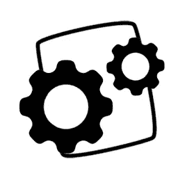
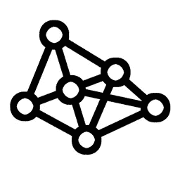
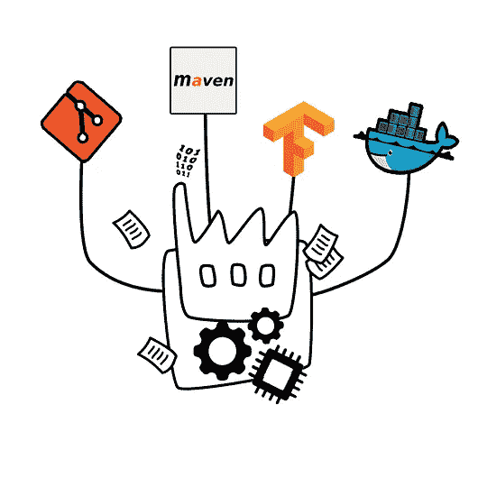

# 谁动了我的二进制文件？

> 原文：<https://towardsdatascience.com/who-moved-my-binaries-7c4d797cd783?source=collection_archive---------17----------------------->

## 在机器学习项目中试验软件开发管道——第三部分——二进制文件、可执行文件等等…

我们现在已经到了这一系列文章的第三篇，是关于我在修改我的软件开发管道以包含我的新 ML 东西时所做的实验。为了总结前面的部分，我们讨论了源代码控制和版本控制，以及旨在生成构成应用程序的二进制包的构建过程。特别是，我们已经看到了如何利用 Tensorflow 和 Keras 库，我被迫在一个以前主要由为不同技术栈(在我的例子中是 Java)编写的模块组成的应用程序中包含给定编程语言(例如 Python)的部分代码。

到目前为止，我们所缺少的是如何处理作为这个编写和构建过程的结果而得到的不同的二进制工件。这个阶段也受到我们的应用程序的多语言特性的影响(也就是说，不同的组件是用不同的编程语言编写的)，因为它的结果包含了许多不同的、不兼容格式的二进制包:。java 模块的 jar 文件。python 的 whl(“wheels”)等等。

我们需要处理好这件事。但是首先，让我们先试着更好地理解我们正在处理的东西，因为许多不同的东西都可以归入“二进制包”的一般定义，通常服务于不同的目的，并且在我们软件开发生命周期的不同阶段使用。仅举几个例子，我们可能有:

**可重用软件库**，提供良好记录和封装的功能。这些是作为依赖项导入并嵌入到我们的代码中的(还记得吗？我们首先选择了 Maven 这样的工具来处理这些问题)。这应该是每个人都熟悉的:我们谈论的是 Tensorflow 或 Keras 之类的东西，它们构建在较低级别的 API(例如 Numpy)之上，以提供更通用的抽象级别。当然，这里我们不考虑公开可用的通用库，如上面两个，而是由我们的团队设计和制作的库，以满足我们公司或我们应用程序的特定需要和要求。一个例子？不知道…可能你公司的数据是一堆图像文件，需要非常具体的预处理步骤。我们不必在每个应用程序组件中重复代码来执行 preproc，而是将这种功能抽象并捆绑到一个可重用的库中，使用它自己的 API，并在我们的存储库中保持可用。

**应用组件或模块。**实际上，这也是一个非常通用的术语，从技术上讲，这些库和上面的可重用库没有明显的区别。我只是喜欢使用不同的术语来区分前一种情况，在这种情况下，功能的开发考虑到了未来的重用，而开发的任何软件模块都是作为应用程序的一个非常特定的部分来运行的，可能符合一些给定的组件模型(想想在电子商务应用程序中提供一些特定业务功能的 EJB，Flask python REST 服务，等等)。).

**随时可部署的可执行文件。**该说的都说了，该做的都做了，我们需要的是在某个地方运行的某个软件。在一个经典的(所谓的“*单片*”)应用程序中，这可以是一个单独的可执行文件(和。用于 windows 系统的 exe，一个可执行文件。jar，或者类似. war/的东西。对于 Java 企业应用程序来说是 ear archive)，将我们所有的库、应用程序组件等等捆绑在一起。一个这样的包可以在某个目标环境中配置、部署和运行。另一方面，在微服务架构[i]中，我们的应用程序可以由几个独立的可部署和可执行的模块组成。

现在我们的嘉宾明星来了:**经过训练的 ML 模特**。这样，我指的是在内存中重新创建先前训练的模型所需的所有信息的序列化副本，而不需要例如从零开始重新训练它。对于简单的逻辑回归模型，这些信息可能只包含几个数字参数，对于复杂的多层深度神经网络，这些信息可能包含数百万个浮点值的矩阵。

您可能会在概念上认为这些与当前的讨论无关，也就是说，将它们视为普通的数据文件。毕竟，它们本身并不直接提供可执行的功能，而是需要一些运行时组件或服务环境来赋予它们生命。它们甚至可能以非二进制(例如文本)格式存储[ii],这使它们明确地脱离了“软件二进制”的定义。

正如您所猜测的，我倾向于采用相反的观点，将它们视为以某种序列化形式提供可执行功能的另一种模块——并将它们包括在本文的讨论中。

现在让我们讨论一下如何管理我们到目前为止讨论过的所有不同种类的二进制文件。首先，这些是为了不同的目的而存在的，所以不同的工具将会方便地管理它们。粗略地说，我们可以根据它们的用途将上述二进制文件分为两组。

第一组由我们在代码开发过程中需要作为依赖项的那些二进制文件组成——我们在应用程序代码中捆绑的软件片段，用于构建其他二进制文件。不仅是通过构建我们自己的代码生成的二进制文件，还有第三方的二进制组件，比如免费开源或授权的商业库。在这种情况下，我们需要一个**二进制存储库管理器**——一个专用的服务器应用程序，用于存储、版本化和提供二进制组件。选择通常取决于我们使用的包格式/构建工具。例如，对于基于 Maven 的项目，我过去使用的一种工具是 Sonatype Nexus[iii]存储库，但是存在许多有效的替代方案，一个显著的例子是 JFrog 的 Artifactory[iv]。Artifactory 也主要是面向 Maven 的，但它被宣传为*“唯一支持所有主要打包格式、构建工具和 CI 服务器的通用存储库管理器”*——这包括标准的 Python 工具，如 pip 和 distutils(尽管我猜想如果你专门使用 Python，你可以在 CI env 上安装你的私有 PyPI 服务器)。

至于第二组，一旦您构建了您的应用程序或服务，您需要保持完成的“可执行”包准备好在某个目标运行时环境中进行部署和配置。同样，使用不同的技术可能会使事情变得复杂，但这里有一个名为 docker 的小工具来拯救我们。

你不太可能还没听说过 docker。这项技术在几年前以一种“革命”的形式出现，我真的无法想象以前没有它我是如何生活的。它提供了一种在所谓的“容器”中统一打包应用程序的方法，这是一种轻量级的自包含虚拟机，将应用程序代码及其所有依赖项捆绑为一个完全自包含的高度可移植的包。[v]

Docker 有自己的存储库，名为 docker registry，您可以在自己的服务器上安装并保护它，以存储和管理容器的图像——除此之外，Artifactory 似乎也与 docker 格式兼容，可以用作容器图像的存储库。

系列化的预训练 ML 车型呢？正如我前面所说，这些通常是以某种序列化格式存储的一组参数:TensorFlow 以 Google 的协议缓冲区格式存储文件，Keras 提供了使用 HDF5 标准的基本保存格式，或者您可以将 numpy 数组定制到自己的数据结构中。

事实是，虽然在最简单的情况下，这些文件可能只包含有限的一串数字(如在简单的线性回归模型中)，但一般来说，它们可能会变成具有数百万浮点参数的巨大文件，例如在非常深度的神经网络的情况下。管理巨大的文件意味着在存储和版本控制方面面临巨大的限制。幸运的是，有一个 GIT 扩展专门解决大文件管理的问题[vi]。一个更好的消息是，Artifactory 似乎也支持 GitLFS。(再说一次，我从未将 Artifactory 作为二进制库使用过，但它肯定在我的任务列表中……)。

更具体地说，最近的发展已经看到了一个全新类别的产品的出现，这些产品被命名为*模型服务器*，例如 TensorFlow 服务器、Apache MMS(Apache MXNet 的模型服务器)、clipper.ai 等。就我们目前的讨论而言，这些似乎更面向产品的部署阶段——而不是支持软件开发阶段的模型的存储和版本化——因此，也许这些值得在未来的帖子中专门讨论。

这篇相当长的文章我差不多要看完了。让我们总结一下到目前为止我们所拥有的:
我们已经在我们的软件工厂中建立了许多软件“机器”，一个源代码版本服务器(gitlab)，一个二进制存储库(nexus，artifactury，…)，一些模型服务器和一个可部署 docker 容器的存储库。

仍然缺少的是一些将所有东西粘在一起的“胶水”。我指的是允许从编写代码到构建到测试再到部署……无论什么，而不必手动与我们谈到的每个软件工具交互的东西:也就是说，我们需要某种持续集成引擎(如 Jenkins)，它有助于自动化整个过程。但是…我认为这篇文章已经太长了，所以我会在下一次的某个时候再讨论这个话题。

希望你资助我们讨论的有趣的东西！

## 链接和参考

[我]查看我以前的[帖子](/in-code-we-trust-7620207f4dfe)

[ii]例如，它们可以存储为基于 XML 的交换格式，就像 [PMML](https://en.wikipedia.org/wiki/Predictive_Model_Markup_Language) 的情况一样，这是表示预测解决方案的事实标准。

[https://www.sonatype.com/nexus-repository-sonatype](https://www.sonatype.com/nexus-repository-sonatype)

【ⅳ】[https://jfrog.com/artifactory/](https://jfrog.com/artifactory/)

https://www.docker.com/

https://git-lfs.github.com/