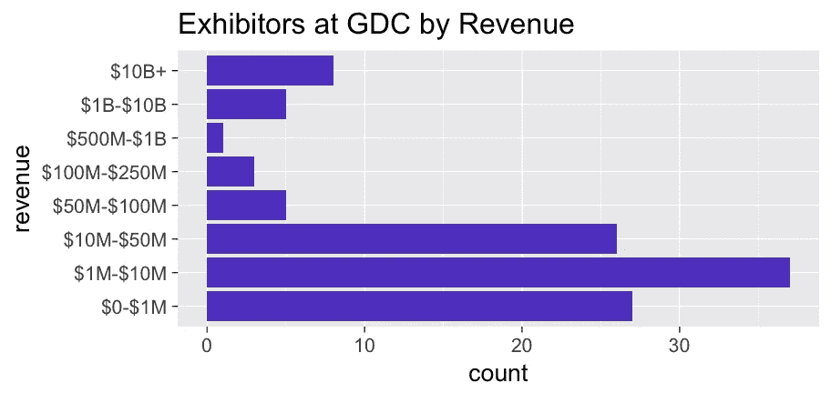
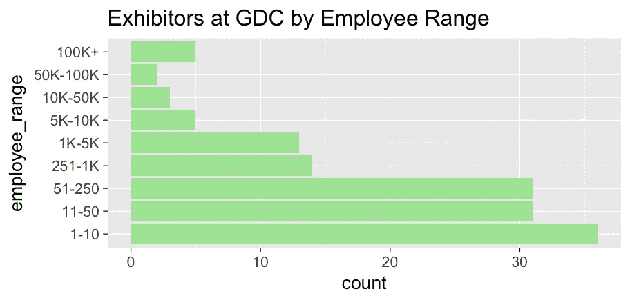
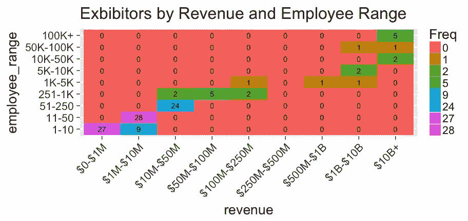
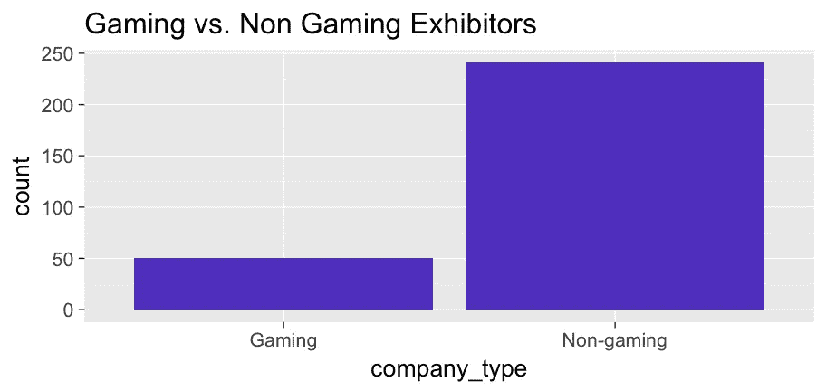
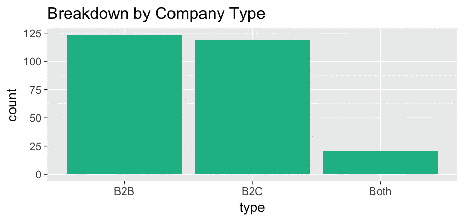
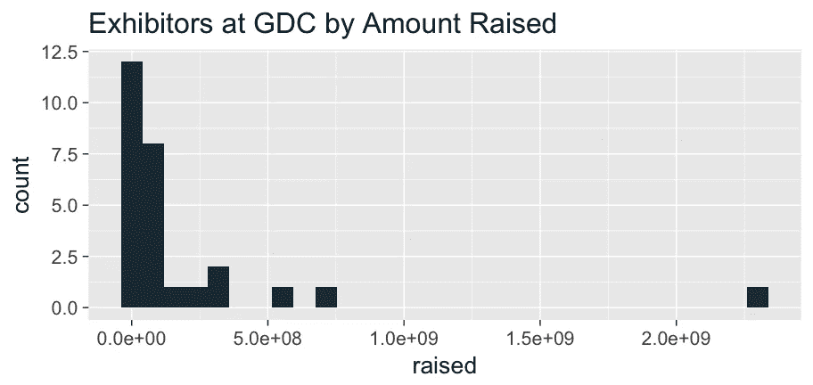

# 为什么我今年要去 GDC。

> 原文：<https://towardsdatascience.com/whos-exhibiting-at-gdc-this-year-40d285dbd462?source=collection_archive---------4----------------------->

# …并采用数据驱动的方法来做决定。

这是你在参加任何会议之前可能会问的一个问题，尤其是在繁忙的时候和一个大的、有利润的季度交易接近尾声的时候。

你可以浏览一个网站，得到一个随机的无意义的名字列表，或者…你可以数据化一个完整的数据驱动的方法。

我想采取数据驱动的方法来回答这个问题，看看它是否值得第一次参加。

使用 [Cooladata](https://www.cooladata.com/) ，我能够产生一个很好的结果摘要，并与我的团队快速分享。

我参加会议有各种各样的原因:职业发展、人际关系和业务发展等等。就 GDC 而言，我主要感兴趣的是与游戏公司建立联系，Cooladata 可能非常适合作为他们的分析解决方案。

鉴于我参加会议的标准相对宽松，我需要一些准则来坚持。以下是我喜欢寻找的东西:

*   中小市场范围的公司
*   Cooladata 服务良好的行业中的公司(即游戏)
*   主要是 B2C 公司
*   资金相当充足的公司

# 方法

首先，我需要拿到一份参展商名单，看看哪些公司计划参展。幸运的是，GDC 的人通过提供一个方便的公司列表和他们的域名列表，使这变得容易了一些:http://expo.gdconf.com/2018/exhibitor-list/

一旦我有了这个列表，我需要用一些关键的公司信息来充实它，比如员工数量、行业、资金和其他一些数据点。

最后，我需要做一些探索性的分析，看看参展的公司是否具备我想要的特征。

# 方法

为了从 GDC 列表中捕获公司域，我使用 R 下载了网页，并采用了一些非常简单的键值提取技术来收集所有公司域的列表。

一旦我有了这些公司的程序清单，我就使用 Clearbit 的 Enrichment API 尽可能多地了解这些公司。Clearbit 返回了每家公司大约 28 个不同的数据点(有时更多)，这些数据点对于详细描述这些公司的一些非常具体的属性非常有帮助。

在我丰富了我的公司列表后，是时候做一些探索性的数据分析了。我使用了`dplyr`和`ggplot2`的组合来产生这些视觉效果。您可以在 GitHub 上找到这些图的源代码。

# 结果

让我们分别来看看这些标准。

## 公司规模

Clearbit 返回了大约 38%公司的收入范围。

基于抽样偏差，我认为大公司的数据可能比小公司更容易获得，所以这对我来说是一个好兆头，因为我看到大多数公司都在范围的低端，尽管抽样偏差对我不利。

Clearbit 返回了大约 48%公司的员工范围数据。

再一次，考虑到我所认为的小公司、中端市场公司和不太多的大企业的健康组合，事情对我来说看起来很好。

为了确保这里没有任何奇怪的事情发生，我想看看这两个分类变量之间的相互作用。

看起来，这些公司的健康组合正好在我的理想范围内，收入不到 1 亿美元，员工人数大大低于 250 人。

## 工业

Clearbit 返回“标签”,这些标签是根据他们对某个公司可能属于哪个行业、部门或集团的最佳猜测而生成的。这里的数据可用性是 100%，所以我决定应用一个非常严格的规则来过滤掉这些干扰。

“游戏”类别中的公司是标签中有“游戏、游戏或游戏”的公司。虽然这张图对我来说不是一个好兆头(我想和游戏公司谈谈)，但仔细看看数据就会发现，许多“游戏公司”被归类为“互联网”或“技术”。

这只是表明，如果有些东西看起来有误导性或似乎不合理，你总是需要查看你的数据。人工检查是不可忽视的方法！

## B2B 与 B2C

如果会议由 B2B 供应商主导，很难逃脱噪音并表现出极端的销售 y。另一方面，如果它完全面向消费者，我可能不会遇到我正在寻找的那种人。

在我看来，公司的崩溃非常健康。就像我说的，我参加过严格意义上的 B2B 会议，当每个人都试图向你推销东西时，试图进行对话是一件很麻烦的事情。

## 提供资金

最后说一下风投资金。有理由假设 Clearbit 从 Crunchbase 获取融资数据，这是一个“最好”的融资资源。当然，鉴于融资交易通常是很少向公众披露的私人事务，我可以理解为什么这里的数据很少。

在这里，只有 9%的公司有融资数据。这可能意味着只有 9%的公司得到了某种形式的资助。

坦白说，我不知道这个分布是好是坏。但它确实显示了相对于其他公司而言, [Magic Leap](https://www.magicleap.com/) 筹集了多少资金。

# 结论

总的来说，这看起来像是第一次参加一个伟大的会议。正如大多数人会注意到的，会议都是关于人的，不一定是参展的技术公司。

你可以在我的同事和团队成员的 [GitHub](https://github.com/EvanKaeding/GDC-Exhibitors-2018) 上找到这些例子的所有代码。

如果你想在会议上见面，请随时给我发电子邮件，地址是丹·cooladata.com！