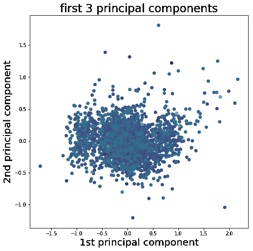
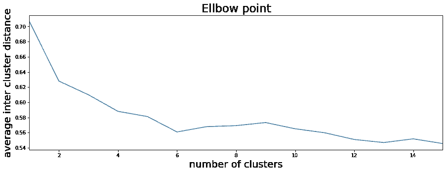
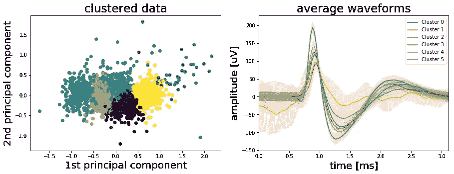
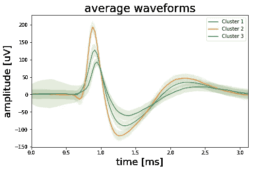

# 谁在说话？—使用 K-Means 聚类对 Python 中的神经事件进行排序

> 原文：<https://towardsdatascience.com/whos-talking-using-k-means-clustering-to-sort-neural-events-in-python-e7a8a76f316?source=collection_archive---------13----------------------->

## 尖峰分类

癫痫是一种大脑疾病，其中同步脑电活动过度导致癫痫发作，其范围可以从根本没有任何外部症状到抽搐运动(强直阵挛性癫痫发作)和意识丧失(失神癫痫发作)。对于一些癫痫患者来说，手术切除受影响的脑组织可能是一种有效的治疗方法。但是在进行手术之前，需要精确定位患病的脑组织。为了找到这个*癫痫发作病灶，*记录电极被插入患者大脑，通过它可以实时监测神经活动。在[之前的一篇文章](/using-signal-processing-to-extract-neural-events-in-python-964437dc7c0)中，我们研究了如何处理来自人类癫痫患者的这种电生理数据，以便提取棘波事件。


如上所述的这种尖峰事件反映了单个神经元的活动，因此可以对疾病的性质给出重要的见解。然而，如下图所示，单个电极通常一次从一个以上的神经元获得信号。虽然这可能不是定位癫痫发作焦点的问题，但与癫痫发作背后的机制相关的研究问题通常需要更详细地了解哪个神经元在什么时间活跃。那么，我们如何才能算出有多少神经元对我们的信号有贡献，以及每一个神经元何时活跃？

现在，在我们开始回答这些问题之前，我想提醒你，你可以在这里找到这篇文章的代码[](https://github.com/akcarsten/spike_sorting)**。当然，您也可以在 [**Twitter**](https://twitter.com/ak_carsten) 上关注我，或者通过 [**LinkedIn**](https://www.linkedin.com/in/carsten-klein/) 联系我。**

## **尖峰分类**

**找出上述哪种尖峰波形属于某个神经元是一项具有挑战性的任务，由于我们没有任何地面真实数据来比较我们的结果，这一任务变得更加复杂。因此，应用无监督聚类算法对尖峰数据进行排序似乎是一个不错的选择。尖峰分类实际上是一个复杂的话题，也是一个正在进行的研究领域，如果你想有一个更详细的概述，你可以看看这里的。在下文中，我们将使用 K-means 聚类对峰值进行分类，并概述峰值分类的一般过程。然而，应该注意的是，在实践中，K-means 不是用于分类尖峰的最佳算法。如上所述，有更复杂的算法可以产生更好的结果，但是为了说明提取和分类尖峰信号的一般过程，K-means 做得很好。**

## **特征选择**

**因此，我们需要做的第一件事是决定我们的尖峰波形的什么特征要输入到我们的算法中。此时，每个波形由 90 个样本定义，总持续时间约为 2.8 毫秒。然而，并不是所有的样本都具有相同的信息量。例如，大多数波形的第一个样本在 0 左右波动。而样本 25 至 30 代表波形的第一次正偏转，并且似乎分成两组，一组具有高峰值，一组具有低峰值。因此，我们应该选择一些能够很好地代表棘波波形的特征，并去除其他特征。做到这一点的一种方法可以是获取尖峰的最大和最小幅度或其宽度或定时参数。另一种常见的方法是应用主成分分析(PCA)并将主成分用作特征。scikit-learn 的 PCA 实现可以在本教程的 [Jupyter 笔记本](https://github.com/akcarsten/akcarsten.github.io/blob/master/spike_sorting/Spike_sorting%20.ipynb)中找到。在下图中，第一个主成分与第二个主成分相对应，而第三个主成分用点的颜色表示。**

****

**从图上看，我们的数据中似乎有三个不同且略有重叠的聚类。中间的一个大星团被左右两个小星团包围。所以我们实际上做的是降低数据的维度。之前，每个棘波波形由 90 个样本表示，而现在维数减少到只有三个特征，这允许我们将每个棘波分配到一个簇。为此，我们现在需要我们的 K 均值聚类算法。**

## **k 均值聚类**

**我们实现 K-means 的方式非常简单。首先，我们从样本中选择若干个 *K* 随机数据点。这些数据点代表聚类中心，它们的数量等于聚类的数量。接下来，我们将计算所有随机聚类中心和任意数据点之间的欧几里德距离。然后，我们将每个数据点分配到离它最近的聚类中心。显然，用随机数据点作为聚类中心做所有这些不会给我们一个好的聚类结果。所以，我们重新开始。但是这次我们不使用随机数据点作为聚类中心。相反，我们基于之前的随机分配计算实际的聚类中心，并再次开始这个过程…一次又一次…一次又一次。随着每次迭代，切换聚类的数据点将变得更少，我们将达到(希望)全局最优。下面你可以找到如上所述的 K-means 的 Python 实现。**

```
import numpy as npdef k_means(data, num_clus=3, steps=200): # Convert data to Numpy array
    cluster_data = np.array(data)

    # Initialize by randomly selecting points in the data
    center_init = np.random.randint(0, cluster_data.shape[0],
                  num_clus) # Create a list with center coordinates
    center_init = cluster_data[center_init, :] # Repeat clustering  x times
    for _ in range(steps): # Calculate distance of each data point to center
        distance = []
        for center in center_init:
            tmp_distance = np.sqrt(np.sum((cluster_data - 
                           center)**2, axis=1))
            tmp_distance = tmp_distance + 
            np.abs(np.random.randn(len(tmp_distance))*0.0001)
            distance.append(tmp_distance) # Assign each point to cluster based on minimum distance
        _, cluster = np.where(np.transpose(distance ==
                     np.min(distance, axis=0))) # Find center of each cluster
        center_init = []
        for i in range(num_clus):
            center_init.append(cluster_data[cluster == i, 
            :].mean(axis=0).tolist())

   return cluster
```

## **聚类数**

**很好，我们准备好了。我们从数据中提取了峰值，选择了特征，并编写了 K 均值函数。现在最后一个问题是:我们期望在数据中找到多少个集群？有几种方法可以解决这个问题。一种是利用我们的领域知识。根据经验，我们预计从单个电极记录中不会发现多于两个或三个可分离的簇。本文中的第一个情节似乎证实了这一观点。另一个更客观的方法是用肘法。为此，我们对我们的数据运行 K-means 函数几次，并且每次运行都增加聚类的数量。对于每次运行，我们计算每个数据点到其聚类中心的平均距离。如下图所示，随着聚类数量的增加，平均聚类间距减小。这并不令人惊讶，但我们也可以看到，当我们达到六个集群时，到集群中心的平均距离不再有太大变化。这被称为“拐点”,它为我们提供了使用多少集群的建议。**

```
# Define the maximum number of clusters to test
max_num_clusters = 15# Run K-means with increasing number of clusters (20 times each)
average_distance = []
for run in range(20):
    tmp_average_distance = []
    for num_clus in range(1, max_num_clusters +1):
        cluster, centers, distance = k_means(pca_result, num_clus)
        tmp_average_distance.append(np.mean([np.mean(distance[x]
        [cluster==x]) for x in range(num_clus)], axis=0))
    average_distance.append(tmp_average_distance)# Plot the result -> Elbow point
fig, ax = plt.subplots(1, 1, figsize=(15, 5))
ax.plot(range(1, max_num_clusters +1), np.mean(average_distance, axis=0))
ax.set_xlim([1, max_num_clusters])
ax.set_xlabel('number of clusters', fontsize=20)
ax.set_ylabel('average inter cluster distance', fontsize=20)
ax.set_title('Elbow point', fontsize=23)
plt.show()
```

****

## **对数据运行代码**

**好吧，六个集群似乎有点高，但让我们看看我们得到了什么。下面的左图再次显示了第一和第二主成分，但这次颜色代码表示 K-means 算法将每个数据点分配给的聚类。右图显示了每个簇的平均尖峰波形。**

****

**正如我们可以从上面的右图中看到的，我们的 K-means 算法在聚类波形方面做得很好。事实上，我们有三个以上的集群。标有绿色“簇 2”的平均波形是具有高振幅峰值的波形。棕色“簇 5”是具有低峰值振幅的尖峰的平均波形，而橙色“簇 1”具有大量噪声和高标准偏差(阴影区域)。似乎我们在这个集群中总结了很多工件，所以我们应该放弃它。最后，群集 0、3 和 4 看起来完全相同，因此我们可以将它们合并为一个群集。这样做将总共给出四个集群，其中一个包含大部分工件。所以我们有多于三个但少于六个的集群。下图显示了产生的三个集群。**

****

**在我们结束之前，我们应该再次思考这些结果实际上意味着什么。肘方法告诉我们在数据中寻找六个集群。然而，根据经验，我们知道这个数字有点过于乐观。因此，我们用六个初始聚类对数据进行聚类，查看每个聚类的平均波形，然后根据平均波形的相似性将三个聚类合并为一个。另一个集群我们放弃了，因为它主要包含噪音。最后，我们有三个集群，但这是否也意味着我们记录了三个独立神经元的信号？不一定。要回答这个问题，我们必须更详细地检查数据。例如:在一个神经元产生一个尖峰信号后，它在 1-2 毫秒内不能产生新的尖峰信号。这被称为不应期，它限制了神经元的最大尖峰频率，并确保信号只从神经元的细胞体沿着轴突传播到突触，而不是相反。因此，如果我们要计算其中一个簇的棘波之间的时间差，并且我们将得到小于 1 毫秒的时间差，则我们必须得出结论，该簇包含来自不止一个神经元的棘波。此外，大脑在颅骨内脉动，这意味着神经元和电极尖端之间的距离会随着时间的推移而改变，这将影响尖峰的波形。因此，同一个神经元仍然可以产生两种略有不同的波形。总之，我们概述了棘波分类过程和 K-means 在 Python 中的实现，但所有这些只是一个起点，而不是对有多少神经元实际上对信号有贡献的明确答案。**

**如果你想要这个项目的完整代码，你可以在这里 找到它 [**。当然，你也可以在**](https://github.com/akcarsten/spike_sorting) **[**Twitter**](https://twitter.com/ak_carsten) 上关注我，或者通过 [**LinkedIn**](https://www.linkedin.com/in/carsten-klein/) 联系我。****

**[](https://github.com/akcarsten/spike_sorting) [## akcarsten/spike _ 排序

### 在 GitHub 上创建一个帐户，为 akcarsten/spike_sorting 开发做贡献。

github.com](https://github.com/akcarsten/spike_sorting)**