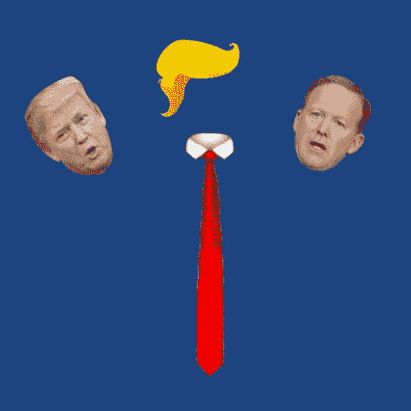
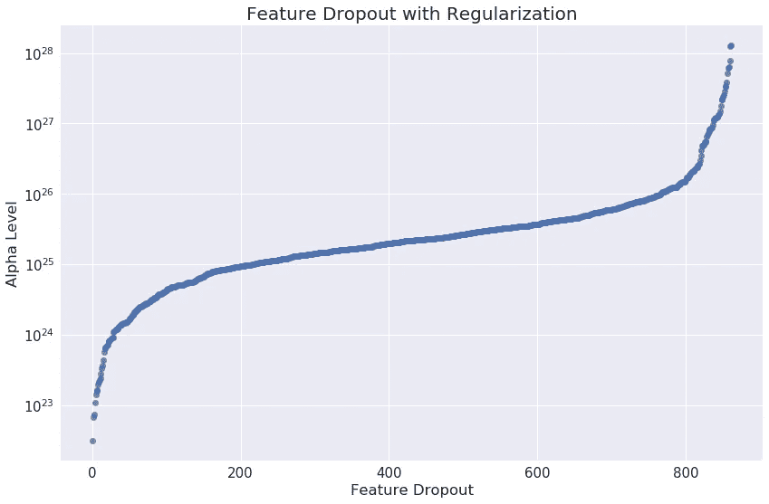
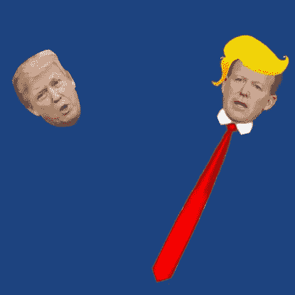

# 谁在椭圆形办公室发微博？

> 原文：<https://towardsdatascience.com/whos-tweeting-from-the-oval-office-96ea5b60c03?source=collection_archive---------1----------------------->



Did Trump type out that tweet? Or was it an aide in Trump clothing?

*更新:我已经写了一篇后续文章*[](https://medium.com/@raffg/whos-tweeting-from-the-oval-office-building-a-twitter-bot-9c602edf91dd)**来详述我如何通过构建一个 Twitter 机器人来部署我的模型。**

*我已经开发了一个推特机器人[@ who sintheval](https://twitter.com/whosintheoval)，它转发唐纳德·特朗普的每一条推文，并预测这条推文是由特朗普本人还是他的一名助手写的。请务必在 Twitter 上关注这个机器人，并继续阅读以了解我是如何构建这个模型的！*

*我是 Greg Rafferty，湾区的数据科学家。你可以在我的 [github](https://github.com/raffg/trump-tweet-author-identification) 上查看这个项目的代码。如有任何问题或反馈，请随时联系我！*

## *动机*

*2017 年 12 月 1 日，迈克尔·弗林承认向联邦调查局撒谎。第二天，特朗普的个人推特账户发推文称:*

*这颇具争议，因为在那年的 2 月 14 日，也就是弗林辞职的第二天，川普要求时任联邦调查局局长的詹姆斯·科米放弃对弗林的任何调查。如果特朗普在向科米提出要求时知道弗林确实向联邦调查局撒谎，那么特朗普的推文可以被视为特朗普企图妨碍司法公正的证据。在几名法律专家论证了这一点后，特朗普为自己辩护说，他的律师约翰·多德写下并发布了这条推文。但他真的这么做了吗？*

*本文分为四个部分:*

*   *背景*
*   *特征选择*
*   *模型*
*   *结果*

*中间的两个部分(尤其是模型部分)有点技术性；因此，如果你对此不感兴趣，而你只是想直接跳到结果，看看到底是谁发布了弗林的推文，请随意！*

## *背景*

*法医文本分析是机器学习的一个早期领域，已经被用于各种案件，从[识别尤那邦摩恐怖分子](https://www.npr.org/2017/08/22/545122205/fbi-profiler-says-linguistic-work-was-pivotal-in-capture-of-unabomber)到[发现 J.K .罗琳是作者罗伯特·加尔布雷斯的真实身份](https://www.scientificamerican.com/article/how-a-computer-program-helped-show-jk-rowling-write-a-cuckoos-calling/)到[确定每篇联邦党人论文的具体作者](http://pages.cs.wisc.edu/~gfung/federalist.pdf)。这个项目旨在使用机器学习和这些相同的技术来识别在 [@realDonaldTrump](https://twitter.com/realdonaldtrump) 上的推文，这些推文是由特朗普本人或他的工作人员在使用他的账户时写的。然而，这项任务是独特的，特别具有挑战性，因为推文很短——在这么短的文本中没有太多信号。最终，我还是成功了，准确率接近 99%。继续关注我的 Twitter 机器人[@ who sintheval](https://twitter.com/whosintheoval)吧，每当特朗普发推文时，它都会实时发布预测。*

## *数据*

*在 2017 年 3 月 26 日之前，特朗普使用三星 Galaxy 设备发推文，而他的员工使用 iPhone 发推文。从每条推文的元数据中提供的这些信息，我们知道是特朗普本人还是他的工作人员发推文(见这些[链接](http://varianceexplained.org/r/trump-tweets/)了解[一些](https://www.wired.com/story/tell-when-someone-else-tweets-from-realdonaldtrump/) [文章](https://www.economist.com/blogs/graphicdetail/2018/01/daily-chart-9) [讨论](https://www.theatlantic.com/politics/archive/2016/08/donald-trump-twitter-iphone-android/495239/)这个[假设](http://didtrumptweetit.com/timestamp-analysis-trump-android-phone/))。然而，在 3 月之后，特朗普也改用 iPhone，所以对推特的识别不能仅来自元数据，而必须从推特的内容中推断出来。*

*我使用布伦丹·布朗的[特朗普推文数据档案](https://github.com/bpb27/trump_tweet_data_archive)收集了特朗普账户从 2009 年年中开始到 2017 年底的所有推文。这一组包括近 33，000 条推文。尽管我知道一条推文来自谁的设备，但作者身份仍有一些模糊之处，因为众所周知，特朗普会向助手口述推文，所以一条推文可能具有特朗普的特征，但却是从非特朗普设备发布的，而且(特别是在竞选期间)还会与助手合作写推文，因此真正的作者身份不清楚。*

*从 2009 年 5 月 4 日特朗普的推特账户开始，直到 2017 年初他停止使用安卓设备，我知道(或至少很好地猜测)作者的推文超过 3 万条(关键是，弗林的推文不在这个日期范围内，所以我让我的模型对真正的推文者进行了最佳猜测——在本文后面的结果部分有更多信息)。这 30，000 条推文在安卓/非安卓之间平均分配(47% / 53%)，所以阶级不平衡不是问题。这是我的训练数据。使用几种不同的技术，我从这些数据中创建了近 900 个不同的特征，我的模型可以用它们来预测作者。*

# *选择功能*

**

*So many important decisions!*

*我着眼于六大类特征来构建我的模型:*

*   *特朗普怪癖*
*   *风格*
*   *感情*
*   *情绪*
*   *词汇选择*
*   *语法结构*

## *特朗普怪癖*

*数据科学有时可能更像艺术而不是科学。为了开始我的模型，我首先想到我作为一个人如何识别一条推文是特朗普的。然后，我尽最大努力将这些“感觉”转化为基于规则的代码。例如，一些显而易见的怪癖可以识别特朗普本人是否在键盘后面，这些怪癖是在他的推文中滥用所有大写字母，随机大写特定的单词，或者是无偿的！感叹号的使用！！！！！*

*事实上，我的模型中最有影响力的特征之一就是我后来提到的引用转发。特朗普似乎不知道如何在推特上转发某人。在全部 33，000 条推文中，只有*一条*来自安卓设备的转发。相反，特朗普复制了别人的推文，@提到了用户并用引号将推文括起来，然后自己发布:*

*这些经常是，但不总是，像这样自我庆祝的推文，这就是为什么，正如你将在我的下一篇讨论结果的帖子中看到的，唐纳德·川普倾向于“经常提到自己*。**

## **风格**

**风格特征是那些不特定于特朗普个人风格的特征，而是可以用来识别任何推特用户。这些类型的特征包括推文、句子和单词的平均长度。我还查看了各种标点符号的使用次数(特朗普几乎从不使用分号；他的助手做得更频繁)。一条推文中的@提及次数、#标签数和 URL 数都被证明是强预测特征。最后，这条推文发布的日期和时间很能说明问题。**

## **感情**

**我用 C.J .休顿的 [VADER](https://github.com/cjhutto/vaderSentiment) 软件包来提取每条推文的情感。VADER，它代表着**V**alence**A**ware**D**ictionary 和 s**E**entiment**R**easioning(因为，我想，VADSR 听起来很傻？)，是一个专门针对社交媒体的词典和基于规则的工具。给定一个文本字符串，它输出一个介于 0 和 1 之间的十进制数来表示文本的消极、积极和中性，以及一个介于-1 和 1 之间的复合分数，它是一个聚合度量。**

**关于 VADER 软件包的开发、验证和评估的完整描述可以在[本文](http://comp.social.gatech.edu/papers/icwsm14.vader.hutto.pdf)中找到，但要点是该软件包的作者首先构建了一个与情感相关的词汇特征(或简单英语中的“单词和短语”)列表，然后将该列表与一些描述短语的语法结构如何增强或减弱情感的规则相结合。当与人类评分员进行测试时，VADER 的准确率高达 96%到 84%。**

## **情绪**

**加拿大国家研究委员会创造了一个超过 14000 个单词的词汇库，每个单词被分为与两种情绪(消极、积极)或八种情绪(愤怒、期待、厌恶、恐惧、快乐、悲伤、惊讶、信任)中的任何一种相关或不相关。他们友好地向我提供了词典，我写了一个 Python 脚本，循环遍历 tweet 中的每个单词，在词典中查找，并输出与该单词相关的任何情绪。然后，每条推文都被分配了一个分数，对应于与该情绪相关的词的数量。**

## **词汇选择**

**为了分析单词选择，我使用了一种叫做[TF–IDF](https://en.wikipedia.org/wiki/Tf%E2%80%93idf)的技术，它代表词频——逆文档频率。它基本上是衡量一个单词对文档的描述性和独特性的一种方法。假设您想将一些新闻文章组合在一起，这样您就可以向读者推荐相似的文章。你把你的电脑设置成阅读每篇文章，其中一篇文章出现了 10 次“棒球”这个词。那一定是文章中非常重要的一个词！这就是术语频率部分。**

**但现在，同一篇文章也有 8 次“说过”这个词。这似乎也是一个非常重要的词。但是我们人类却不这么认为；我们知道，如果几篇文章提到“棒球”，它们可能是关于同一个主题，但如果几篇文章提到“说”，这并不能告诉我们多少文章的相似性。因此，我们接着查看集合中的*所有*文章，并计算其中有多少文章包含单词“baseball”和“said”比方说，在 1000 篇文章中，只有 30 篇有“棒球”这个词，但 870 篇有“说”这个词。因此，我们取该计数的倒数，即 1/30 和 1/870，然后乘以频率项，即 10 和 8。这是逆文档频率部分。因此，单词“baseball”的得分为 10/30 = 0.333，单词“said”的得分为 8/870 = 0.009。我们对每个文档中的每个单词都这样做，简而言之，看看哪些文章具有相同的高价值单词。这是 TF–IDF。**

**为了减少我的模型的计算需求，我只查看了单字，而不是二元和三元模型(TF-IDF 处理这些小短语的方式与处理单字完全相同)。每一个 n-gram 都需要成倍增加的处理时间，我认为“弯曲的希拉里”或“说谎的特德·克鲁兹”仍然会被“弯曲的”和“说谎的”这两个词单独提取出来。我还忽略了超过 99%的推文中出现的单词(称为语料库专用停用词)，以及不到 1%的推文中出现的单词。我在整个项目中大量使用 Python 的 scikit-learn 包，其中包括他们的[TF–IDF 实现](http://scikit-learn.org/stable/modules/generated/sklearn.feature_extraction.text.TfidfVectorizer.html)。**

## **语法结构**

**对当前事件使用自然语言处理的主要挑战之一是事件会随着时间而变化。虽然“不诚实的希拉里”和“撒谎的特德·克鲁兹”这两个词在川普的总统竞选中出现了很多次，但在最近的推特上却几乎没有出现过。我想捕捉特朗普推文的更基本形式，所以我使用[自然语言工具包](http://www.nltk.org/)将每条推文转换成词性表示。**

**这实质上是将每个词转换成它的词性，保持对该词在句子中的作用的意识，以便将句子“*”中的名词“侮辱”与句子“*中用作动词的同一个词区分开来。当 Trump 提到他的政治对手*时，“Crooked Hillary”用作侮辱，而“你通过将政治过程简化为幼稚的骂人来侮辱政治过程”。***

*这将短语“*我不得不解雇弗林将军，因为他对副总统和联邦调查局*撒谎”更改为其更基本的词类形式为“*PRP VBD TO VB NNP NNP IN PRP VBD TO DT NNP NNP CC DT NNP*”，使用 [Penn 词类标签](https://cs.nyu.edu/grishman/jet/guide/PennPOS.html) (PRP =人称代词，VBD =动词，过去式，TO = to，VB =动词，基本形式，NNP =单数专有名词等)。使用与之前相同的 TF-IDF 流程，但这一次忽略了 unigrams，而是专注于 bigrams 和 trigrams，我可以提取出特朗普或他的助手在推特上发布的更通用的方法。*

*最后，我使用了[斯坦福命名实体识别(NER)标签](https://nlp.stanford.edu/software/CRF-NER.shtml)将所有的名字替换为“人”，将所有的地点替换为“地点”，将所有的组织替换为“组织”这是又一次试图将推文从可能随时间变化的细节中概括出来。在处理这些推文的过程中，这个 NER 过程是**到目前为止**计算量最大的过程，如果我再次做这个项目，我会认真考虑一个不依赖于高级统计学习算法的不太先进的 NER 标记器，并且会大大加快处理时间**。你已经被警告了！***

# ***模特们表现如何？***

******

***They did well, very well***

***首先，按照这个领域的标准，我将我的数据分成 80%的训练集和 20%的测试集。我将测试集放在一边，直到我对我的所有模型尽可能准确感到满意，然后发送测试集通过它们来获得我将在这里报告的性能度量。***

## ***特征重要性***

***我做的一个更重要的任务是将我的特征按照它们对模型结果的影响排序。为此，我使用了 scikit learn 的[脊分类器](http://scikit-learn.org/stable/modules/generated/sklearn.linear_model.RidgeClassifier.html#sklearn.linear_model.RidgeClassifier)。岭回归是逻辑回归的一种形式，它包括一个正则化因子α。在α= 0 时，岭回归与非正则化逻辑回归相同；在低 alpha 级别，影响最小的特征的系数被强制为零，有效地将它们从模型中移除；在更高的 alpha 级别，会移除更多的功能。我递归地迭代每个 alpha 级别，一个接一个地删除特性，直到一个都没有。***

******

***正如你在上面的图中所看到的，当 alpha 值刚刚超过 10 时，第一个(影响最小的)特征就消失了。在 10 ⁵的范围内，特征丢失迅速增加，仅留下最有影响的特征留在高于 10 ⁶.的 alpha 级别***

## ***单个模型***

***我一共建立了 9 个模型:[高斯朴素贝叶斯](http://scikit-learn.org/stable/modules/generated/sklearn.naive_bayes.GaussianNB.html)，[多项式朴素贝叶斯](http://scikit-learn.org/stable/modules/generated/sklearn.naive_bayes.MultinomialNB.html)，[K 最近邻](http://scikit-learn.org/stable/modules/generated/sklearn.neighbors.KNeighborsClassifier.html)，[逻辑回归](http://scikit-learn.org/stable/modules/generated/sklearn.linear_model.LogisticRegression.html)，[支持向量分类器](http://scikit-learn.org/stable/modules/generated/sklearn.svm.SVC.html)，[支持向量机](http://scikit-learn.org/stable/modules/generated/sklearn.linear_model.SGDClassifier.html)以及 [AdaBoost](http://scikit-learn.org/stable/modules/generated/sklearn.ensemble.AdaBoostClassifier.html) ，[梯度提升](http://scikit-learn.org/stable/modules/generated/sklearn.ensemble.GradientBoostingClassifier.html)，[随机森林](http://scikit-learn.org/stable/modules/generated/sklearn.ensemble.RandomForestClassifier.html)的集成方法。每个模型都经过仔细的[调整](http://scikit-learn.org/stable/modules/generated/sklearn.model_selection.GridSearchCV.html)，仅在训练数据上使用 10 重[交叉验证](http://scikit-learn.org/stable/modules/generated/sklearn.model_selection.KFold.html)，并在测试数据上进行评估。***

***[交叉验证](https://en.wikipedia.org/wiki/Cross-validation_(statistics))是一种有效的技术，用于训练这些模型，而不会使它们过于偏向正在被训练的特定数据；换句话说，允许他们更好地归纳未知数据。在 10 重交叉验证中，数据被分成 10 个大小相等的组，即组 1-10。在第一次训练迭代中，模型在组 1–9 上训练，在组 10 上测试。重复这个过程，但这次是在第 1-8 组和第 10 组进行训练，在第 9 组进行测试。这个训练步骤总共重复 10 次，因此每个组从训练集中保留一次，并用作不可见的测试集。最后，在所有 10 次折叠中具有最佳平均性能的模型参数组合是在最终模型中使用的一组参数。***

***这些模型背后的算法都非常迷人；它们各有优缺点，在[偏差—方差权衡](https://en.wikipedia.org/wiki/Bias%E2%80%93variance_tradeoff)上有不同的平衡，有时处理时间也大不相同(例如，训练朴素贝叶斯只需要几分之一秒，而支持向量分类器和梯度推进方法都需要一整个周末来执行网格搜索)。如果你有兴趣了解更多，我会从这些模型的维基百科条目开始:***

*   ***[朴素贝叶斯分类器](https://en.wikipedia.org/wiki/Naive_Bayes_classifier)***
*   ***[*k*-最近邻算法](https://en.wikipedia.org/wiki/K-nearest_neighbors_algorithm)***
*   ***[逻辑回归](https://en.wikipedia.org/wiki/Logistic_regression)***
*   ***[支持向量机](https://en.wikipedia.org/wiki/Support_vector_machine)***
*   ***[AdaBoost](https://en.wikipedia.org/wiki/AdaBoost)***
*   ***[梯度增强](https://en.wikipedia.org/wiki/Gradient_boosting)***
*   ***[随机森林](https://en.wikipedia.org/wiki/Random_forest)***

***此外，使用上面生成的那些特征重要性，我在总共近 900 个特征的子集上训练每个模型。例如，朴素贝叶斯仅使用前 5 个特征表现最佳，而两个增强模型在处理前 300 个特征时都最开心。这部分是由于[维数灾难](https://en.wikipedia.org/wiki/Curse_of_dimensionality)；事实上，在高维空间中，两个看起来很近的点(当在我们的三维头脑中想象时)，实际上可能相距非常非常远。特别是，*k*-最近邻模型(knn)对太多的维度高度敏感，所以我也将[主成分分析](https://en.wikipedia.org/wiki/Principal_component_analysis) (PCA)应用于馈入该模型的数据。***

***PCA 是一种既能降低维数又能消除特征间共线性的技术。如果你能想象高维空间中的一组向量，PCA 将扭曲和按摩这些向量，使它们中的每一个都垂直于所有其他向量。如果这些矢量表示要素，那么通过强制它们全部正交，我们还可以确保它们之间不存在共线性。这将极大地改善 knn 等模型的预测，并允许我们在不减少信息量的情况下减少发送到模型的特征数量。简而言之，这使我能够从我的 knn 模型中获得更好的性能。***

## ***合奏***

***最后，我为每个模型创建了两个不同的集合。第一个是简单的多数投票:由于模型数量为奇数，输出为二进制，有分歧的模型之间永远不会出现平局，所以我简单地将特朗普的所有预测和助手的所有预测相加，并为我的最终预测提供更大的预测。我的第二个组合更复杂一些:我把前九个模型的结果输入到一个新的[决策树](http://scikit-learn.org/stable/modules/generated/sklearn.tree.DecisionTreeClassifier.html)中。这个最终模型在我的测试集上具有近乎完美的准确性。***

***现在，终于有了结果..***

# ***结果***

***可以看到，梯度提升模型和随机森林的表现最好，错误率只有 1/20。***

***其他模特的个人表现不太好，但对最终的组合贡献很大。我根据第一组 9 个模型的结果构建的决策树的准确率超过了 99%！***

***如果你不清楚所有这些措施是什么，这里有一个简单的解释。准确性是这些衡量标准中最直观的，它就是正确的猜测数除以总猜测数，也就是说，在我所有的猜测中，有多少是正确的？ [Precision](https://en.wikipedia.org/wiki/Precision_and_recall) 回答问题，在所有我猜测是特朗普的推文中，有多少是真的特朗普？[回忆](https://en.wikipedia.org/wiki/Precision_and_recall)几乎是精确的反义词；它回答了这个问题，在特朗普写的所有推文中，我答对了多少？F1 分数是精确度和召回率的混合，从技术上来说是两者的调和平均值。它远不如准确性直观，但当班级不平衡很大时，f1 分数是比准确性更好的衡量标准。然而，在这个 tweet 数据的例子中，我的类被很好地平衡了，这就是为什么在上面的图表中所有的度量或多或少是相等的。如果这让你感到困惑，或者你只是想了解更多，这里有一篇关于这些措施的极好的博客文章。***

***那么，特朗普的推文有什么特点呢？***

*   ***引用转发***
*   ***@提及次数***
*   ***晚上 10 点到早上 10 点之间***
*   ***惊讶、愤怒、消极、厌恶、喜悦、悲伤、恐惧***
*   ***感叹号***
*   ***完全大写的单词***
*   ***@realDonaldTrump***

***正如我所料，我在这篇文章的功能选择部分描述的引用转发高度预测了特朗普的推文。其他用户的“提及”也是如此。特朗普经常在晚上和凌晨以及周末发推特。他表现出惊讶、愤怒、消极、厌恶……事实上所有的情绪，而不仅仅是媒体强调的消极情绪。他确实使用了超出语法需要的惊叹号和全大写单词。最后，他经常提到自己。***

***另一方面，他的助手发布的推文的特点是:***

*   ***真实转发***
*   ***“via”这个词***
*   ***上午 10 点到下午 4 点之间***
*   ***分号***
*   ***周期***
*   ***资源定位符***
*   ***@巴拉克·奥巴马***

***如果一条推文是正确的转发，你可以确信它是由助手发布的。有趣的是,“via”这个词在助手的推文中出现了很多次——他们经常会引用一篇文章或一张图片，并将其与这个词联系起来。可以预见的是，他们在工作日发微博，而不是经常在工作之外。他们的语法更复杂，有更好的句子结构和标点符号，他们非常频繁地发布其他来源的 URL。有趣的是，如果巴拉克·奥巴马的推特用户名在一条推文中被提及，那通常是一个助手。特朗普会提到他的名字，但不会用“提”的方式。***

***至于词性标签，川普最常用的组合是 NN PRP VBP，或者是名词、人称代词和动词。这些推文经常采用@ reference 后跟“我感谢…”或“我有…”的形式。助手经常写 NNP NNP NNP，连续三个专有名词，这通常是一个组织的名称。他们还在文本后使用#标签，而特朗普在@提及后使用#标签。***

***我有点失望，词性标签对模型来说并不重要。我知道 tweet 中的特定词汇会随着时间的推移而变化，所以我想捕捉更多的语法结构，我认为这些结构会更加稳定。然而，这个项目的主要挑战是推文的简短性质，这确实大大减少了我的模型可以拾取的语法信号的数量。这对我的模型意味着，尽管它对历史推文有近乎完美的准确率，但对当前推文的准确率有所下降。***

***此外，对历史推文具有高度预测性的三个特征是推文长度、收藏次数和转发次数。然而，我不得不放弃所有这三个功能，并重新训练我的模型，以便部署在实时推特上。对于后两个功能，收藏计数和转发计数，原因有点显而易见:我试图在推文发布后立即预测作者，因此它还没有被收藏或转发。然而，Tweet length 因为不同的原因被删除了。在我的训练数据的所有 33，000 条推文中，Twitter 将字符数限制在 140 个。但是直到最近 Twitter 才把这个数字增加到 280。这意味着所有关于这一特性的培训都必须放弃。***

# ***一个小游戏***

***考虑到这些特征，我们来玩一个小游戏。我会发一条推文，请你猜作者是谁。***

******

***Is it Trump or one of his aides?***

***不要向下滚动太远，因为答案就在下面！这是第一个。这是谁写的，特朗普还是助手？***

***这有点简单。你看到了什么？有一个词“via”，高度表示一个助手推文。它包括一个链接，又一个助手的迹象。它是在中午发布的(我从加州刮来的这条推文，所以时间戳比华盛顿 DC 晚 3 个小时)，非常正式，不带感情色彩:所有迹象都表明是一名助手。***

******

***是的，你说对了，那是一个助手发布的！好吧，这里还有一个:***

***那是特朗普还是助手？还是那句话，我们一起过一遍。这条推文比另一条包含更多的情感，这通常是特朗普的标志。这就是那个惊叹号:又一个特朗普式的风格。记得在时间戳上加 3 小时；时间是下午 7:30，一天工作结束后。考虑到这一点，我们可以自信地猜测这是由…***

******

***特朗普！是的，又答对了！***

# ***弗林的推特***

***这是一条重要的微博，这条微博开启了整个项目:***

***现在，这条推文是在 2017 年 3 月 26 日之后发布的，如果你记得早些时候是在这个日期之后，没有标签来识别真正的推文者。我们要做的就是我的模型。事实上，这是一条难以猜测的推文。它包含了“撒谎”、“有罪”、“羞耻”和“隐藏”这些词这些都是非常情绪化的话——可能表明特朗普是作者。但也有点正式。语法写得很好，并且包含一些比平均长度更长的单词:那些是助手的标志。这条微博是在中午发布的，也暗示了一名助手。但很个人化，建议川普。那么模特们说了什么？以下是原始输出:***

```
***rf [ 0.23884372  0.76115628]
ab [ 0.49269671  0.50730329]
gb [ 0.1271846  0.8728154]
knn [ 0.71428571  0.28571429]
nb [ 0.11928973  0.88071027]
gnb [ 0.9265792  0.0734208]
lr [ 0.35540594  0.64459406]
rf [1]
ab [1]
gb [1]
knn [0]
nb [1]
gnb [0]
svc [1]
svm [0]
lr [1]([1], [ 0.15384615,  0.84615385])***
```

***顶部的“rf”是随机森林。它以 76%的概率预测了 1 或特朗普(前七行显示了首先是助手，然后是特朗普的概率；接下来的九行显示预测:0 表示助手，1 表示川普)。“ab”是 AdaBoost，它也预测到了川普，但只有 51%到 49%的概率——一点都不太自信。梯度推进模型更有信心，87%的可能性是特朗普。然而，KNN 不同意:71%的可能性是由助手写的。多项式朴素贝叶斯预测了特朗普，但高斯朴素贝叶斯预测了助手。两个支持向量机模型也存在分歧:SVC 预测了川普，SVM 预测了助手(由于这些模型的创建方式，它们无法输出概率估计，这就是为什么它们没有出现在结果的上半部分)。逻辑回归有点骑墙，特朗普的概率为 64%，助手的概率为 36%。特朗普有 6 个模特，助手有 3 个。***

***事实上，在花了几周时间阅读和分析了数千条特朗普的推文后，我认为这条推文是合作撰写的推文的最佳例子之一。从话题和情感上来说，这是 100%特朗普式的。但是从文体和语法上来说，它似乎来自一名助手。在我看来，特朗普很可能与多德一起起草了这条推文。特朗普告诉多德他想说什么以及他想怎么说，多德撰写了这条推特。这是我最好的猜测。***

***这只能说明这些模型并不完美，有很多不同意见；此外，一条推文包含的用于机器学习训练的信息非常少。我的最后一个组合，决策树，在我的测试集上准确率超过 99%，确实提供了对 Trump 的最终预测，概率为 85%(这是上面输出的最后一行)。所以这就是我们要选的:川普。不是他的律师约翰·多德。所以他们声称多德写了这条推文，而不是特朗普，我们只能假设这是:***

******