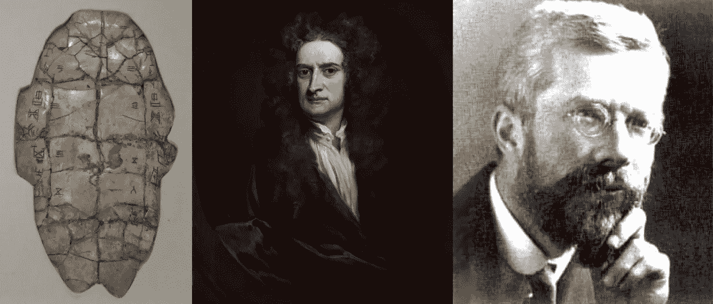
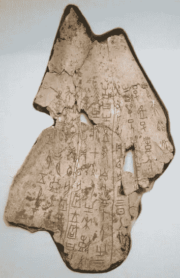
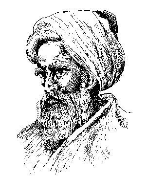
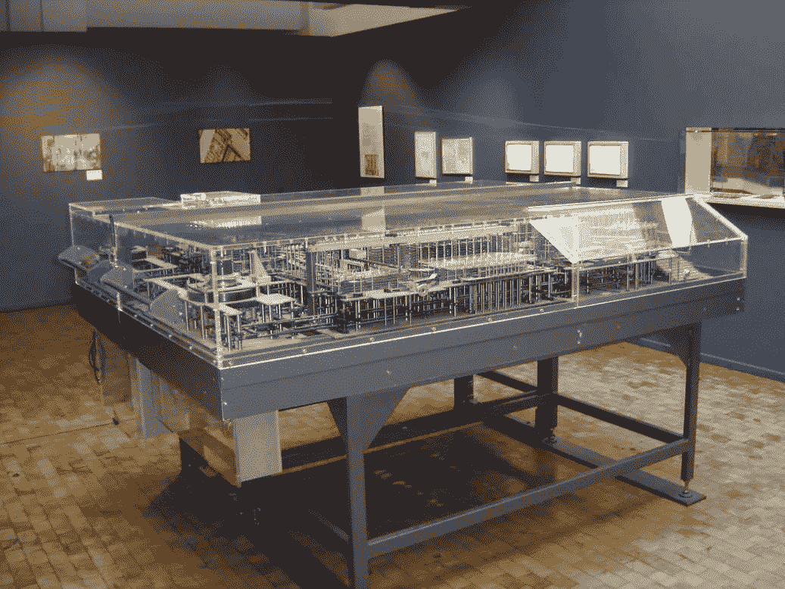

# 为什么人工智能正在增强人类解决问题的能力

> 原文：<https://towardsdatascience.com/why-ai-is-supercharging-mankinds-ability-to-solve-problems-3d778c941ee6?source=collection_archive---------3----------------------->

[Chinese Oracle Bones](https://de.wikipedia.org/wiki/Orakelknochen#/media/File:Shang_dynasty_inscribed_tortoise_plastron.jpg) (CC-BY-SA 3.0), Isaac Newton, (Public Domain) and R.A. Fisher (Public Domain)

在这篇文章中，我想带你进行一次人类发展的时间旅行。让我们扪心自问:*人类是如何学会解决问题的？我们如何保存这些知识并与他人分享？*我们将把答案放在历史背景中。我们还会发现为什么人工智能在解决问题方面是一个非凡的新概念。

## **开端**

生活在石器时代的尼克是怎么知道应该避开熊的？他的基因里有解决这个问题的方法。我们的本能是基因编码的行为模式。它们指导我们在危及生命和繁殖的情况下做出正确的决定。

这种解决问题的方式是自然界帮助生物解决问题的一般方式。许多物种的 DNA 中都有这种基因。人们甚至可以在植物中观察到这种行为。植物利用挥发性有机化合物来保护自己。它们要么毒死敌人，要么向其他掠食者求救。

不死是好的第一步:但是尼克怎么知道吃什么？这个问题的解决方法是不断尝试。他可以尝试不同的浆果，并希望从他的反应中了解这是否是一个好的选择。尼克可以把这些知识教给他的朋友和家人。发现的知识可以转移给其他人。

这也不是人类独有的。其他高级物种也能够将行为从一代传给下一代。我们开始不同于这个星球上任何其他生命形式的地方是**的社会方面**。人类学会了在复杂的社会组织中生活，并向其他个体传授知识。

# 口头教学

随着文明的开始，人类群居在一起。在某个时候，这些变成了村庄和城市。在文明中，有可能有专门保存知识的人——学者和牧师。

尼克生活在这样一个早期文明中，能够比他的石器时代同伴学到更多的东西。尼克需要保存多少种子才能在明年有足够的小麦？他怎么知道什么时候播种？这些问题都是用他所在社会的**集体知识**来回答的，这些知识都保存在口头传统中。

口头传统是长期保存信息的第一种方式。这种方法的缺点是容易出错。很难在几十年甚至几个世纪的时间里不改变信息。

# 书面教导

[Ox scapula recording](https://en.wikipedia.org/wiki/Oracle_bone#/media/File:Shang_dynasty_inscribed_scapula.jpg) divinations by Zhēng 爭 in the reign of King Wu Ding. One of the first scriptures. (CC-BY-SA 3.0)

随着美索不达米亚、中国、印度和埃及早期高级文化的兴起，我们看到了第一部经文的兴起。从某种程度上来说，经文是保存知识的一个很好的方式，也是一个更防错的方式。

现在生活在古埃及的尼克是能够阅读的幸运儿之一。有了这种能力，尼克能够向他从来不认识的人学习。他能够与他的文明中最优秀的学者交流和学习，而不用直接与他们交谈。

通过这种方式，人类能够将如何解决问题的信息从一个人传递给另一个人。也有可能将信息添加到人类共享的知识中。

## 自 1450 年以来——印刷书籍

15 世纪 50 年代，约翰内斯·古腾堡发明了第一台机械活字印刷术。这项发明使得人类可以大量复制书籍。在这项发明之前，书籍需要手工抄写。在活字印刷的帮助下，人类有机会保存和分享比以往更多的书籍。

值得注意的是，书面和口头的教导大多被用来保存解决问题的方法。他们没有自己解决问题。

# 科学和数学的兴起

[Alhazen](https://en.wikipedia.org/wiki/Ibn_al-Haytham) (965–1040), one of the first scientist who ever lived. (Public Domain)

在文艺复兴重新发明科学之前，知识是用自然语言保存的。像数学、物理和化学这样的学科引入了一种新的语言来描述世界的基础。通过使用数学，我们能够描述和理解物理定律。

这导致了一种有趣的解决问题的新方法。以前，一个人需要知道如何解决问题。随着科学的兴起，人类能够从自然法则中找到一个好的解决方案。这是一种全新的解决问题的方式。男人知道**学到了事物如何运作的原理**，然后从中总结出其他知识。

我们的老朋友尼克刚刚在拿破仑的炮兵部队里升职了。他负责瞄准目标。他能够预测正确的角度等。通过了解牛顿定律。

科学的发明从根本上改变了人类学习的方式，以及他们需要保存什么样的知识来解决任何问题。

# 算法和计算机的兴起

[Replica of Conrad Zuse's Z1.](https://en.wikipedia.org/wiki/Z1_(computer)#/media/File:Zuse_Z1-2.jpg) The Z1 is the first programmable computer and was built in 1936–1938\. (CC-BY-SA 3.0)

算法的发明展示了人类解决问题的新途径。算法是一种方法，不是写下特定问题的解决方案，而是写下如何解决它。

1920 年，尼克在一家街角商店的收银台工作。他应该总是分发尽可能少的硬币。他学会了一个很好的算法来做这件事。他总是把尽可能多的硬币加到剩余的总数中。这种贪婪的算法总是让出最少数量的硬币来找零。

人类更进了一步，开发了能够使用这些算法的机器。在我们的例子中，这些是自动寄存器，它们自己返回变化。

这彻底改变了人类解决问题的方式。Nick 不再需要知道算法来找到他的变化问题的最佳解决方案。他也不需要从基本定律中推导出这些知识。他只是要求一台机器来解决他的问题。它使人们不仅能分享解决方案，还能与每个人分享解决问题的能力。使用这种方法的人不一定需要有自己解决问题的能力。他只需要知道如何提问。

使用算法的一个更复杂的例子是热力学定律与有限元法的结合。这使得人类可以对机器部件进行复杂的热力学模拟。你不需要自己去解方程，而是得到问题的解。

# 人工智能和模式识别

R.A. Fisher the father of modern statistics. (Public Domain)

我们终于到达了人类发展出某种可以称之为人工智能的阶段。老实说，我不确定现代深度学习算法是否应该被称为 AI。我个人更愿意坚持使用术语*模式识别*。它精确地告诉我们这些算法做什么——它们自动检测数据中的模式。现代深度学习系统只能获得观察结果。他们能够**自己从数据中提取知识**。模式识别的本质比以前的任何算法都更具普遍性。

尼克操作收银机时，我们的机器在观察他。从这些观察中，该算法能够提取一种模式。他们知道他们需要付出多少改变，以及付出的最佳方式。

这多少有些**进化了人类的知识发现能力**。之前的所有阶段都需要人来解决问题。我们刚刚发现了保存和分享这些知识的非常好的方法。

我们现在进入了一个不需要自己去发现知识的世界。机器正在为我们做这些。我们需要制定问题，然后机器检测模式。

所以有人可能会问，如果 R.A .费希尔是有史以来最重要的科学家。