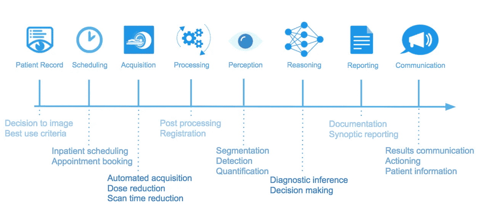

# 为什么人工智能不会取代放射科医生

> 原文：<https://towardsdatascience.com/why-ai-will-not-replace-radiologists-c7736f2c7d80?source=collection_archive---------1----------------------->

2016 年末，神经网络教父杰弗里·辛顿教授表示，“很明显，我们应该停止培训放射科医生”，因为图像感知算法很快就会明显优于人类。他说，放射学家是“已经越过悬崖边缘但还没有往下看的郊狼”。

这引发了一场圣经比例的炒作浪潮，这一浪潮至今仍在持续，而且还没有打破的迹象。在我看来，尽管这股热情和乐观的浪潮成功地将放射学人工智能带到了人们想象的最前沿，并带来了大量的资金，但它也通过过度膨胀政策和决策者的期望造成了无尽的伤害，并对招聘产生了切实的连锁反应，因为失望的初级医生开始相信机器确实在取代人类，所以他们不应该申请成为放射科医生。很难想象还有比这更具破坏性的言论出现在放射科员工危机(尤其是在英国)威胁到整个医院系统稳定的时候。

你看，没有放射科医生，医院根本无法运作。据我保守估计，进入医院的 95%以上的患者都会有某种形式的医学成像，随着患者数量的增长，对成像服务的需求也在增长。不仅如此，随着成像被认为是大多数诊断、大多数治疗途径和大多数结果测量的关键，我们已经看到对医学成像和放射学家的需求几乎呈指数级增长。这与耸人听闻的标题“机器击败放射科医生”形成了鲜明的对比，这只会进一步误导公众对人工智能目前真实状态的认识，误导他们认为放射科医生的日子屈指可数。

无论你对人工智能和自动化的可能性多么着迷或深信不疑，期望它在不久的将来完全取代人类放射科医生都是不现实的。我的估计是 10 年后我们才能在 NHS 的常规实践中看到人工智能——我的观点现在是关于 T2 议会记录的问题！我知道这可能会引起争议，因为目前有太多的希望和炒作，甚至可能会让像我这样基本上将自己的职业生涯奉献给放射学人工智能的人感到惊讶，但我相信，就该职业的未来进行明智的讨论绝对至关重要，而不是只听硅谷福音传道者和媒体的话，让我们承认，他们对放射科医生实际上做什么一无所知，只是喜欢夸大他们所兜售的东西的力量。

在这篇文章中，我将试图分解为什么诊断放射科医生是安全的三个主要原因(只要他们随着技术的发展而改变)，甚至讨论为什么我们需要更多的培训。

# 原因 1。放射科医生不只是看影像。

如果有一件事我想对任何说人工智能将取代放射科医生的人尖叫，那就是这个——*放射科医生不只是看图片！*所有关于放射学中人工智能的媒体炒作都只涉及图像感知，正如我下面的图表中清楚显示的那样，图像感知并不是人类放射科医生日常工作的全部。此外，上图仅描绘了一个*诊断*工作流程，完全忽略了面向患者的工作(超声波、荧光透视、活检、引流等)、多学科工作，如肿瘤委员会、教学和培训、审计和差异审查，这些工作也是诊断放射科医生定期进行的。据我所知，没有一个放射科医生会将诊断报告作为全职工作。(甚至还有独立的介入放射学职业，更类似于外科手术而不是图像感知，也是一个遭受劳动力危机的职业，不太可能受益于人工智能系统)。

Simplified schematic of the diagnostic radiology workflow, with examples of where AI systems can be implemented. Image copyright @drhughharvey.

诊断放射学工作流程可以简化为如上所述的组成步骤:从导致决定是否成像以及执行何种类型成像的患者陈述和病史，到安排成像，以及自动化或标准化图像采集。一旦成像完成，算法将越来越多地对图像进行后处理，以便其他算法进行解释，跨纵向时间框架注册数据集，提高图像质量，分割解剖结构，并对生物标记进行检测和量化。目前，诊断推理似乎是最难啃的骨头，也是人类将保持最多存在感的领域。这将得益于智能报告软件、标准化模板和机器可读输出的引入，使数据能够服从进一步的算法训练，从而更好地为未来的决策软件提供信息。最后，可以通过语言翻译或外行翻译来半自动地传递报告，并且还可以实现以有意义的形式向其他临床医生或患者增强呈现结果。这只是开始…

虽然人工智能绝对可以在这个诊断工作流程的每一个步骤中发挥作用，甚至可以在某些步骤中取代人类(如调度)，但它根本无法完全取代放射科医生。除非我们奇迹般地开发出一个完整的端到端系统，对整个诊断路径进行监督和控制。对我来说，这是一个白日梦，特别是考虑到目前最先进的人工智能系统，这些系统目前只是勉强进入临床工作流程，没有一个在任何重要意义上接近取代放射科医生的图像感知工作。

# 原因二。人类将永远保持最终的责任

2017 年[没有一个人死于商业飞机事故](https://uk.reuters.com/article/uk-aviation-safety/2017-safest-year-on-record-for-commercial-passenger-air-travel-groups-idUKKBN1EQ17F)。这一惊人的成功故事部分归功于高科技系统的实施，这些系统将许多通常由人类工作人员执行的安全监督任务自动化，包括但不限于防撞系统、高级近地警告系统和改进的空中交通管制系统。这在很大程度上也是由于更好的培训、对安全问题的意识以及人类飞行员和其他辅助航空工作人员的警告/担忧升级。

随着自动化在过去几十年中的发展，人类在交流安全问题方面有了更多的自由，有了更多的时间来对越来越多的有用信息做出反应，所有这些都得到行业主导的安全意识的凝聚环境的支持。然而，最重要的事实是，商业飞行员的数量零下降——事实上，恰恰相反。航空公司[报告训练有素的飞行员](https://www.pilotcareernews.com/demand-for-pilots-to-reach-breaking-point-over-the-next-decade-says-aviation-recruitment-expert/)短缺，人们越来越担心预计全球数量需要增加一倍以上。你看，随着安全性的提高，成本的降低，飞行变得更加流行，乘客数量的增加，有理由认为需要更多的飞机。

医学常被比作航空，有时不恰当，有时也不准确。然而，我觉得这两个行业有一些重叠的关键特征。首先，两者都主要集中在维护人类的安全，同时让他们从 A 点到 B 点，无论是地理上还是系统上。传统上，两者都依赖于人类的专业知识和高水平的培训来监督所涉及的过程。过去十年，两者都在自动化方面取得了巨大进步，当然，两者都将从人工智能系统中受益匪浅，人工智能系统将越来越多的认知工作量和日常任务从人类手中夺走。但最重要的是——在这两个行业中，人类绝对不会被取代*。*

原因很简单——法律责任。当人类的生命危在旦夕时，想象人工智能系统的所有者选择承担机器输出的全部法律责任几乎是不可思议的。没有一家航空公司能够完全在没有飞行员的情况下驾驶商业飞机，如果真的如此，我敢打赌，保险金额将会如此之大，以至于对于一般的商业飞行来说可能不值得(然而，我承认*可能会在私人或军事航班上看到*)。我们可能会看到商业航班的“无人机”驾驶——飞行员端端正正地坐在陆地上，但在飞机飞越全球时远程监控飞机上发生的一切。事实上，远程驾驶的实验已经在计划中，公众对此反应不一。

在医学领域，目前简单地将人工智能系统限制为提供“决策支持”并将所有最终“决策”留给合格的人类要容易得多。没有一个现有的人工智能系统已经获得医疗监管机构的批准，还没有人声称自己是“决策者”，我真诚地怀疑是否会有人这样做，除非所做的决定是次要的，不太可能是致命的。这是因为人工智能系统不可能 100%准确地解决医疗诊断问题，因为，正如我之前讨论的那样，医学在某种程度上仍然是一门艺术，永远无法完全量化或解决。总会有一个离群值，总会有一个利基案例，总会有混杂因素。仅仅因为这个原因，我们总是需要某种形式的人为监督。

# 原因三。生产率的提高将推动需求

“如果你建造了它，他们就会来”是经常被错误引用的来自电影《梦想的领域》(或韦恩的《世界 2》，取决于你这一代)的说法。如果我们建立系统，大规模改善放射学工作流程和诊断周转，我们几乎肯定会看到医疗成像需求的大规模增长。

我亲眼看到了这一点——当我还是一名实习生时，我们部门开始了一项新举措，试图减少超声检查的等待时间。我们开放了一个晚上的名单，有三四个额外的位置，供急诊病人或已经等了三周以上的病人使用。起初，这个工作进行得很顺利，每天都有一个受训者被分配到这个额外的列表中。毕竟最多只花了一个小时。然而，很快，我们开始注意到请求进来说“请给额外的清单”，在我们知道之前，我们不得不开始打开额外的额外清单，额外的额外的额外清单，这反过来成为新的常态。我在这里的观点是，在放射学中，如果你给医生一个扫描病人的位置，他们会找到一个病人来填补这个位置！

随着人工智能成为放射学的新常态，随着扫描时间和等候名单的减少，以及随着放射学报告变得更加准确和有用，我们将继续看到对我们服务的需求增加。再加上不断增长的人口年龄和复杂性，对我来说，100%的需求增长是不可避免的，这可能是我仍然看好放射学作为职业选择的主要原因。

我们将需要培训更多的放射科医生，以应对要求成像和产生数据的浪潮，甚至可以考虑在病理学和基因组学等其他数据产生专业进行双重或三重认证。在遥远的未来,“放射科医生”甚至可能不被称为放射科医生——至少这是我去年在 RSNA 听到的一个理论，但这并不能否认这样一个事实，即*某人*人类仍将控制数据流。

# 那时放射科医生会做什么？

未来几十年的放射科医生将越来越多地从过去的世俗任务中解放出来，并大量使用华丽的预填充报告进行验证，以及时髦的分析工具来处理大量迷人的“放射”数据。这不太像《少数派报告》,但如果你想把自己想象成汤姆·克鲁斯(Tom Cruise ),对着一个未来的可延展实时数据屏幕滑动手指，那就来吧。

放射科人工智能*的发展方向*是放射科医生的数字化增强，他们的工作将变成监控和评估机器输出，而不是像现在一样手动检查每一个可能的平凡发现。就我个人而言，我张开双臂欢迎这一点——我已经浪费了太多的工作时间，在多次 CT 扫描中测量淋巴结，或者数椎骨来报告转移的水平。我更愿意检查系统是否测量了正确的淋巴结，识别了所有需要的椎骨，并在结果上签字。放射科医生将从使用原始工具的“lumpologists”转变为处理更加复杂的量化输出的“data wranglers”。

放射科医生也将变得比以往任何时候都更“医生”，生产力的提高使他们有更多的时间与临床医生和患者交流结果。我当然可以设想放射科医生作为数据交流者，直接与查房的临床团队和肿瘤委员会交流，甚至直接向患者提供信息。目前，这个行业只是因为过多地躲在黑暗的房间里而受到伤害，如果有什么不同的话，人工智能有能力让放射科医生回到光明中来。这才是真正的力量所在。

如果你和我一样对放射学人工智能的未来感到兴奋，并想讨论这些想法，请保持联系。我在推特上 [@drhughharvey](http://twitter.com/drhughharvey)

*如果你喜欢这篇文章，点击推荐并分享它会很有帮助。*

*关于作者:*

*Harvey 博士是一名委员会认证的放射科医生和临床学者，在英国国民医疗服务体系和欧洲领先的癌症研究机构 ICR 接受过培训，并两次获得年度科学作家奖。他曾在 Babylon Health 工作，领导监管事务团队，在人工智能支持的分诊服务中获得了世界第一的 CE 标记，现在是顾问放射科医生，皇家放射学家学会信息学委员会成员，以及人工智能初创公司的顾问，包括 Algomedica 和 Kheiron Medical。*