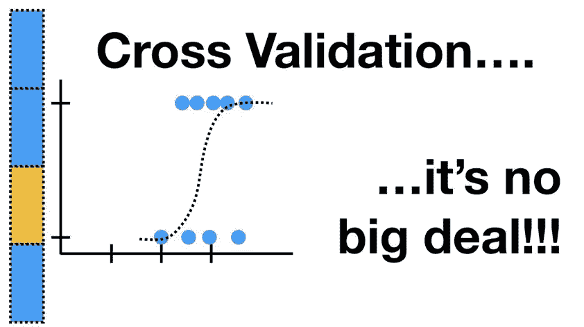
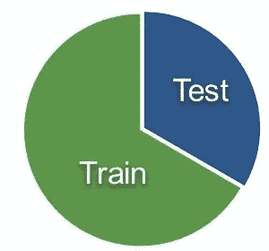
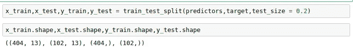
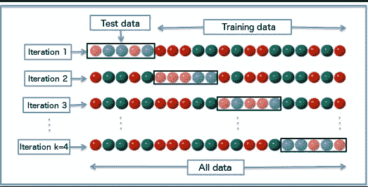
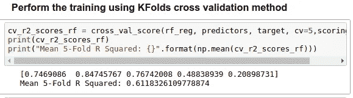
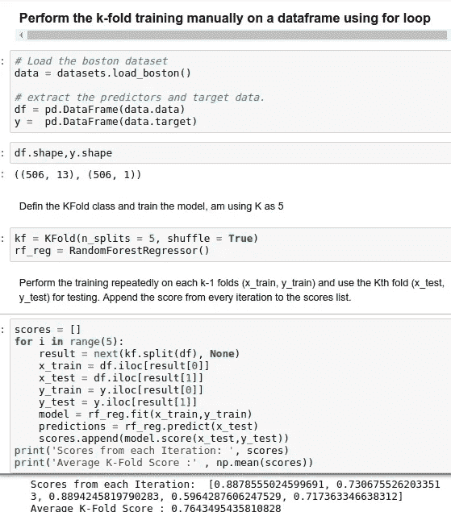

# 为什么以及如何交叉验证模型？

> 原文：<https://towardsdatascience.com/why-and-how-to-cross-validate-a-model-d6424b45261f?source=collection_archive---------1----------------------->

## 交叉验证技术的重要性和类型..

一旦我们完成了对模型的训练，我们就不能假设它会在以前没有见过的数据上很好地工作。换句话说，我们不能确定模型在生产环境中会有期望的准确性和变化。我们需要对我们的模型做出的预测的准确性有某种保证。为此，我们需要验证我们的模型。确定量化变量之间假设关系的数值结果是否可接受作为数据描述的过程称为验证..

为了评估任何机器学习模型的性能，我们需要在一些看不见的数据上测试它。基于模型对未知数据的表现，我们可以说我们的模型是否欠拟合/过拟合/良好概括。交叉验证(CV)是一种用于测试机器学习模型有效性的技术，它也是一种用于在数据有限的情况下评估模型的重新采样过程。为了执行 CV，我们需要保留未用于训练模型的样本/部分数据，稍后使用该样本进行测试/验证。

下面是一些常用于 CV 的技巧。

1.  **列车 _ 测试分流方法**。

在这种方法中，我们将完整的数据随机分为训练集和测试集。然后对训练集执行模型训练，并使用测试集进行验证，理想情况下将数据分成 70:30 或 80:20。使用这种方法，如果我们的数据有限，就有可能出现较高的偏差，因为我们会错过一些没有用于训练的数据信息。如果我们的数据很大，并且我们的测试样本和训练样本具有相同的分布，那么这种方法是可以接受的。

我们可以使用切片将数据手动分割成训练集和测试集，或者我们可以使用 scikit-learn 方法的 **train_test_split** 来完成这项任务。完整的文档可在[这里](https://scikit-learn.org/stable/modules/generated/sklearn.model_selection.train_test_split.html)获得。

**2。k 重交叉验证**:

K-Folds 技术是一种流行且易于理解的技术，与其他方法相比，它通常会产生一个偏差较小的模型。因为它确保了原始数据集中的每个观察值都有机会出现在训练集和测试集中。如果我们的输入数据有限，这是最好的方法之一。该方法遵循以下步骤。

Image Sourced From Wikipedia

1.  将整个数据随机分成 K 份(K 的值不应该太小或太高，理想情况下我们根据数据大小选择 5 到 10)。K 值越高，模型偏差越小(但较大的方差可能会导致过度拟合)，而 K 值越低，则类似于我们之前看到的训练测试分割方法。
2.  然后使用 K-1 (K 减 1)个折叠来拟合模型，并使用剩余的第 K 个折叠来验证模型。记下分数/错误。
3.  重复这个过程，直到每个 K 倍作为测试集。然后取你记录分数的平均值。这将是该模型的性能指标。

我们可以手动编写一个逻辑来执行此操作，或者我们可以使用 scikit_learn 库中内置的 **cross_val_score** (返回每个测试折叠的分数)/ **corss_val_predict** (返回输入数据集中每个观察值的预测分数，当它是测试集的一部分时)。

如果 esitmator(模型)是一个分类器，且' y '(目标变量)是二进制/多进制，则默认使用' **StratifiedKfold** '技术。在所有其他情况下，默认使用' **K_Fold** '技术来分割和训练模型。

类似于 K_Fold 交叉验证器，StratifiedKfold 返回分层的折叠，即在进行折叠时，它保持每个折叠中每个类的样本百分比。因此该模型为训练/测试折叠获得均匀分布的数据。

我们可以使用 K-Fold 中的折叠作为迭代器，并在 for 循环中使用它来对 pandas 数据帧进行训练。下面是例子。

完整的代码可在[这里](https://github.com/Msanjayds/Machine_Learning_Projects/blob/master/2.%20CrossValidation.ipynb)获得。

就这些了，非常感谢你的阅读。如果有任何更正/建议，请告诉我。请吧👏如果你喜欢邮报。提前感谢…😉