# 为什么以及如何摆脱维数灾难(乳腺癌数据集可视化)

> 原文：<https://towardsdatascience.com/why-and-how-to-get-rid-of-the-curse-of-dimensionality-right-with-breast-cancer-dataset-7d528fb5f6c0?source=collection_archive---------4----------------------->

这篇文章的主题已经在我的脑海中漂浮了很长一段时间，但是正如我的博客活动向我们展示的那样，我在几个多月的时间里都找不到灵感来将我所知道的信息转换成结构化的文字。我希望自从我的上一篇文章以来，我写博客的技巧没有变得很差，并且你会喜欢这里描述的主题；一如既往，我们欢迎任何类型的反馈。

## 非正式定义和直觉

维数灾难和降维本身是很少被谈论的话题；然而，对于几乎每个数据科学家(无论他/她是从事机器学习还是自然语言处理)来说，总有一天，专家会直面这个问题。

给维数灾难下一个有效的定义是相当困难的，但是简单地说，它是一个

> 算法的低性能及其与具有大量维度/特征的数据帧相关联的高复杂性，这经常使得目标函数非常复杂，并且只要数据集经常位于较低维度的流形上，就可能导致模型过拟合。

只要大多数机器学习/自然语言处理算法是基于处理一个数字数据集(来自现实生活或在进行一些数据预处理后生成)，那么很常见的情况是每个观察值都是一个实值向量，大小为 *N×1* ，其中 *N* 可能是 200、500 或 10000 以上。然而，正如前面提到的，许多 ML/NLP 方法不能以适当的方式处理给定数量的特征(尤其是在处理经典机器学习模型时)。

在现实生活中的一些情况下，大量的变量会导致模型的准确性和召回率大幅下降；适当减小数据集大小有助于实现模型泛化和良好的交叉验证结果。

选择合适的降维算法的问题高度依赖于我们正在处理的数据集的类型和我们准备数据的目标函数；例如，在一些情况下，保持低维空间内的距离是重要的，而在其他情况下，观测值的条件概率分布获得了在高维特征空间中编码的绝大多数信息。

## 手动特征选择

如果数据科学家非常熟悉数据集及其数字特征的含义，那么就很容易确定我们是否需要某些变量。例如，当预测某个地区的温度时，有关于湿度、云量、日出时间等的数据。只要目标变量不依赖于给定区域的人口数据和交通数据，这些数据就不充分。然而，只有在数据集易于解释并且变量之间的依赖关系易于确定的情况下，才可能执行这种方法。

去除无用变量的另一个好主意是查看它们的相关性(皮尔逊相关系数)并去除两个特征中的一个，这两个特征高度相关，只要它们都包含相似的信息。

人口的皮尔逊相关系数计算如下:

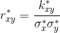

这个公式的分子是两个变量的协方差，分母是它们的标准差的乘积。

## 主成分分析和奇异值分解(P [主成分分析](http://files.isec.pt/DOCUMENTOS/SERVICOS/BIBLIO/Documentos%20de%20acesso%20remoto/Principal%20components%20analysis.pdf)

我认为主成分分析是机器学习中最流行的降维算法；一些数据科学家将它作为降维方法论的同义词(当然这是错误的)，因为它在许多论文、研究等中被广泛使用。

**主成分分析** PCA 背后的思想是矩阵分解方法:我们将输入数据集表示为两个矩阵 *T* 和 *P 转置*的乘积(还添加了残差和均值向量，这将在后面观察到)。

将数据集投影到矩阵 *T* 中等同于为每一行分配一个标量；它的列表示主要的对象模式(这些列也称为“得分向量”)。将数据集投影到矩阵*P’*中等同于为每一列分配一个标量；它的行代表主导变量模式(这些行也被称为“加载向量”)。 *T* 中的矢量和*P’*中的矢量正交。

事实上，PCA 可以用最小二乘模型来表示:

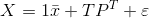

ε代表残差，它是原始坐标和投影之间的导数；平均向量可以包括在模型公式中，或者用数学方法确定。

这是乳腺癌数据集(分类任务),数据被投影到二维空间。

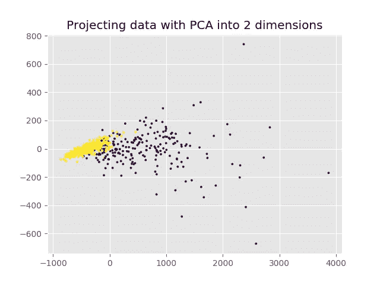

**奇异值分解**

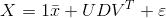

矩阵 *U* 与 *T* 相同，但对于归一化向量，如前所述， *D* 为对角矩阵，以协方差矩阵*XX’*的特征值平方根为其值，*V’*与*P’*完全相同。

SVD 也是其他流行算法的基础，例如，在自然语言处理任务方面的潜在语义索引。矩阵 *D* 的值通常被称为分量的“解释方差”;它们代表了每个变量的重要性。

## 多维标度([映射感知观察的流形](http://web.mit.edu/cocosci/Papers/man_nips.pdf))

多维缩放算法背后的直觉是通过计算对象之间的测地线(局部最短)距离并将这些路径映射到缩减的特征空间中的直线来保持对象的内在度量结构。

MDS 的主要组成部分是 isomap 过程，它以一种非常简单的方式进行表述:

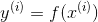

Isomap 假设观察空间中的点之间的距离仅是低维空间中局部距离的精确度量，并且必须对流形上的路径进行积分以获得全局距离。这个非线性函数的两个主要特性是:

*   本质上相似的观察值应该映射到特征空间中的附近点；
*   流形中的测地线路径应该映射到所获得的特征空间中的直线上。

isomap 程序由 3 个关键步骤组成:

1.  流形的离散表示。我们从数据集中随机选择 *r* 个点作为拓扑保持网络的节点，并且仅当整个数据集中存在至少一个观察值，并且其两个最近的节点是这些前面提到的节点时，才连接这些节点。创建的图形 *G* 清楚地考虑了流形的拓扑结构；
2.  流形距离度量。我们应该给图 *G* 中的每个链接分配一个权重，这个权重等于数据点之间的欧几里德距离:

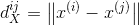

路径 *G* 的长度等于沿着该路径的链接权重的总和。下一步，我们将从欧几里德距离转移到测地线距离，公式如下:

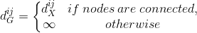

之后，对于每个节点 k，我们将测地线距离设置为:

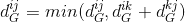

使用动态编程算法进行计算；

3.等距欧氏嵌入。有序多维标度(“非度量 MDS”)用于找到对应于高维观察值的用 *Y* 表示的 k 维特征向量的配置，使得图形距离尽可能地保持不变。序数 MDS 对数据集中的噪声和异常值也不太敏感:

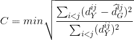

我们正在最小化关于欧几里德图距离的成本函数；带有帽子符号的图距离表示应用了一些单调变换的距离。总的来说，多维标度的主要思想是通过将测地线距离变成低维空间中的直线来尽可能地保持和简化高维空间中的现有距离，并且仍然获得结果流形中的数据点的正确位置，这些数据点彼此关联良好。

相同的数据集被投影到 2 维中:很明显，现在聚类更密集，数据的趋势清晰可见，这可以解释为线性回归线。

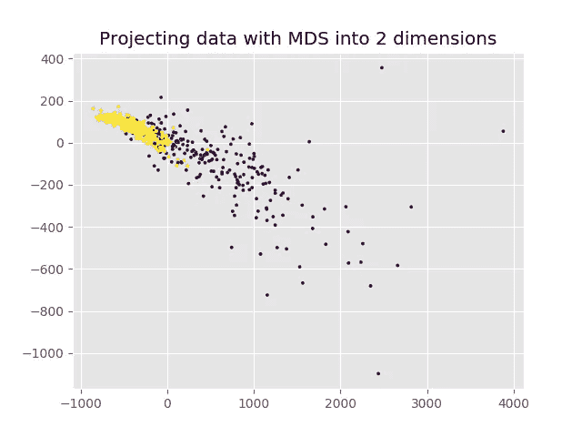

## 局部线性嵌入([通过局部线性嵌入进行非线性降维](http://citeseerx.ist.psu.edu/viewdoc/download?doi=10.1.1.456.5279&rep=rep1&type=pdf)

先前描述的降维技术基于处理观测值之间的距离，并在低维空间中适当地保存它们；局部线性嵌入思想是基于这样一个事实，即流形的局部线性片上的每个数据点及其邻域都位于其上或与之接近。这些面片以线性系数为特征，这些系数根据相邻数据点重建每个数据点。

重建误差通过以下方式测量:

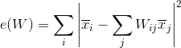

重建有索引*j*；我们最小化的成本函数有两个主要约束:首先，我们只从它的邻居重建每个数据点。其次，我们的权重矩阵的行总和为 1。我们需要这些约束来使权重获得必要的对称性。通过最小化最小二乘问题找到解决该函数的最佳权重；事实上，最佳权重是第 *j* 个数据点对第 *i* 次重建的贡献。

LLE 背后的核心概念是，在高维空间中重建数据点的相同权重也应该在低维空间中重建其嵌入的流形坐标。重建权重反映了数据固有的几何属性，这些属性对于诸如平移、旋转、重新缩放等变换是不变的。

全局内部坐标用高维邻域保持映射表示，代价函数如下:

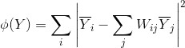

这里，我们固定了之前计算的权重，并优化了嵌入坐标 *Y* 的成本函数。

正如我们在图上看到的，数据点之间的距离和相对观察位置没有很好地保留，但样本之间的邻域显示得很清楚。

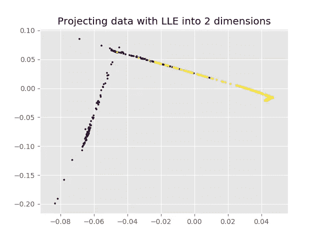

## SNE 和 t-SNE ( [使用 t-SNE](http://www.jmlr.org/papers/volume9/vandermaaten08a/vandermaaten08a.pdf) 可视化数据)

随机邻居嵌入和 t 分布随机邻居嵌入是本文描述的最后两种方法，但只要它们使用表示相似性的概率信息作为模型的核心，它们在降维任务方面仍然非常重要。SNE 和 t-SNE 背后的主要思想是利用观察相似性将高维数据点转换为低维数据点，并很好地捕捉高维数据的大部分局部结构。

**随机邻居嵌入**
如前所述，在将观测值嵌入低维空间时，保持邻居身份是我们试图解决的主要任务。

对于每个对象 *i* 和每个潜在邻居 *j* 来说，如果邻居在以 *x* 为中心的高斯分布下与其概率密度成比例地被挑选，则 *i* 将挑选 *j* 作为邻居的不对称概率被定义为:

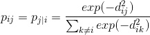

两个高维点之间的欧几里德距离(相似性)通过使用概率分布方差以如下方式来表示:

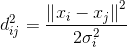

适马平方是以索引为 *i* 的数据点 *x* 为中心的高斯方差。

相似性具有以下属性:

*   *k* 是有效邻居数(困惑数)；
*   sigma 平方的值使得邻居分布的熵等于 *log k* 。

点 *i* 选取点 *j* 在低维空间中的诱导困惑度不使用概率密度定义为:

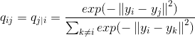

只要我们想尽可能好地模拟这两种分布，我们正在构建的成本函数是使用梯度下降法通过所有数据点上的 Kullback-Leibler 散度之和得出的:

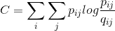

因为 Kullback-Leibler 散度是不对称的，所以低维映射中成对距离中不同类型的误差的权重不同。先前定义的成本函数的最小化导致将观察值嵌入到流形中，该流形具有在低维空间中计算的条件概率，该条件概率等于或几乎等于在高维空间中计算的条件概率，使得两个概率分布之间的失配最小化。

**t 分布随机邻居嵌入** t 分布随机邻居嵌入与简单随机邻居嵌入的唯一区别在于，我们使用对称概率而不是不对称条件概率来计算高维空间中的相似性。此外，在低维空间中使用学生 t 分布来缓解 SNE 的拥挤问题和优化问题。

当两个高维数据点之间的距离很大时，对称 SNE 有助于计算成对的相似性:

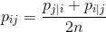

拥挤问题被公式化为“可用于容纳中等距离的数据点的二维图的区域与可用于容纳附近的数据点的区域相比不够大”的事实。结果，数据点之间的距离没有被充分保留，并且由于到低维空间的投影的高方差，自然数据集聚类没有被正确形成。为了解决拥挤问题，我们使用 Student t 分布，它使得对于相距较远的地图点，地图的联合概率表示对于地图比例的变化(几乎)不变:

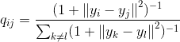

在执行 t-SNE 后，低维空间中的球形数据表示是相当常见的结果:

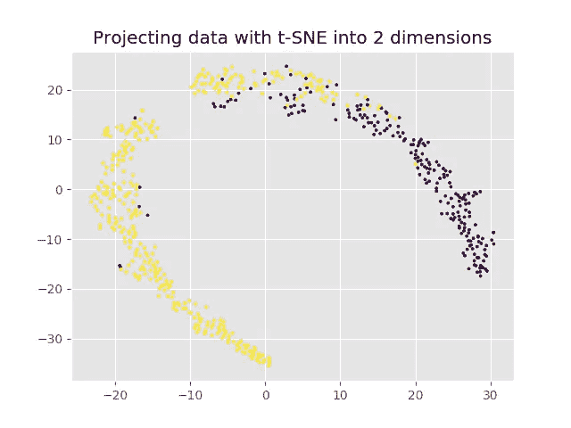

## 结论

本文没有提到所描述的方法的优缺点、它们适用的方法、最常见的使用案例等。只要这个主题高度依赖于输入数据、其中存在的噪声、维数等。实际上，由于与单词嵌入模型相同的原因，降维技术不能被充分地测量:它们的有效性高度依赖于随后应用的算法和传递到方法中的数据类型。

表示的可视化提供了对降维技术保存的信息类型的很好的洞察，例如，它是否很好地反映了邻居关系、趋势或聚类位置。