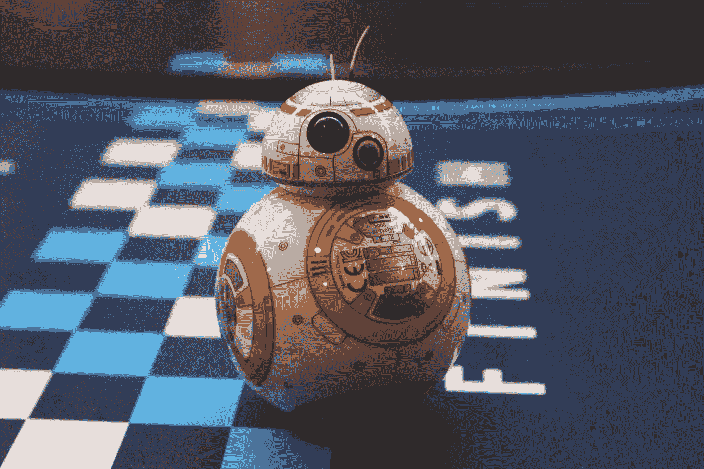

# 为什么人们这么害怕 AI？

> 原文：<https://towardsdatascience.com/why-are-people-so-scared-of-ai-956ca2fb2c7f?source=collection_archive---------4----------------------->

[@kaaps](https://unsplash.com/@kaaps)

今天，围绕人工智能(AI)的辩论并不缺乏，它已经渗透到社会的几乎每一个媒体，使其成为社会中与政治、性、战争(恐怖主义)、健康和生态并列的主要讨论之一。但令人惊讶的是，这个新来者在相对处于婴儿期的时候却遭到如此多的反对。为什么人们如此烦恼——或者像一些末世论者所说的那样——如此害怕？！

我认为答案的一部分在于，作为一个物种，我们担心，如果我们把一些认知属性交给机器，我们相对于地球上其他动物的相对优势将会丧失。但是，仅仅因为我们更高的进化而变得越来越聪明，并不局限于解决问题。诸如生成计算、自我反思、思想的混杂组合、抽象思维和精神符号(通常被称为思维的组成部分)等主题都属于人类，并且是我们被赋予创造力的原因之一。因此，卸下大量完全没有价值的大脑活动，专注于只有人类思维才能解决的事情，是促进公共利益的一个很好的动力。

这种“思维”(智能)形式也是人类与机器不可估量的不同之处。这就引出了下一个问题，什么是“智力”。

人工智能领域只研究了思维光谱的最高端，尽管它渴望尝试“逆向工程”人类智能，并且它显然抓住了大众的想象力，但手头的问题是我们尚未对人类智能有深刻而彻底的理解。

如果我们不知道人类智能是由什么组成的，为什么我们还要谈论人工智能？

所有这些噪音都来自忧虑，我们是焦虑的物种。人工智能的不确定性首先与时间尺度有关，而我们人类在一个短期最重要的环境中进化。此外，今天公众舆论中明显的偏见(反对人工智能)显然有利于可能产生适度短期利益(可能有利于就业的技术限制)的战略，但同时几乎没有对更有效的第二代方法(设计一个每周工作时间或一生工作时间都很少的世界)做出预测，同时受益于人工智能在人类几乎每个领域都能提供的巨大增长。

所以现在，大众不知道的是，为谷歌助手、Siri、Spotify、使命召唤、亚马逊、 [X.ai](https://x.ai/) 、[蒙娜](https://www.monahq.com/)、[洛拉](https://www.lolatravel.com/)、[卢卡](https://luka.ai/)、[玛亚](https://trymya.io/)、[未来达](https://www.futurenda.com/)、[米拉](https://milahq.com/)、[每个像素](https://everypixel.com/)和其他人将继续努力，让我们的生活变得更简单，以便我们可以继续生活如果你保持开放的心态和对变化的反应，你甚至会享受这只援助之手。

与此同时，似乎周围最聪明的人都认为当今最大的威胁之一是机器智能。他们可能是对的，但是还有其他类型的人类活动有着更值得担忧的记录。