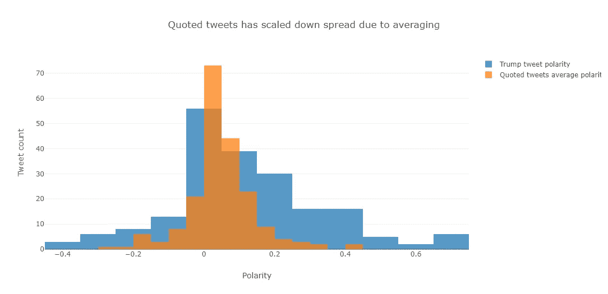
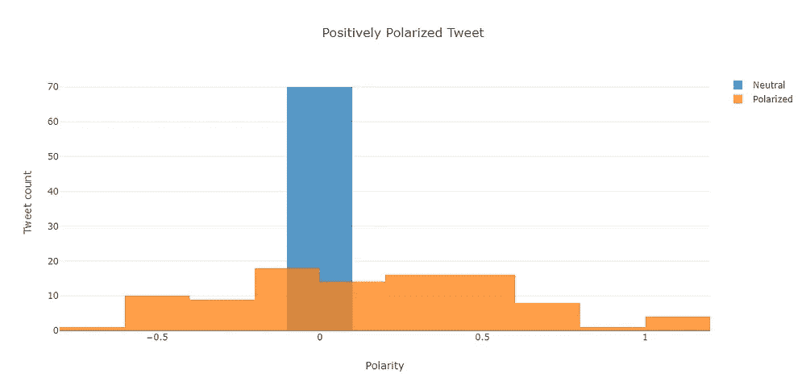
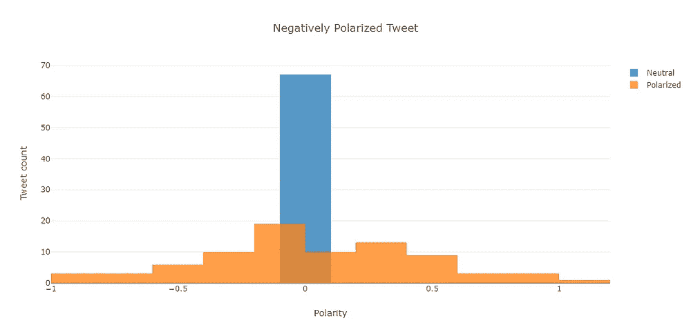
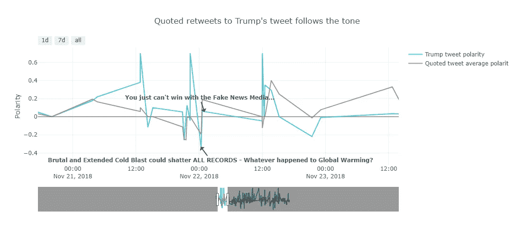
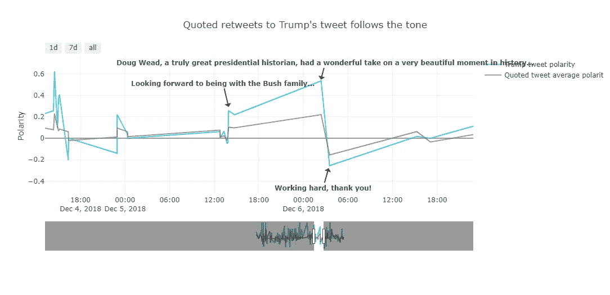
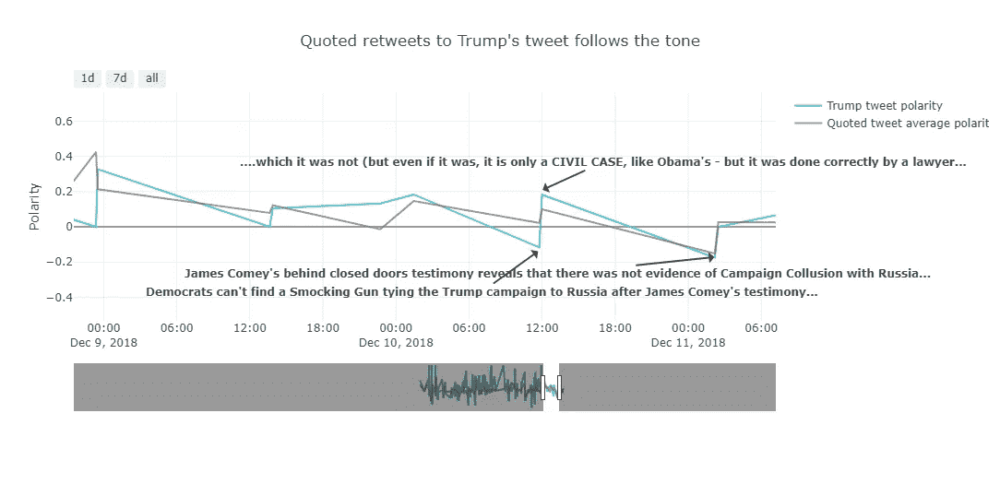
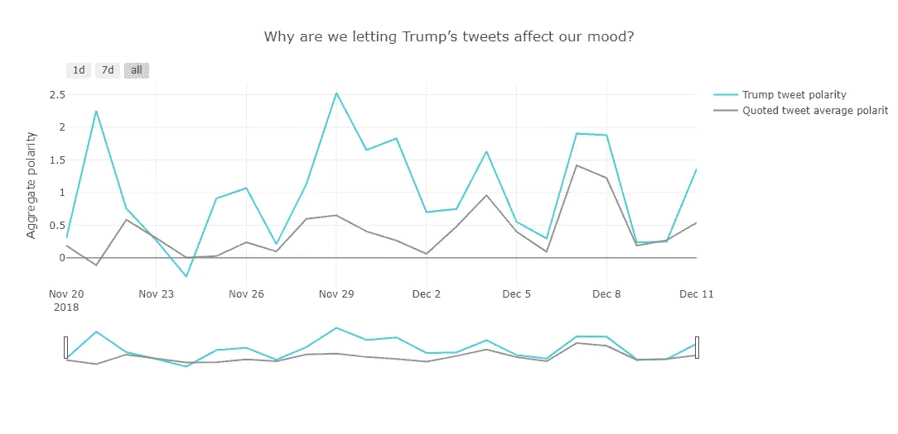

# 为什么我们要让特朗普的推文影响我们的心情？

> 原文：<https://towardsdatascience.com/why-are-we-letting-trumps-tweet-affect-our-mood-7f9baafae3a7?source=collection_archive---------27----------------------->

## 如果你倾向于在推特上关注特朗普，那么你对他推文的反应可能会受到他语气的影响。由两个截然不同的群体划分的总体意见通常遵循原始推文的基调。

# 序言

基于我[之前对](/analyse-retweet-ratio-to-determine-social-influence-d83bda0559d)在推特上的社交影响力的分析，来自[*唐纳德·特朗普(@realDonaldTrump)*](https://twitter.com/realDonaldTrump?ref_src=twsrc%5Egoogle%7Ctwcamp%5Eserp%7Ctwgr%5Eauthor) *的推文，美国总统*的参与度相对较高。

> 我想知道特朗普先生的原创推特在多大程度上影响了人们的反应情绪。

# 对数据的洞察力

首先，我使用 [Tweepy](http://docs.tweepy.org/en/3.7.0/getting_started.html) 从 Twitter 获取数据。我设计了我的实验，用 Twitter 句柄[*@ realDonaldTrump*](https://twitter.com/realDonaldTrump?ref_src=twsrc%5Egoogle%7Ctwcamp%5Eserp%7Ctwgr%5Eauthor)*获取最近的 **200 条推文**，并为特朗普的每条推文从其他人获取多达 **100 条相关推文**。*

*对检索到的每条推文使用 [TextBlob](https://textblob.readthedocs.io/en/dev/) 进行情感分析，以确定推文的**极性**。*

# *初步观察*

*特朗普的推文极性和人们相应回应的平均值的绘图显示了重叠。然而，特朗普的推特极性传播更广。*

> *这可能是由于人们的推文极性平均高于单个特朗普推文的极性。*

*所以我把特朗普推文的极性缩小到 70%。但是结果仍然是非结论性的。*

**

*下一个合乎逻辑的步骤是更深入地挖掘特朗普的每一条推文及其来自其他人的相应回应。*

****

*人们对积极极化的特朗普推文和消极极化的特朗普推文的响应分布似乎类似。尽管结果仍不确定，但我发现了一个有趣的模式。*

> *与消极回应相比，积极极化的特朗普推特从其他人那里获得更多积极极化的回应。类似地，与积极极化的回应相比，消极极化的特朗普推文从其他人那里获得更多消极极化的回应。*

# *推文时间线分析*

*我想确定这种新发现的人们在特朗普的推文情绪后的反应模式是反复出现的。*

******

> *人们回应的平均极性的转变似乎是在特朗普推特的突然极性转换之后发生的。有时在几分钟内。*

*单个 tweet 集合的时间线图有很多尖峰，肉眼看起来大部分都很嘈杂。为了更好的可视化，我汇总了每天推特极性的总和。*

**

# *结论*

*从上面的分析来看，人们对特朗普推文的回应在很大程度上遵循了原始推文的语气。*

*这一分析是基于最近几周获取特朗普的推特数据，并考虑到所用 API 的限制。TextBlob 不考虑被分析文本的讽刺，也不考虑 Twitter 对使用**标准搜索 API 获取的记录数量的限制。***

# *源代码:*

*【https://github.com/ShreyasJothish/tweetsentimenttimeline *

# *参考资料:*

* [## llSourcell/Twitter _ 情操 _ 挑战

### Youtube 上@Sirajology 为学习 Python for Data Science 举办的 Twitter 情绪分析挑战# 2…

github.com](https://github.com/llSourcell/twitter_sentiment_challenge/blob/master/demo.py)  [## 使用 Twitter 流 API 和 Python // Adil Moujahid // Data 的文本挖掘介绍…

### Adil Moujahid，数据分析等

adilmoujahid](http://adilmoujahid.com/posts/2014/07/twitter-analytics/)*