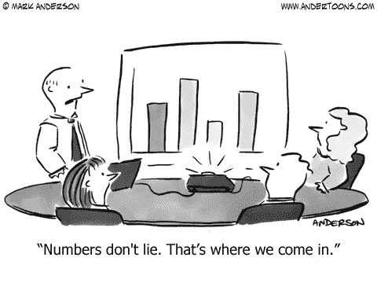
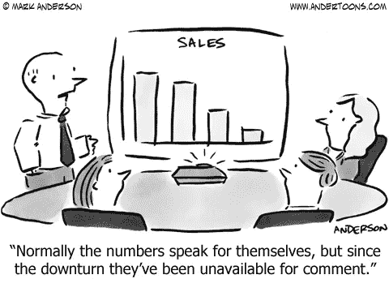
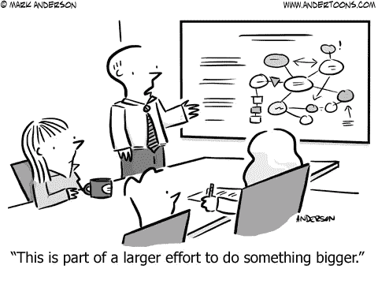

# 为什么平均值经常是错误的

> 原文：<https://towardsdatascience.com/why-averages-are-often-wrong-1ff08e409a5b?source=collection_archive---------6----------------------->

1906 年，美国作家塞缪尔·兰霍恩·克莱门斯(更为人熟知的名字是马克·吐温)向英国首相本杰明·迪斯雷利推广了他关于人类如何使用数字来量化情景的思想:“有三种谎言:谎言、可恶的谎言和统计”(吐温，2010)。有太多的理由说明为什么这通常是真的:统计技能不足，已知的偏见，未知的偏见，或者只是传统的智力懒惰。在我的学术和数据科学生涯中，我多次遇到基于“平均值”的分析或合理化，或者像我们数据极客喜欢更准确地说的那样，“平均值”。然而，事实上，平均值往往是错误的，而且不止一种方式。

平均值是指一组不同样本的测量值，通常是一群个体。平均值的主要目的是测量同一样本组或组群随时间的变化。正是在这种应用中，或者更确切地说是在误用中，通过将平均值用于不同的目的，出现了三种最常见的错误。

首先，在任何数据集中，存在异常值是很常见的。这些通常在图表中最容易看到，其中大多数数据点聚集在一个区域或一条线周围，然后一个或几个数据点偏离了“永远不要”区域。这些异常值扭曲了数据集的平均值，将它“拉”向自己的方向。这给人一种错误的印象，即数据点聚集在比它们真正聚集的位置高或低的点周围。在这些情况下，通常最好使用中位数而不是平均值来表示集中趋势测量值，因为它受异常值的影响较小。

第二，许多人倾向于认为“平均”是“典型的”这个假设在许多数据集中的问题是——当然是那些涉及人类的数据——有很多很多“典型”的例外人们甚至可以说没有“典型”这种东西。例如，一个经常被误用的统计数据是美国的平均离婚率，它经常被引用为“大约 50%”。如果研究一下这个问题，他们会发现平均离婚率因年龄、受教育程度、职业、种族、地理、宗教信仰等因素而有很大差异。因此，每个人都被这些因素不同地分类，导致许多不同的平均离婚率，这取决于哪些因素描述了那些被测量的人。

在美国劳工统计局发表的一项研究中，专业统计学家纵向跟踪了 7357 名随机选择的 1957 年至 1965 年出生的男性和女性，从 1979 年到 2010 年共 31 年(Aughinbaugh，2014)。虽然 31 年来这一群体的总体平均离婚率为 43.1%，但例如，拥有大学学位的人的离婚率仅为 29.6%。考虑到结婚年龄，平均离婚率差异更大。对于那些获得大学学位并在 22 岁前结婚的人来说，平均离婚率为 46.6%；然而，对于那些获得大学学位并在 35-40 岁之间结婚的人来说，平均离婚率仅为 13.4%。

在同一项研究中，这些差异可以通过不同的指标看到。虽然 88%获得大学学位的人在 46 岁前结婚，但只有 20.9%的人曾经离婚。类似地，对于 21%离婚并选择再婚的人来说，其中 85%的人保持再婚，这使得受过大学教育的人的平均二婚离婚率仅为 15% (Aughinbaugh，2014)。因此，对于那些拥有大学学位的人来说，在 31 年的研究中，96.9%的人最终拥有了可持续的婚姻。应用平均值的第二种错误的寓意是，人们只能比较相似和同等分类的组的平均值，否则，提供错误的信息。

平均数经常被错误使用的第三种方式是将它们应用于个别情况。将一组数据点的平均值应用于单个点并假设它是正确的，这是统计学上的错误。即使假设数据是正态分布的(“钟形曲线”)，任何一个数据点与平均值相同的概率是 50% —与随机猜测相同。根据该数据点在数据点的归一化分布(“钟形曲线”)中的位置，当数据分布接近曲线尾部时，该组平均值准确描述或预测任何一个数据点的行为或结果的概率下降。

总之，均值有助于衡量一组受试者或数据点如何随时间变化。当用于比较不同的群体、将群体行为应用于个体场景时，或者当数据中有大量异常值时，平均值会产生误导。这些问题的根源似乎是过度简化和合理化——人们愿意相信的东西。我们从统计学及其更现代的兄弟机器学习中知道，结果是基于因果关联的，这些因果关联是复杂的，因为它们是多重的和动态的，并且它们在历史上比预测性地更容易测量。

那么，关于迪斯雷利首相早熟的观察，即统计数字是谎言的真相，与其说是在统计数字提供给我们的答案中找到的，不如说是因为我们常常不知道问题是什么，或者更糟的是，我们确实知道，而且是错误的问题。套用阿尔伯特·爱因斯坦(Albert Einstein)的话，当他被问及如果他有 48 小时来拯救世界，他会怎么做时，花 90%的时间分析问题，此时，答案变得不言自明。

# 引用的作品

aughinbaugh(2014 年)。按性别、种族和教育程度分类的模式。*月度劳动评论*，【https://doi.org/10.21916/mlr.2013.32\. 

m .吐温、H. E .史密斯和 b .格里芬(2010 年)。*马克·吐温自传*。伯克利:加州大学出版社。