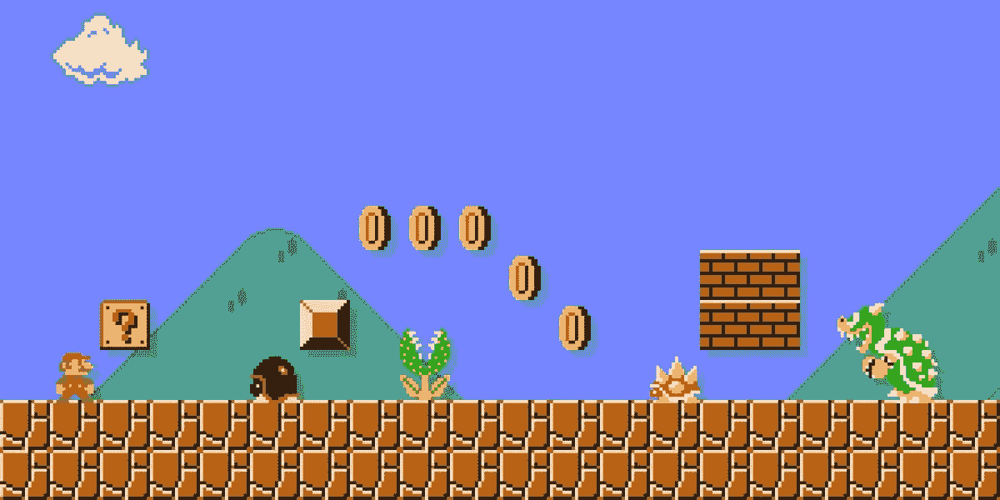
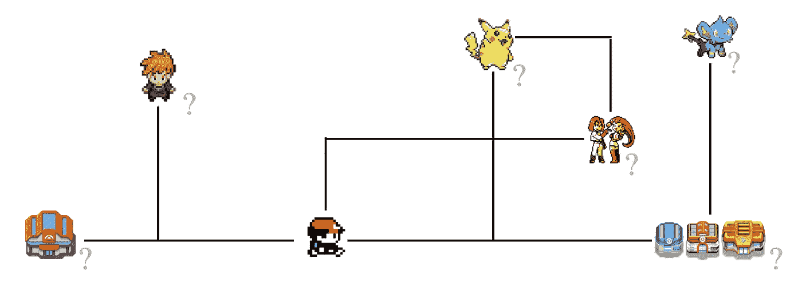
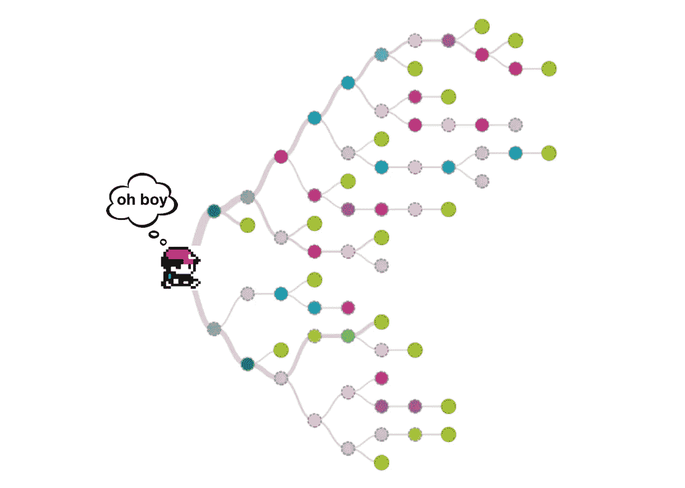
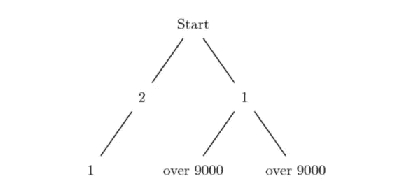

# 为什么机器能打得过马里奥却打不过口袋妖怪？

> 原文：<https://towardsdatascience.com/why-can-a-machine-beat-mario-but-not-pokemon-ff61313187e1?source=collection_archive---------5----------------------->

到现在为止，你可能已经听说过机器人以超人的水平玩视频游戏。这些机器人可以被显式编程，以设定的输出对设定的输入做出反应，或者 [*学习*](https://en.wikipedia.org/wiki/Reinforcement_learning) *和* [*进化*](https://en.wikipedia.org/wiki/Genetic_algorithm) ，以不同的方式对相同的输入做出反应，以期找到最佳的反应。

几个著名的例子是:

*   AlphaZero ，一个经过 24 小时训练后成为地球上最伟大的棋手的国际象棋机器人
*   AlphaGo ，一个著名的围棋机器人，击败了世界级棋手李·塞多尔和柯洁
*   MarI/O ，一个超级马里奥机器人，它可以自己学习快速运行任何级别的马里奥

这些游戏很复杂，训练这些机器需要复杂算法、重复模拟和时间的巧妙结合。我想重点谈谈 MarI/O 以及为什么我们不能用类似的方法打败一个口袋妖怪的游戏(如果你不熟悉它的工作原理，请观看上面链接中的视频)。

马里奥和口袋妖怪在这方面有 3 个主要区别:

1.  目标数量
2.  分子因子
3.  全局优化与局部优化

让我们用这些因素来比较这些游戏。

## 目标数量

> 机器**学习** 的方式是通过优化某种目标函数。无论是最大化一个[奖励](https://en.wikipedia.org/wiki/Reinforcement_learning)或[适应度](https://en.wikipedia.org/wiki/Fitness_function)函数(在强化学习和遗传算法中)，还是最小化一个[成本函数](https://en.wikipedia.org/wiki/Loss_function)(在监督学习中)，目标都是相似的:尽可能获得最好的分数。

马里奥有一个目标:**到达关卡** *的末尾。简单地说，你临死前得到的权利越多，你做得越好。这是你的单一目标函数，你的模型能力可以直接用这个数字来衡量。*

口袋妖怪有…很多。让我们试着确定我们的目标。是为了打败精英 4 吗？去抓所有的口袋妖怪？培养最强团队？是以上所有的还是其他的？仅仅问这个问题就很奇怪，因为答案可能是所有这些问题的某种个人主观组合。

我们不仅要定义最终目标，还要定义进展是什么样的，所以每一个行动单元都对应着一个奖励或损失，这个奖励或损失是基于任何时候许多许多可能的选择。

这就引出了下一个话题。

## 分子因子

> 简单来说，分支因子就是你在任何一步可以做出多少选择。在国际象棋中，平均分支因子是 35；在围棋里是 250。对于未来的每一步，你都有(factor)^(steps 分行)数量的选择要评估。

在马里奥里，你要么向左，向右，跳，要么什么都不做。机器要评估的选择数量很少。而且，分支因子越小，机器人就能在计算上看得更远。

口袋妖怪是一个开放的世界游戏，这意味着你在任何时候都有很多选择。简单地向上、向下、向左或向右移动并不是计算分支因子的有用方法。相反，我们着眼于下一个有意义的行动。下一个行动是去打仗，与 NPC 人交谈，还是去左、右、上、下的下一个地方？随着游戏的进行，可能的选择范围从大到非常大。

建造一台能够计算出最佳选择集的机器需要它考虑自己的短期和长期目标，这就引出了最后一个话题。

## 局部优化与全局优化

> 局部和全局优化可以从空间和时间上考虑。短期目标和直接的地理区域被认为是局部的，而长期目标和相对较大的区域如城市甚至整个地图被认为是全局的。

将每次运行分解成它的组成部分是一种将口袋妖怪问题分解成小块的方法。局部优化在一个区域内从 A 点到 B 点很容易，但是决定*哪个*目的地是最佳 B 点是一个困难得多的问题。[贪婪算法](https://en.wikipedia.org/wiki/Greedy_algorithm)在这里失败，因为局部最优决策步骤不一定导致全局最优。

马里奥地图很小，是线性的。口袋妖怪地图很大，错综复杂，并且是非线性的。为了追求更高的目标，你的最高优先级会随着时间而改变，将全局目标转化为优先的局部优化问题并不是一件容易的事情。这不是我们目前的型号所能处理的。

## 最后一件事

从机器人的角度来看，口袋妖怪不仅仅是一个游戏。机器人是专家，当你遇到想要战斗的 NPC 人时，帮助你在地图上移动的机器人无能为力。从他们的角度来看，这是两个完全不同的任务。

在战斗中，每一回合都有几十种选择。选择使用哪个动作，换哪个口袋妖怪，以及何时使用不同的物品本身就是一个复杂的优化问题。环顾四周，我找到了[这篇文章](https://realworldcoding.io/machine-learning-in-pokemon-db32dcd96f33)，其中有人解释了他建造战斗模拟器的过程。这是经过深思熟虑的，非常复杂，甚至没有考虑到物品的使用，这是决定战斗结果的一个关键因素。

到目前为止，我们应该庆幸的是，我们可以建立比我们更擅长自己游戏的机器人。到目前为止，这些游戏在数学上很复杂，但在目标上很简单。随着人工智能的进步，我们将创造出能够解决越来越有影响力的现实世界问题的机器，所有这些都是通过它们自己对复杂优化问题的学习来实现的。请放心，我们仍然有更擅长的事情，包括我们童年的游戏——至少现在是这样。感谢阅读！