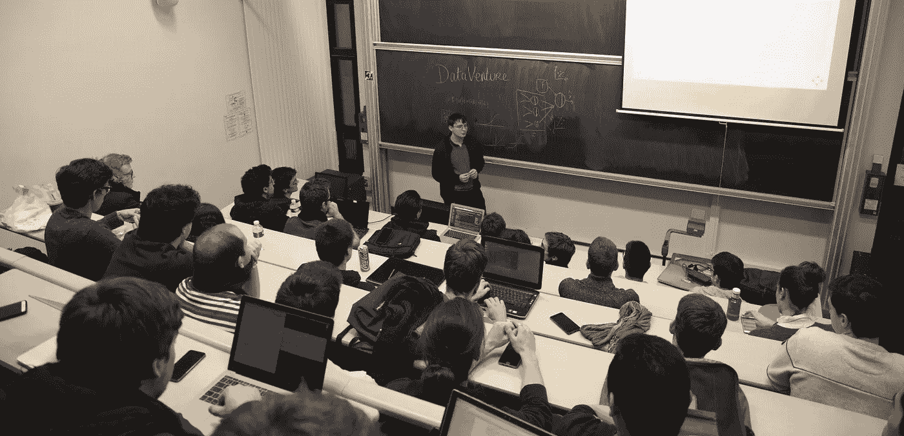
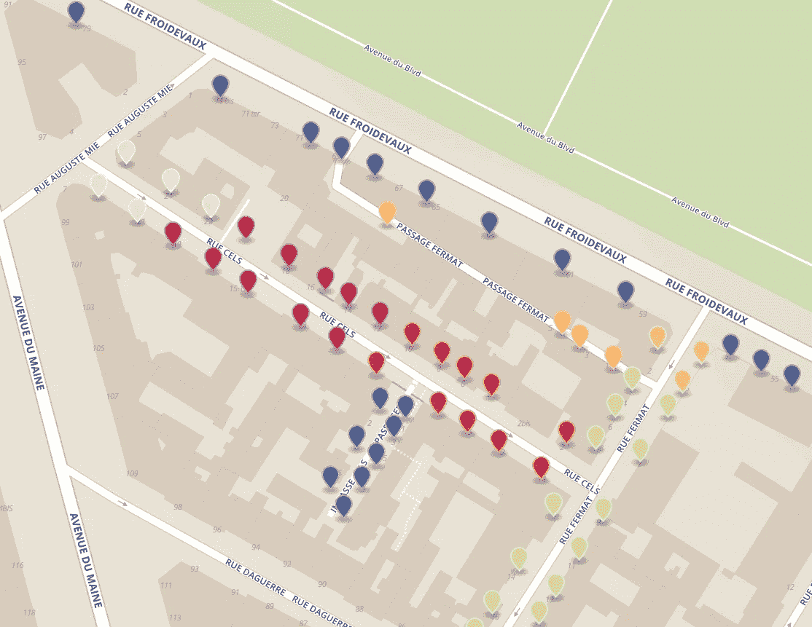
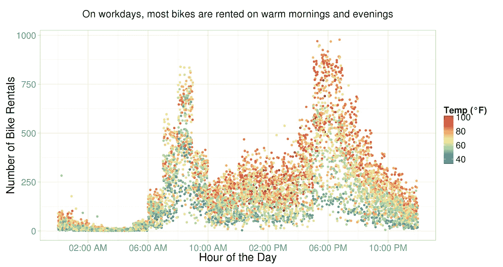

# 为什么应该在每个工程专业推广数据科学

> 原文：<https://towardsdatascience.com/why-data-science-should-be-promoted-in-every-engineering-major-aaf9c92d9d0d?source=collection_archive---------12----------------------->

Neural networks explained to a majority of Computer Science students by a Mechanical Engineering student during a [DataVenture](https://twitter.com/dataventure) event — Photo by Bastien Le Moallic

数据科学是大多数大学教授的一个时髦的新领域——至少是科学和工程大学。但仍然在 2018 年，它并不总是被视为和理解为每个专业的完整和强大的解决问题的方法。我相信应该是！

数据科学涵盖了许多不同的东西:数据管理、统计学、数据可视化、机器学习等等。人们认为只有计算机科学家有足够的技术来处理这个问题。为什么？因为它通常需要编程技能，而这些技能在高中(或之前)并没有作为基础知识教给每个人。因此，它引起了人们的恐惧，因为他们不知道编程。

老实说，数据科学需要与一些计算机材料兼容。比如操纵数据(文件、数据库)和对它们进行操作(编程或使用高级软件)。但是数据科学可以在很多方面帮助你。如今，数据无处不在。那么你不应该仅仅因为你缺乏计算机编程技能而忽视解决你自己问题的方法。这不是重点。

现在忘掉障碍，专注于利益。我将给出一些具体的例子来说明为什么你应该开始用数据思考，不管你是谁。从化学到机械工程专业，学生没有理由远离。

# 如何利用数据科学解决问题

数据科学是一套应用于数据集的统计工具，目的是提取有趣的值(解决问题、发现模式和意外规则等)。

数据可以是数字、文本、图像、声音。它通常存储在文件或数据库中。具有相同变量的数据集合称为数据集。数据集有时是私有的，有时是公共的。越来越多的机构将他们的数据放到网上。这些公共在线数据集被称为“开放”的，因为任何人都可以下载和探索它们。例如，巴黎市有一个很棒的[在线平台](https://opendata.paris.fr)，他们在那里发布许多开放数据集。它是关于经济，社会统计，建筑，交通，公共服务等。

让我们来看看[这个数据集](https://opendata.paris.fr/explore/dataset/troncon_voie/information/)。它由巴黎街道的城市数据组成。它描述了巴黎的街道是如何被道路分隔开的。你可能在想:“我就是不在乎这个”。等一下。最近，我不得不使用这个数据集。

我研究了一个解决方案来改善巴黎市的垃圾收集管理。这个想法是利用机器学习预测垃圾车到达街道，然后在几分钟前提醒管理员，以便他们可以将垃圾箱放在户外。最终目标是减少巴黎街头垃圾箱的数量。

其中一个步骤是将街道聚集起来，将城市中的每个地址聚集成小的集群。簇必须是彼此靠近的地址，并且同时由卡车收集。即使同一条街道上的两个号码很近，它们也可能被道路隔开，因此垃圾收集车可能不会同时收集它们。我不得不将没有被道路分隔的街道编号进行分组。所以这个数据集正是我所需要的！我用了所谓的聚类算法，这是结果。

我没有设计一个可能涉及一些城市知识的复杂算法，而是使用了一种机器学习方法，这种方法很有效。因此，无论你是谁，例如在城市规划领域工作的人，你都有理由使用数据科学，因为它很有帮助。

# 不同科学领域中已解决问题的例子

嗯，有很多例子。快速访问 [Kaggle](https://kaggle.com) (网络上最著名的致力于数据科学竞赛的实体)及其多样化的数据集，人们在这些数据集上不断竞争，这给了我非常广泛的想法。

**化学工程**。分子结构和性质的类型不知何故是无限的。对于在制药领域工作的化学科学家来说，预测给定分子的生物反应是一项非常具有挑战性的任务。在实践中，这意味着在评估一种新分子的有效性和安全性之前要进行大量的临床实验。这个[数据集](https://www.kaggle.com/c/bioresponse)提供了一系列不同的分子，每个分子都有 1776 个分子描述符。鉴于 1776 个分子描述符的细节，药剂学专家几乎不可能用分析方法预测生物反应，但数据科学方法使之成为可能。

**工业工程**。假设你在一家非常大的汽车制造厂负责降低生产成本。我敢打赌，你首先想到的是建筑本身。但是在作为最后一步的强制性汽车测试中，实际上花费了很多钱。汽车制造商必须确保每辆新车的安全性和可靠性。梅赛德斯-奔驰发布了一个[数据集](https://www.kaggle.com/c/mercedes-benz-greener-manufacturing)，包含 377 辆正在接受测试的汽车的描述符，以及相关的答案“通过测试”或“否”。他们想要一种已经学会预测汽车是否通过测试的算法。他们表示，最终算法将有助于更快的测试，导致他们所说的“更低的二氧化碳排放”(测试期间)，但首先它将有助于提高生产率和租赁能力。

**城市工程**。几年前，华盛顿特区有一个问题需要解决。他们想更好地了解他们的自行车共享系统是如何使用的:高峰时间，最活跃的出发和到达码头等。他们把这个问题变成了一个数据科学问题，他们要求竞争对手在 [Kaggle](https://www.kaggle.com/c/bike-sharing-demand) 上预测在给定日期和时间使用的自行车数量。数据集中的描述符通常是与天气和日期相关的信息(季节、星期几、月份等)。人们做了很好的可视化，带来了对服务使用方式的直观理解(见下图)。通过共享自行车需求预测系统，他们为物流员工提供了一个强大的工具，帮助他们在城市中调度自行车车队。

前面的三个例子实际上都是关于在给定环境下统计预测输出的。根据机器学习模型，有时可能会得到为什么做出预测的解释。我们经常提到“白盒”和“黑盒”这两个术语。黑盒模型很难理解(通常是神经网络)，但白盒模型提供了选项(如决策树)。在白盒里，有时会发现完全出乎意料的奇怪原因！

从这个故事开始，我们就一直在讨论工程师和科学家使用数据科学的原因。此外，在其他领域存在更多的用例。你知道优步正在预测它的需求吗？然后，该公司能够派遣更多的司机前往非常活跃的地区，或者建议他们更容易找到客户的路线。而且，酒吧可能会利用他们的销售数据来准确预测在一年中的特定日期和时间他们能卖出多少啤酒！事实上，数据科学绝对不仅仅是为了科学人。每个人，制造商、销售商或任何组织，都能够通过利用数据创造新的价值。

# 我们如何在 DataVenture 为每个人推广数据科学和人工智能

[DataVenture](http://www.dataventure.fr) 是一个学生组织，旨在建立一个数据科学和人工智能领域的社区。自 2017 年以来，我们在法国贡比涅理工大学(UTC)推广这些领域。

通过每两周组织一次技术讲座、会议(研究人员、公司)和研讨会，我们努力为每个人推广数据科学。我们希望让未来的工程师意识到，一方面数据科学可以解决他们的问题，另一方面他们不需要成为计算机科学家。我们提供了广泛的数据科学相关主题，并在讲座中进行了介绍和讨论。通过伟大的会议(学术会议、[、脸书](https://www.youtube.com/watch?v=Ap3UzbG5ktc)、微软等)，我们展示了这个领域能带给他们多远。此外，从我们的角度来看，在研讨会期间为他们提供合适的工具也很重要。不仅科技知识很重要，法律和道德等话题也是不可忽视的。与我们来自 Picasoft 的朋友一起，我们也带来了法律演讲。

我们在 DataVenture 最活跃的成员之一，学习机械工程并一直对它充满热情，现在是达索航空公司的数据科学实习生。他实际上正在使用机器学习技术来解决他的力学问题:混合他对力学和统计学的理解，以选择正确的特征和正确的可理解模型来预测一个复杂问题的答案，这个问题几乎不可能用纯分析研究来解决。

那么，我们的任务成功了吗？我相信是的！

你想加入我们的[*data venture*](http://dataventure.slack.com)*社区吗？您可以在*[*Twitter*](https://twitter.com/dataventure)*上关注我们，加入我们的* [*脸书群*](https://www.facebook.com/groups/DataVenture/) *，阅读我们的* [*媒体博客*](https://medium.com/dataventure) *，在我们的* [*网站*](http://www.dataventure.fr) *上查看我们的最新活动！特别感谢*[*Matt*](https://twitter.com/mglorion)*和 DataVenture 人的点评！*