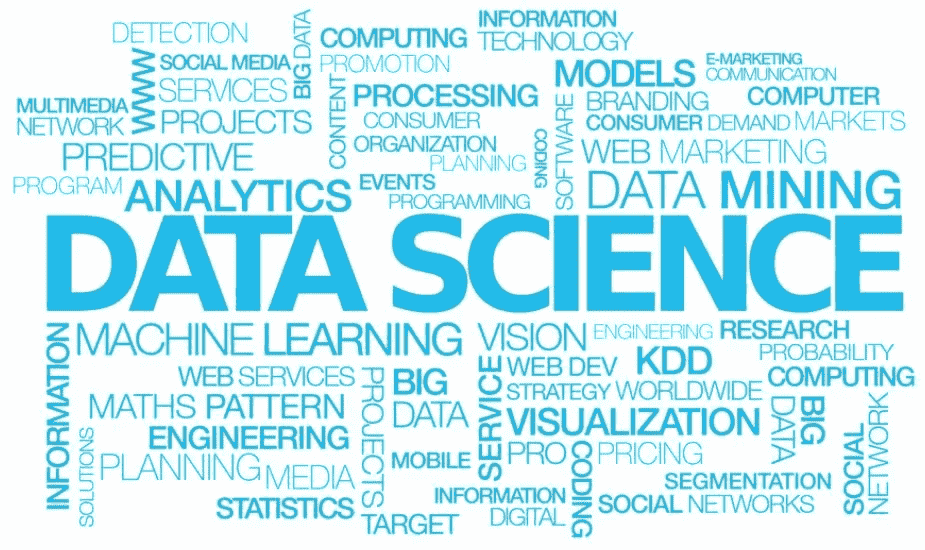

# 数据科学成功或失败的原因:

> 原文：<https://towardsdatascience.com/why-data-science-succeeds-or-fails-c24edd2d2f9?source=collection_archive---------3----------------------->

**投资几分钟可能为您的公司节省数百万美元**

**简介**

数以千计的公司领导人已经迷恋上了数据——部分原因是数据太多了，部分原因是商业媒体上写的数据科学和机器学习(ML)的潜力，部分原因是他们知道数据有价值，但他们不确定如何处理这些数据或如何提取这些数据，数据只是呈指数级增长(莱德曼，你的公司知道如何处理所有的数据吗？, 2017).然而，根据最近 [Gartner](https://www.gartner.com/en) 的一项研究，85%的数据科学项目失败了。为什么？更关键的是，你的公司怎么可能在那 15%(沃克，2017)？行业文献充满了一些常识性的原因:数据不足(Asay，2017)，技术本身而不是利润和关键绩效指标(KPI)的驱动因素(Taylor，2017)，沟通不畅(Taylor，2017)，高管支持不足(Taylor，2017)，过于复杂(Veeramachaneni，2016)，以及问题焦点过于狭窄(Veeramachaneni，2016)。

然而，作为一名数据科学家和组织领导者，它回避了一个问题，这些是否只是症状，而不是导致数据科学项目生病的原因。他们的根本原因是什么？在这些下游后果的上游是否存在元问题，这样，如果这些“疾病”的来源被识别和解决，症状被预防，数据科学/ML 项目保持健康？

**数据科学成功的根本原因&失败**

**1。团队多元化——跨职能团队—**20 世纪 90 年代中期，我大学毕业后的第一份工作是为世界上第一家端到端全球电信公司工作，当时互联网——以及数据流量——正经历着飞速增长。因为他们已经与 40 个国家的 2，000 个客户签订了价值 7 亿美元的合同，这些合同都是基于数据质量的最低服务级别协议(SLA ),所以提前足够长的时间预测数据质量故障(这些故障将触发合同规定的经济处罚)以采取措施预防这些故障是至关重要的。要做到这一点，他们需要创建传输质量的多维数据流，将其存储在数据仓库中，然后开发定制工具来自动分析、预测和提醒服务类型和区域何时会违反 SLA，并发出足够的通知来阻止它，从而通过避免处罚来确保其跨国客户的满意度和自身的盈利能力。

这个成功的多年项目几乎在发射台上爆炸了，原因和数据科学项目失败的原因一样——他们错误地假设一个精通几种语言和工具的程序员可以:(a)用这些工具做任何事情；(b)找出所有其他的元素——成功地识别需求、技术策略、统计数据、用户体验、质量保证、培训和交付。

有类比。想象一下，雇佣一个有才华的糕点师来发展你的餐厅——有一个明星糕点师可以做得很好，但他将创造其他食物类型，开发菜单，创造和最大化就餐体验，为食客服务，推广和营销餐厅，管理财务等。或者，想象一下，想用一个熟练的木雕师建造一座豪宅。虽然雕刻可能是最棒的，但是谁来开发这个地方，为这个建筑确定最佳方向，设计它，获得许可，开发这个系统，做砖石工程，盖屋顶，装玻璃，美化和装饰它呢？

在这样的框架下，答案似乎显而易见:即使是才华横溢的程序员单独工作，也可能无法实现重大的数据科学计划，因为这需要跨职能技能和人才的更大多样性。引用一家领先的 ML 咨询公司的话，“数据科学家应该具有商业洞察力，理解数据背后的数学，并与熟练的开发人员协同工作”(Tereschenko，2017)。虽然理论上可以设想一名数据科学家拥有跨许多功能和工具的知识平衡，但在现实生活中，他们就像独角兽一样——很难找到。那么，什么才是理想的数据科学或 ML 团队呢？好吧，这是一场有趣而热闹的行业辩论；然而，就像理想的软件开发团队是跨职能的一样，数据科学和 ML 也是如此——本质上，它是特定类型的软件开发团队的特定案例。虽然每个团队成员都有类似传统的职能，但更重要的是关注职能的表现，而不是头衔:

**(A)项目领导**——这有两种形式:(I)有经验的项目经理创建路线图，知道潜在的陷阱，管理人员和预算和交付物，并确保高质量的交付物，按时和在预算内，超过预期；以及(ii)技术领导，他通常对如何最好地满足功能和业务需求的技术要素有最终建议(如果不是批准的话)。双方经常在团队建设中发挥作用；然而，他们很少是同一个人。

**(B)** **策略师** —这可能是一个在统计学、生物统计学、预测分析、人工智能和机器学习方法方面有广泛经验的人。通常，他们有能力将业务问题或研究问题转化为最合适的数据科学模型，解释结果，比较评估模型，知道何时使用哪些统计工具、监督学习和非监督学习算法，以及哪些类型(例如，用于比例因果关系的[随机森林](https://en.wikipedia.org/wiki/Random_forest)——特别是对于大数据，哪些模型过度拟合或拟合不足以及如何改进，用于搜索引擎功能的[梯度推进](https://en.wikipedia.org/wiki/Gradient_boosting)， 何时以及如何使用像 [Tableau](https://www.tableau.com/) 这样的仪表盘向一线的公司用户实时普及数据，在零售中使用 [K-means](https://en.wikipedia.org/wiki/K-means_clustering) 或[自组织地图](https://en.wikipedia.org/wiki/Self-organizing_map)进行客户细分或聚类，何时以及如何在电子零售中使用[集体预测分析“群体智慧”](/on-the-wisdom-of-crowds-collective-predictive-analytics-302b7ca1c513)等。 )，以及对如何使用数据类型、清理、训练等的高级理解。简而言之，战略家专门研究什么时候做什么，他们很可能能够从不同领域创造新的创新方法来解决问题，并且在高层次上知道如何这样做。

**(C)沟通/翻译**——《哈佛商业评论[(莱德曼，2017)中的托马斯·莱德曼说:“最好的数据科学家会出来和人们交谈。”。最佳需求是通过与最终用户的大量对话发现的，经过记录、审查、编辑，然后确定优先级。这些问答环节需要法庭提问的技巧，以及与从熟练工人到管理层到高管的每个人的轻松对话。理想情况下，他们还拥有广泛的商业知识，了解流程如何工作，帮助企业发展和盈利的关键问题是什么。此外，他们需要成为翻译专家，能够在需求、功能性解决方案和解决该问题的技术之间架起一座桥梁。他们一部分是分析师，一部分是专家，一部分是作者，几乎总是撰写开发者和程序员所依赖的详细的功能性和技术性需求文档。有时，这些分析师-沟通者-作者也是领导文档和培训的完美人选——这就是它的作用、工作方式和原因——因为他们已经彻底了解业务问题和解决方案，并且完全有能力向他们已经建立关系的人阐述和解释它们。](https://hbr.org/2017/01/the-best-data-scientists-get-out-and-talk-to-people)

**【D】****—在大多数技术周期的开始，一切都是定制编码的，因为带有图形用户界面的软件包还不存在。这曾经是统计学的真理；然而，现在 MATLAB、Minitab、SAS 和 SPSS 是基于图形的软件包的领导者，使数据科学家能够更快、更准确地获得结果，而不需要投入宝贵而昂贵的时间来编程或调试代码。在我看来，使用图形工具进行软件开发的人是“开发人员”，用语言编写代码的人是“程序员”。在数据科学中，从定制编码到图形化编程工具的转变可以说是半途而废。当然，有一些图形化的解决方案，包括上面提到的那些，可以很快地完成出色的工作，可以用代码定制，但通常不需要这么做；然而，对于定制应用程序，仍然有一个与程序员一起定制代码的合理的好理由——通常使用 Python 或 R，这取决于它是一个需要其他功能的通用应用程序，还是纯粹的数据科学和统计学。今天，在你的团队中可能仍然有必要同时拥有这两种技能。即使你正在使用下一代自动化的人工智能工具——比如[数据机器人](https://www.datarobot.com/),它可以并行排列几十种流行的人工智能模型和算法，从而节省数月的猜测和费力的模型构建——最好的算法仍然需要在定制的生产环境中构建。开发人员和程序员是“如何做”的人。**

****【E】****数据工程**——“只有 3%的公司数据符合基本质量标准”2017 年发现三位研究人员(Nagle，2017)。这种数据的可信度问题有多种形式——“脏数据”，可能被错误分类、错误识别或仅仅是错误的——缺失数据，或者可能是最麻烦的——看起来是正确的数据；然而，它有多种定义。它创造了一个前端质量保证关卡，需要确保数据在进入数据科学分析或工程流程之前尽可能准确。虽然有处理缺失数据的策略—删除记录、插入剩余数据的平均值或中值、移除缺失数据元素平均值 2.5 倍的异常值，但这肯定很耗时—知道如何以及何时使用每种策略至关重要。理想情况下，这个人可能是在跨系统提取、转换和加载(ETL)数据方面有丰富经验的人，并且还必须对每个环境中已经使用和正在使用的数据字典和定义有敏锐的理解。当公司合并他们自己或系统时，这个问题会成倍增加，因为每个实体通常都有自己的数据系统和定义，它们的一致性是整体和企业范围的数据科学项目的先决条件。数据工程师是开发人员和程序员关注的细节“如何”的无价伙伴。**

****(F)** **质量保证/测试** —这可能是数据科学团队中最容易被忽视的职能；然而，这是至关重要的。在传统的软件开发生命周期中，测试人员查看功能需求，并确保解决方案做了它应该做的事情。然后，他们试图通过用户做的奇怪事情来破坏它，或者给它加载太多数据来进行压力测试。在数据科学的发展中，由于统计和数学，它有了额外的意义，这些必须是正确的才能得到有价值的答案和预测。否则，该公司实际上投资了数十万或数百万美元在一台超级高效的错误答案生成机器上，这台机器将提供错误信息和误导，而不是提供信息和帮助。这样做一次，它所造成的不信任可能一代企业领导人都无法克服。从战术质量保证方法来看，他们批判性地回答了一些问题，如数据科学工具是否针对多代数据进行了测试(通常是从培训中获得的)，相关性或关联性是否与因果关系不正确地融合在一起，是否使用了一种统计工具来假设非标准化数据的标准化数据分布，数据不平衡是否会导致右倾或左倾分布，数据类型是否在方法中不正确地混合(例如，连续型与分类型等)。).如果一个团队告诉我，他们花了项目持续时间的 33%在分析和设计上，33%在开发上，33%在 QA/测试上，我觉得这是一个合理和健康的时间和资源分配。**

****2。数据多样性&广度——从哪里开始** — [Don Wedding](https://www.linkedin.com/in/donaldwedding/) ，我在[西北大学](https://sps.northwestern.edu/masters/data-science/curriculum.php)的一位出色的预测分析教授，也是 [SAS 研究所](https://www.sas.com/en_us/home.html)的前技术负责人，他用一个类比来表达机器学习的功效在很大程度上取决于起点的重要性。如果你问一个 ML 算法地球上的最高点是哪里，它会从阿拉斯加开始蛮力、试错，它可能会说麦金利山。如果从亚洲开始，它可能会说珠穆朗玛峰。如果它从死亡谷开始，它可能会说一个当地的草原土拨鼠洞边缘。结果分别是非常好、完美和非常差(婚礼，2017)。**

**类似的问题也出现在数据科学在基因组学中的应用。今天使用的大多数基因组数据库或生物库是来自西欧血统的高加索人的样本。正如零售业中的欺诈检测寻找行为异常值一样，在基因组 ML 应用中，变体是游戏的名称。什么是正常的基因组足迹，什么时候，什么地方，为什么有些东西与正常足迹不同？因此，除非数据来自多样化的人群，且样本与人群一致，当 ML 算法识别出变异体与常模的“差异”以指示疾病、抗性等时。，这很可能仅仅是因为变异来自数据集中代表性不足的少数群体，这是一个错误的假设。所有这些都是说，在数据科学项目的数据工程方面，数据的广度和多样性是关键，否则，该技术只会更有效地给你一个误导性的答案，以及错误的信心。**

****3。理解上下文核心问题**—Don Wedding 还提出了“分析型狼人”的概念，这些事情是更深层的潜在问题，导致公司认为他们应该从事数据科学或机器学习来“杀死狼人”(Wedding，2017)。Wedding 教授也是一家*财富 500 强*公司的首席数据科学家，他根据自己丰富的经验认为:(a)对 ML 的兴趣通常意味着缺乏分析或统计人才，sa 技能有限或工具过时，计算能力或模型不足，或数据质量问题；以及(b)客户通常使用数据科学或 ML 计划作为“银弹”,以获得专业咨询服务来弥补他们的分析差距、增加工具和/或培训、升级软件、更强的计算能力(例如，过渡到云或更强大的处理器或更大的内存、过渡到分布式计算架构、更快的数据库吞吐量等)。)、重组数据库架构或任何组合。这些潜在的需求、动机和解决方案不一定一点都不好；然而，当形成数据科学或 ML 计划时，重要的是将推荐或需要数据科学的动机和原因的饼状图放在上下文中。不了解问题就无法提供有效的解决方案。**

****4。有用吗？**——我们数据科学家是一群极客。行业期刊，更不用说学术同行评审期刊了，充斥着依靠晦涩难懂的行话来调整这个过程算法或那个公式以更好地预测. 01，或者过度或欠拟合修正以实现递增的更好结果的文章。当然，这些纯粹的研究型文章对推动该领域的发展非常重要。例如，如果一个人正在人工智能应用于医学科学的新兴领域工作，这可能是我们最终比我们的祖先活得更长(或不活)的原因，逐步提高图像读取或疾病预测的准确性可以延长成千上万人的预期寿命；然而，在商业中，大部分数据科学投资回报(ROI)更简单。如果一个数据科学解决方案增加的利润超过其成本，过于简单，它就是成功的。更具体地说，如果数据科学解决方案可以将客户盈利能力、细分、获取、行为预测、保留或偏好提高 10%以上，这可能是一个巨大的成功。如果它能在每个领域重复达到 10%以上，它可能会让你成为竞争领域的领导者。**

****5。他们会用吗？** —这个问题的答案可能在很大程度上取决于它对普通观众的可解释性以及他们的信任程度(Gray，2017)。围绕数据科学的 AI-ML 方面(相对于统计方面)有一点肮脏的秘密，[在技术出版社](https://www.technologyreview.com/s/604087/the-dark-secret-at-the-heart-of-ai/) (Knight，2017)中不止一次地写过这个秘密。也就是说，当 ML 涉及无监督学习时，可能很难确定模型是如何得到其答案的，并且由于这种不可理解性，一般管理人员和外行用户可能不愿意信任它。想象一下，如果一个无监督的 ML 算法预测你的新孩子将在 20 年后患上一种疾病，这种疾病可能会大大缩短他/她的预期寿命。因此，他们的基因应该在出生后立即进行编辑，以试图预防疾病；然而，这种基因编辑也可能有不可预见的下游后果，可能导致其他问题。你会做吗？答案可能很大程度上取决于你是否理解为什么算法会预测到这一点。缺乏对结果/预测的信任，决策者会对采取行动过敏。有了统计学，甚至监督学习，数据科学的侧面，我们可以教育决策者为什么机器做出这样的预测或发现；在无监督的 ML 中，它自己学习，缺少解释它对人类做了什么的反馈循环，我们经常不知道它是如何得出结论的。信任或不信任。**

****合奏是关键****

**最后，数据科学和 ML 的未来可以说是将模型和方法结合成一个整体，优于单独的应用程序。成功的数据科学项目也是如此。最成功的方法可能不会最大化上述五个根本原因或驱动因素中的任何一个，但会在所有五个方面产生最高的平均值。例如，客户可能信任并因此使用[一个在线分析处理(OLAP)多维数据集](https://en.wikipedia.org/wiki/OLAP_cube)，它以一种比 k-means 或自组织图更容易理解的方式对客户进行图形化细分，即使后者更复杂、更精确、更自动化。类似地，确定因果要素并将其构建到预测模型中的最佳 ML 方法可能是决策树，然后由数据机器人进行自动预测模型比较；然而，如果团队没有这些工具，而是有擅长 TensorFlow 的 Python 程序员，或者可以产生逻辑回归的 Minitab 实例(通常几乎和 ML 一样好)，这种平衡很可能会胜出。**

**类似地，在理想世界中，这里列出的几个字母化的跨职能团队能力将在同一个人身上找到。一个项目的所有者，如果他们搜索并且运气好的话，会找到多用途的团队成员。例如，一个项目经理，他也是一个熟练的、经验丰富的沟通者和战略家，或者一个技术领导，他可以是一个开发人员/程序员和测试人员。团队中的人员节点越少，他们就越容易、有效和高效地一起工作——并且通常价值越大(对于服务提供商来说，这也可以更有利可图，因为在资源成本保持不变的情况下，一些功能的收费比其他功能更高)。虽然一个跨职能的团队成员可能单位时间花费更多，但它可以为客户或项目节省两个人，这两个人几乎以相同的速度工作。**

**史蒂夫·乔布斯(Steve Jobs)被认为是成功应用这些在 21 世纪变得无处不在的跨学科和专业领域的最终关键——也许具有讽刺意味的是，因为他受过有限的正规教育——他解释了苹果电脑巨大的长期创新引擎:“大多数公司雇佣聪明人，然后告诉他们怎么做，我们雇佣聪明人，让他们告诉我们怎么做。”**

***Eric Luellen 自 1997 年以来一直领导全球预测分析领域的软件开发项目，拥有西北大学的信息学硕士学位，他的论文设计了基于高维图像进行预测的新集成机器学习方法，并成为 2016 年斯坦福 MedX C3 奖* *和 2017 年* [*世界科技奖*](https://www.wtn.net/) *的全球决赛选手。***

# **引用的作品**

**m . asay(2017 年 7 月 12 日)。机器学习大规模失败的 3 种方式(也是成功的一个关键)。 *Tech Republic* ，PP .[https://www . Tech Republic . com/article/3-ways-to-massive-fail-with-machine-learning-and-one-key-to-success/。](https://www.techrepublic.com/article/3-ways-to-massively-fail-with-machine-learning-and-one-key-to-success/.)**

**格雷，K. (2017 年 7 月 20 日)。AI 可能是个麻烦的队友。*哈佛商业评论*，页[https://hbr.org/2017/07/ai-can-be-a-troublesome-teammate.](https://hbr.org/2017/07/ai-can-be-a-troublesome-teammate.)**

**骑士，W. (2017 年 4 月 11 日)。人工智能核心的黑暗秘密。*麻省理工科技评论*，PP .[https://www . Technology Review . com/s/604087/the-dark-secret-at-the-heart-of-ai/。](https://www.technologyreview.com/s/604087/the-dark-secret-at-the-heart-of-ai/.)**

**茨韦塔纳格勒，茨韦塔纳莱德曼，萨蒙，D. (2017 年 9 月 11 日)。只有 3%的公司数据符合基本质量标准。*《哈佛商业评论》*，PP .[https://HBR . org/2017/09/only-3-of-companies-data-meets-basic-quality-standards。](https://hbr.org/2017/09/only-3-of-companies-data-meets-basic-quality-standards.)**

**t .莱德曼(2017 年 6 月 15 日)。你的公司知道如何处理所有的数据吗？*《哈佛商业评论》*，PP .[https://HBR . org/2017/06/does-your-company-know-what-do-its-all-data。](https://hbr.org/2017/06/does-your-company-know-what-to-do-with-all-its-data.)**

**t .莱德曼(2017 年 1 月 26 日)。最好的数据科学家出来和人们交谈。*哈佛商业评论*，PP .[https://HBR . org/2017/01/the-best-data-scientists-get-out-and-talk-to-people。](https://hbr.org/2017/01/the-best-data-scientists-get-out-and-talk-to-people.)**

**t .莱德曼(2018 年 1 月 25 日)。你在让你的数据科学家失败吗？*哈佛商业评论*，PP .[https://HBR . org/2018/01/are-you-setting-your-data-scientists-up-to-fail。](https://hbr.org/2018/01/are-you-setting-your-data-scientists-up-to-fail.)**

**泰勒，B. (2017 年 10 月 16 日)。为什么大多数 AI 项目会失败。数据机器人博客、https://blog.datarobot.com/why-most-ai-projects-fail.[页](https://blog.datarobot.com/why-most-ai-projects-fail.)**

**捷列先科，M. (2017 年 12 月 9 日)。*当 ML 即服务不起作用时，建立一个跨职能团队。*从 DZone 中检索:[https://DZone . com/articles/building-a-cross-functional-team-when-ml-as-a-serv](https://dzone.com/articles/building-a-cross-functional-team-when-ml-as-a-serv)**

**k . veeramachaneni(2016 年 12 月 7 日)。为什么您没有从数据科学中获得价值。*哈佛商业评论*，PP .[https://HBR . org/2016/12/why-you-not-get-value-from-you-data-science。](https://hbr.org/2016/12/why-youre-not-getting-value-from-your-data-science.)**

**j .沃克(2017 年 11 月 23 日)。*大数据战略令人失望，85%的失败率*。检索自数字期刊:[http://www . Digital Journal . com/tech-and-science/technology/big-data-strategies-despair-with-based-percent-failure-rate/article/508325 # ixzz 5 JVG k3av 0](http://www.digitaljournal.com/tech-and-science/technology/big-data-strategies-disappoint-with-85-percent-failure-rate/article/508325#ixzz5JvGk3AV0)**

**婚礼，D. (2017)。*预测建模。* (D. Wedding，表演者)美国伊利诺伊州埃文斯顿西北大学。**

**虽然跳过这些时间密集的步骤是一个普遍的想法，但是团队这样做是自担风险的，因为他们奠定了项目的期望、功能和目的的基础。在这位作者看来，最理想的情况是，它们被彻底完成，然后开始一个[快速应用程序开发(RAD)](https://www.techopedia.com/definition/3982/rapid-application-development-rad) 过程，在这个过程中，团队离开并在 30 天内回来并问:“你是这个意思吗？”并对解决方案草案进行另一个 30 天的审核周期的编辑。2-3 个短周期的产品通常比一个漫长的开发过程要好很多。**