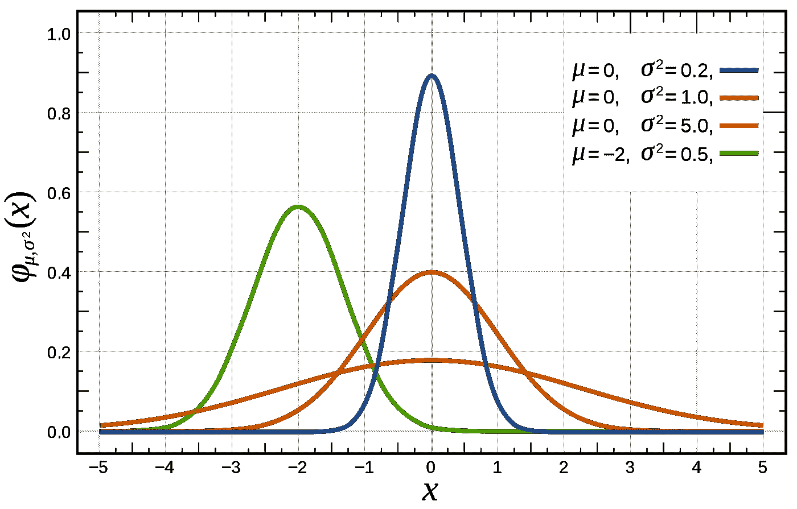
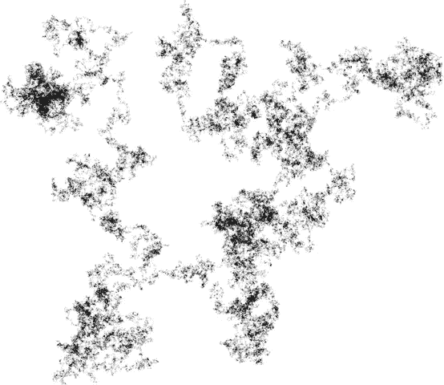

# 为什么数据科学家喜欢高斯？

> 原文：<https://towardsdatascience.com/why-data-scientists-love-gaussian-6e7a7b726859?source=collection_archive---------1----------------------->

Visual representation of Gaussian distribution.

对于深度学习和机器学习工程师来说，在世界上所有的概率模型中，高斯分布模型非常突出。即使你从未从事过人工智能项目，你也有很大的机会遇到高斯模型。

高斯分布模型通常以其标志性的钟形曲线而闻名，也称为正态分布，之所以如此流行主要是因为三个原因。

Mathematical formula for Gaussian probability distribution function.

# 普遍存在于自然现象中

> 所有的模型都是错的，但有些是有用的！—乔治·博克斯

Position of particles that experience diffusion can be described using a Gaussian distribution.

自然和社会科学中难以置信的大量过程自然遵循高斯分布。即使它们不一致，高斯模型也能给出这些过程的最佳模型近似值。一些例子包括-

*   我们成年人的身高、血压和智力
*   经历扩散的粒子的位置
*   测量误差

# 数学推理:中心极限定理

Random walk in two dimension with two million steps.

中心极限定理指出，当我们添加大量独立的随机变量时，不管这些变量的原始分布如何，它们的归一化和都趋向于高斯分布。例如，随机行走中覆盖的总距离的分布趋向于高斯概率分布。

该定理的含义包括，专门为高斯模型开发的大量科学和统计方法也可以应用于可能涉及任何其他类型分布的广泛问题。

该定理也可以看作是对许多自然现象遵循高斯分布的解释。

## 一次是高斯，永远是高斯！

与许多其他在变换时改变其性质的分布不同，高斯分布倾向于保持高斯分布。

*   两个高斯的乘积是一个高斯
*   两个独立的高斯随机变量之和是一个高斯
*   高斯与另一个高斯的卷积是高斯
*   高斯的傅立叶变换是高斯的

# 简单

Occam Razor is a philosophical principle that emphasized that the simpler solution is the best one given that all other things are same.

对于每个高斯模型近似，可能存在给出更好近似的复杂多参数分布。但高斯仍然是首选，因为它使数学简单得多！

*   它的均值、中值和众数都是一样的
*   整个分布可以用两个参数来确定——均值和方差

高斯分布以伟大的数学家和物理学家卡尔·弗里德里希·高斯的名字命名。