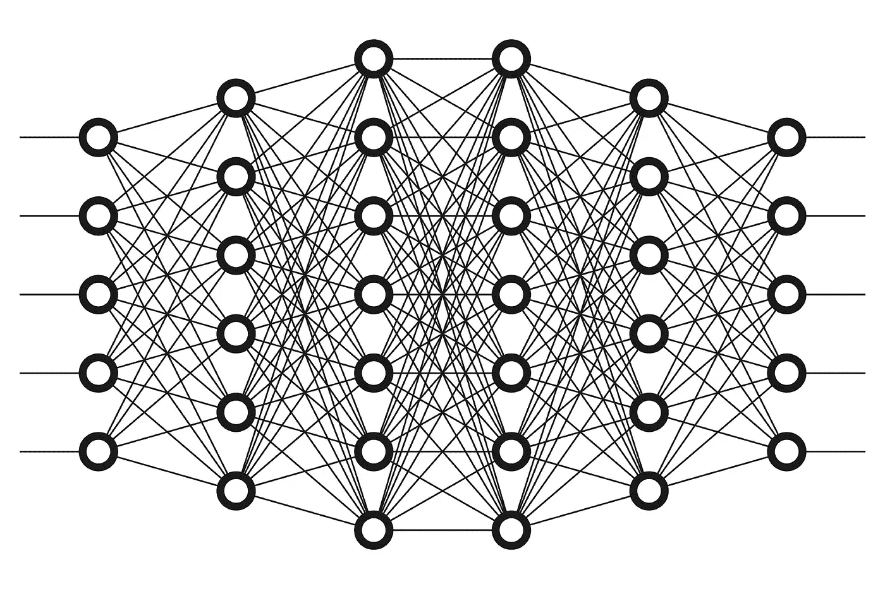
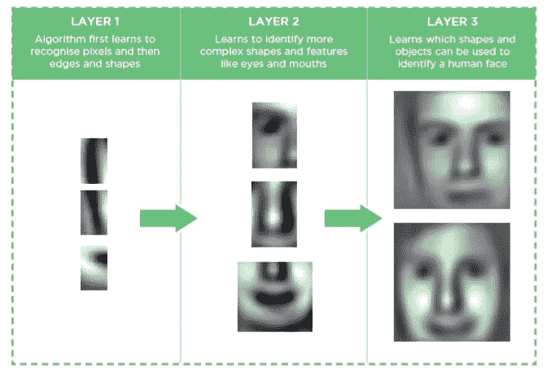
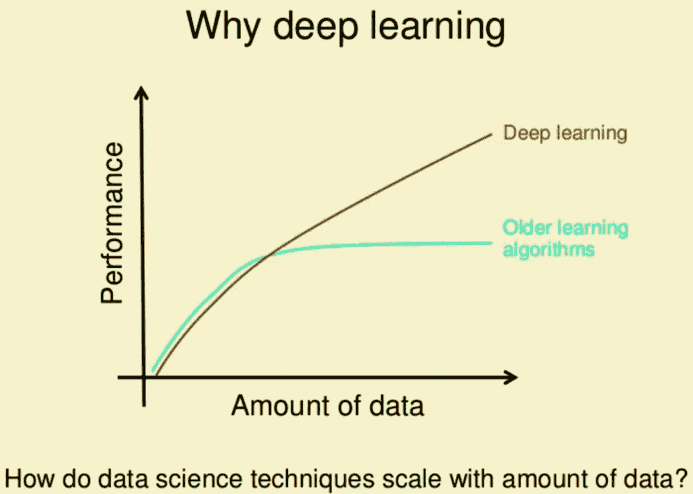
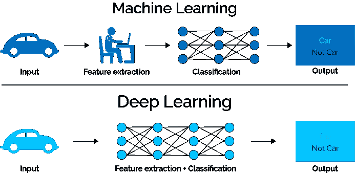
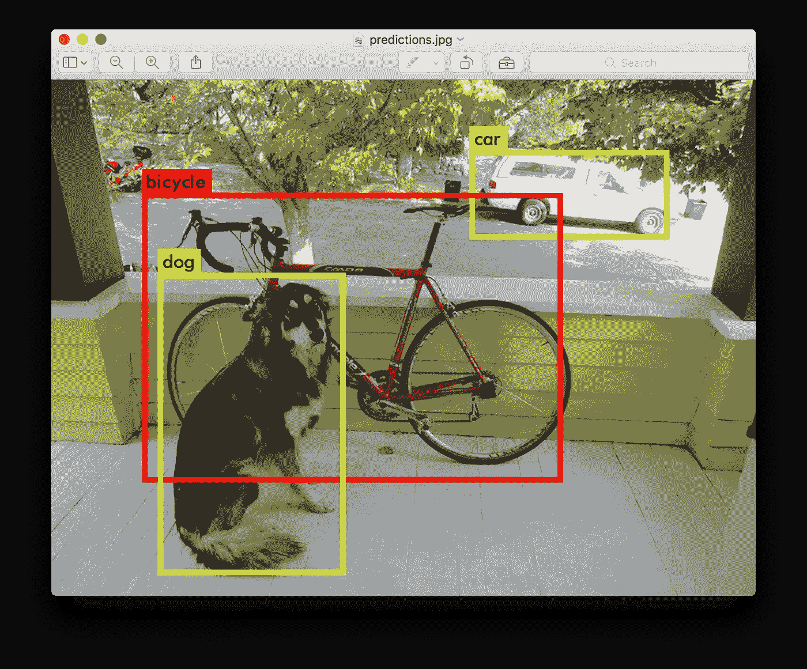

# 为什么深度学习优于传统的机器学习？

> 原文：<https://towardsdatascience.com/why-deep-learning-is-needed-over-traditional-machine-learning-1b6a99177063?source=collection_archive---------0----------------------->

**人工智能**火了！突然间，每个人，不管懂不懂，都在谈论它。理解人工智能的最新进展可能看起来势不可挡，但它实际上可以归结为两个非常流行的概念**机器学习**和**深度学习**。但最近，**深度学习**越来越受欢迎，因为在用大量数据训练时，它在准确性方面占据优势。

为了向你展示深度学习得到的关注，下面是关键词的谷歌趋势:

Trend of “Deep Learning” in google

软件业如今正朝着机器智能的方向发展。**机器学习**作为让机器智能化的一种方式，在每个领域都变得必不可少。更简单地说， ***机器学习是一套解析数据的算法，从中学习，然后应用所学知识做出智能决策*** *。*

**机器学习**的例子比比皆是。这就是网飞如何知道你下一个想看的节目，或者脸书如何在数码照片中认出你朋友的脸。或者在你进行 CSAT 调查之前，客户服务代表如何知道你对他们的支持是否满意。

传统的**机器学习**算法的问题在于，尽管它们看起来很复杂，但它们仍然像机器一样。他们需要很多领域的专业知识，人工干预只能做他们设计的事情；不多不少。对于人工智能设计师和世界上的其他人来说，这是深度学习更有希望的地方。

# **什么是深度学习？**

实际上，**深度学习**是**机器学习*的一个子集，它通过学习将世界表示为嵌套的概念层次结构来实现强大的功能和灵活性，每个概念都是相对于更简单的概念来定义的，而更抽象的表示是根据更不抽象的概念来计算的。***

详细地说，深度学习技术通过它的隐藏层架构逐步学习类别，首先定义像字母这样的低级类别，然后定义像单词这样的稍高级别类别，然后定义像句子这样的高级别类别。在图像识别的例子中，这意味着在对线条和形状进行分类之前识别亮/暗区域，以便进行人脸识别。网络中的每个神经元或节点代表整体的一个方面，它们一起提供了图像的完整表示。每个节点或隐藏层都有一个权重，代表其与输出的关系强度，随着模型的发展，权重会进行调整。

Deep Learning Architecture

# **深度学习的显著特征**

深度学习的一大优势，也是理解它为什么变得流行的一个关键部分，是它由海量数据驱动。技术的“大数据时代”将为深度学习的新创新提供大量机会。按照中国主要搜索引擎百度首席科学家、【谷歌大脑】项目负责人之一*****的说法，深度学习的比喻是，火箭引擎是深度学习模型，燃料是我们可以喂给这些算法的海量数据。*****

****

****深度学习**需要高端机器与传统**机器学习**算法相反。GPU 现在已经成为执行任何**深度学习**算法不可或缺的一部分。**

**在传统的**机器学习**技术中，大多数应用的特征需要由领域专家来识别，以降低数据的复杂性，并使模式对学习算法的工作更加可见。前面讨论的深度学习算法的最大优势是，它们试图以增量的方式从数据中学习高级特征。这消除了领域专业知识和核心特征提取的需要。**

****

****深度学习**和**机器学习**技术的另一个主要区别是解决问题的方法。**深度学习**技术倾向于端到端地解决问题，而**机器学习**技术需要首先将问题语句分解成不同的部分来解决，然后在最后阶段将它们的结果组合起来。例如，对于一个多对象检测问题，**深度学习**技术，如 **Yolo net t** 将图像作为输入，并在输出时提供对象的位置和名称。但是在通常的**机器学习**算法中，如 **SVM** ，首先需要一个包围盒对象检测算法来识别所有可能的对象，以将**拱**作为学习算法的输入，以便识别相关对象。**

****

**通常一个**深度学习**算法由于参数数量大，训练时间长。流行的 **ResNet** 算法完全从零开始训练大约需要两周时间。传统的**机器学习**算法需要几秒到几个小时来训练。在测试阶段，情况完全相反。测试时，**深度学习**算法运行时间要少得多。然而，如果将它与 k-最近邻(一种机器学习算法)进行比较，测试时间会随着数据大小的增加而增加。尽管这并不适用于所有的机器学习算法，因为其中一些算法的测试时间也很短。**

**可解释性是为什么许多部门使用其他**机器学习**技术而不是**深度学习**的主要问题。我们举个例子。假设我们用深度学习来计算一个文档的相关度得分。它的表现相当出色，接近人类的表现。但是有一个问题。它没有透露为什么给出这个分数。事实上，从数学上讲，你可以找出深层神经网络的哪些节点被激活了，但我们不知道这些神经元应该模拟什么，以及这些神经元层集体在做什么。所以我们无法解释结果。这与**机器学习**算法不同，如决策树、逻辑回归等。**

# ****什么时候用深度学习还是不要超过别人？****

1.  ****深度学习** out 执行其他技术如果 ***数据量大*** 。但是对于小数据量，传统的**机器学习**算法更可取。**
2.  ****深度学习**技术需要有 ***高端基础设施*** 在合理的时间内进行训练。**
3.  **当 ***缺乏领域理解的特性自省*** ，**深度学习**技术一枝独秀，因为你不必太担心特性工程。**
4.  ****深度学习**在处理图像分类 ***、自然语言处理*** 等复杂问题时，确实大放异彩。**

****参考文献-****

** [## 深度学习什么时候比支持向量机或者随机森林效果更好？

### 如果我们处理一个监督学习问题，我的建议是从最简单的假设空间开始。也就是说，尝试…

www.kdnuggets.com](https://www.kdnuggets.com/2016/04/deep-learning-vs-svm-random-forest.html)  [## 何时选择深度学习

### 深度学习适合机器学习和其他优化算法的什么地方，它能解决什么样的问题…

deeplearning4j.org](https://deeplearning4j.org/whydeeplearning.html)  [## 机器学习与深度学习

### 如果你是这个领域的新手，可能会觉得有很多术语需要记住。两个最大的嗡嗡声…

www.datascience.com](https://www.datascience.com/blog/machine-learning-and-deep-learning-what-is-the-difference)**