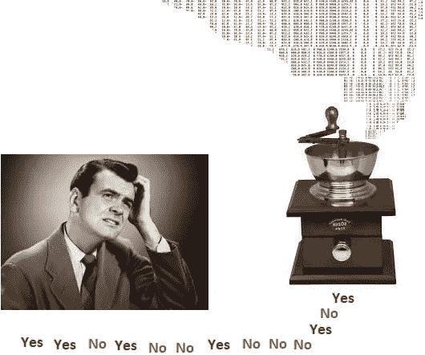
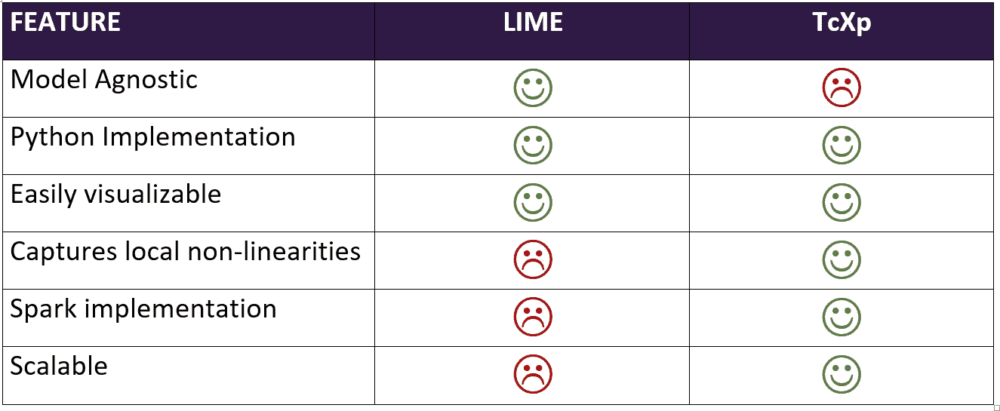
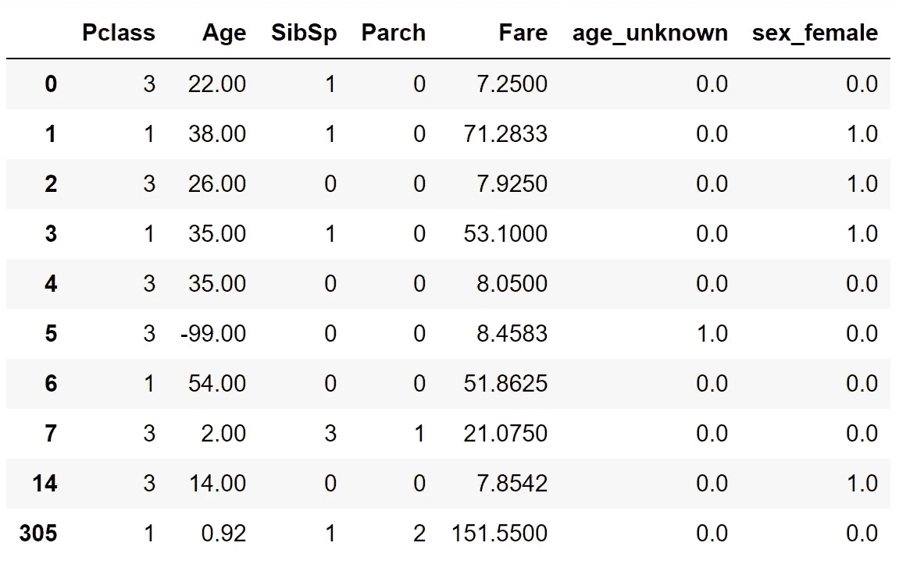
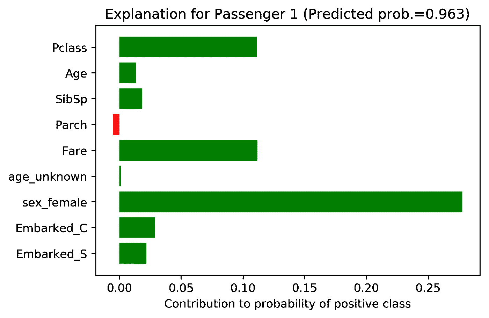
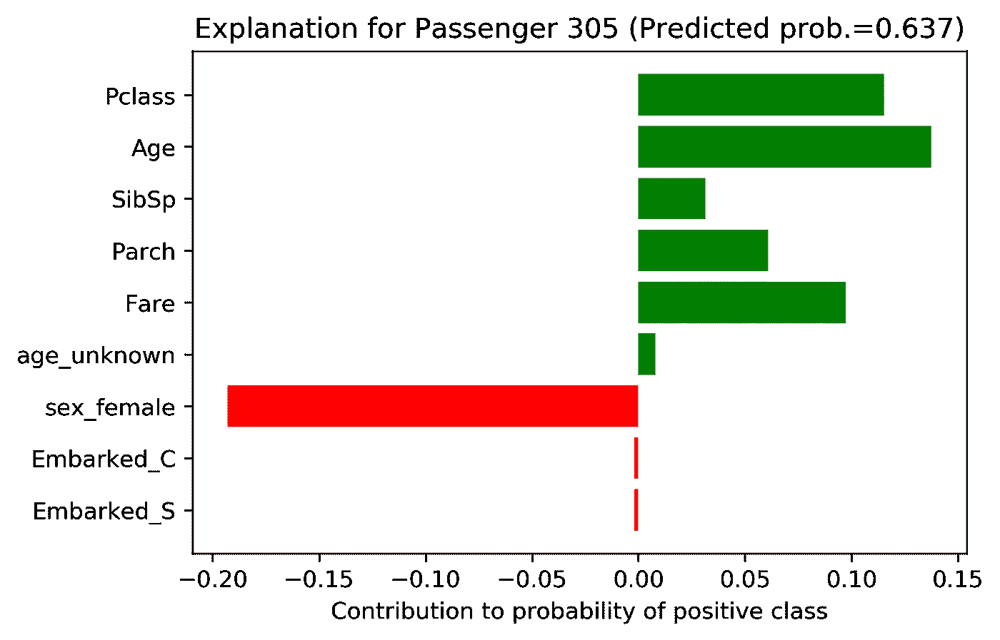

# 为什么你的模型预测到了？(第 2 部分，共 2 部分)

> 原文：<https://towardsdatascience.com/why-did-your-model-predict-that-part-2-of-2-48e3d50e1daf?source=collection_archive---------8----------------------->

这篇文章的第一部分，[请点击这里](https://medium.com/@mateini_12893/why-did-your-model-predict-that-4f7ed3526397)。在那里，我们激发了对分类器预测解释的需求，提到了以前的工作(LIME 包)并详细描述了我们的算法。

Not understanding the predictions of a machine-learning model.

这个帖子会比较短。有四个部分。

*   在**第 1 节中，**我们给出了代码实现的链接
*   在**第 2 节中，**我们将我们的算法特性与 LIME 的进行了并排比较
*   在第 3 节**，**中，我们用一个教学例子来说明我们算法的使用。
*   在第 4 节中，我们展示了我们的结论。

## 1.代码实现

我们以非常短的 Python 模块**tcxp**(**t**REE-**c**classifier e**XP**lanation)的形式实现了上述方法，该模块依赖于决策树分类器和随机森林的 scikit-learn 实现。代码可以在[羽西环球](http://www.yuxiglobal.com)的公开共享数据分析库[这里](https://github.com/YuxiGlobal/data-analytics/tree/master/tree_classif_explain/py)找到。

提供的 Python 代码仅用于说明和教学目的，因为它肯定不是可能的最佳实现。它包含一对嵌套循环:一个在实例 x[ *i* 上，另一个在给定树中这些实例所遵循的路径的节点上。后一个循环可以通过使用 np.take 和 np.diff 进行矢量化来完成。此外，整个过程可以很容易地移植到 Cython，以产生真正优化的版本。

我们还制作了代码的 Spark 2.2 实现，依赖于 Spark 自己的 ML 库(spark-ml)，可以在这里找到[。](https://github.com/YuxiGlobal/data-analytics/tree/master/tree_classif_explain/spark)

## 2.与石灰的对比

下表总结了与 LIME 相比，我们的解释生成算法及其实现的一些关键特性。每一项的详细信息包含在第一部分的[第 3 节中。](https://medium.com/@mateini_12893/why-did-your-model-predict-that-4f7ed3526397)

## 3.一个例子

让我们通过一个例子来说明 Python 模块的用法。

我们考虑 Kaggle 的经典*泰坦尼克号:灾难中的机器学习*二进制分类任务。在这项任务中，我们得到了一个由 891 条记录组成的训练集，每条记录都包含泰坦尼克号上一名乘客的信息。这些字段包括性别、年龄、乘客级别、支付的票价、与乘客同行的兄弟姐妹和父母的数量以及他们上船的港口。除此之外，还有一个“幸存”二进制列，告诉我们哪些乘客在沉船事件中幸存。该任务的目标是训练一个监督模型，根据给定的乘客变量尽可能好地预测该类别。

下面的代码从 scikit-learn 导入了必要的类来训练一个随机森林分类器，以及从我们开发的 tcxp 模块中导入了 **rf_explain** 函数。

最后一行执行训练数据的少量预处理。结果如下所示。

A sample of train_df

现在可以用几行代码训练一个随机森林:

最后一行计算的准确度是 85%。对几行工作来说还不错。然而，这并不是我们所寻求的最高精度。我们想直观地了解为什么模型会做出预测。

这是通过对 rf_explain_function 的一个函数调用来完成的

这个调用返回(1)，一个 891 乘 9(特征的数量)的矩阵，包含解释数组作为行，以及(2)，p[0]概率，它是一个乘客在没有考虑他们的任何特征的情况下在泰坦尼克号事件中幸存的*先验*概率。

现在让我们来看看几位乘客，看看他们的预测和解释是否

**乘客 1** (上表第二排)预计有 0.963 的生还概率，事实上她幸存了下来。解释数组如下:tc_exps[1，:]=[0.11 0.01 0.02-0.01 0.11 0.00 0.28 0.03 0.02]，不过最好在一个图中看到:

这名乘客幸存下来并不令人惊讶，因为头等舱的女性乘客生还的可能性非常高。解释数组将这些特征与票价(与 Pclass 高度相关)一起显示为预测的最具决定性的特征。

**14 号乘客(**上表中倒数第二排)没有成功，我们的模型正确预测了相对较低的生存概率。要解释为什么，我们来看看解释情节:

在这种情况下，她乘坐三等舱旅行的事实对她的生存机会产生了负面影响。

一个更有趣的案例由**乘客 305** (上表最后一行)**、**提出，他幸存了下来，尽管他是男性:

我们看到，他乘坐的航班，但主要是他的年龄，以及他与父母和兄弟姐妹一起旅行的事实，导致他的生存概率为 67.7%。

## 结论

正如最后一节所示，我们的树分类器解释方法很可能产生合理的解释，并阐明否则黑盒 ML 架构的预测。这种方法和其他更通用的方法(如 LIME)一起，产生了一些希望，希望有一天这些高级算法可以摆脱目前的坏名声。与任何其他解释方法一样，我们的方法为从这种模型的预测中得出的更聪明的指令性行动开辟了道路。