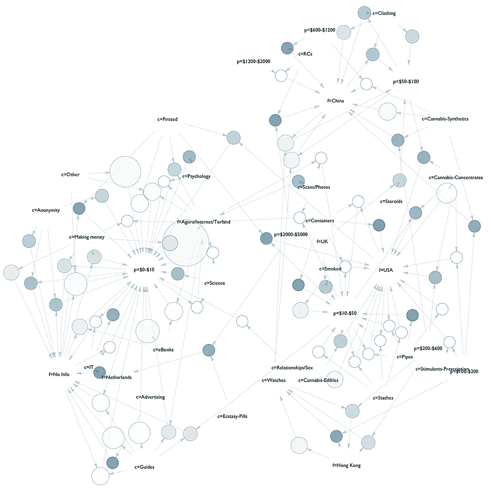
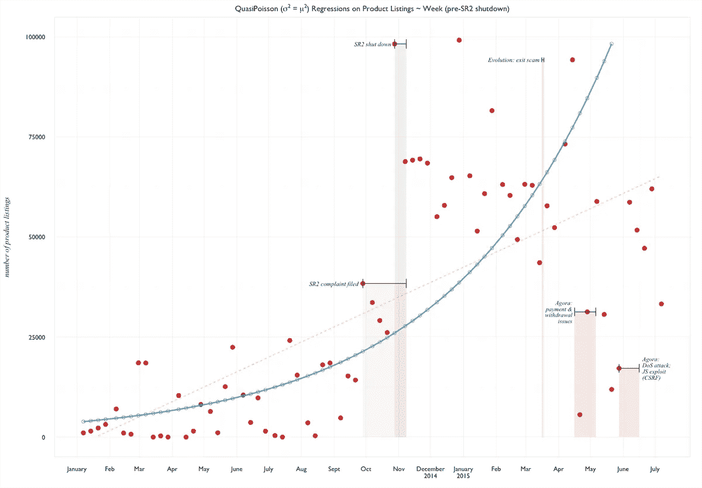

# 为什么要这么做？

> 原文：<https://towardsdatascience.com/why-do-this-4f2adcc646a1?source=collection_archive---------5----------------------->

做什么？写作。 ***那又怎样？***

# 准反市场动机

严格来说，我是个摄影师。2016 年 4 月，我开始在线学习一门名为*数据科学基础*的课程。在这里，我学会了收集、可视化和分析数据。决定选修这门课是几个月来对算法进行独立研究的结果，这些算法积极地塑造了我们日常生活的许多方面。

Technically, I take pictures like this for a living. (Kate Spade Valentine’s Day Gift Guide, campaign 2017)

我们日常生活的哪些部分？Instagram &脸书的新闻、内容和图片。还包括将我点击到亚马逊的广告，以及网飞或 Spotify 的内容“监管”。我很不满意不知道这些大公司是如何向我提供内容的——关于意识到我对这些近乎垄断的公司的依赖，以及它们如何有能力塑造我的日常情绪和前景。

Customers who bought this, also bought that: Association Rule Mining a darknet market listings database, from my first (unfinished) R project. Looks like spaghetti, but glad to get a feel for some of the workings behind Amazon’s recommendation engine. Dataset source: [gwern.net](http://gwern.net)

快进——一年后，我在 R 语言中已经有足够的流畅性来收集数据、可视化数据并执行一些基本的分析。我仍然需要查找*置信区间*并检查我的正则表达式(并发现更多的 ggplot 统计和几何)。但是，当异常值变得难以控制时，我觉得可以在普通最小二乘法上执行稳健回归，或者当变量数量变得无法控制时，切换到随机森林。有一天我甚至可能会用到贝叶斯方法。

# **好吧，但是“为什么？”**

因此，经过一年的稳步训练，我在统计分析中尽可能做到客观——我意识到没人在乎。相关性？因果关系？异常？'那又怎样？'我发现这个问题变得更难回答了。

我发现大多数艺术学校的同龄人并不真正喜欢数学；光是这个想法就能让他们中的一些人感到厌恶。我会在另一个咆哮中指责教育方法。也许不喜欢自己不了解的东西是很自然的。不过，对这类事情感到好奇似乎更有趣。

An early foray into explaining the obvious: charting darknet market sizes after the demise of Silk Road 2\. Data originally from [gwern.net](http://gwern.net)

# 那么，为什么呢？“那又怎么样？”

如果问题是*“那又怎样？”*，那么学习写作似乎是一条通往答案的道路。以及将 InDesign 拉入 vis 工作流(todo:学习 Illustrator)。我敢打赌，我可以找到至少 10 篇文章，引用来自数据科学世界的写作和交流的重要性。我打赌这些文章也存在于其他科学领域和自助手册中。我可以多读 10 篇这样的文章，或者点击这一篇，所以——

希望这是题目中问题的部分答案。

:)

# 笔记

我早该知道的——我一直试图回答“那又怎样？”多年来。遍及各个领域，这是一个很大的问题。