# 梯度下降为什么有效？

> 原文：<https://towardsdatascience.com/why-does-gradient-descent-work-128713588136?source=collection_archive---------6----------------------->

## 你可能明白，但你见过吗？

**我)何苦呢**

首先，让我们把房间里的大象弄走。你为什么要读这个博客？首先，因为它有很棒的动画，如下图 1 所示。你不想知道这张照片里发生了什么吗？

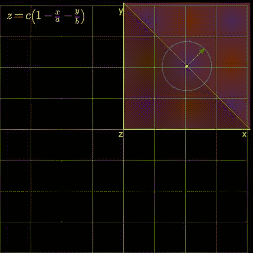

Figure 1: A plane with its gradient. Created by author using: [https://github.com/ryu577/pyray](https://github.com/ryu577/pyray)

第二，因为优化非常非常重要。我不管你是谁，那应该是真的。我的意思是，这是寻找最好的科学。它让你选择你对“最好”的定义，然后不管那可能是什么，告诉你你能做什么来实现它。就这么简单。
此外，尽管最优化——作为一门完整的科学——有很多深度，但它有一个基本的一阶技术，叫做“梯度下降”,非常容易理解。事实证明，这项技术实际上是实践中应用最广泛的。至少在机器学习中，随着模型变得越来越复杂，使用复杂的优化算法变得越来越困难。所以大家就用梯度下降。换句话说，学习梯度下降，你就学会了最简单，但也是最优化中最广泛使用的技术。那么，让我们非常直观地理解这个技巧。

**II)优化要点**

正如我在上一节提到的，优化是非常棒的。它包括取一个单一的数字——例如，你银行账户里的钱的数量，或者你床上的臭虫的数量——并告诉你如何使它尽可能好(如果你像大多数人一样，第一种情况下高，第二种情况下低)。让我们称这个东西为我们试图优化的 z.
当然这里隐含的假设是，我们可以以某种方式控制我们想要优化的东西。假设它依赖于某个变量(比如 x，它在我们的控制之内。所以，在 x 的每一个值上，都有 z 的某个值(我们想找到使 z 最好的 x)。可能有一些等式可以描述这个图。假设 f(x，z) = 0。但是在最优化的背景下，我们需要用以下形式来表示:z= f(x)(假设原方程有利于这样分离 z 和 x)。然后，我们可以问——“x 的什么值对应最佳 z？”。如果我们有一个很好的连续函数，那么有一点我们可以肯定的说，在这个特殊的 x 处，z= f(x)的导数(一般用 f'(x)表示)将为零。

**III)什么是梯度**

当我们要优化的东西依赖于不止一个变量时，导数的概念就延伸到了梯度。所以，如果上面的 z 依赖于 x 和 y，我们可以把它们收集到一个单独的向量 u = [x，y]。因此，当 z= f(x，y) = f(u)时，z 的梯度变为:

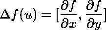

就像导数一样，我们可以确定，优化 z 的 u 值，会使梯度的两个分量都等于零。
顺便提一下，梯度在任何光滑、可微函数的泰勒级数展开中起着重要作用:

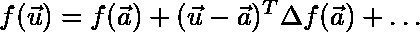

Equation (1)

如你所见，右边的前两项只涉及 u，没有平方、立方或更高的幂(那些在后面的项中出现)。前两项恰好也是 u=a 附近函数的最佳线性近似。下面我们展示简单抛物面(z = x + y)的线性近似。

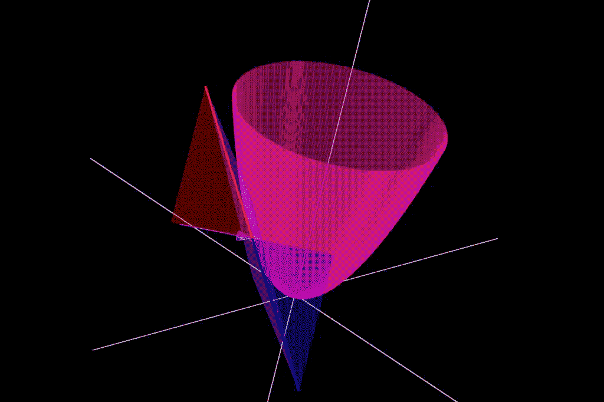

Figure 2: The best approximation of a paraboloid (pink) by a plane (purple) at various points. Created for this blog using: [https://github.com/ryu577/pyray](https://github.com/ryu577/pyray)

**IV)线性函数**

我们在上一节中看到，梯度可以用线性函数很好地表示。因此，我们将限制讨论线性函数。对于一个线性函数的方程，我们只需要知道它与轴的交点。
如果我们只有一个维度(x 轴),相交发生在 x=a，我们可以这样描述

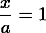

Equation (2)

如果我们有两个维度(x 轴和 y 轴),并且直线在 x=a 处与 x 轴相交，在 y=b 处与 y 轴相交，则等式变为

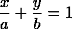

Equation (3)

当 y=0 时，我们得到 x/a=1，和上面的等式一样。
如果我们有三维空间会怎么样？我想你知道这是怎么回事

Equation (4)

以此类推(顺便说一下，这就是你在上面的图 1 中看到的红色飞机)。
现在，我们可以看到上面所有的方程在 x，y，z 等方向上都是对称的。然而，在优化的上下文中，它们中的一个具有特殊的地位。这是我们寻求优化的变量。假设这个特殊变量是 z，在我们想把这个表示成一个优化问题的时候，需要把方程表示成 z=f(x)。如果我们对等式(4)这样做，我们得到的是

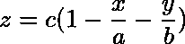

Equation (5)

我想增加我的线性函数。我应该去哪里？

这是这个博客的中心问题。你有上面方程描述的线性函数，x 和 y 在你的控制之下。你发现自己处于(x，y)的某个值。为了简单起见，我们假设在当前点 z=0。你可以沿着任何方向走 1 个单位的一步。问题变成了，你应该朝哪个方向迈出这一步？下面的图 3 展示了这个难题，展示了你可以走的无限的方向。每个方向以不同的量改变目标函数 z。因此，其中一个将最大程度地增加 z，而另一个将最大程度地减少 z(取决于我们想要最大化还是最小化它的天气)。
请注意，如果我们的控制中只有一个变量(比如 x ),这就容易多了。只有两个方向可供选择(增加 x 或减少 x)。然而，一旦我们有了两个或更多的自由变量，选择的数量就会从两个跳到无穷大。

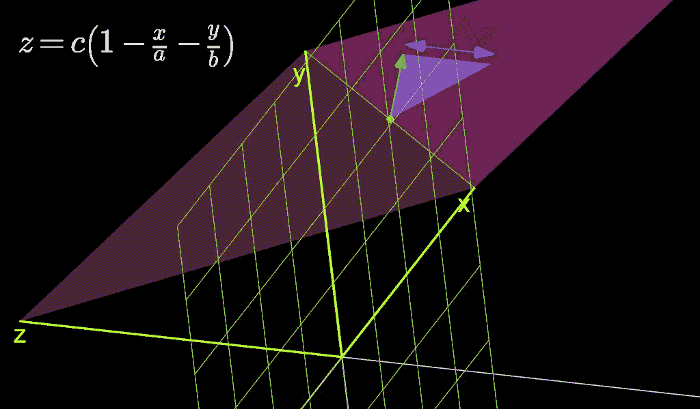

Figure 3: The infinite directions we can move along. Which one should we choose? Created for this blog using: [https://github.com/ryu577/pyray](https://github.com/ryu577/pyray)

现在，我们想找出 z 变化最大的方向。所以我们反其道而行之(说，因为我们有点疯狂？).我们来寻找 z 完全不变的方向。如果你仔细观察上图，你会发现当绿色箭头与橙色线(绿色网格和红色平面相交的线)对齐时会发生这种情况。如果你继续盯着看，你可能会注意到当绿色箭头垂直于橙色线时，z 变化最大。因此，这条橙色的线似乎可以让我们对这个问题有所了解。那么橙色线是什么？很明显，这是我们的平面与代表 x-y 平面的绿色网格(我们可以沿着它移动的网格)相交的地方。x-y 平面的方程是什么？它将是 z=0。换句话说，z 在上面不变。所以，既然橙线完全位于网格上，那么它也一定在网格上处处都有 z=0。难怪当我们的绿色箭头使我们简单地沿着橙色线移动时，z 拒绝改变。

至于橙色线的方程，就是平面的方程-

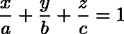

和 x-y 网格；z=0 同时得到满足。这给了我们

现在，从上面橙色线的方程可以清楚地看出，当 y=0 时，x=a .所以，它与 x 轴相交的点的位置向量为 o_x : [a，0] (o 代表橙色)。同样，它与 y 轴相交的点是 o_y : [0，b]。现在我们有了直线上两点的位置向量，我们减去它们得到一个沿直线的向量(o)。

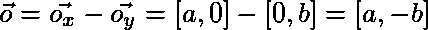

Equation (6)

现在，如果我们能证明梯度垂直于这个向量，我们就完成了。这将给我们一些直觉，为什么梯度变化 z 最大。

**VI)平面的倾斜度**

将第三节中梯度的定义应用于上方平面的方程(x/a+y/b+z/c=1 ),我们得到-

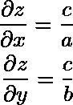

Equation (7)

这使得梯度:

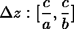

Equation (8)

现在，我们知道两个向量要正交，它们的点积必须为零。取点积或平面的梯度(来自等式(7))和沿着橙色线的矢量(来自等式(6))，我们得到，

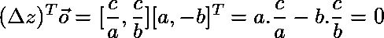

Equation (9)

我们知道了，梯度与垂直于橙线的方向一致，所以，它改变 z 最大。事实证明，沿梯度方向增加 z 最多，而沿相反方向(注意，这两个方向都与橙色线正交)减少 z 最多。

我将留给你们这个可视化的演示，当我们改变平面时，梯度继续顽固地指向改变它最大的方向。

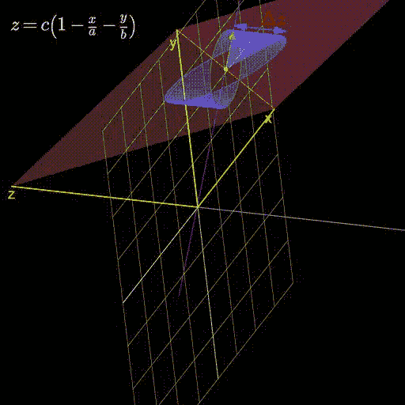

Figure 4: As we change the plane, the gradient always aligns itself with the direction that changes it the most. Crated for this blog using: [https://github.com/ryu577/pyray](https://github.com/ryu577/pyray)