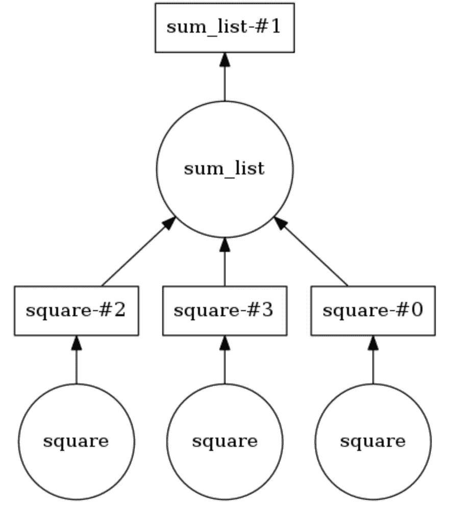

# 为什么每个数据科学家都应该使用 Dask？

> 原文：<https://towardsdatascience.com/why-every-data-scientist-should-use-dask-81b2b850e15b?source=collection_archive---------0----------------------->

> 2021 年更新:如果你正在寻找运行 Dask 的快捷方式，请尝试 [SaturnCloud](https://www.saturncloud.io/s/home/) ，它甚至提供免费计划。

Dask 是我遇到的最具革命性的数据处理工具。如果你喜欢熊猫和 Numpy，但有时又苦于数据无法放入 RAM，那么 Dask 绝对是你所需要的。Dask 支持 Pandas dataframe 和 Numpy 数组数据结构，既可以在本地计算机上运行，也可以扩展到集群上运行。本质上，您只需编写一次代码，然后选择在本地运行它，或者使用普通的 Pythonic 语法部署到多节点集群。这本身就是一个很好的特性，但这并不是我写这篇博客并说每个数据科学家(至少是使用 Python 的)都应该使用 Dask 的原因。对我来说，Dask 的神奇之处在于，只需进行最少的代码更改，我就可以利用笔记本电脑上已有的处理能力并行运行代码。并行处理数据意味着更少的执行时间、更少的等待时间和更多的分析时间！这篇博文将讨论 dask.delayed 及其如何融入数据科学工作流。

Photograph from [https://pixabay.com/en/skiing-departure-wag-trace-curves-16263/](https://pixabay.com/en/skiing-departure-wag-trace-curves-16263/)

> “Dask 为分析提供高级并行性，为您喜爱的工具提供规模化性能”——【https://dask.pydata.org/en/latest/ 

## 熟悉 Dask

作为对 Dask 的介绍，我将从几个例子开始，向您展示它完全不引人注目的自然语法。这里的主要收获是，您可以使用您已经知道的东西，而无需学习新的大数据工具，如 Hadoop 或 Spark。

Dask 引入了 3 个并行集合，能够存储大于 RAM 的数据，即数据帧、包和数组。这些集合类型中的每一种都能够使用在 RAM 和硬盘之间分区的数据，以及分布在集群中的多个节点上的数据。

Dask 数据帧由较小的拆分 Pandas 数据帧组成，因此允许 Pandas 查询语法的子集。以下是在 2018 年加载所有 csv 文件、解析时间戳字段，然后运行 Pandas 查询的示例代码:

Dask Dataframe example

Dask 包能够存储和处理内存中无法容纳的 Pythonic 对象集合。Dask 包非常适合处理日志和 json 文档集合。在这个代码示例中，2018 年的所有 json 文件都被加载到 Dask Bag 数据结构中，每个 json 记录都被解析，并使用 lambda 函数过滤用户:

Dask Bag example

Dask 数组支持 Numpy 类切片。在以下代码示例中，HDF5 数据集被分成(5000，5000)个维度块:

Dask Array example

## 利用 Dask 进行并行处理

该部分的另一个准确名称是“顺序循环的死亡”。我经常遇到的一个常见模式是循环遍历一个项目列表，并用不同的输入参数对每个项目执行一个 python 方法。常见的数据处理场景包括，为每个客户计算功能聚合或为每个学生执行日志事件聚合。Dask Delayed 允许并行处理多个项目，而不是按顺序对循环中的每个项目执行函数。随着 Dask 的延迟，每个函数调用被排队，添加到执行图和调度。

编写自定义线程处理或使用 asyncio 对我来说总是有点乏味，所以我甚至不打算向您展示比较示例。有了 Dask，您不需要改变您的编程风格或语法！您只需要用@dask.delayed 注释或包装将要并行执行的方法，并在循环代码后调用 compute 方法。

Example Dask computation graph

在下面的例子中，用@dask.delayed 对两个方法进行了注释。三个数字存储在一个列表中，必须对它们进行平方，然后集体求和。Dask 构建了一个计算图，它确保“平方”方法并行运行，输出作为一个列表整理，然后传递给 sum_list 方法。计算图可以通过调用。可视化()。打电话。compute()执行计算图。正如您在输出中看到的，列表项没有按顺序处理，而是并行运行。

Dask Delayed demonstration

可以设置线程的数量(即 dask . set _ options(pool = thread pool(10))，也可以很容易地切换到您的笔记本电脑或个人桌面上使用的进程(即 dask . config . set(scheduler = ' processes))。

我已经说明了使用 Dask 向您的数据科学工作流添加并行处理是微不足道的。我最近使用 Dask 将用户点击流数据分成 40 分钟的会话，并为聚类建立用户聚合功能。请分享你如何使用 Dask 的描述，作为对这篇博文的评论。快乐 Dasking…..

## 额外资源

*   dask cheat sheet[https://dask . pydata . org/en/latest/_ downloads/dask cheat sheet . pdf](https://dask.pydata.org/en/latest/_downloads/daskcheatsheet.pdf)
*   16 分钟大 Dask 概述视频【https://www.youtube.com/watch?v=ods97a5Pzw0
    T3
*   详细 Dask 概述视频(40 分钟)
    [https://www.youtube.com/watch?v=mjQ7tCQxYFQ](https://www.youtube.com/watch?v=mjQ7tCQxYFQ)