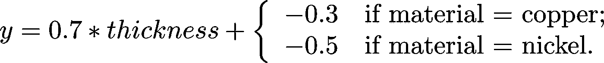
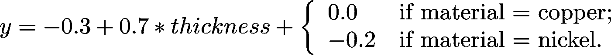
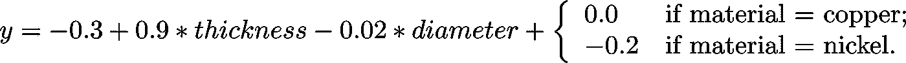

# 为什么机器学习模型中的特征权重没有意义

> 原文：<https://towardsdatascience.com/why-feature-weights-in-a-machine-learning-model-are-meaningless-b0cd22a4c159?source=collection_archive---------5----------------------->

## 不要根据 ML 模型的权重来做决定

当我看到我们的客户爱上了 [BigQuery ML](https://cloud.google.com/bigquery/docs/bigqueryml) 时，一个老问题浮出了水面——我发现他们无法抗拒赋予特征权重意义的诱惑。

“在我的模型中，预测客户终身价值的最大权重，”他们可能会说，“是客户是否收到了高管的感谢电话。”或者，他们可能会看到负权重，并得出一个可怕的结论:“位于城市地区的商店导致负满意度。”

请不要这样做。不要让你的主管给每个客户打电话！不要关闭你所有的城市位置！

Don’t make decisions based on the weights of your machine learning model

不要根据你的机器学习模型的权重来做决定。为什么不呢？

## 分类权重是自由参数

我们举个简单的例子。假设您想要创建一个模型来预测硬币的重量。你的机器学习模型将有三个输入——硬币的直径、硬币的厚度和硬币的材料。

也许在对您的大型硬币数据集训练模型后，您最终会得到这个模型:

Model to predict the weight of a model

该材料的负面术语不代表任何东西。例如，我们可以将部分权重移入“偏差”项，并创建一个等效模型:

This model is equivalent to the one above

换句话说，分类变量为模型如何分配权重提供了很大的余地。这完全是随机的。

## 因变量也提供自由参数

假设结果是，在你的现实世界数据集中，更大的硬币也更厚。那么，你的模型可能是:

因此，现在直径特征的权重为负，因为它基本上抵消了赋予厚度的额外正权重。

显然，较大的硬币会更重，但因为它们在我们收集数据集的真实世界中也更厚，所以单个要素权重不会反映这一点。

## 不要做就是了

底线是，你不能从重量的大小或重量的符号得出结论。作为人类，我们需要可解释性，但在现实世界的数据集中，这可能相当困难。

像[置换输入](https://christophm.github.io/interpretable-ml-book/feature-importance.html)、[石灰](https://arxiv.org/pdf/1602.04938v1.pdf)和[综合梯度](https://arxiv.org/abs/1703.01365)这样的方法有些帮助，但是除非你也清楚地知道特征间的依赖关系，否则基于这些更复杂的方法做出昂贵的决定是危险的。特性重要性是特定模型中的重要性，通常不会转化为现实生活中的重要性。

## 真的，不要

预测终身价值或客户满意度的模型是很好的——您肯定可以使用这些模型来确定哪些客户需要照顾，哪些交易需要调查。这是因为该模型是在一个大型数据集上训练的，以准确预测这一点。

然而，与单个特征相关的权重是不可解释的。不应使用输入特征量(“高管销售电话具有巨大的权重”)或特征符号(“城市商店导致满意度低”)来得出结论。你不应该使用一个预测终身价值的模型来强制要求每个客户都需要收到一封来自高管的个性化邮件。