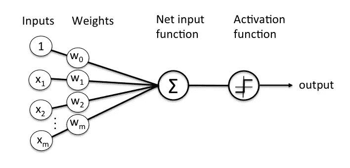
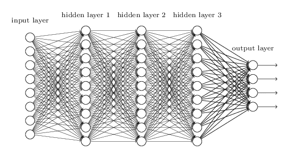
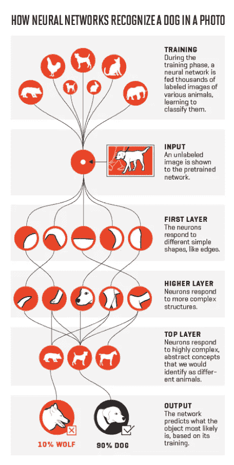
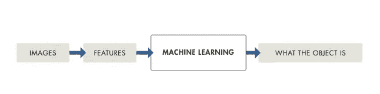
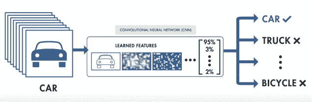

# 为什么要用大量数据进行深度学习？

> 原文：<https://towardsdatascience.com/why-go-large-with-data-for-deep-learning-12eee16f708?source=collection_archive---------4----------------------->

吃一碗面条对我来说从来都不容易。现在我不怪筷子(还没学会怎么用筷子)，而是讨厌面条里的卷心菜。通过整理这些美味的食物，我在狼吞虎咽之前，干净利落地挑出卷心菜丝。

我如何区分一条卷心菜和一根面条？如果不是因为在技术领域模仿人类神经元模型的重要性日益增加，我可能永远不会考虑这个问题。

为了试图复制令人惊叹的人类智能，大量的努力被用来将机器变成像人类一样的理性生物。这不仅仅是另一种时尚，而是艾伦·图灵的一个想法，他相信训练机器从过去的经验中学习。

很快，机器开始玩跳棋和象棋，击败人类冠军。尽管游戏很有趣，但更大的教训是，如果人工系统能够像我们一样“学习”，并将获得的智能应用到现实生活场景中，人工系统会变得多么有用——想想自动驾驶汽车。

**学习的进化:**

编程例程实现了一定程度的自动化，但逻辑和代码必须由人来输入。人工智能的概念，虽然最初与神奇的机器人联系在一起，但很快就缩小到预测和分类分析。

决策树、聚类和贝叶斯网络被认为是预测用户音乐偏好和对臭名昭著的垃圾邮件进行分类的手段。虽然这种传统的 ML 方法为许多分类问题提供了简单的解决方案，但仍在寻求一种更好的方法来像人类一样无缝地识别语音、图像、音频、视频和文本。这催生了各种深度学习方法，这些方法主要依赖有史以来最好的学习机制——人类神经元，并在最近使脸书、亚马逊、谷歌[等科技巨头对深度学习着迷](http://fortune.com/ai-artificial-intelligence-deep-machine-learning/)。

尽管最近人们的兴趣有所扩大，但早在 1957 年，弗兰克·罗森布拉特就设计出了第一台模拟单个神经元活动的感知机。我怎么能不举大脑在这里工作的例子呢！

虽然解码人脑的工作本身很难捉摸，但我们知道的是，大脑通过在树突层中传播电信号来惊人地识别物体和声音，并在超过阈值时触发积极信号。一个感知器，如下文所述，就是基于这一点而设计的。

*Image Source :* [*https://medium.com/@debparnapratiher/deep-learning-for-dummies-1-86360db18367*](https://medium.com/@debparnapratiher/deep-learning-for-dummies-1-86360db18367)

当输入的加权和[超过阈值](https://www.codeproject.com/Articles/16419/AI-Neural-Network-for-beginners-Part-of)时，输出被触发。现在我们这里只有一个单层感知器，它只对线性可分函数起作用。一些简单的事情，比如画一条线，一边是白色的绵羊，另一边是黑色的。现实世界中并非如此。

图像识别——神经网络的主要应用领域之一，处理的是识别隐藏在像素数据后面的大量 ***特征*** 。为了解读这些特征，采用了一种[多层感知器](https://www.codeproject.com/Articles/16508/AI-Neural-Network-for-beginners-Part-of)方法。与感知器类似，可以看到输入层和输出层，在输入层和输出层之间有许多“隐藏层”。

*Image Source:* [*http://neuralnetworksanddeeplearning.com/chap6.html*](http://neuralnetworksanddeeplearning.com/chap6.html)

隐藏层的数量决定了学习的深度，找到正确的层数需要反复试验。这些神经网络中的“学习”部分是这些层调整最初分配给它们的权重的方式。

虽然看到了各种学习类型， ***反向传播*** 被视为一种常见的方法，其中分配随机权重，将所看到的输出与测试数据进行比较，并通过比较两者来计算输出中的误差(即实际输出相对于预期输出)。现在，紧邻输出层的层调整其权重，导致后续内层的权重调整，直到错误率降低。

在下图中可以看到一种高级而实用的查看隐藏图层的方法。我确实应该向猫和狗道歉，因为它们已经无数次地参与到“学习”实验中来了！

虽然在示例中每个层对应于一个特定的功能看起来很简单，但是隐藏层如何工作的可解释性并不像看起来那么容易。这是因为，在典型的无监督学习场景中，隐藏层被比作黑盒，它们做它们所做的事情，但每一层背后的推理仍然像大脑一样是一个谜。

[*http://fortune.com/ai-artificial-intelligence-deep-machine-learning/*](http://fortune.com/ai-artificial-intelligence-deep-machine-learning/)

**总之，深度学习与其他机器学习方法有何不同？**

一个简单的答案就是所涉及的训练数据量和所需的计算能力。

在我阐述差异之前，人们必须理解深度学习是实现机器学习的一种手段，并且存在许多这样的 ML 方法来实现期望的学习水平。深度学习只是其中之一，由于所需的人工干预水平最低，它正迅速受到欢迎。

也就是说，**传统的 ML 模型**需要一个叫做[的特征提取](http://nikhilbuduma.com/2014/12/29/deep-learning-in-a-nutshell/)的过程，程序员必须明确地告诉在某个训练集中必须寻找什么特征。此外，当任何一个特征被遗漏时，ML 模型不能识别手里的物体。这里的重点是 ie 的算法有多好。程序员必须记住所有可能的猜测。否则，无人驾驶汽车很难发现道路上各种各样的路标和无数的物体，这种情况会危及生命。

*Image Source: Matlab tutorial on introduction to deep learning*

另一方面，深度学习是由各种例子的大型数据集提供的，模型从中学习要寻找的特征，并产生带有概率向量的输出。这个模型会自己“学习”,就像我们小时候学习数字一样。

*Image Source: Matlab tutorial on introduction to deep learning*

**太好了！那么我们为什么不早点从深度学习开始呢？**

多层感知器和反向传播方法是在 20 世纪 80 年代从理论上设计的，但由于缺乏大量数据和高处理能力，muse 逐渐消亡。自从 ***大数据和英伟达超级强大的***[***GPU***](http://www.nvidia.com/object/what-is-gpu-computing.html)问世以来，深度学习的潜力正受到前所未有的考验。

现在已经有很多关于数据集需要多大的争论。尽管有些人声称更小但多样化的数据集就可以了，但你希望模型学习的参数越多，或者手头的问题越复杂，训练所需的数据也就越多。否则，拥有更多维度但数据量小的问题会导致[过度拟合](http://www.visiondummy.com/2014/04/curse-dimensionality-affect-classification/)，这意味着你的模型实际上抢走了它的结果，并且只对你训练的集合有效，从而使分层学习无效。

为了验证大数据的必要性，让我们来看三个大容量训练数据的成功场景-

1.  脸书 著名的现代 ***人脸识别系统，恰如其分地称为“ [DeepFace](https://research.fb.com/publications/deepface-closing-the-gap-to-human-level-performance-in-face-verification/) ”，部署了 400 多万张 4000 多个身份的人脸图像训练集，在标注集上达到了 97.35%的准确率。他们的研究论文在许多地方重申了这种大型训练集如何帮助克服过度拟合的问题。***
2.  **Alex Krizhevsky**——开发 AlexNet 并与 Geoffrey Hinton 一起参与谷歌大脑事业的人和其他学者，[描述了一个涉及手眼协调的***机器人抓取*** 的学习模型](https://arxiv.org/pdf/1603.02199.pdf)。为了训练他们的网络，总共收集了 800，000 次抓取尝试，机械臂成功地学习了更广泛的抓取策略。
3.  [**Andrej kar pathy**](https://techcrunch.com/2017/06/20/tesla-hires-deep-learning-expert-andrej-karpathy-to-lead-autopilot-vision/)，特斯拉的人工智能总监，在斯坦福大学攻读博士期间使用神经网络进行 [***密集字幕***](https://cs.stanford.edu/people/karpathy/densecap.pdf)——识别图像的所有部分，而不仅仅是一只猫！该团队使用了 94，000 张图片和 4，100，000 个基于地区的字幕，从而提高了速度和准确性。

Andrej 还声称他相信他们的座右铭是保持他的数据大，算法简单，标签弱。

**那么你的数据有多大？**

支持该论点的另一方是最近的一篇关于深度面部表征的研究论文使用小数据，面部识别问题用 10，000 张训练图像解决，并发现与用 500，000 张图像训练的问题相当。但同样的情况尚未在深度学习目前涉及的其他领域得到证明——语音识别、车辆、行人和自动驾驶车辆中的地标识别、NLP 和医学成像。还发现[迁移学习](https://medium.com/nanonets/nanonets-how-to-use-deep-learning-when-you-have-limited-data-f68c0b512cab)的一个新方面需要大量预先训练的数据集。

在证明这一点之前，如果你正在寻求在你的业务中实施神经网络，比如微软的销售团队如何使用 NN 来推荐要联系的潜在客户或要推荐的产品，你需要访问大量数据，正如百度前首席数据科学家、广受欢迎的深度学习专家吴恩达所说，他将深度学习模型等同于需要大量数据燃料的火箭发动机。

现在，当我回去从我的面条中挑选卷心菜的时候(感谢我惊人的大脑)，你为什么不开始向你的人工神经网络输入丰富的数据呢！

本文最初发表于[刮刀厂](https://scrape.works/blog/go-large-data-deep-learning/)。