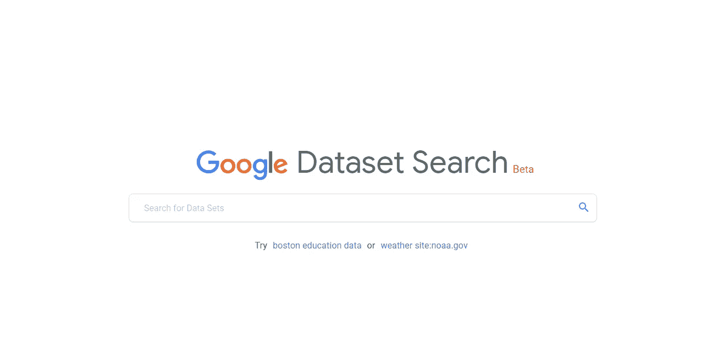
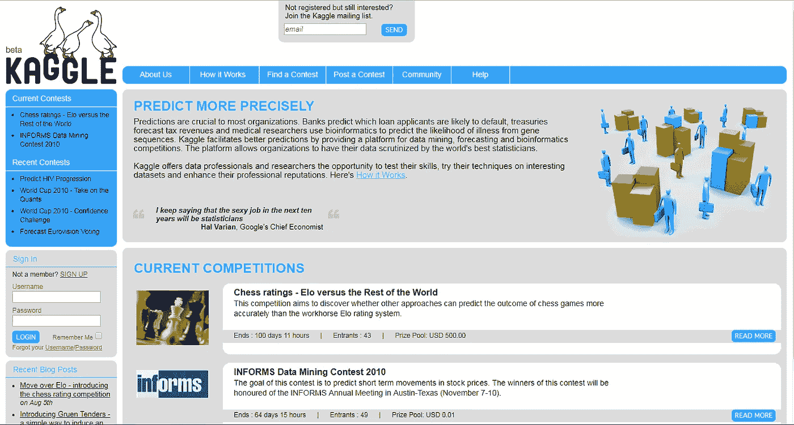
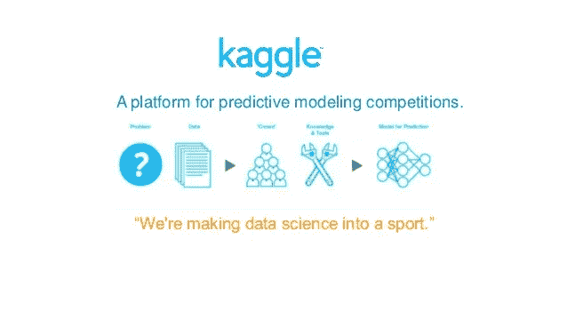
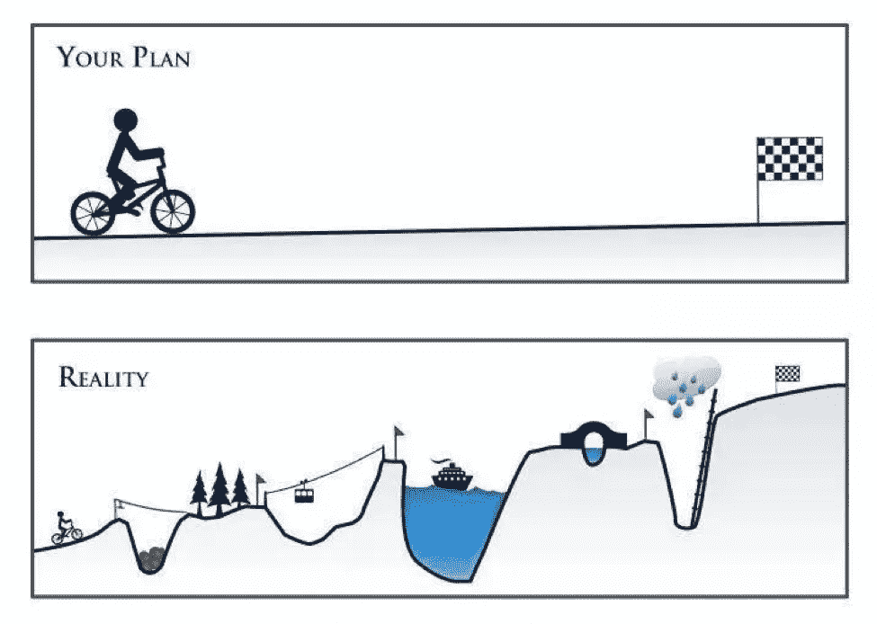
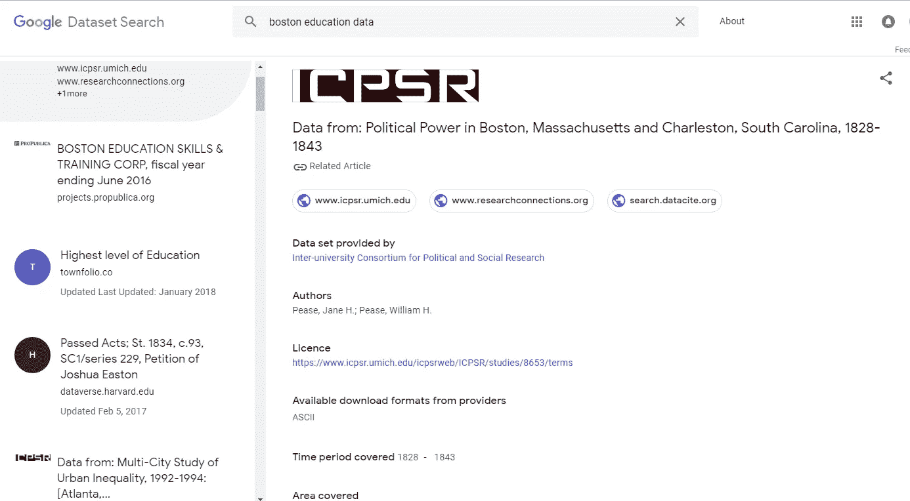

# 为什么 Google Dataset 可以彻底改变数据科学界

> 原文：<https://towardsdatascience.com/why-google-dataset-could-revolutionize-data-science-community-4c446f9181c1?source=collection_archive---------9----------------------->

让我们面对现实吧，数据集搜索比[数据清理](https://realpython.com/python-data-cleaning-numpy-pandas/)更差，或者一个悖论，如果我们按照我们的要求精心设计地收集数据，数据清理将需要更少的努力。

但并不是每次阳光普照，也不是每次我们都得到干净的完全格式化的数据，每一列都符合我们的要求，每一行都按照该列提供的参数显示所有值。事实上，我可以说你肯定不会得到完美的数据集来满足你的要求。请注意，我代表的是现实世界问题的这些场景。

现在， [Anthony Goldbloom](https://www.google.co.in/search?rlz=1C1GGRV_enIN801IN801&q=Anthony+Goldbloom&stick=H4sIAAAAAAAAAOPgE-LSz9U3SM9NSTErVAKzM_KSM3JMtdSzk630k0qLM_NSi4vhjPj8gtSixJLM_DyrtPzSvJTUIgDPTv21QwAAAA&sa=X&sqi=2&ved=2ahUKEwiGh521i6jdAhXGv7wKHd0GCyMQmxMoATAkegQIBxAo) 和 [Ben Hamner](https://www.google.co.in/search?rlz=1C1GGRV_enIN801IN801&q=Ben+Hamner&stick=H4sIAAAAAAAAAOPgE-LSz9U3SM9NSTErVOLVT9c3NEw2MUkrNCzI0VLPTrbSTyotzsxLLS6GM-LzC1KLEksy8_Os0vJL81JSiwAHtHy8RgAAAA&sa=X&sqi=2&ved=2ahUKEwiGh521i6jdAhXGv7wKHd0GCyMQmxMoAjAkegQIBxAp) 已经完全理解了这个问题，他们创建了一个[网站](https://www.kaggle.com/)纯粹专注于提供数据集和主持数据科学家之间的竞争，而不担心他们提供的数据集。

Kaggle website on April 2010

现在仍然要注意的是，这是在 2010 年的时候，当时比特币的价格仅为 0.08 美元，人们需要四年多的时间才能尝到甘的味道。

时光飞逝，现在我们已经有了一个伟大的数据科学家社区和专注于人工智能和深度学习的高端 GPU 社区。Kaggle 还在热情的数据科学家中建立了一个特殊的位置，并为他们的网站添加了许多功能。

到目前为止，Kaggle 一直是最可靠的平台，用于举办机器学习比赛，而不是对数据集感到好奇。

但是就像你“不要以貌取人”一样去 Kaggle。虽然 Kaggle 仍然是最好的竞争场所，但它不是你在现实生活中能得到的。

 [## 大数据科学:期望与现实

### 对于那些从事分析和大数据工作的人来说，过去几年就像梦想成真一样。有一个新的职业…

www.kdnuggets.com](https://www.kdnuggets.com/2016/10/big-data-science-expectation-reality.html) 

因此，我们必须在网上搜索，以获得我们机器学习算法的现成数据集，或者如果你想要特定地理区域或特定人口统计的数据集，那么你必须[收集](https://www.kdnuggets.com/2018/02/web-scraping-tutorial-python.html)数据。

但是搜集数据在 T2 很有争议，因为从技术上讲，从不同的网站搜集数据在 T4 是非法的。此外，它需要大量的计算速度和能力来收集数据。因此，这给数据科学家收集数据带来了严重的难题。

然后是谷歌数据集。

到目前为止，谷歌数据集仍处于测试阶段，但它已经在数据科学界获得了非常积极的回应。

还有很多[更多的](https://twitter.com/search?q=google%20dataset&src=typd) …。

现在[谷歌数据集](https://toolbox.google.com/datasetsearch)帮助你从各种网站获取搜索数据。即使在测试阶段，我也要说它比其他任何提供数据集搜索的平台都要好。

此外，GoogleAI 还表示，它将增加一些功能，例如获取特定地理位置的数据集，甚至直接可视化数据。

这让我很兴奋，因为这是执行机器学习 ie 的第一步。使用 google dataset 收集数据集将会更加令人兴奋。