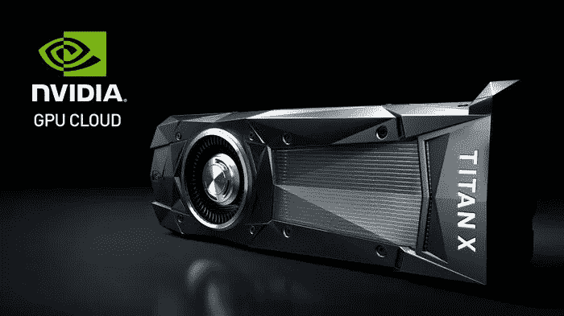

# 为什么选择 GPU？

> 原文：<https://towardsdatascience.com/why-gpus-4af616f15ab6?source=collection_archive---------12----------------------->



在深度学习社区中，GPU 支持的机器和集群将大大加快训练神经网络的时间，这已经不是秘密。在本文中，我们将研究梯度下降的运行时间，以及 GPU 在哪些方面降低了时间复杂度。

伪代码，梯度下降(为了简洁省略了一些细节)

```
While (k < max_iterations):
  select batch size n
  For each instance in n:
    Calculate network output
    For each weight dimension m:
      # arbitrarily chosen update algorithm
      delta_wi = delta_wi + eta * (desired - output) * x(n)i
  For each weight dimension m:
      wi(k+1) = wi(k) + delta_wi
  k += 1
```

该算法以 O(knm)运行，(丢弃计算网络输出所花费的时间，因为这完全依赖于网络架构，如果你在做典型的矩阵*向量运算，W^T*X).，则在每个节点可以是 O(m)

**O(knm):** 循环的 k 次迭代，批量大小的 n 个实例，权重的 m 维。

然而，神经网络算法的最佳特性之一是它们对并行化的可扩展性。我们能够将批量更新中的 **n 个实例**和 **m 个维度**拆分到我们 GPU 上的 **c 个不同内核中。**

**NVIDIA GPU 通常有> 1，000 个内核，**相比之下，CPU 速度快得惊人，但只有大约 4 到 8 个内核。这对我们的神经网络训练意味着什么？

这些内核允许我们将我们的批处理(n/c)分开，并在每个内核上并行运行训练过程。由于梯度下降更新网络中权重参数的方式，这是可能的。GD 不是在每个训练步骤后立即更新权重，而是聚集该批的误差，然后在计算完该批中所有实例的更新后更新权重。此外，权重的更新可以分开，因为这些操作也彼此独立地运行。

感谢阅读，我希望这能帮助你获得一些关于 GPU 和梯度下降算法的直觉！如果你有兴趣尝试 GPU，我强烈推荐 [Google Colab 运行时。](https://medium.com/deep-learning-turkey/google-colab-free-gpu-tutorial-e113627b9f5d)

# [CShorten](https://medium.com/@connorshorten300)

Connor Shorten 是一名计算机科学学生。对软件经济学、深度学习和软件工程感兴趣。