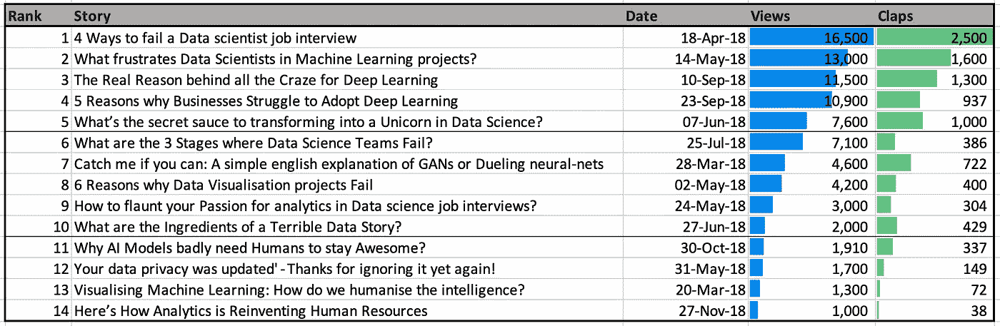
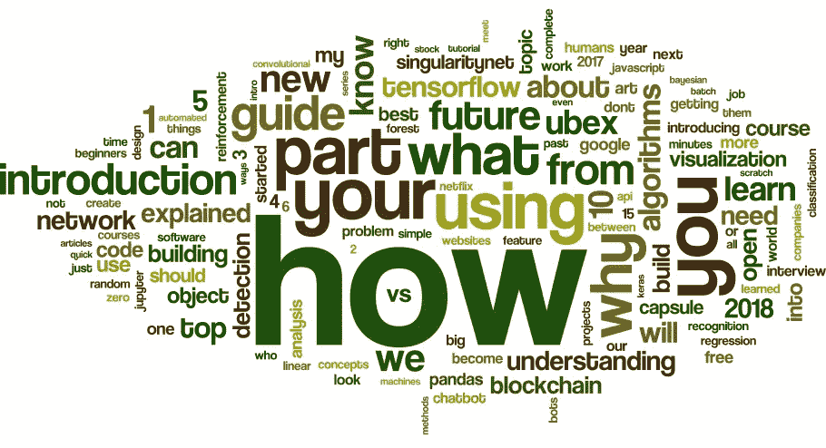
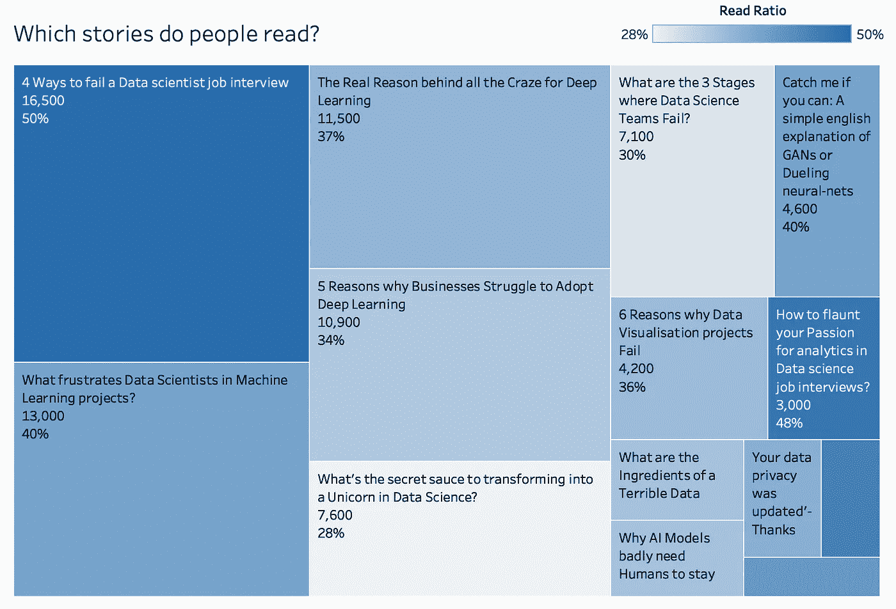
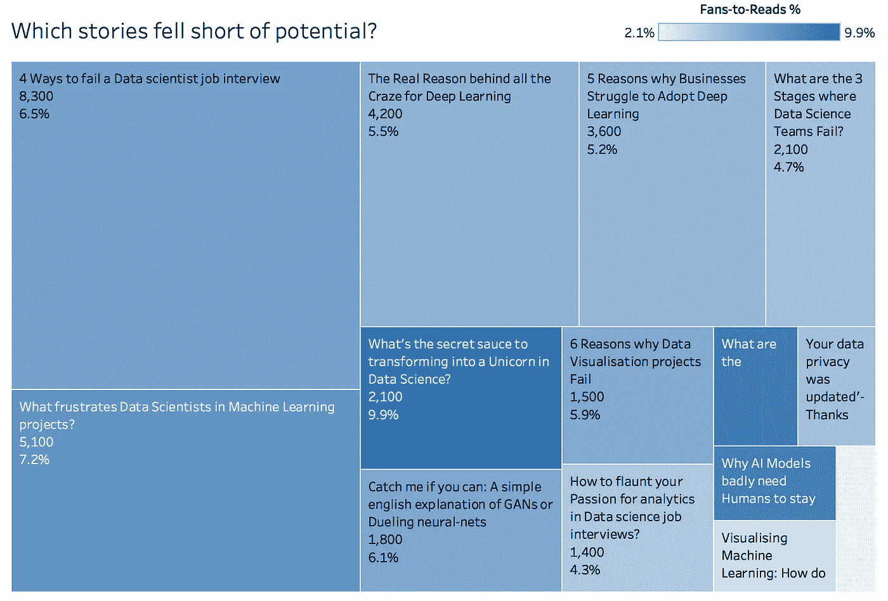
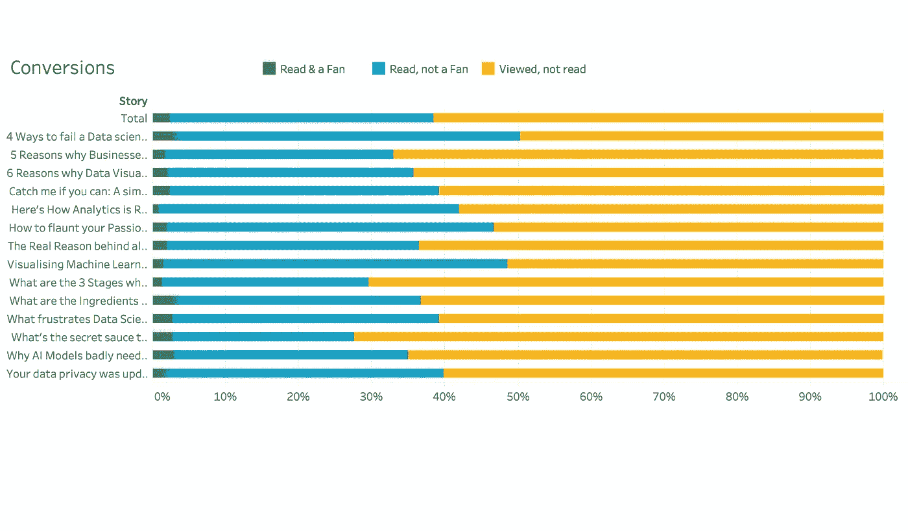
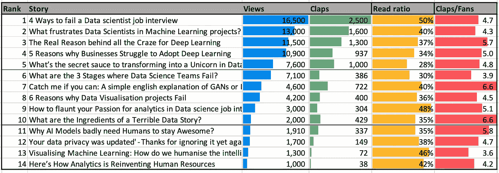
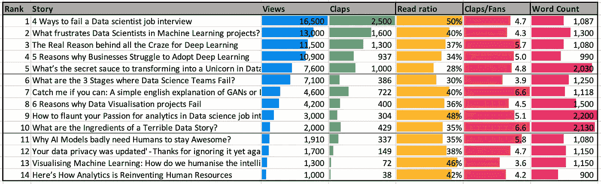

# 为什么伟大的故事在媒体上失败了，你能做些什么？

> 原文：<https://towardsdatascience.com/why-great-stories-fail-on-medium-and-what-you-can-do-about-it-bf9db4982ef0?source=collection_archive---------10----------------------->

Collage of my 2018 stories (Photocollage.com)

## 以下是我在分析 2018 年媒体故事时发现的一些令人惊讶的事情

是什么让一篇文章在媒体上疯传？哪些是人们真正阅读的？是什么驱使他们点击*珍贵的*拍手按钮，他们又是什么时候爱上它的？

这些都是每个作家心中的疑问。我们将在这里回答他们。我们将充分利用 Medium 提供的稀疏但有用的统计数据。然后，我们将从一年多来发表的一百万篇媒体报道中获得更多的见解，这些报道是由 [Harrison Jansma](https://medium.com/@harrisonjansma) 从公共故事卡片中收集的。

这也反映了我作为一名作家在媒体上的一年，突出了一些突出的故事，并确定了一些关于提升的关键要点。

## **我的 2018 上媒**

虽然我写博客已经有几年了，但我的出版之旅始于今年早些时候。我已经在 TDS 上发表了我所有的 [14 篇数据科学文章](https://towardsdatascience.com/@kesari)，几乎是每月一篇。非常感谢 [TDS](http://towardsdatascience.com) 团队构建了这个社区，并能够接触到如此高质量的读者群。

我的帖子面向三类读者:a) [how-to](/4-ways-to-fail-a-data-scientist-job-interview-d9c4c85c683) 文章，帮助那些有志于数据科学[事业](/whats-the-secret-sauce-to-transforming-into-a-unicorn-in-data-science-94082b01c39d)的[，b)讲解者](/how-to-flaunt-your-passion-for-analytics-in-data-science-job-interviews-2cb432cc3d3d)[为数据科学](/what-frustrates-data-scientists-in-machine-learning-projects-3398919a7c79)[从业者](/4-superpowers-that-will-make-you-indispensable-in-a-data-science-career-6571e8e7d504)揭开技术[和](/decoding-deep-learning-a-big-lie-or-the-next-big-thing-b924298f26d4)[方法论](/murdering-a-legendary-data-story-what-can-we-learn-from-a-grammar-of-graphics-ad6ca42f5e30)的[文章，为](/the-3-missing-roles-that-every-data-science-team-needs-to-hire-97154cc6c365)[非技术](/5-adoption-challenges-that-every-data-science-project-faces-9b9618a7242f)和[业务](/5-reasons-why-businesses-struggle-to-adopt-deep-learning-85205e11d69a)简化数据科学的文章

我的 14 篇文章已经获得了 86，000+的总浏览量(包括 RSS 浏览量约 120，000 次，[转载](https://www.techinasia.com/profile/ganes-kesari?section=email) [和](https://www.experfy.com/blog/author/ganes-kesari) [语言](http://ainow.ai/2018/12/12/157625/)翻译)和 10，000+的掌声。平均每篇帖子有 6000 多次浏览，阅读率约为 40%。

Summary of my stories on TDS

相比之下，哈里森从他的分析中发现，大多数中等水平的文章获得的掌声不到 10 次，而排名前 1%的文章获得的掌声超过 2000 次。大约有 2700 名作家已经完成了这项工作。一致性是罕见的，因为不到 0.3%的这些高度鼓掌的故事有重复作者。

虽然我的点击率最高的故事“[*”*](/4-ways-to-fail-a-data-scientist-job-interview-d9c4c85c683)*”*在这个范围内，但它错过了标记为数据科学的故事的截止日期。因此，这是一个目标，以及一致性。

## **是什么让人们点击你的故事？**

许多因素会影响一篇报道的曝光率和浏览量。虽然发布的范围、发布日期、时间和主题都有发言权，但最重要的是帖子的标题。

> “除非你的标题能推销你的产品，否则你已经浪费了 90%的钱。”— 大卫·奥格威

我对文章标题做了相当多的试验，但我总是害怕在点击“发布”之前对标题进行精炼的最后阶段。简直是疯了[分析](https://coschedule.com/headline-analyzer) [麻痹](https://headlines.sharethrough.com)跑步到深夜，那吃了一个小时，还留下不好的回味。

这似乎对我的故事有用，但我仍在学习其中的诀窍。

媒体世界告诉我们，坏消息很好卖，标题受益于一点负面色彩(失败、挫折、挣扎)。工作物品，我定期使用( *4 种方式*、 *5 种原因*、 *3 个阶段*)。[感性](https://coschedule.com/headline-power-words/)生僻字给单调的标题带来魅力和感染力(*秘密*’、*狂热*’、*真实原因*’)。

## 一个好标题的秘诀是什么？

虽然我的帖子没有这么多，但《百万媒体故事》在这方面提供了一些有趣的见解。分析那些获得 2000 多个数据科学相关标签的文章，这是我从它们的标题中发现的。

毫不奇怪，大多数标题都有关键词'*数据科学*'、*人工智能*'、*机器学习*'、*神经网络*'、*数据科学家*。撇开这些不谈，我们最后得出这个词云:

Wordle.net

大多数标题的结构都是问题'*如何*'、*为什么*'、*什么*'，它们很好地吸引了用户。这些帖子兼作讲解者，并使用诸如'*介绍*'、*了解*'、*学习*'、*指导*'、*讲解*'、*教程*'、*初学者*'等词语。

列表条很突出，有趣的是看到了流行的数字:1-6，10，15。他们把个人与'*你*'、*你*'、*我们*'、*我们*'联系在一起。故事中确实使用了否定形式，如'*而非*'、*不要*'、*零*'，但情感分析在这里可能更有用。

很多帖子都是技术性的，围绕着' *python* '、*熊猫*'、 *keras* '、 *jupyter* '、 *tensorflow* '、*回归*'。好的数字使用个人的，情感的或不常见的词，如'*需要知道*'，' 完成'，' 快速'，' 自由'，' 新'，' 大'。

现在，这是一个现成的计算器。

## **哪些故事让人懒得看？**

除了点击之外，大多数故事都无法吸引读者。我自己每天都会打开几十个浏览器标签，其中大部分都没有得到进一步的爱，直到一次浏览器崩溃让它们永远安息。

那么，哪些故事实现了这一壮举？“*读数*计数与“*视图*计数没有任何不同，因为两者高度相关(我的有限集合为 96%)。

但是，Medium 的*读数* %我对此保持关注，远远超过查看次数。这就是它如何发现隐藏的宝石。

Bigger boxes mean more Views, darker blue is higher Read%

我在[数据科学访谈](/4-ways-to-fail-a-data-scientist-job-interview-d9c4c85c683)上的头条新闻拥有最高的阅读量(对于一个大分母来说，这是不寻常的高)，但接下来的两个故事的浏览量要低得多([# 9-如何炫耀你对分析的热情](/how-to-flaunt-your-passion-for-analytics-in-data-science-job-interviews-2cb432cc3d3d)和[# 13-可视化机器学习](/visualising-machine-learning-how-do-we-humanise-the-intelligence-e62658f1f6df))。尽管基数较低，但如果被选中，它们还是有可能被阅读。

## **哪些故事未能实现潜力？**

每个作家都有自己最喜欢的故事，他们觉得这些故事很有潜力，但没有得到应有的曝光。好故事总是不了了之。这可能是一个糟糕的标题，不起眼的缩略图，错误的时间或其他因素。

一个人如何超越偏见，从统计上发现具有这种隐藏潜力的人？粉丝转化率(粉丝/阅读)是一个很好的代理。

在所有真正读过这个故事的人中，有多少人被感动到向全世界宣布了这个故事(以及搜索互联网上任何和所有人类活动的信号饥渴算法)。

按照这个标准，我的前三个故事没有一个登上排行榜:

Bigger boxes mean more Reads, brighter blue shows higher fans-to-reads ratio (or underserved potential)

这里最突出的是:“[变成独角兽的秘方是什么](/whats-the-secret-sauce-to-transforming-into-a-unicorn-in-data-science-94082b01c39d)”、“[图形语法如何帮助构思一个伟大的故事](/murdering-a-legendary-data-story-what-can-we-learn-from-a-grammar-of-graphics-ad6ca42f5e30)”和“[为什么人工智能模型非常需要人类来保持令人敬畏](/why-ai-models-absolutely-need-humans-to-stay-awesome-8fce149a8bf)”。

必须指出的是，高收视率的故事远远超出了目标受众，所以他们往往表现不佳。

对于 Medium 来说，这是一个添加到统计页面的有用指标。出版物和策展人可以用它来决定哪些故事必须被赋予新的生命。

## 是什么让一个故事如此受欢迎？

点击并阅读了一个故事后，用户花时间欣赏它是一件大事。毫不奇怪，你会发现许多帖子要求鼓掌或做 gif 演示，尽管 Medium 的策展人讨厌这样做。

> 作家可能渴望它，但一个故事必须理所当然地赢得它！

The lifecycle of a story: View — Read — Fan

衡量一个故事受欢迎程度的一个好方法是看粉丝给它鼓掌的次数。这与上面的粉丝-阅读比率不同，它只是告诉读者中有多少人转化为粉丝。

现在，我们把门槛设得很高，因为这个人需要按住按钮宝贵的几秒钟来提高鼓掌次数。那些为故事鼓掌 50 次的人，一直到最大可能，你们真的很特别！

由于 Medium 卡显示的只是总点击量，而不是粉丝数，所以我不能对一百万个故事进行统计(也许 Medium 可以添加另一个有用的指标？).对我来说，每个粉丝的平均鼓掌次数是 4.9 次。

再说一次，我的五大故事没有一个占据这里的首位。我的帖子“GANs 神经网络的简单英文解释”最受欢迎，每个粉丝有 6.62 次掌声，紧随其后的是“为什么图形的语法是伟大数据故事的成分”的帖子，有 6.60 分。

Note the spikes in Claps/Fans ratio for the 2 lower-ranked stories (ratio of 6.6)

## 多长时间算太长？

现在终于谈到一个困扰我很久的问题。一个故事的合适尺寸是多少？阅读时间长是否会让人不点击？或者，当他们看到里面巨大的卷轴时会跳过它吗？

虽然我一直以 1000 字为基准，但我的故事平均 1355 字。我花时间重新起草，使它们更紧凑、更有力。我想知道是否要把真正长的分成几部分。

令我惊讶的是，长篇故事并不是禁忌。如果有什么不同的话，那就是我的长篇小说更受欢迎，阅读率也不相上下。

Note how the stories with 2000+ words shine in the engagement metrics

在我的 3 个 2000 多字的故事中，[一个](/whats-the-secret-sauce-to-transforming-into-a-unicorn-in-data-science-94082b01c39d)在浏览量中排名前 5，[一个](/how-to-flaunt-your-passion-for-analytics-in-data-science-job-interviews-2cb432cc3d3d)阅读率非常高，[另一个](/murdering-a-legendary-data-story-what-can-we-learn-from-a-grammar-of-graphics-ad6ca42f5e30)最受喜爱，拥有最高的掌声/粉丝比率。

可以肯定的是，我检查了百万中等数据集，发现阅读时间和喜欢之间有+10%的相关性(对于喜欢数超过 100 的~200K 的故事)。这证实了用户不会回避长表单。

所以，如果你有一个很长的故事，不要隐瞒。

并且，[这里的](https://www.dropbox.com/s/c2iesky5nkm5awq/ganes-kesari-medium-stats-dec18.xlsx?dl=0)是一个 excel 表格，里面有我所有的故事链接和统计数据，包括一些比这里显示的更多的数据。你还能发现其他有趣的金块吗？

## 那么，你下一个故事的要点是什么？

1.  特别注意标题，混合使用情感、力量、消极和列表。但是，不要过度。(*这个故事我理解对了吗？！*)
2.  如果你的故事很长，不要担心(*这是我第四长的 1700 字*)。
3.  对你的阅读量保持好奇，如果阅读量太低，反思一下你的内容。在没有公开数据的情况下，也许 30%是一个很好的基准。
4.  找到你的哪些故事粉丝转化率(粉丝/阅读)高，哪些最受喜爱(拍手/粉丝)。他们是你的观众最能产生共鸣的人。向他们学习，写得更像他们。

最重要的是，为热爱写作的人写故事，并慷慨地与听众分享你的知识。剩下的迟早会自己解决的。

现在，我点击发布按钮，让这个故事成为另一个统计数据:)

*本文使用的工具:Excel、R、TableauPublic 和 Wordle.net。感谢* [*哈里森*](https://medium.com/@harrisonjansma) *对于中等数据集和分析。*

如果你觉得这很有趣，你会喜欢我写的这些相关文章:

*   [*让你在数据科学生涯中不可或缺的 4 种超能力*](/4-superpowers-that-will-make-you-indispensable-in-a-data-science-career-6571e8e7d504)
*   [*数据科学家面试失败的 4 种方式*](/4-ways-to-fail-a-data-scientist-job-interview-d9c4c85c683)

*对数据科学充满热情？随意在*[*LinkedIn*](https://www.linkedin.com/in/gkesari/)*上加我，订阅我的* [*简讯*](https://gkesari.substack.com/) *。*