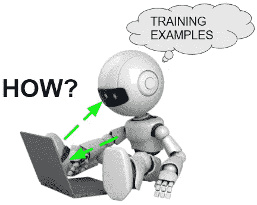
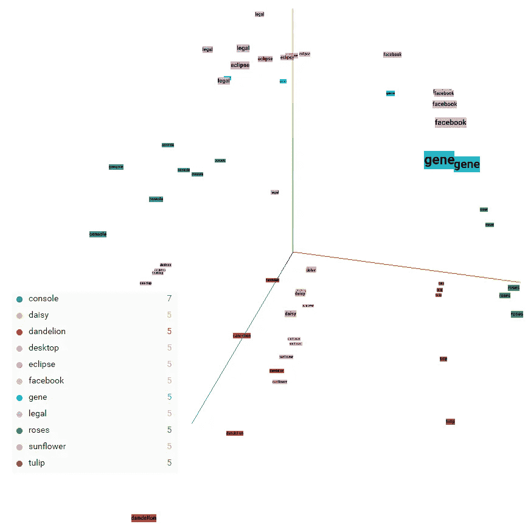

# 如何聘请人工智能顾问

> 原文：<https://towardsdatascience.com/why-hire-an-ai-consultant-50e155e17b39?source=collection_archive---------1----------------------->

所以，你知道你需要一些机器学习/人工智能开发。为什么不自己做呢？简单的回答是，专家比多面手更有经验，因此可以减少你的风险和努力。更长的答案是关于知道地雷藏在哪里，以及好的需求看起来像什么。我是一名机器学习专家，我在美国和加拿大的公司担任顾问，从事合同工作。我也有丰富的发展业务的经验。结合我在该领域工作中获得的经验，我们来谈谈聘请人工智能顾问的问题。

如果你的项目没有资金支持，你最好的选择是尝试与大学实验室合作，以获得一些早期结果。在本文中，让我们假设你的项目是一个企业采用人工智能来改进核心产品的标准案例。因此这是一个**[**的小 R；大 D**](http://www.sciencemag.org/careers/2010/12/tooling-little-r-big-d)**R&D 项目。有些项目，尤其是创业公司，是一个**“大 R；大 D"** 风流韵事，那是另一个时代的话题。现在，让我们坚持假设你有一个合适的团队和客户服务器，并希望添加一些尖端的人工智能功能。****

****你在找一个人工智能顾问。现在让我们更具体地了解要寻找什么。你想要的是一个比数据科学家更专业的顾问。你需要工程学。机器学习项目很少只涉及数据科学部分。你需要聚集数据，并将其转化为人工智能可以学习的正确格式。有时项目涉及硬件、无线和网络。这就是云和物联网(IoT)。雇佣一个了解你的需求的业务含义的顾问也是有帮助的，有点像管理顾问。你想要一个可以谈论预算、规划和解决方案架构的资源，知道大规模的机器学习部署是什么样子的。这也是一个好主意，尽你所能涉及**资助**，因为 ML 领域是非常前沿的，应该使你的 R & D 有资格申请一些政府资助项目(在加拿大，这些是 [Mitacs](https://www.mitacs.ca/en) 、 [OCE](http://www.oce-ontario.org/) 、 [NSERC](http://www.nserc-crsng.gc.ca/) 等。等等。).****

********

****雇佣顾问来启动你的人工智能项目的另一个方面是能力建设。您希望在您的公司中构建一些通用基础架构，以提供执行未来机器学习项目的能力，并将知识灌输到您的 devops 团队中，以维护和扩展顾问带来的代码(尽可能/实际)。将人工智能能力融入一家公司可能是一个项目管理和团队建设过程，就像它是一个软件/硬件项目一样。它通常涉及董事会会议，将这些目标与关键绩效指标(KPI)和利益相关者会议联系起来。在设计项目时，让高管、产品经理和高级开发人员在同一个房间里是一个聪明的主意。我准备了许多提案，与投资者和关键意见领袖互动，并向大量观众展示产品。没有两个会议是相同的。这就是为什么当你决定让你的公司进入人工智能领域时，有一位专家在你身边是件好事。****

******运营和大数据******

****“*幸运青睐有准备的人”(路易斯·巴斯德)。*****

****向任何一位未来的顾问询问他们最近的工作经历。即使有了 NDA，他们也可以分享一些不被禁止的信息。例如，*“描述一下你最近为一个大客户做的项目”*可以用*来回答“我最近完成了一个项目，涉及一个美国客户的大数据 AI 解决方案的架构和部署。这是一个本地解决方案，从运行 Ubuntu server 和 GPU 的准系统基础架构服务器开始，到能够支持每秒数千个事务的服务结束。他们对结果很满意。我会问他们我是否能和你分享更多细节。”*这是一种意料之中的反应。就我而言，我列出了可公开验证的专利、文章和博士学位，以便客户能够了解我的工作水平。我最近在机器学习方面的工作将于 2017 年 7 月在法国尼斯发表(“面向个人计算机用户的无监督深度学习推荐系统”和“面向个人计算机用户的可视化深度学习推荐系统”)。****

****在后续工作中，你可能会从一位优秀的顾问那里得到类似下面这样的东西。*“回到大数据和云之间的关系，我想谈谈我最近在数据流物理资产的云连接方面的体验。我的团队帮助一个新客户将硬件设备连接到一个云系统，该云系统记录、分析和呈现数据可视化。我们从头开始设计云解决方案，并期望在客户的后续工作声明中，将我们的机器学习分析添加到他们的实时生产解决方案中。”*这告诉你，他们了解云和物联网，并乐于大规模进入人工智能领域。****

****我的大部分工作都是在非常严格的 NDA 下进行的，所以我在这里提供了我的学术工作或公共领域工作中的例子来说明我在实践中是如何与客户打交道的。但是… **不要让顾问躲在 NDA 后面**。特别是如果他们不能为你提供上述陈述，你的顾问应该有一个公开的个人资料，表明他们来自哪里。例如，同行评审的出版物、相关的大学学位、专利、小组讨论、团队等等。以我自己为例，我已经完成了一个硕士学位，课题是在给定硬件限制的情况下，找出软件程序的哪些部分应该在硬件中加速。我的博士论文是关于通过无监督学习向用户推荐行动。所有这些都是为了告诉客户一个可信的故事。看看咨询的网站。是好看，还是他们只是一个邮箱地址和一个空白页？不言而喻，顾问公司应该成立。此外，他们公司的网站是一个很好的方式来判断如何组织顾问真的是。他们基本上是为了钱而做任何事情吗(例如，会为 cookies 编码)，或者他们是狭隘地专注于？比如我们这种情况，做 IoT 和 AI，就这样。****

****预计会遇到一个**过程**。咨询师热爱过程。通过需求收集和白板会议，希望在编写任何代码之前深入了解解决方案的结构。您应该讨论如何使用该系统，以及如何向客户销售该系统的商业案例。顾问应该与您一起制定一个名为**工作说明书(SOW)** 的计划，其中包含里程碑和可交付成果，然后让利益相关方参与进来。****

****每个顾问处理风险的方式都不一样。我对解决方案架构的方法是组织。在我职业生涯的早期，我直接在运营部门工作，数据中心和网络运营是非常严肃的领域，一直让我踌躇不前。如果一个人在运营中拉错了弦，或者在这些服务器中部署了一个错误，那么每个客户都可能会呼叫支持。这是一个高压环境。为了应对这种压力，我对开发团队采用传统的系统架构方法，从开发、集成和生产开始，包括回滚选项、QA 部署验证，以及在每个分发中心定期进行 VPS 备份以降低风险。只要有可能，我建议客户使用云来避免这种运营风险。****

****我是**云解决方案**的忠实粉丝。机器学习代码在 GPU 上运行，有时比在 AWS 上运行更便宜。我带来的关键价值是理解和设计软件架构以及所需硬件的能力。你想要的建议是什么时候去云。不是所有的客户都会听，但是所有的顾问都应该能够帮助你决定在哪里构建你的系统(云还是本地)。我经常将 GPU 硬件配置到客户端基础架构中，无论是基于 AWS 的云、数据中心的专用机架中，还是在客户的私有设施中。GPU 硬件设置和部署到生产环境是我理解的事情。这里值得一提的具体技术有 Nginx 用于服务和负载平衡，内存化用于缓存结果以减少延迟和不必要的计算，复制和索引以减轻高流量数据库表的压力，以及 noSQL 等分布式查询系统。我个人的偏好是 postgres，虽然我用过 t-SQL (SQL server)、mySQL 和 Sqlite。经验告诉我要规范化表格，**听从 DBA，**因为他在数据库方面比任何人都聪明，并且尽可能通过预处理从数据库之外的数据中获取性能。**任何优秀的顾问都会做出这样的限制性陈述，宣称他们不是所有事情的专家。如果一个咨询师总是声称自己有专业知识，而不考虑话题，那么你应该担心了。******

****你雇佣的任何人工智能顾问都必须了解**安全**。他们经常接触你最敏感的数据。通过参与几个大数据项目，我对云自动化有了一种直观的感觉，这种感觉与安全需求密切相关。我把云，不管是私有的还是公共的，看作是一个 VPS 管理系统。为了建立公司的生产系统，需要许多基础技术，从认证(例如 Oauth2)和授权(例如基于角色的访问控制模式)到 SSL 和防火墙。我经常这样做，从零开始，我熟悉涉及硬件和软件的安全系统([见已批准的专利](https://www.linkedin.com/in/dcshapiro))以及伴随安全开发项目的威胁模型和安全策略，就像这个职位的帖子中描述的那样。比如 IP 的白名单和黑名单，PPK 认证，RSA 基于令牌的认证等。当然，任何系统都是由使用它的人来决定的。培训员工遵守安全策略对于维护安全基础架构至关重要。****

******机器学习******

****现在让我们深入讨论这个关键话题。也就是说，顾问能设计并实现一个机器学习系统来满足你的需求吗？你怎么知道？****

********

****Visualization of the output from an image processing neural network classifier in 3D space.****

****[正如我在最近的一篇帖子](https://medium.com/towards-data-science/fear-in-the-age-of-machine-learning-87ee33b5b264)中描述的那样，**机器学习专家**很难找到。开发人员很快就掌握了一般知识，这很好，但是更深层次的专业知识很难从短期的在线课程或在线视频中获得。不要误解我的意思，我喜欢这些资源并强烈推荐它们，但是它们不足以给你的开发团队提供他们需要的技能。回顾我的档案，我在 2006 年本科最后一年上了我的第一门人工智能大学课程，当时它还没有风靡一时。在 2009 年至 2017 年以兼职方式完成机器学习博士学位的同时，我一直在从事一系列与机器学习相关的非常有趣的工作，一直追溯到我在 Zip.ca(重大公司)的工作，在那里我设计了一个推荐系统并进行运筹学研究(例如整数线性规划、组合优化、背包问题、转运问题等)。我在加州 Zip 公司的任务是找到一个“好的”DVD 分配给客户，给出一个客户需求列表和每个分销中心的 DVD 供应情况。这部作品与网飞在加拿大展开了激烈的竞争。****

****对于一个你不认识的顾问，总是指望**从一个小的概念证明**开始，向自己证明这个顾问了解他们的东西。与顾问合作，想出一个唾手可得的项目。一些他们不需要太多开发工作就可以快速交付的东西(例如，基于他们已经拥有的现有代码，以及你已经收集的数据)。如果这第一步进展顺利，那么你就可以自信地转移到更大的项目范围。****

****不要过多考虑顾问用的是什么工具，只要是行业标准就行。我用 python 完成了大部分机器学习工作，我选择的框架是 Tensorflow 1.0 和 scikit-learn。我有时使用 Keras。我的代码几乎总是在 GPU 中运行。只要有可能，我就重用现有的机器学习模型，而不是从头开始构建它们。期待顾问向你展示如何通过**重用现有的人工智能代码**来节省每个人的时间和金钱。****

****请顾问**概括描述部署**。我举的一个图像处理项目的例子是这样的:*“我采用了卷积神经网络(CNN)和监督学习来根据标记数据区分图像类别。例如，区分患者身上的伤口、基于外观检测产品之间的差异以及其他这样的图像分类任务。在生产中，我会使用一个支持 GPU 的 VPS 和一个服务器，如 Flask 和一个负载平衡器(nginx ),使这些模型具有高吞吐量。训练一个完整的 CNN 可能是时间密集型的，因此作为了解观察到的特征的第一步，我使用了来自现有 CNN 的迁移学习，以查看标记数据聚类中感兴趣的特征在多大程度上分类为期望的类别。在监督学习之外，当没有足够的标记数据用于监督学习时，我部署了非监督学习模型。有时，维度缩减适用于无监督学习(例如，对于聚类，我使用 t-SNE，有时使用 PCA 或 K-means)。”*****

****然而，对于一个文本处理项目，我会这样回答:*“我是单词嵌入模型的超级粉丝。对于这种类型的任务，我使用 word2vec 和/或 GloVe，或者与 Tensorflow 一起使用，或者直接在 python 中使用，并利用现有的模型，如 google news vectors 和 wikipedia，或者基于文本语料库或客户的数据集构建自己的模型。我们可以更详细地研究许多其他机器学习模型，包括 RNN 和 LSTM 等生成模型，以及情感分析等更新的学习模型，等等。”*****

******结论******

****希望这篇文章能帮助你决定和谁一起做机器学习顾问。最重要的是，你雇佣的人工智能顾问不仅仅是一名数据科学家。你希望他们在从需求到部署的整个系统设计中提供帮助，并帮助进行能力建设，以便你在 devops 团队中的内部资源可以支持 AI 基础设施和代码。期望顾问有一些与你合作的过程，包括一份设定明确期望的工作说明书。问一个潜在的顾问一些棘手的问题，并确保你得到一些最近的工作历史和高级别的确认，他们了解你的项目的风险、安全性和云组件。请他们用一般术语描述一个部署，并尝试让他们尽可能重用现有的 AI 代码，从而节省您的金钱和时间。调查政府拨款以及它们如何应用于你的项目。最后，即使顾问看起来很棒，也要从一个小的概念验证开始，以确保他们能满足你的期望。****

****编码快乐！****

****——丹尼尔
[丹尼尔@lemay.ai](mailto:daniel@lemay.ai) ←打个招呼。
[LEMAY . AI](https://lemay.ai)
1(855)LEMAY-AI****

****您可能喜欢的其他文章:****

*   ****[人工智能和不良数据](/artificial-intelligence-and-bad-data-fbf2564c541a)****
*   ****[人工智能:超参数](/artificial-intelligence-hyperparameters-48fa29daa516)****
*   ****[人工智能:让你的用户给你的数据贴上标签](https://medium.com/towards-data-science/artificial-intelligence-get-your-users-to-label-your-data-b5fa7c0c9e00)****