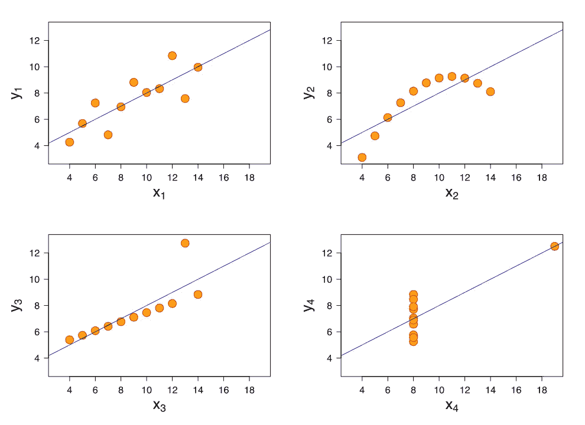
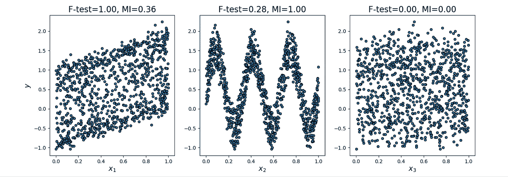
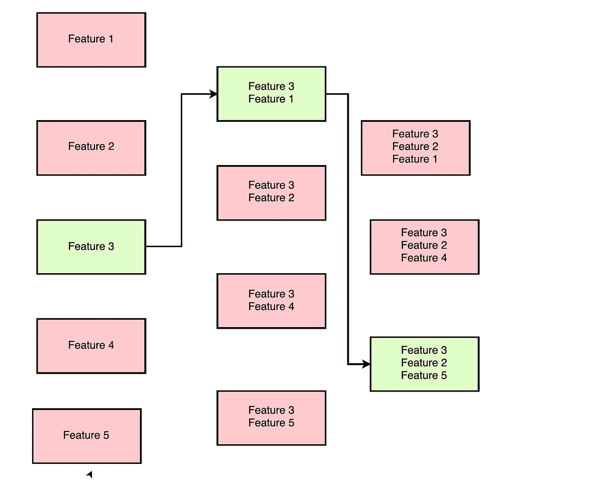
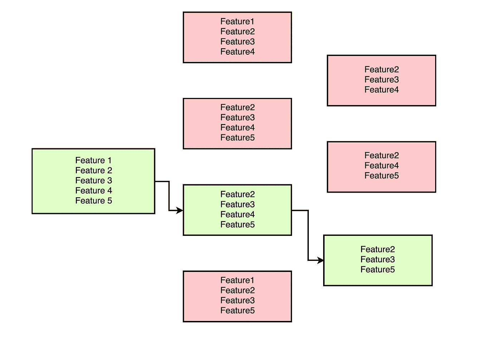
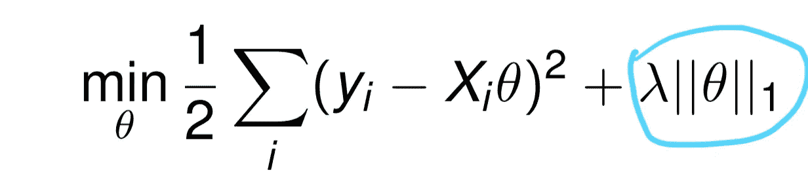
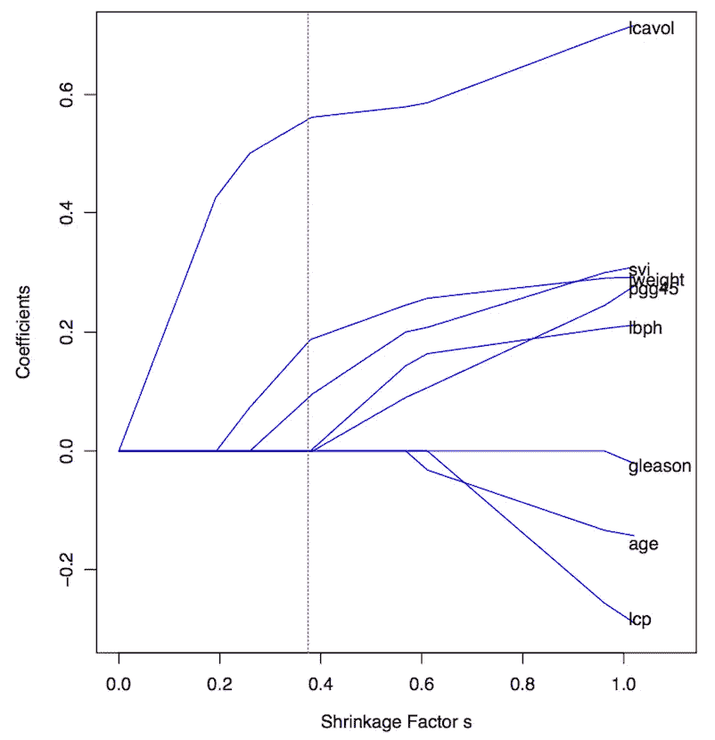
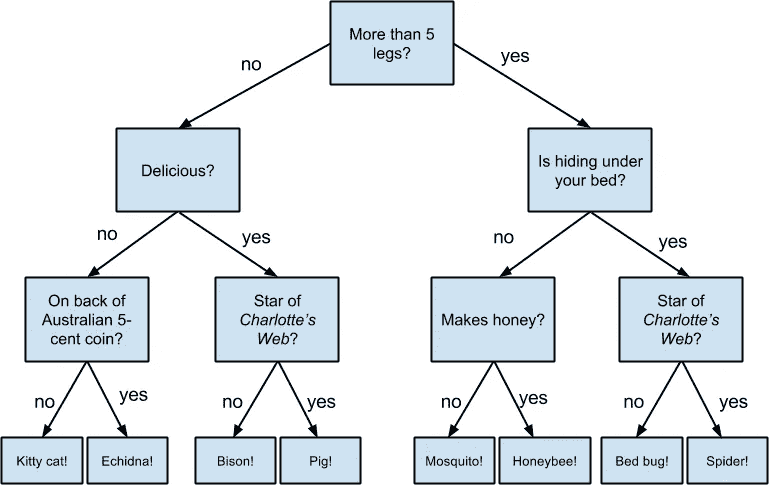

# 为什么、如何以及何时应用特征选择

> 原文：<https://towardsdatascience.com/why-how-and-when-to-apply-feature-selection-e9c69adfabf2?source=collection_archive---------1----------------------->

现代数据集的信息非常丰富，数据是从数百万个物联网设备和传感器收集的。这使得数据变得高维，拥有数百个要素的数据集很常见，甚至达到数万个也不罕见。


特征选择是数据科学家工作流程中的一个非常重要的组成部分。当呈现非常高维度的数据时，模型通常会阻塞，因为

1.  **训练时间**随着特征数量呈指数增长。
2.  随着特征数量的增加，模型具有越来越大的**过度拟合**的风险。

特征选择方法有助于解决这些问题，方法是在不损失太多信息的情况下降低维数。这也有助于理解这些特性及其重要性。

在本文中，我将讨论以下特征选择技术及其特点。

1.  过滤方法
2.  包装方法和
3.  嵌入式方法。

# 过滤方法

过滤方法考虑特征和目标变量之间的关系来计算特征的重要性。

## 方差比检验

f 检验是一种统计检验，用于模型之间的比较，并检查模型之间的差异是否显著。

f 检验对模型 **X** 和 **Y** 进行假设检验，其中 **X** 是仅由常数创建的模型，而 **Y** 是由常数和特征创建的模型。

比较两个模型中的最小二乘误差，并检查模型 **X** 和 **Y** 之间的误差差异是否显著或偶然引入。

f 检验在特征选择中是有用的，因为我们知道每个特征在改进模型中的重要性。

Scikit learn 提供使用 F-Test 选择 K 个最佳特性的**。**

```
sklearn.feature_selection.f_regression
```

对于分类任务

```
sklearn.feature_selection.f_classif
```

使用 f 检验来选择特征有一些缺点。F-Test 检查并仅捕获要素和标注之间的线性关系。高度相关的特征被给予较高的分数，而不太相关的特征被给予较低的分数。

1.  相关性具有很强的欺骗性，因为它不能捕捉强非线性关系。

2.使用像相关性这样的汇总统计可能是个坏主意，正如安斯科姆的四重奏所展示的那样。



Francis Anscombe illustrates how four distinct datasets have same mean, variance and correlation to emphasize ‘summary statistics’ does not completely describe the datasets and can be quite deceptive.

## 交互信息

两个变量之间的互信息衡量一个变量对另一个变量的依赖性。如果 **X** 和 **Y** 是两个变量，并且

1.  如果 **X** 和 **Y** 是独立的，那么知道 **X** 就无法得到关于 **Y** 的任何信息，反之亦然。因此它们的相互信息是 **0** 。
2.  如果 **X** 是 **Y** 的确定性函数，那么我们可以用互信息 **1** 从 **Y** 确定 **X** ，从 **X** 确定 **Y** 。
3.  当我们有 Y = f(X，Z，M，N)时，0 < mutual information < 1

We can select our features from feature space by ranking their mutual information with the target variable.

Advantage of using mutual information over F-Test is, it does well with the non-linear relationship between feature and target variable.

Sklearn offers feature selection with Mutual Information for regression and classification tasks.

```
sklearn.feature_selection.mututal_info_regression 
sklearn.feature_selection.mututal_info_classif
```



F-Test captures the linear relationship well. Mutual Information captures any kind of relationship between two variables. [http://scikit-learn.org/stable/auto_examples/feature_selection/plot_f_test_vs_mi.html](http://scikit-learn.org/stable/auto_examples/feature_selection/plot_f_test_vs_mi.html)

## Variance Threshold

This method removes features with variation below a certain cutoff.

The idea is when a feature doesn’t vary much within itself, it generally has very little predictive power.

```
sklearn.feature_selection.VarianceThreshold
```

Variance Threshold doesn’t consider the relationship of features with the target variable.

# Wrapper Methods

Wrapper Methods generate models with a subsets of feature and gauge their model performances.

## Forward Search

This method allows you to search for the best feature w.r.t model performance and add them to your feature subset one after the other.



Forward Selection method when used to select the best 3 features out of 5 features, Feature 3, 2 and 5 as the best subset.

For data with n features,

->在第一轮中，创建具有单独特征的“N”个模型，并选择最佳预测特征。

->在第二轮中，用每个特征和先前选择的特征创建“n-1”个模型。

->重复这一过程，直到选择了“m”个特征的最佳子集。

## 递归特征消除

顾名思义，这种方法一个接一个地消除特定模型上表现最差的特征，直到知道特征的最佳子集。



Recursive elimination eliminates the least explaining features one after the other. Feature 2,3 and 5 are the best subset of features arrived by Recursive elimination.

对于具有 n 个特征的数据，

->在第一轮中,“n-1”个模型结合了除一个特征之外的所有特征。性能最低的特征被移除

->在第二轮中，通过移除另一个特征来创建“n-2”模型。

包装器方法通过广泛的贪婪搜索向您承诺一组最佳的特性。

但是包装方法的主要缺点是需要训练的模型数量庞大。它在计算上非常昂贵，并且对于大量特征是不可行的。

# **嵌入方法**

特征选择也可以通过一些机器学习模型提供的洞察力来实现。

**套索线性回归**可用于特征选择。套索回归是通过在线性回归的成本函数中增加一个额外的项来实现的。这除了防止过度拟合之外，还将不太重要的特征的系数降低到零。



The highlighted term has been added additionally to Cost Function of Linear Regression for the purpose of Regularization.



As we vary ƛ in the cost function, the coefficients have been plotted in this graph. We observe that for ƛ ~=0, the coefficients of most of the features side towards zero. In the above graph, we can see that only ‘lcavol’, ’svi’, and ‘lweight’ are the features with non zero coefficients when ƛ = 0.4.

**基于树的模型**计算特性的重要性，因为它们需要将性能最佳的特性保持在靠近树根的位置。构建决策树包括计算最佳预测特征。



Decision Trees keep the most important features near the root. In this decision tree, we find that Number of legs is the most important feature, followed by if it hides under the bed and it is delicious and so on. [https://www.safaribooksonline.com/library/view/data-science-from/9781491901410/ch17.html](https://www.safaribooksonline.com/library/view/data-science-from/9781491901410/ch17.html)

基于树的模型中的特征重要性基于**基尼指数**、**熵**或**卡方**值来计算。

与数据科学中的大多数事情一样，特征选择高度依赖于上下文和数据，并且对于特征选择没有一站式解决方案。最好的方法是了解每种方法的机制，并在需要时使用。

我主要使用特征选择技术来获得关于特征及其与目标变量的相对重要性的见解。请在下面评论你使用的特征选择技术。