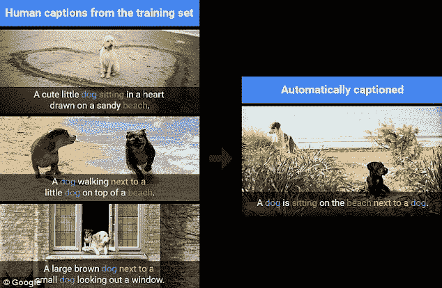
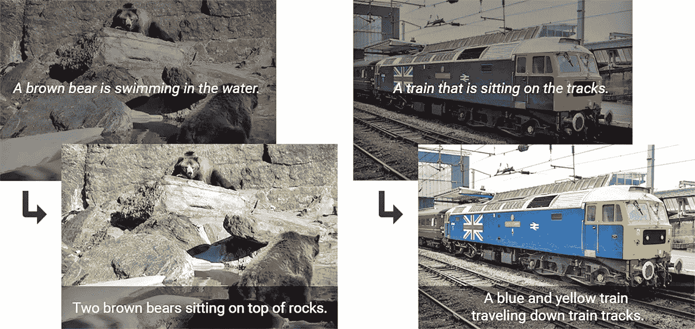
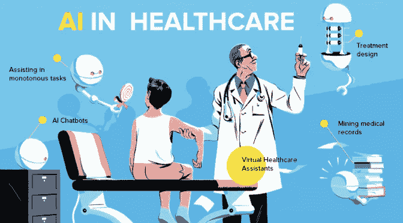
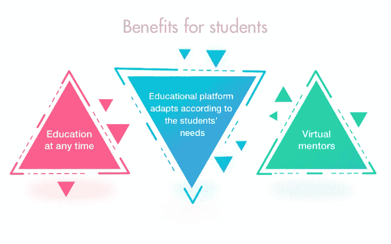

# 我为什么开始学习机器

> 原文：<https://towardsdatascience.com/why-i-got-started-with-machine-learning-8ca06f31ac13?source=collection_archive---------19----------------------->

Photo by [Franki Chamaki](https://unsplash.com/photos/z4H9MYmWIMA?utm_source=unsplash&utm_medium=referral&utm_content=creditCopyText) on [Unsplash](https://unsplash.com/search/photos/artificial-intelligence?utm_source=unsplash&utm_medium=referral&utm_content=creditCopyText)

因为我一直热爱技术，所以我有探索新技术的习惯。我喜欢阅读科技世界正在发生的事情，以及这些新技术如何颠覆当前的行业。

最近，当我在探索和广泛阅读最新技术对我们生活的影响时，我很快注意到有几个术语几乎随处可见:*人工智能、数据科学、机器学习、深度学习。*

*虽然，技术上不对，让我们把这些技术统称为 AI(人工智能)。*

我有点被*迷住了，我开始漫不经心地阅读它们，因为这些技术很自然地似乎有可能颠覆任何可以想象的行业。我在 YouTube 上浏览了几个关于人工智能的视频，读了几篇文章，了解了它的一些应用，决定学习它对我来说太难了(相信我，它可能会令人生畏！)就是这样。*

虽然这些术语在我脑海中停留了很长时间，但某种东西让我相信，进入人工智能世界的冒险对我来说太难了，我没有足够的潜力来完成它。由于这些假设，我甚至没有开始的方向。

那是 2018 年 4 月，我刚从电气工程专业毕业。我刚刚开始我的第一份(目前的)工作，是一名汽车工程师。几个月后，我和一个大学同学计划了一次见面。我们很自然的拍了几张自拍然后就发生了！Google Photos *在快照中认出了*我的朋友，问我是否想给她加标签(它说，‘*想给 Muskan 加标签’*或者可能是*‘想和 Muskan 分享这张照片’，*之类的)。)!锦上添花的是，我最近买了一部新手机，它和那个人没有任何关系。

当我进一步调查此事时，我知道这是谷歌部署的深度学习算法，可以根据你的账户活动识别你快照中的人。更准确地说，当你用谷歌账户登录你的安卓设备并用它拍照时，如果你碰巧在这些照片中标记了这个人几次(只是几次)，谷歌的算法就会识别这个人，即使你更换了你的设备并用以前的账户登录到一个新设备，谷歌的算法也能检测到他们。

现在，有些人(包括我)可能会说这是对个人隐私的侵犯，但我被这项技术的美丽和强大震撼了！这可能看起来没什么，因为脸书也有自动标签功能，但那一刻改变了我的想法。我现在确信*我想让*学会这些，在那一刻，我所有的幽灵都消失了。

我重新开始了我在学习人工智能领域的研究，通过不懈的努力，我学到了很多。我不会说我知道所有关于它的事情，但我知道的比几个月前还多。我比昨天知道的更多。我现在知道我能做到！我开始相信，任何拥有正确心态和专注努力的人都可以学习人工智能，并成为能够改变我们所知世界的技术的一部分。

我想列举几个人工智能领域的一些漂亮的应用，我相信它们可以激励这个领域的任何新手向前迈进:

# 推荐系统

你有没有注意到亚马逊是如何知道你想买什么，并向你展示这些产品的？或者，网飞怎么知道你喜欢看什么类型的节目/电影？这就是人工智能在起作用。这种被称为*推荐系统*的系统会记录你的活动历史，并产生对你来说意义重大且独一无二的见解。

现在，想象一下为亚马逊上的数十亿用户和网飞上的数百万观察者扩展这项技术。想象一下这个系统设计得如此美丽和复杂，以至于它的每个用户都有独特的体验。这种系统效率很高，如果实施正确，可以产生很好的效果，并显著增加利润。

[‘Because you watched’ is AI at work](https://media2.s-nbcnews.com/j/streams/2013/november/131113/2d9672564-attachment.nbcnews-ux-1024-900.jpg)

# 图像识别系统

正如我已经讨论过的，这是我最初开始的原因。正如我已经解释过的，人脸识别系统非常强大。这些是美丽的艺术品！

除了面部识别系统，这项技术还被扩展到设计这样的系统，它可以根据人的面部表情来检测人的当前情绪。一旦检测到情绪，这种系统可以根据它来设置空气，比如根据情绪播放音乐，或者根据情绪调节灯光。这一切都可以通过 AI 和物联网(IoT)的微妙结合来实现。

一个伟大的研究领域是让一个人工智能解释图片中发生的事情。这旨在为图片添加标题，就像人类一样(不是我们的 Instagram 标题！当心！我们现在有点太远了)。

下图就是一个例子:

[Source](https://i.dailymail.co.uk/i/pix/2016/09/23/19/38B9880E00000578-0-image-a-1_1474654991912.jpg)

这就是我所说的！这简直太棒了！

现在让我们看看这个领域是如何改进的。

[Source](https://s.aolcdn.com/hss/storage/midas/d30364072dfa6a769bf130b1fa2c3dbb/204366695/google-ai-image-captioning-tensorflow-2016-09-23-01-ed.jpg)

在这张图片中，顶部的图片显示了旧人工智能的字幕，而底部的图片显示了字幕的改进程度。这太神奇了！

# 语音识别系统

你体验过 Siri 的机智吗？或者，有现成结果的谷歌助手？或许还有 Cortana …呃..用什么？所有这一切都是由基于自然语言处理的人工智能系统*驱动的。*

这里说得够多了。

# 自动驾驶汽车

不再需要人类司机的未来并不遥远。随着优步、特斯拉、Lyft 和谷歌等大公司投入数百万美元开发自动驾驶汽车，该领域的研究是目前最热门的研究之一。这种汽车将由核心的*强化学习*算法驱动。

一旦一个可靠的学习算法到位，人类将能够避免每年因道路事故造成的数百万人死亡。

道路会更安全，交通堵塞的问题也可以消除。

[Source](https://i.gifer.com/CBES.gif)

这种运输方式是多么复杂啊！

# 卫生保健

这是一个本身就非常令人兴奋的领域。这是因为基于医疗保健的人工智能系统的目标不是最大限度地点击广告或标记照片中的人，而是以非常积极的方式直接影响数百万人的生活。

人工智能可以帮助文学拯救生命。研究表明，基于人工智能的机器人可以以最大的精度进行复杂的手术，因此由于人为错误造成的伤亡可以大大减少。人工智能在癌症等威胁生命的疾病的早期诊断方面显示出巨大的潜力。这种系统在大规模、有组织地临时准备和实施时，可以帮助拯救数百万人的生命。

人工智能研究人员声称，基于人工智能的系统是我们找到治疗癌症、阿尔茨海默病等痛苦和威胁生命的疾病的最安全和最快的途径。

在这个应用程序中，我个人喜欢的是，尽管医学科学本身是一个非常独特的研究领域，需要多年的努力才能掌握，但任何拥有正确人工智能技能的人都可以在基于人工智能的医疗系统中工作，并在拯救生命方面做出小小的贡献！多美啊！

[Source](https://www.intelegain.com/wp-content/uploads/2018/02/AI-in-Healthcare-672x372.png)

# 教育

人工智能具有颠覆教育行业的巨大潜力。一个非常好的应用是，基于人工智能的系统可以部署在机构中，以对学生的试卷和作业进行评分。这将帮助教师节省宝贵的时间，这些时间可以用来学习新概念或帮助学生取得进步。这也将减少学生之间的偏见。

*并非所有人生来都一样。*因此，自然地，我们都拥有不同的技能。但是传统的教育系统旨在给每个人提供相同的内容。这一直是一个问题，因为大多数人无法与课程保持一致，因此最终表现不佳，甚至可能从未意识到自己的潜力。基于人工智能的系统可以帮助消除这个问题。我们可以设计这样的系统，它可以根据各种指标评估学生的潜力或目标，然后推荐这样的课程/课程，帮助他们实现目标，而不是做一只绵羊。

[A few advantages for students](https://www.cleveroad.com/images/article-previews/Advantages-of-artificial-intelligence-in-education-for%20students.png)

# 最后的话

人工智能是一项在许多领域都显示出巨大前景的技术。以重复我自己为代价，我想说，任何人只要有正确的心态和努力的意愿，都可以学习人工智能，并为人类社会的发展做出贡献。

如果你刚刚起步，你不需要花一大笔钱从名牌大学获得硕士或博士学位。你几乎可以免费开始。有很多像 Coursera、Udemy、Udacity 等平台可以让你立刻进入这个领域。

谷歌搜索一下，你的旅程就开始了！

人工智能可以实现任何可以想象的事情。你所需要做的就是想象和工作！

如果你喜欢这篇文章，请留下一些掌声。有帮助！

**感谢你读到这里，祝你的人工智能之旅一切顺利！**